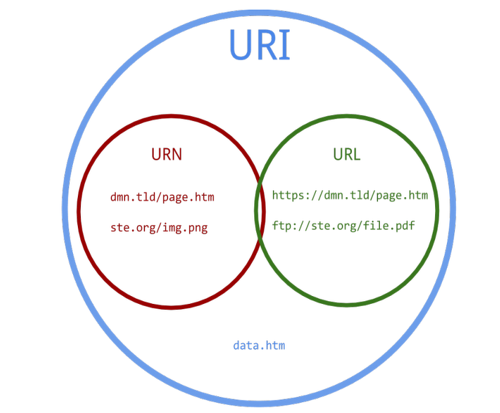
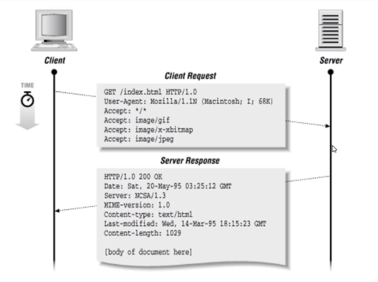

> https://watrv41.gitbook.io/devbook/web/http/2-url

# 1장 HTTP 개관

## 1.1 HTTP

> 인터넷의 멀티미디어 배달부
>
> 수많은 이미지, HTML 페이지, 텍스트 파일, 동영상, 음성 파일 등 많은 정보들을 사용자들의 pc에 설치된 웹 브라우저로 옮겨준다.

- HyperText Transfer Protocol
- W3 상에서, 클라이언트와 서버 사이에
   이루어지는 요청/응답(request/response) 프로토콜

신뢰성 있는 데이터 전송 프로토콜(TCP)을 사용하기 때문에, 전송 중 데이터가 손상되지 않음을 보장한다. 신뢰성 있는 전송 프로토콜 이므로 개발자는 인터넷의 결함 및 약점에 대한 걱정없이 애플리케이션 고유의 기능을 구현하는데만 집중할 수 있다.


## 1.2 웹 클라이언트와 서버

- 웹 서버는 http프로토콜로 통신하기 때문에 http서버라고 불린다

웹 서버는 인터넷의 데이터를 저장하고, 웹 클라이언트가 요청한 데이터를 제공한다. 아래의 순서로 웹 서버와 웹 클라이언트가 통신한다.

1. http요청: 클라이언트(사용자)는 서버에게 데이터를 요청한다 (/index.html 이라는 문서 보여줘)
2. http응답: 서버는 요청된 데이터를 찾아 HTTP 응답으로 돌려준다.(/index.html 여기! xx타입이고 2000자다)

예를들어 브라우저를 켜서 http://google.com/index.html 를 입력하면, 브라우저는 사용자가 입력한 HTTP 요청을 [http://google.com](http://google.com/) 서버로 보낸다. 구글 서버는 요청을 받은 /index.html 객체를 찾고, 성공하면 객체의 타입, 길이 등의 정보와 함께 HTTP 응답에 실어 브라우저에게 보낸다.


## 1.3 리소스

- 웹 서버는 웹 리소스를 관리하고 제공한다. 
- 리소스
  - 정적 파일
    - 텍스트파일, HTML 파일, 워드 파일 등
  - 동적 파일
    - 콘텐츠를 생산하는 프로그램, 실시간 라이브 영상을 보여주는 등의 동적 콘텐츠 리소스
    - 사용자가 누구고 어떤 정보, 몇 시인지에 따라서 다른 콘텐츠를 생성
    - 어떻게 요청하느냐에 따라서 달라지는 리소스를 전달


### 1.3.1 미디어 타입

> MIME: Multipurpose Internet Mail Extensions

인터넷은 수천가지의 데이터 타입을 다루기 때문에, **MIME 타입** 이라는 데이터 포맷 라벨을 붙인다. 웹 서버는 모든 HTTP 객체 데이터에 MIME 타입을 붙인다. 웹 브라우저는 서버로 부터 응답을 받을 때 응답 객체가 다룰 수 있는 객체인지 MIME 타입을 통해 확인한다.

MIME 타입은 사선(/)으로 구분된 **주타입과 부타입**으로 이루어진 문자열이다.

- text/html
- text/plain
- image/jpeg
- image/gif
- application/json
- multipart/formdata


### 1.3.2 URI (통합자원식별자)



웹 서버 리소스는 각자 이름을 갖고 있기 때문에, 클라이언트는 원하는 리소스를 선택할 수 있다. 서버의 리소스 이름은 **통합 자원 식별자(uniform resource identifier) URI**로 불린다.


```
http://google.com/index.html
```

구글에게 요청한 리소스 URI를 HTTP 프로토콜은 다음과 같이 해석한다.

1. http:// => HTTP 프로토콜을 사용하라
2. www.google.com => www.google.com으로 이동하라
3. /index.html => /index.html 이라 불리는 리소스를 가져와라

URI는 URL과 URN 두 종류로 나뉜다.

### 1.3.3 URL (통합자원지시자)

**통합 자원 지시자(uniform resource locator) URL**은 리소스 식별자의 가장 흔한 형태다. URL은 특정 서버의 한 리소스에 대한 **구체적인 위치**를 서술한다.

대부분의 URL은 세 부분으로 이루어진 표준 포맷을 따른다.

- 첫 번째 부분은 스킴(scheme) 이라고 불리는데, 리소스에 접근하기 위해 사용되는 프로토콜을 서술한다.
- 두 번째 부분은 서버의 인터넷 주소를 제공한다
- 마지막은 웹 서버의 리소스를 가리킨다.

요즘 우리가 사용하는 대부분의 URI가 URL이다. 이 때문에 URI와 URL이 같다고 오해하는 경우가 많다.

### 1.3.4 URN (유니폼 리소스 이름)

- URL이 집 주소라면 URN은 사람의 이름
- URL은 단순히 위치를 제공하는 반면에 URN은 해당 객체의 정체성을 제공

**유니폼 리소스 이름(uniform resource name) URN** 은 리소스의 **위치에 영향 받지 않는** 유일한 이름 역할을 한다. 즉, 리소스의 위치가 변하더라도 문제없이 동작한다.


---

##### 요약

**결론적으로 요약하자면, URL과 URN은 URI의 종류이다.**

**그렇기에 모든 URL은 URI이고, 또한 모든 URN은 URI이다.**

**그리고 위에서 언급했듯이, URL과 URN은 다르다.**

**그렇다는 건 모든 URI는 URL이라고 말할 수 없다.** (URI는 URL과 같다는 주장에 대한 오류)

출처: https://mygumi.tistory.com/139 [마이구미의 HelloWorld]

---


## 1.4 트랜젝션

HTTP 트랜젝션은 `요청`과 `응답`으로 구성되어있다. 이 상호작용은 **HTTP 메시지** 라고 불리는 정형화된 데이터 덩어리를 이용해 이루어진다.

### 1.4.1 메서드

HTTP는 HTTP 메서드라고 불리는 여러 종류의 요청 명령을 지원한다. 모든 HTTP 요청 메시지는 **한 개의 메서드**를 가진다.

다음은 흔히 사용되는 HTTP 메서드이다.

- GET : 서버 => 클라이언트로 지정한 리소스 전달
- PUT : 클라이언트 => 서버로 보낸 데이터를 지정한 이름의 리소스로 저장
- DELETE : 지정한 리소스를 서버에서 삭제
- POST : 클라이언트 데이터 => 서버 게이트웨이 애플리케이션으로 전달
- HEAD : 지정한 리소스에 대한 응답에서 HTTP 헤더 부분만 전달

### 1.4.2 상태 코드

모든 HTTP 응답 메시지는 **상태 코드**와 함께 반환된다. 상태 코드란? 클라이언트에게 요청이 성공했는지 또는 추가 조치가 필요한지 알려주는 세 자리 숫자다.

- 200 : 성공
- 404 : 리소스를 찾을 수 없음

HTTP는 상태 코드와 함께 텍스트로 된 **사유 구절 reason phrase**도 함께 전달한다.

- 200 OK
- 200 Success

## 1.5 메시지

웹 클라이언트에서 웹 서버로 보낸 HTTP 메시지를 **요청 메시지** 라고 한다. 서버에서 클라이언트로 가는 메시지는 **응답 메시지** 라고 부른다.

메시지는 세 가지 부분으로 나뉜다.



- 시작줄
  - 메시지의 첫 줄은 시작줄로, 요청일 때는 무엇을 해야 하는지 응답 일 때는 무슨 일이 일어났는지 나타낸다.
- 헤더
  - 시작줄 다음에는 0개 이상의 헤더 필드가 이어진다.
  - 헤더는 이름과 값(key:value)으로 구성된다.
  - 헤더는 빈 줄로 끝난다.
- 본문
  - 메시지 본문은 필요에 따라 올 수 있다.
  - 요청의 본문은 웹 서버로 데이터를 전송
  - 응답의 보문은 클라이언트로 데이터를 반환
  - 본문은 문자열 이외에 이진 데이터도 전송 가능


## 1.6 TCP 커넥션

> TCP: Transmission Control Protocol, 전송 제어 프로토콜

- 메세지가 TCP커넥션을 통해 한 곳에서 다른 곳으로 옮겨가는 과정

### 1.6.1 TCP/IP

HTTP는 `애플리케이션 계층 프로토콜`이다. 따라서, `네트워크 통신`의 핵심적인 세부사항에 대해서는 `TCP/IP 인터넷 전송 프로토콜`에게 맡긴다.

TCP는 다음을 제공한다.

- 오류없는 데이터 전송
- 순서에 맞게 전달
- 조각나지 않는 데이터 스트림

TCP/IP는 TCP와 IP가 층을 이루는, 패킷 교환 네트워크 프로토콜의 집합이다. 어떤 종류의 컴퓨터나 네트워크든 서로 **신뢰성 있는 의사소통**을 하게 도와준다.

### 1.6.2 접속, IP 주소 그리고 포트번호

HTTP 클라이언트가 서버에 메시지를 전송할 수 있게 되기전에, **인터넷 프로토콜(IP)** 주소와 포트번호를 통해 클라이언트와 서버 사이에 TCP/IP 커넥션을 맺어야 한다.

그렇다면 어떻게 HTTP 서버의 IP 주소와 포트번호를 알 수 있을까 ? =>  URL 리소스 주소

```
http://www.google.com/index.html
http://www.netscape.com:80/index.html
http://101.222.66.33:8888/index.html
```

위 세가지 주소에서
	첫번째로 IP주소 207.200.83.29 에 포트번호 80 번을 찾아가 index.html 리소스를 가져온다.
	두번째로 wiw.netscape.com 이라는 주소는 DNS( Domain Name Service (포트번호:53)) 를 통해 쉽게 IP주소로 변환이 된다.
	세번째로 포트번호가 없는 경우는 기본값 80(HTTP), 443(HTTPS) 이라고 생각하면 된다.


## 1.7 프로토콜 버전

- HTTP/0.9
  - 심각한 디자인 결함이 다수 있고 구식 클라이언트하고만 같이 사용할 수 있다.
  - 오직 GET 메소드만 지원
  - MIME 타입, HTTP 헤더, 버전 번호는 지원하지 않음.
- HTTP/1.0
  - 처음으로 널리 쓰이기 시작한 버전
  - 헤더, 추가 메서드, 멀티미디어 객체 처리 추가
- HTTP/1.0+
  - keep-alive 커넥션
  - 가상호스팅 지원, 프락시 연결지원
- HTTP/1.1
  - 구조적 결함 교정, 성능 최적화, 잘못된 기능 제거
  - 현재의 HTTP 버전
- HTTP/2.0
  - HTTP/1.1 성능 개선 위해 설계 진행


#### HTTP 요청과정

1. 웹브라우저가 URL 에서 `호스트 명을 호출'
2. 웹브라우저가 서버의 호스트명을 'IP주소로 변환(DNS 이용)
3. 웰브라우저가 `(포트번호가 있다면) 포트 번호 추출'
4. 웹브라우저가 웹서버와 `TCP 커넥션 형성'
5. 웹브라우저가 웹서버에 `HTTP 요청'
6. 서버가 웹브라우저에게 HTTP 응답'
7. 커넥션이 닫히면 웹브라우저는 문서를 보여준다


## 1.8 웹의 구성요소

### 1.8.1 프락시

*클라이언트와 서버 사이에 위치한 HTTP 중개자*

프락시는 클라이언트와 서버 사이에 위치하여, 클라이언트의 모든 HTTP 요청을 받아 서버에 전달한다. 프락시는 주로 보안을 위해 사용된다. 또한 요청과 응답을 필터링한다

웹 보안, 애플리케이션 통합, 성능 최적화에 있어서 중요

### 1.8.2 캐시

*많이 찾는 웹페이지를 클라이언트 가까이에 보관하는 HTTP 창고*

웹캐시와 캐시 프락시는 자신을 거쳐가는 문서들 중 자주 찾는 것의 사본을 저장해두는 특별한 종류의 HTTP 프락시 서버다.

### 1.8.3 게이트웨이

*다른 애플리케이션과 연결된 특별한 웹 서버*

주로 HTTP 트래픽을 다른 프로토콜로 변환하기 위해 사용된다. 스스로가 리소스를 갖고 있는 **진짜 서버**인 것처럼 요청을 다룬다.

예를들어, HTTP/FTP 게이트웨이는 FTP URI 요청을 받아 들인 뒤, FTP 프로토콜을 이용해 문서를 가져온다. 받아온 문서는 다시 HTTP 메시지에 담겨 클라이언트 에게 전달된다. 이 때 클라이언트는 자신이 게이트웨이와 통신하고 있음을 알아차리지 못할 것이다.

### 1.8.4 터널

*단순히 HTTP 통신을 전달하기만 하는 특별한 프락시*

터널은 두 커넥션 사이에서 raw 데이터를 열어보지 않고 그대로 전달해주는 HTTP 애플리케이션이다. 주로 비 HTTP 데이터를 하나 이상의 HTTP 연결을 통해 그대로 전송해주기 위해 사용된다.

대표적으로 암호화된 SSL 트래픽을 HTTP 커넥션으로 전송함으로 웹 트래픽만 허용하는 사내 방화벽을 통과시키는 경우가 있다.

### 1.8.5 에이전트

*자동화된 HTTP 요청을 만드는 준지능적 웹 클라이언트*

웹 요청을 만드는 애플리케이션은 뭐든 HTTP 에이전트이다. 웹 브라우저 이외에도 사용자 에이전트는 여러종류가 있다. 예를 들어 스스로 웹을 돌아다니며 HTTP 트랜젝션을 일으키고 콘텐츠를 받아오는 에이전트도 있다.