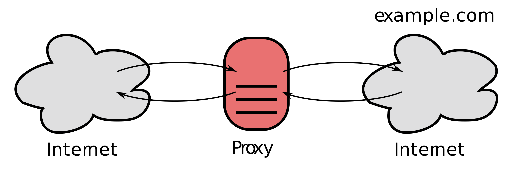

# 6장 프락시

## 6.1 웹 중개자

웹 프락시 서버는 클라이언트 입장에서 `트랜젝션을 수행`하는 중개인이다.

HTTP 프락시 서버는 웹 서버이기도 하며 웹 클라이언트이기도 하다.

### 6.1.1 개인 프락시와 공유 프락시

하나의 클라이언트만을 위한 프락시를 `개인 프락시`라고 부르며, 여러 클라이언트가 함께 사용하는 프락시는 `공용 프락시`라 부른다.

- 공용 프락시 대부분의 프락시는 공용이며 공유된 프락시다. 중앙 집중형 프락시를 관리하는 게 더 비용효율이 높고 쉽다. 캐시 프락시 서버와 같은 몇몇 프락시 애플리케이션은 프락시를 이용하는 사용자가 많을수록 유리하다. 이유는 여러 사용자들의 공통 요청에서 이득을 취할 수 있기 때문이다.
- 개인 프락시 브라우저의 기능을 확장하거나 성능을 개선하거나 무료 ISP 서비스를 위한 광고를 운영하기 위해 작은 프락시를 컴퓨터에서 직접 실행한다.

### 6.1.2 프락시 vs 게이트웨이

프락시 : 같은 프로토콜을 사용하는 둘 이상의 애플리케이션을 연결 게이트웨이 : 서로 다른 프로토콜을 사용하는 둘 이상을 연결

실질적으로 프락시와 게이트웨이의 차이점은 모호하다. 프락시는 떄때로 약간의 프로토콜 변환을 하기도 한다.

## 6.2 왜 프락시를 사용하는가?

프락시 서버는 보안을 개선하고, 성능을 높여주며, 비용을 절약한다. + 트래픽 감시, 수정

- 어린이 필터

  어린이들에게 교육 사이트를 제공하며 동시에 성인 콘텐츠를 차단하는 필터링 프락시를 사용할 수 있다.

- 문서 접근 제어자

  각각 다른 조직에서 관리되는 다양한 종류의 수많은 웹 서버들에 대한 접근 제어를 수시로 갱신할 필요 없이,

  중앙 프락시 서버에서 접근 제어를 설정할 수 있다.

  (특정 페이지에 대한 제약 여부, 특정 서버 접근하기 전에 비밀번호 요구)

- 보안 방화벽

  보안을 강화하기 위해 프락시 서버를 사용한다. 프락시 서버는 조직 안에 들어오거나 나가는 응용 레벨 프로토콜의 흐름을 네트워크의 한 지점에서 통제한다. 또한 바이러스를 제거하는 웹이나 이메일 프락시가 사용할 수 있는 트래픽을 세심히 살펴볼 수 있는 훅을 제공하기도 한다.

- 웹 캐시

  프락시 캐시는 자주 요청하는 문서의 로컬 사본을 관리하고 해당 문서에 대한 요청이 오면 빠르게 제공하여, 느리고 비싼 인터넷 커뮤니케이션을 줄인다.

- 대리 프락시(리버스 프락시)

  대리 프락시는 공용 콘텐츠에 대한 느린 웹 서버의 성능을 개선하기 위해 사용될 수 있다. 흔히 서버 가속기 라고 부른다.

  또한, 콘텐츠 라우팅 기능과 결합되어 주문형 복제 콘텐츠의 분산 네트워크를 만들기 위해 사용될 수 있다.

- 콘텐츠 라우터

  인터넷 트래픽 조건과 콘텐츠의 종류에 따라 요청을 특정 웹 서버로 유도하는 콘텐츠 라우터로 동작할 수 있다. ( 사용자나 콘텐츠 제공자가 더 높은 성능을 위해 돈을 지불한 사용자의 경우 요청을 가까운 복제 캐시로 전달, 사용자가 필터링 서비스 가입했다면 HTTP 요청이 필터링 프락시를 통과하도록 함.)

- 트랜스코더

  콘텐츠를 클라이언트에게 전달하기 전에 본문 포맷을 수정할 수 있다.

  크기를 줄이기 위해 자신을 거쳐가는 GIF 이미지를 JPG 이미지로 변환할 수 있다.

  한국어 텍스트를 스페인어 텍스트로 변환하고, HTML 문서를 단순 텍스트로 변환하는 트랜스코딩을 할 수 있다.

- 익명화 프락시

  HTTP 메시지에서 신원을 식별할 수 있는 특성(클라이언트IP주소, From 헤더, Referer 헤더, 쿠키, URI 세션 아이디)들을 제거함으로써 개인 정보 보호화 익명성 보장에 기여한다.

  - User-Agent 헤더에서 사용자의 컴퓨터와 OS의 종류를 제거
  - 사용자의 이메일 주소 보호를 위해 From 헤더 제거
  - 어떤 사이들 거쳐 방문했는지 알기 어립게 하기 위해 Referer 헤더 제거
  - 프로필과 신원 정보를 없애기 위해 Cookie 혜더 제거

## 6.3 프락시는 어디에 있는가?

### 6.3.1 프락시 서버 배치

- 출구 프락시

  로컬네트워크와 더 큰 인터넷 사이를 오가는 트래픽을 제어하기 위해 프락시를 로컬 네트워크의 **출구**에 넣는다. 

  - 회사 밖의 악의적 해커들을 막는 방화벽 제공

  - 인터넷 요금 절약과 인터넷 트래픽의 성능 개선을 위해

  - 학생들의 성인 콘텐츠 필터링을 위해

- 접근(입구) 프락시

  모든 요청을 종합적으로 처리하기 위해 프락시는 ISP 접근 지점에 위치하기도 한다. ISP는 사용자들의 다운로드 속도 개선,

  인터넷 대역폭 비용을 줄이기 위해 캐시 프락시를 사용해 많이 찾는 문서들의 사본을 저장한다.

- 대리 프락시

  웹 서버들의 바로 앞에 위치하여 모든 요청을 처리하고 필요할 때만 웹 서버에게 자원을 요청한다.

  일반적으로 웹 서버의 이름과 IP 주소로 스스로를 가장하기 때문에, 모든 요청은 서버가 아닌 프락시로 간다.

- 네트워크 교환 프락시

  네트워크 사이의 인터넷 피어링 교환 지점들에 놓인다.

### 6.3.2 프락시 계층

프락시들은 `프락시 계층` 이라고 불리는 연쇄를 구성할 수 있다. 프락시 계층에서 프락시 서버들은 부모와 자식의 관계를 갖는다. 다음번 <u>인바운드 프락시(서버에 가까운 쪽)을 부모, 다음번 아웃바운드 프락시(클라이언트에 가까운 쪽)는 자식</u>이라고 부른다.

- 프락시 계층 콘텐츠 라우팅

  프락시 계층은 정적이나, 계층이 반드시 정적이어야 하는 것은 아니다. 프락시 서버는 여러가지 판단 근거에 의해 메시지를 다양하고 유동적인 프락시 서버와 원 서버들의 집합에게 보낸다.

  - 부하 균형

    자식 프락시는 부하를 분산하기 위해 현재 부모들의 작업량 수준에 근거하여 부모 프락시를 고른다.

  - 지리적 인접성에 근거한 라우팅

    자식 프락시는 원 서버의 지역을 담당하는 부모를 선택할 수도 있다.

  - 프로토콜/타입 라우팅

    URI에 근거하여 다른 부모나 원 서버로 라우팅 할 수 있다. 어떤 특정 종류의 URI를 갖고 있는 요청의 경우,

    특별한 프락시 서버로 보내져 특별한 프로토콜로 처리될 수도 있다.

  - 유료 서비스 가입자를 위한 라우팅

    빠른 서비스를 위해 추가금을 지불했다면, 그들의 URI는 대형 캐시나 성능 개선을 위한 압축 엔진으로 라우팅 될 수 있다.

  동적 부모 라우팅 로직은 제품마다 다르게 구현된다.

### 6.3.3 어떻게 프락시가 트래픽을 처리하는가

클라이언트 트래픽이 프락시로 가도록 만드는 방법은 다음 네 가지가 있다.

1) 클라이언트를 수정한다

- 웹 클라이언트들은 수동 혹은 자동 프락시 설정을 지원

- 프락시 설정이 되어있다면, 클라이언트는 HTTP 요청을 바로 프락시에게 전달

  2)  네트워크를 수정한다

- 네트워크 인프라를 가로채서 웹 트래픽을 프락시로 가도록 조정

- HTTP 트래픽을 지켜보고 가로채어 클라이언트 모르게 트래픽을 프락시로 보내는 **스위칭 장치 / 라우팅 장치**가 필요

- 인터셉트 프락시라고 부른다

  3)  DNS 이름공간을 수정한다

- DNS 이름 테이블을 수동으로 편집하거나, 특별한 동적 DNS 서버를 이용해서 조정

  4)  웹 서버를 수정한다

- 웹 서버는 HTTP 리다이렉션 명령(305)을 클라이언트에게 돌려줌으로써 클라이언트의 요청을 프락시로 리다이렉트 한다

