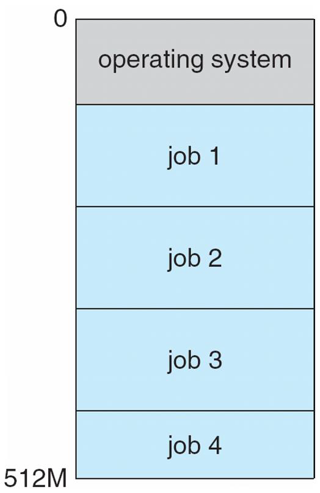

> 본 내용은 WILEY 출판사에서 발간한 운영체제 10판(번역본)과 https://www.inflearn.com/course/운영체제=공룡책-전공강의# 이곳의 강의를 바탕으로 작성하였습니다.


[TOC]

## 0. 강의개요

### 실습을 위한 개발환경 구축(Windows 10 + WSL 2 + Visual Studio Code)

1. 버전 확인

- Windows 10 x64의 경우 버전 1903이상, 빌드 18363 이상

2. WSL/가상머신 기능 켜기

- 설정 - Windows 기능 켜기/끄기

  - `Linux용 Windows 하위 시스템` 옵션 체크

    - 명령어로도 가능

      ```powershell
      dism.exe /online /enable-feature /featurename:Microsoft-Windows-Subsystem-Linux /all /norestart
      ```

  - `가상머신 플랫폼` 옵션 체크

    - 명령어로도 가능

      ```powershell
      dism.exe /online /enable-feature /featurename:VirtualMachinePlatform /all /norestart
      ```

3. Linux 커널 업데이트

- https://docs.microsoft.com/ko-kr/windows/wsl/install-win10
- Linux 커널 업데이트 패키지 다운로드

4. Linux 배포 설치

- Microsoft Store - "Ubuntu"
- Ubuntu 20.04 LTS
  - admin 계정 생성

5. WSL2를 기본버전으로 설정하기

- powershell을 관리자 권한으로 열기

  ```powershell
  wsl --set-default-version 2
  wsl -l -v
  ```

6. 우분투에서 GNU 툴체인 설치

- 시작 - UBuntu - Ubuntu 커맨드 창에 서 설치

  ```powershell
  $ sudo apt-get update
  $ sudo apt-get install build-essential gdb
  $ gcc --verison
  $ g++ --version
  $ gdb --version
  ```

  - 4. 의 비밀번호 입력 필요

7. VS Code 설치
8. VS code의 확장프로그램`Remote = WSL` 확장팩 설치
9. VS Code에서 WSL 연결하기\

- 좌측 하단 `원격 창 열기`
- Remote = WSL:New Window 선택
- 폴더 열기 - 홈 디렉토리 열림 - 새 디렉토리 만들고 연결

10. 리눅스 시스템 프로그래밍

- 폴더 생성 : `mkdir testwsl`

  - 자신의 위치 확인 `$ pwd`
  - 원격에 연결되었습니다  - 폴더 열기 - 목록에서 폴더가 생성된 것을 확인 
  - 리눅스 안의 폴더가 된 것.

- `hello.c` 생성, vscode 플러그인 설치

  ```bash
  $ gcc-pthread hello_thread.c
  ```

  ```bash
  $ ./a.out
  ```

  - c 드라이브 이동

    ```bash
    $ cd /mnt/c
    ```


<br>

## 1. Chapter 1-2. Introduction & O/S Structures**

### 1. 운영체제가 뭐길래?

> 운영체제 : 컴퓨터 시스템을 운영하는 소프트웨어

<br>

**컴퓨터**

- 정보를 처리하는 기계

<br>

**정보**

- 클로드 섀넌(Claude Elwood Shannon)

$$
I(x) = -log_2P(x)
$$

- 정보를 전송한다는 것은 '가능한 기호들의 경우의 수에서 하나를  선택하는 것'

- 정보의 최소 단위 **1bit(binary digit)** : T,F 중 하나가 발생했을 때의 정보량

- 예시

  - [1, 2, 3, 4, 5, 6] 중 하나의 수를 맞출 확률은 1 / 6 = 6^-1
    $$
    P(x) = \frac{1}{6} = 6^{-1}
    $$
    
    $$
    I(x) = -log_26^{-1} = log_26
    $$

  - 동전의 앞뒷면에 대한 정보
    $$
    P(x) = \frac{1}{2} = 2^{-1},\quad I(x) = -log_22^{-1} = 1
    $$

<br>

#### 정보의 처리

- 정보의 상태 변환
- 정보의 연산
  - 부울 대수 : NOT, AND, OR
- 논리 게이트 : NOT, AND, OR, XOR, NAND, NOR
- 논리 회로 : IC, LSL, VLSL, ULSI, SoC
- 무어의 법칙, 황의 법칙
  - 무어의 법칙: 칩의 집적도 - 반도체 집적회로**의** 성능이 24개월마다 2배로 증가한다.
    - 이제는 한계에 도달. 더 이상 집적이 힘들어지고 있음
  - 황의 법칙: 메모리 - 반도체 메모리 용량이 1년마다 2배씩 증가한다
- 산술 논리 장치(Arithmetic logic unit, ALU)
  - 두 숫자의 산술연산과 논리연산을 계산하는 디지털 회로
  - 컴퓨터 중앙처리장치의 기본 설계 블록

<br>

**정보의 저장과 전송**

- 저장 : 플립-플롭
- 전송 : 데이터버스, RF

<br>

**정보의 처리 : 덧셈**

- 반가산기 : 전가산기에 사용, CARRY(올림)을 추출해 내는 데 목적

  

  - 진리표

    | **A** | **B** | **SUM** | **CARRY** |
    | ----- | ----- | ------- | --------- |
    | **0** | **0** | **0**   | **0**     |
    | **1** | **0** | **1**   | **0**     |
    | **0** | **1** | **1**   | **0**     |
    | **1** | **1** | **0**   | **1**     |


- 전가산기 : CPU에 사용, SUM과 CARRY를 구하는 회로

  

  - 진리표

    | **A** | **B** | **C(IN)** | **S** | **C(OUT)** |
    | ----- | ----- | --------- | ----- | ---------- |
    | **0** | **0** | **0**     | **0** | **0**      |
    | **0** | **0** | **1**     | **1** | **0**      |
    | **0** | **1** | **0**     | **1** | **0**      |
    | **0** | **1** | **1**     | **0** | **1**      |
    | **1** | **0** | **0**     | **1** | **0**      |
    | **1** | **0** | **1**     | **0** | **1**      |
    | **1** | **1** | **0**     | **0** | **1**      |
    | **1** | **1** | **1**     | **1** | **1**      |

<br>

**정보의 처리 : 뺄셈**

- 2의 보수 표현법
  - 덧셈 회로를 이용해서 표현을 2의 보수로 하면 뺄셈도 가능
  - A - B를 계산할 때 B의 보수(-B)를 구한 다음 A + (-B)로 계산
- 보수 :
  - 두 수의 합이 진법의 밑수(N)가 되게 하는 수
  - 1의 보수
    - 각 자릿수의 값이 모두 1인 수에서 주어진 2진수를 빼면 1의 보수
    - 1010 -> 0101
  - 2의 보수
    -  1의 보수에 1을 더한 값과 같과 같음
    - 1010의 1의보수 0101 -> 1을 더해 0110
- A - B =  A + (-B)

> 1의 보수 뺄셈 : 1의 보수를 이용한 뺄셈은 빼는 수의 1의 보수를 구한 다음 더합니다. 덧셈한 결과가 최상위 비트에서 자리올림이 생겼다면 최하위 비트에 1을 더하고, 자리올림이 생기지 않았다면 연산 결과에 대해 1의 보수를 구한 후 - 부호를 붙입니다.
>
>  예시 ) 111(2) - 110(2) = 111(2) + 001(2) = 1000(2)에서 최상위 비트를 지우고 1을 더하므로 답은 1(2)입니다.
>
>  예시 ) 100(2) - 110(2) = 100(2) + 001(2) = 101(2)에서 다시 1의 보수를 취하므로 답은 10(2)입니다.
>
>  
>
> 2의 보수 뺼셈 : 2의 보수를 이용한 뺄셈은 빼는 수의 2의 보수를 구한 다음 더합니다. 덧셈한 결과가 최상위 비트에서 자리 올림이 생겼다면 자리올림을 제외한 나머지 부분이 연산 결과이고, 자리 올림이 생기지 않았다면 연산 결과의 2의 보수를 구한 후 - 부호를 붙입니다.
>
>  예시 ) 111(2) - 110(2) = 111(2) + 010(2) = 1001(2)에서 최상위 비트를 지우므로 답은 1(2)입니다.
>
>  예시 ) 100(2) - 110(2) = 100(2) + 010(2) = 110(2)에서 답은 010(2)입니다.
>
> 출처: https://ndb796.tistory.com/4 [안경잡이개발자]

<br>

**정보의 처리 : 곱셈과 나눗셈**

- 덧셈과 뺄셈의 반복
- 2진수의 곱셈 : 부분 곱(Partial Product)
- 2진수의 나눗셈 : 뺄셈으로 구현

<br>

**정보의 처리 : 실수 연산**

- 부동 소수점 표현

  **m X r^e ( m : 가수 r : 밑수 e : 지수 )**

  - 소수점이 포함된 실수를 표현하기 위해 사용
  - 부호 비트, 지수 부분, 가수 부분으로 구성되는 방식
  - 지수 부분 = 소수점의 위치, 가수 부분 = 유효 자릿수

<br>

**정보의 처리 : 함수**(반복문 등..)

-  GOTO

**삼각함수, 미분, 적분, 사진촬영, 동영상 재생...**

- 위 정보의 처리방식을 이용하여 구현 가능

<br>

#### 범용성(universality)

- NOT, AND, OR 게이트(BOOL)만으로 모든 계산을 할 수 있다.
- NAND 게이트만으로 모든 계산을 할 수 있다
  -  결국 NAND회로를 얼마나 집적시키냐가 반도체의 성능
- 범용 컴퓨터 : general-purpose computer

<br>

#### 계산가능성(computability)

- Turing-computable: 튜링 머신으로 계산 가능한 것

  - 튜링 머신 : 긴 테이프에 쓰여있는 여러 가지 기호들을 일정한 규칙에 따라 바꾸는 기계

    - 테이프 (메모리): 기호 정보를 저장할 수 있는 셀이 연결된 정보저장 장치
    - 헤드 (cpu): 셀을 읽고 쓰거나 좌우로 이동할 수 있는 제어 장치 

    

    

    - 튜링 머신의 원리 영상 : https://www.youtube.com/watch?v=DDu652WsYbc

- 정지 문제 : Halting Problem: 튜링 머신으로 풀 수 없는 문제

  - 유한한 수의 단계 후에 주어진 프로그램이 해결하고자 하는 **문제**가 해결되는지 우리에게 미리 말해줄 수 있는 어떠한 알고리즘이 존재하는가?
  - 무한루프에 빠지는지를 미리 알 수 있는가?
    - https://johngrib.github.io/wiki/halting-problem/

<br>

**컴퓨터사**

- 컴퓨터의 할아버지 : Alan Turing - Turing Machine(1996) 
  - 현대 컴퓨터의 원형을 제시
    - 헤드 - CPU
    - 테이프 - 메모리
    - 유니버셜 튜링 머신 - 운영체제
    - 튜링머신 - 응용 프로그램
  - https://www.youtube.com/watch?v=BOr1waCdv3U

- 컴퓨터의 아버지 : 폰 노이만( John von Neumann) - ISA : Instruction Set Architecture
  - 실제로 동작하는 컴퓨터
  - 내장형 프로그램(stored-program computer)
    - 메모리에 프로그램을 저장하는 컴퓨터

  <br>

- **폰 노이만 아키텍처 ISA : Instruction Set Architecture**

  - 명령어의 집합 구조

  - fetch - excute cycle

    - RAM에 저장되어있는 program들을 CPU로 패치(fetch)해서 실행(execute)

  - 명령 레지스터 : 메모리에서 패치된 명령어들을 하나씩 가져와 저장하는 위치, 

  - 실행과정

    - 명령어 체계 ex) 1+2
      - 실행코드(op(eration) code) ex)Add
      - 피연산자(operand) ex) R1=1, R2=2

    1. 메모리에 있는 명령어들을 가져온다
    2. 명령 레지스터에 해당 명령을 저장한다
    3. 명령이 디코딩 된다.
    4. 피연산자를 메모리에서 가져오고 내부 레지스터에 저장될 수 있게 된다
    5. 피연산자에 대한 명령이 실행된 후 결과는 다시 메모리에 저장될 수 있다

<br>

프로그램

- 컴퓨터에게 일을 수행하게 하는 명령어들의 집합
  - 코드파일을 compile하면 기계어가 생김
    기계어는 하나의 정보(0101011...).
    우리가 읽을 수 없으므로 어셈블리어로 표현
- 운영체제도 프로그램의 일종

<br>

#### 운영체제

- 컴퓨터에서 항상 실행중인 프로그램
- system services를 apllication programs에 제공해줌
- **processes**, resources, user interface 등을 관리

<br>

### 2. 운영체제의 개념과 구조

#### 운영체제

- 의미 : 컴퓨터 시스템을 운영하는 소프트웨어
- 어플리케이션 프로그램의 기초를 제공
- 사용자와 하드웨어간의 매개 역할

<br>

**Components**

1. 하드웨어 (the hardware)
2. 운영체제 (the operating system)
3. 응용 프로그램 (the application programs)
   - compiler, assembler, text editor, database system ...
4. 사용자 (a user)


- 하드웨어와 응용프로그램 사이의 OS의 레이어가 있음
  => 시스템과 응용프로그램 사용 시 OS를 통해 통신할 수 있음

<br>

**운영체제의 정의**

- 항상 컴퓨터에서 작동되고 있는 프로그램
- **kernel** 
  - 알맹이, 핵심
  - 두 종류의 프로그램
    - system programs
    - application programs
  - 커널을 업데이트하는 경우는 잘 없음. 주로 device를 추가하고 그를 위한 device controller를 만듬

<br>

#### 컴퓨터 시스템 조직(Organization)

**근대 컴퓨터 구조**

- 한개 이상의 CPU가 있음
- 여러개의 device controller가 bus를 통해 연결되어 있다.


<br>

**bootstrap program**


- 컴퓨터의 전원을 켰을 때 실행되는 첫번째 프로그램
- 메모리에 운영체제(특히 커널)를 로드함

> 전원을 키면 메모리에는 현재 유효한 값이 없음, cpu가 로딩해야 할 명령어를 불러와야
> power on :fast_forward: bootstrap : EEPPOM 등에 있는 명령어를 불러옴 

<br>

**Interrupts**


> 검색 - 운영 체제에서 컴퓨터에 예기치 않은 일이 발생하더라도 작동이 중단되지 않고 계속적으로 업무 처리를 할 수 있도록 해 주는 기능?

- CPU와 I/O device의 통신 방법
- 주로 system bus의 방식으로 CPU에 신호를 보냄으로써 하드웨어는 언제든지 interrupt를 발생시킬 수 있다.
- 키보드를 누르거나, 마우스가 움직였을 때

<br>

**Storage system**

- 저장 시스템
- 용량(storage capacity)과 속도(access time)에 따라서 계층 구조를 형성
  - registers
    - 제일 빠름
  - cache
    - RAM보다 훨씬 빠르고 훨씬 비쌈 => 용량을 크게 할 순 없음
  - main memory
    - RAM
  - solid-state-disk(SSD)
    - 메모리 형태의 하드디스크
  - hard disk(HDD)
    - 자기장을 이용
  - optical disk(광학 디스크), magnetic tapes
    - HDD보다도 용량이 큰 경우
    - back up을 위해(5-7년)


<br>

**I/O Structure**

- 입출력 구조


- theread of execution : 실행
- CPU가 theread of execution을 가지고 있을 때 cache를 통해 RAM에 엑세스를 한다.
- device와 입출력, 데이터, interrupt를 주고받는다.
- DMA 
  - directed memory access
  - CPU가 할 일이 없는경우 직접 memory와 device가 데이터를 주고받는다
    - 영화를 스트리밍해 보는 경우 Network로부터 데이터를 받아서 LCD에 출력하고 키보드 마우스 조작 등 interrupt가 발생했을 때에만 CPU가 처리

<br>

#### 컴퓨터 시스템 구조(Architecture)

**Computer System Components**

- CPU
  - 명령어 처리
- Proccessor
- Core
- Multicore
- Multiprocessor


**Symmetric multiprocessing(SMP)**

- 보편적인 다중처리 시스템
- 메모리는 한개지만 여러개의 CPU가 각각의 register와 cache를 갖고 연결되어 있음


**Multi-core-design**

- 같은 프로세서 칩 하나에 여러개의 코어가 붙어 있는 구조
- CPU여러개는 비용이 많이 들으므로 CPU칩 안에 register와 cache를 가지고 있는 core만 구성
- dual core, quad core, 8- core


<br>

#### 운영 체제 작동

**Multiprogramming**

- 프로그램 = 명령어들의 집합
- 여러 개의 프로그램을 메모리에 동시에 올려놓는 것
- 여러 개의 프로세스가 메모리에 동시에 올라가 있어 CPU 사용 효율을 높일 수 있다 



<br>

**Multitasking(=multiprocessing)**

> 입력이 아무리 빠르더라도 CPU입장에서는 여유가 있으므로
> 잠깐잠깐 일해도 처리할 수 있기에 동시에 다른 일을 수행할 수 있다.
>
> => time-sharing : 시분할

- Multiprogramming의 논리적 확장
- CPU가 수행업무를 자주 바꿈으로서 사용자는 일들이 수행되는 동안 각각에 상호작용할 수 있다.
- **CPU scheduling**
  - 여러개의 프로세스가 동시에 실행될 수 있을 때, 시스템은 우선순위를 정해야 한다.
- concurrency
  - 병행성, 동시성
  - 여러 계산을 동시에 수행하는 시스템의 특성
  - 잠재적으로는 서로 상호 작용이 가능하다.
- Parallelism
  - 병렬 처리
  - 동시에 많은 계산을 하는 연산의 한 방법
  - 크고 복잡한 문제를 작게 나눠 동시에 병렬적으로 해결하는 데에 주로 사용

<br>

**Two seperate mode of operations**

- 잘못된 프로그램으로 인해 다른 프로그램이 부적절하게 실행되지 못하도록 보장

- user mode
  - 실행하다가 system call(o/s에 서비스 요청) -> kernel mode
- kernel mode
  - 커널 모드가 아니면 직접적으로 하드웨어를 제어하지 못한다.


<br>

#### Virtualization

> 여러개의 프로그램을 올려놓는 multitasking이 가능하다면 여러개의 운영체제를 올릴 수도 있지 않을까?


- 가상화
- 여러 다른 처리 환경을 통해 우리가 또다른 컴퓨터의 하드웨어를 추상화할 수 있게 하는 기술
- VMM
  - Virtual Machine Manager(moniter)
    - hardware - VMM - several o/s
  - VMware, XEN, WSL ...
    - windows에는 windows system for Linux

<br>

**Computing Environments**

- Traditional Computing

- Mobile Computing

- Client-Server Computing

  - 서버의 클라이언트들이 요청/응답 => Web

  

- Peer-to-Peer Computing

  - 음악 파일 공유, 토렌트(중앙서버없이 무수히 쪼객 파일조각을 공유), 블록체인, 비트코인

  

- Cloud Computing

  - AWS, Azure, GCP

  

- Real-Time Embedded Systems

  - RTOS(real time operation system)

<br>

#### OS 서비스

- 프로그램의 실행을 위한 다양한 환경을 제공
- User interface
- Program execution
- I/O operation
- File system manipulation
- Communications
- Error detection
- Resource allocation
- Logging
- Protection and security

<br>

>  앞으로 배울 것

process(thread) - multiprocessing - synchroniztion - (문제 발생 시)deadlock

memory management, virtual memory

<br>


<br>

#### **유저 - OS 상호작용**

- 유저가 OS와 상호작용하기 위한 세가지 기초적인 방법

  1. CLI

     - command line interface, or command interpreter (명령어 입력)

     - **shells**
       - sh, bash, csh, tcsh, zsh ...

  2. GUI

     - graphical user interface (클릭)

     - Windows, Aqua for MacOS, KDE/GNOME for Linux, etc.

  3. Touch Screen Interface

     - Android UI, iPhone UI, etc.

<br>

#### **System calls**

- os에 의해 서비스가 가능하도록 상호작용을 제공


- API
  - API: Application Programming Interface
  - OS API = system calls


- *The handling of a user application invoking the open() system call*.


- *Passing of parameters as a table.*


- *Examples of Windows and UNIX system calls:*
- 매번 system call하는 것이 힘들기 때문에 라이브러리 제공


- *The standard C library*
- system-call 상호작용의 일부분을 제공

<br>

<hr>

<br>

> # Quiz

1. 정보량

   - 내 친구가 4지선다형 시험 문제의 답 하나를 알려주었다. 이 친구가 나에게 준 정보량은 얼마인가?

   $$
   I(x) = -log_2\frac{1}{4} = -log_24^{-1} = 2
   $$

   답 : 2

<br>

2. **논리 게이트**

   - 범용 컴퓨터(general-purpose computer)는 소프트웨어를 통해 여러 목적으로 사용할 수 있는 컴퓨 터를 의미한다. 범용 컴퓨터를 구현하려고 논리 회로를 만들려고 할 때 필요한 최소한의 논리 게이트 집합을 모두 고르시오.
   - 논리 게이트 : NOT, AND, OR, XOR, NAND, NOR

   답 : 1) NOT, AND, OR, 5) NAND

<br>

3. Turing Machine

   - Turing Machine에 대해서 틀린 설명은? 

   1) Alan Turing이 제안한 현대적 컴퓨터의 원형이다. 

   2) Universal Turing Machine은 현대적 컴퓨터에서 운영체제가 되었다. 

   3) Turing Machine은 정지 문제를 포함하여 계산가능한 모든 문제를 풀 수 있다고 증명되었다. 

   4) Turing Machine의 설계는 CPU와 Memory와 같은 하드웨어의 설계를 포함하고 있었다. 

   답 : 3)

<br>

4. program

   - A _______ is defined as a set of insructions that directs a computer to perform a cetain job to do.

   답 : 4) program

<br>

5. kernel

   - A _____ is the core of operating system that is running at all times on the computer.

   답 : 1) kernel

<br>

6. bootstrap

   - A ________ program is the first program to run on computer power-on, and then loads the operating system into the main memory.

   답 : 3) bootstrap

<br>

7. Virtualization

   - ________ is a technology that allow us to abstract the hardware of a single computer into several different execution environments to enable for several OSes to run concurrently. 

   답 : 1) Virtualization

<br>

8. **system call**

   - ________ is a technology that allow us to abstract the hardware of a single computer into several different execution environments to enable for several OSes to run concurrently. 

   답 : 1) system call

<br>