## Chapter 3. Processes

### 3. 프로세스의 이해

#### 프로세스의 개념

 **프로세스**

- 실행중인 프로그램
- 운영체제에서의 작업의 단위
- 프로세스는 작업을 수행하기 위해 특정 자원이 필요
  - CPU time
  - memory
  - files
  - I/O devices
- 프로세스를 실행시키기 위한 순서


| CPU     |         | Memory           |        | Storage         |
| ------- | ------- | ---------------- | ------ | --------------- |
|         | ← fetch | **( Proccess )** | ← load | 실행파일(a.out) |
| execute | →       | 메모리           |        | SSD, HDD        |

<br>

**프로세스의 구조**

- 프로세스의 메모리 레이아웃은 다수의 구조로 나뉘어 있다.
  - Text section
    - 명령어
  - Data section
    - 전역 변수
  - Heap section (runtime)
    - 프로그램 실행 시간 동안 동적으로 할당되는 메모리
  - Stack section (compile)
    - 함수 호출 시 임시 데이터 저장
    - 함수 매개 변수, 반환 주소, 지역 변수 등이 저장됨
- 실제로 확인해보는 방법

```bash
$ gcc 3.1 memory_layout.c
$ size ./a.out
```


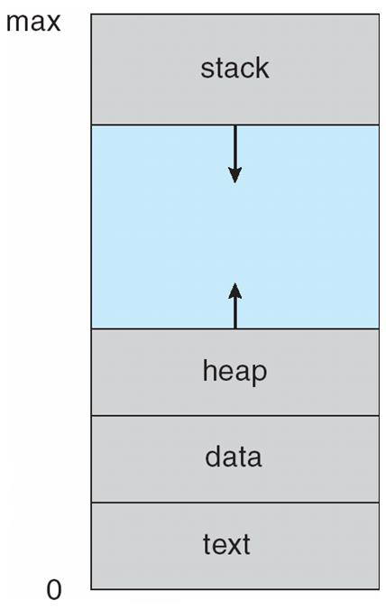

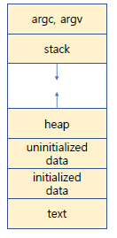

<br>

**프로세스의 상태**

- 프로세스가 실행되면 다섯개의 상태로 변경된다.

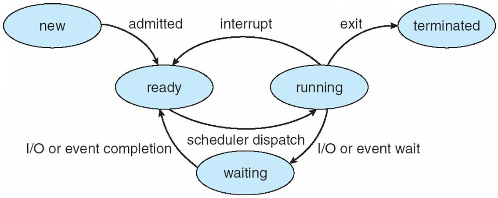

- New
  - 프로세스가 생성된 상태
- Running
  - 명령이 실행 중일 때
- Waiting
  - 프로세스가 어떤 사건이 발생하기를 기다리고 있는 상태
  - 사건 : I/O 완료 혹은 신호 수신 등
    - a = input() 같은 코드에서 input 입력을 기다리는 상태 등
  - 자발적으로 running 상태에서 waiting으로 오며 사건이 끝나면 다시 running 상태로 돌아간다
- Ready
  - 프로세스가 할당되기를 기다리고 있는 상태
  - CPU 점유율을 주면 일할 수 있다
- Terminated
  - 프로세스 실행이 종료된 상태
  - return이나 exit()를 사용했을 때

<br>

**프로세스 관리법**

> scheduler dispatch

- PCB Process Control Block ) 또는 TCB (Task Control)

  > 프로세스가 가져야 하는 모든 정보를 가진 구조체

  - 각 프로세스는 운영 체제에서 PCB로 표시된다.
  - 1개의 프로세스는 1개의 PCB를 가진다.
  - PCB에는 특정 프로세스와 관련된 많은 정보가 포함되어 있다.
    - **Process state** [new, running, waiting, ready, terminate]
    - **Program counter**
      - for문이나 while문 등으로 이동할 때
      - IR (Instruction Register) 로 메모리에 있는 명령어를 fetch할 때 어디에 있는 메모리를 가져아야할지 알려줌
    - CPU registers
      - IR, DR
      - program counter도 일종의 CPU register
    - CPU scheduling information
    - Memory management information
    - Accounting information
      - 계정 정보
    - I/O status information
      - 어떤 파일과 자원을 사용하는지

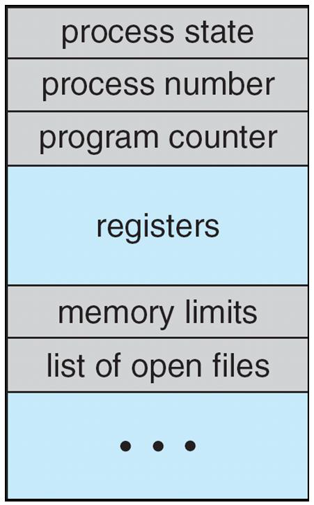

<br>

**thread**

- 프로그램은 단일 실행 스레드(single thread execution)를 수행하는 프로그램이다
- 단일 제어 스레드는 한 번에 하나만 수행하는 프로세스를 허용한다.
- 최신 운영 체제는 프로세스 개념을 확장했다.
  - 프로세스가 다중 실행 스레드를 갖도록 허용
  - 한 번에 둘 이상의 작업을 수행
- thread는 경량 프로세스다. (Chapter 04. Thread에서 다룬다.)

<br>

#### 프로세스 스케쥴링

- Concurrency(동시성, 병행성)
  - 실질적으로 이 여러 프로세스들이 **actual same time** 에 동시에 실행되는 것은 아니다! 워낙 자주, 빠르게 CPU가 옮겨다니기 때문에 사람의 감각으로는 그 차이를 파악하지 못하는 것일 뿐이다.
- Multiprogramming(다중 프로그래밍)의 목적
  - 항상 일부 프로세스가 실행되도록 하기 위해
  - CPU 사용률을 최대화하기 위해
- Time sharing의 목적
  - 프로세스간에 CPU 코어를 자주 전환하기 위해
  - 사용자가 각 프로그램이 실행되는 동안 상호작용을 할 수 있다.


**Scheduling Queues**

- queue : FIFO
- Ready 상태에 있는 프로세스들을 묶어서 큐로 구성하고 그 큐를 **Ready Queue**라 한다.
- ready queue
  - Ready 상태의 프로세스들을 관리하기 위한 큐 형태의 자료구조
  - 프로세스가 시스템에 들어감에 따라, ready queue에 들어간다.
  - CPU 코어에서 실행할 준비가 되어 있고 대기중인 곳
- wait queue
  - 특정 이벤트가 발생하기를 기다리는 프로세스가 배치되는 곳
- 이러한 queue들은 일반적으로 PCB들의 linked lists로 구현된다.
  - 단순히 array 방식으로 만들면 OS가 제공할 수 있는 프로세스의 개수가 제한된다는 단점이 있다.
  - 이를 극복하기 위해서 링크드 리스트 방식을 사용하는 것이다. (아마도 prev 포인터와 next 포인터 모두를 가지는 doubley-linked-list 방식으로 구현되지 않을까 싶다.)

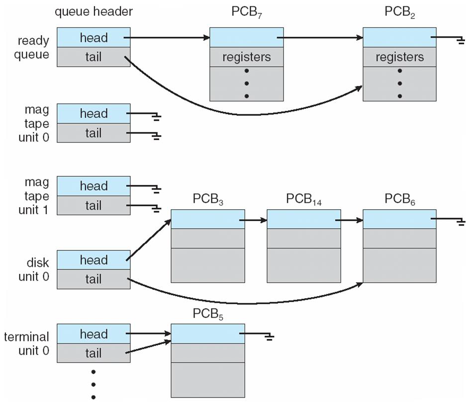

- 첫번째의 ready queue를 제외한 나머지는 전부 wait queue(여러개의 디바이스)

<br>

**Queueing Diagram**

- 프로세스 스케쥴링을 표현

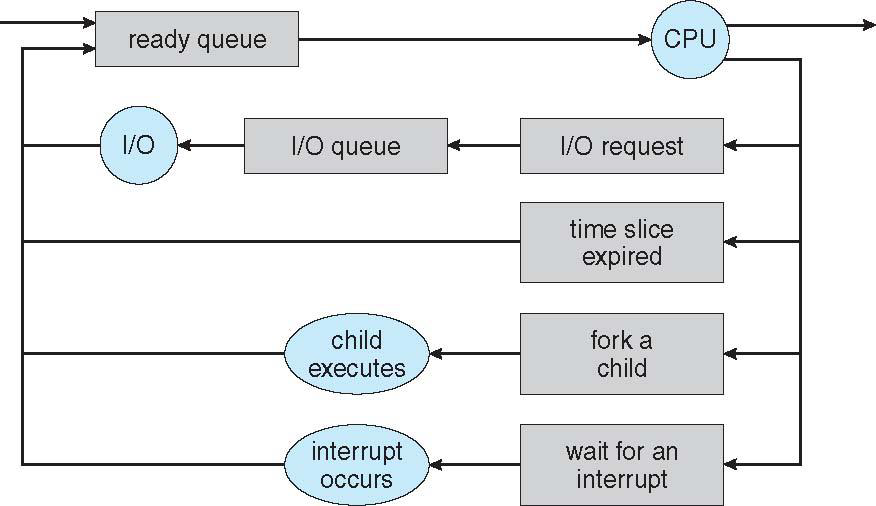

- 프로세스의 이동
  - ready queue에서 CPU로 갔다가 다시 ready queue로 돌아가는 경우
  - I/O request가 발생해 해당 device의 wait queue에 들어갔다가 다시 ready queue로 돌아오는 경우
  - 타임 슬라이스가 만료되어 ready queue로 돌아가는 경우
  - CPU가 folk를 했을 때는 new가 되기 때문에 child 프로세스가 ready queue로 들어감
  - interrupt를 기다릴 때도 wait queue에 들어갔다가 interrupt를 받은 후 ready queue로 들어감

>Q. Running state의 프로세스가 CPU를 빼앗기는 경우는 I/O request가 왔을 때 뿐인가?
>
>A. 아니다. Running state의 프로세스가 CPU를 빼앗기게 되는 경우는 크게 2가지가 존재한다.
>
>첫번째로는 I/O request가 올 때, 두번째로는 Running state의 프로세스보다 더 높은 우선순위의 프로세스가 오는 경우이다.
>
>하지만, 이 두가지 경우에는 큰 차이가 존재한다. I/O request가 오는 경우에는 해당 I/O request가 끝날 때까지 기다려야만 한다. 때문에 현재 Running state의 프로세스는 Waiting queue에 들어가게 된다. 반면, 더 높은 우선순위의 프로세스가 오는 경우에는 단순히 CPU를 뺏기기만 하는거지 기다릴 이유가 없다. 때문에 바로 Ready queue에 들어간다.
>
>- 프로세스를 수행하는 도중 더 높은 우선순위를 가지는 프로세스가 오게 되면, 원래 하던 프로세스에 interrupt를 걸고 더 높은 우선순위의 프로세스를 처리하는 것이 context switch다

<br>

**Context Switch**

- 프로세스의 문맥은 PCB에 나타난다.

- 인터럽트가 발생했을 때
  
  - 시스템은 실행중인 프로세스의 현재 문맥을 저장한다.
  - 나중에 다시 시작해야할 때 해당 컨텍스트를 복원할 수 있다.
  
  > interrupt가 걸려서 CPU가 이동하기 전에, 지금까지 이 프로세스에서 했던 작업들을 저장해두고 가야 다음에 돌아왔을 때 이어서 처리할 수 있다.
  
- 컨텍스트의 전환은
  - CPU 코어를 다른 프로세스로 전환
  - 현재 프로세스의 상태를 저장
    - 이 context를 저장해놓을 공간이 필요하기 때문에 프로세스마다 하나의 PCB를 할당하는 것
  - 다른 프로세스의 상태를 복원

> Q. Context Switching은 오버헤드가 없는 동작일까?
>
> overhead : 어떤 처리를 하기 위해 들어가는 간접적인 처리 시간 · 메모리 
>
> A.아니다. Context Switching은 pure overhead를 갖는다.(1번당 5 microseconds on today's hardware) 왜냐하면, Switching을 하는 동안에는 CPU가 다른 일을 할 수 없다.

<br>

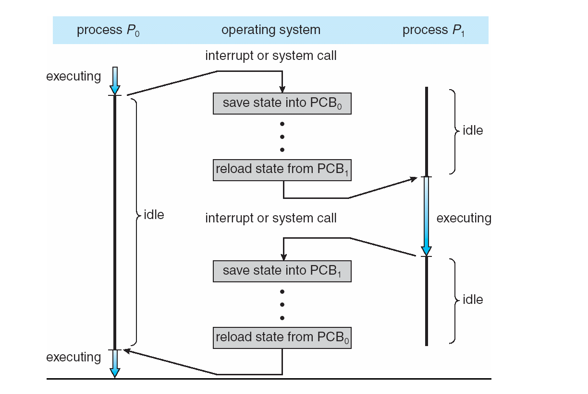

- P0을  수행하다가 inteerupt나 system call이 발생하여 상태를 저장하고 P1을 불러와 수행하고, 같은 방식으로 다시 P0을 수행시키는 과정

<br>

#### 프로세스의 운영

- 운영체제가 제공하는 메커니즘의 목적
  - 프로세스 생성(`fork()`)
  - 프로세스 종료
- 프로세스는 여러개의 새로운 프로세스를 생성할 수 있다.
  - 생성하는 프로세스 : 부모 프로세스
  - 새로 생성된 프로세스 : 자식 프로세스

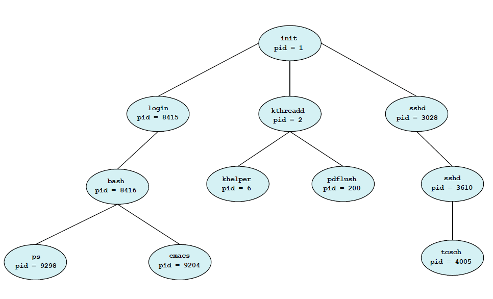

- 실행의 두가지 경우
  - 부모가 계속 실행되면서 자식도 실행되는 경우 
  - 부모는 자식이 terminate 상태가 될때까지 기다렸다가 실행을 재개하는 경우
- 주소 공간의 두가지 경우
  - 자식이 부모의 복제본일 경우 `fork()`
  - 자식에 새로운 프로그램이 불러와져 있는 경우 `exec()`

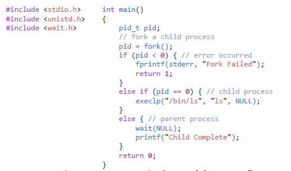

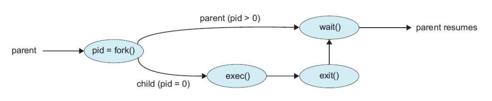

<br>

- 프로세스가 종료되는 경우
  - 마지막 구문이 실행되면 종료된다. (return)
  - `exit()` system call로 OS에게 강제 종료 요청
  - 프로세스가 끝나면 OS는 모든 리소스를 할당 해제하고 회수한다.
    - 할당된 메모리, 열린 파일, I/O 버퍼 등

<br>

**Zombie & Orphan**

- Zombie 프로세스
  - 부모가 자식을 생성하고 `wait()`를 호출하지 않음 (부모가 자식을 생성한 후 신경 안쓰고 자기 할일을 계속 하는 경우)
- Orphan 프로세스
  - 부모가  자식을 생성하고  `wait()`를 호출하지 않고 return 등으로 종료된 경우 ( 부모 없는 자식 프로세스)

<br>

### 4. 프로세스의 생성

**fork()**

- O/S와 같은 UNIX에서는 새로운 프로세스는 `folk()`라는 system call에 의해 생성된다.
- 자식 프로세스의 구성
  - 부모 프로세스의 address space 사본
- 두 프로세스는 이후 실행을 계속하는데, 한가지 차이점이 있다.
  - `fork()`의 리턴 코드가 zero면 자식 프로세스로 넘어가고,
  - nonzero pid면 부모 프로세스로 넘어간다.
- `fork()` 후
  - 부모는 실행을 계속하거나
  - 자식이 실행되는 동안 할 일이 없다면 `wait()`를 발생시켜 자식의 실행이 끝날 때까지(nonzero pid가 return될 때까지) ready queue에 스스로 이동해 대기한다.

**exec()**

- replace의 개념

> 부모 프로세스의 내용들이 똑같이 자식 프로세스에 복사되는 일련의 과정들이 굉장히 비효율적이라는 생각이 들 수 밖에 없다. 때문에 "공통적으로 필요한 부분들은 공동으로 소유하면 어떨까?" 라는 아이디어가 나왔고, 이 아이디어를 바탕으로 만들어진 개념이 쓰레드(thread)이다.


<br>

#### 예제

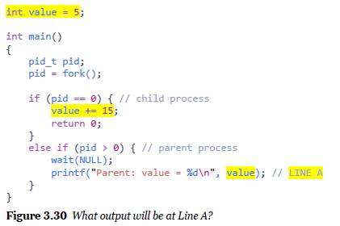

- 5가 출력

<br>

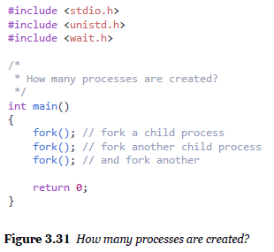

- 16개
- fork되서 생성된 child process도 계속 fork를 하기 때문

<br>

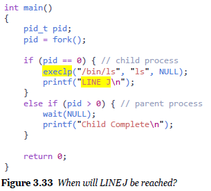

- 실행되지 않음

- execlp를 하면 ls로 완전히 복사해온 것을 덮어쓰게 됨. 따라서 다음 코드가 의미가 없음

<br>

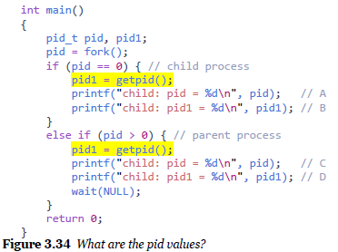

- get pid하면 현재 진행되는 process의 pid가 나옴
  - wait가 있어서 부모 프로세스가 먼저 실행되는데(else문)
  - else문의 pid는 자식의 pid, pid1은 `getpid()`로 얻었으므로 부모의 pid
  - 그 다음 if문의 pid는 부모의 pid, pid1은 `getpid()`로 얻었으므로 자식의 pid

<br>

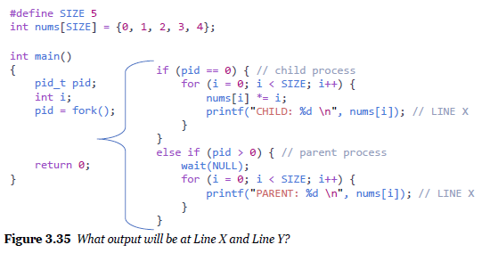

- else문에서 wait가 위에 있으면 child 먼저 실행되어서 1 4 9 16 나온 후 부모 child가 0 1 2 3 4 출력
- wait가 else문의  for문의 밑에 있었다면 부모 child  0 1 2 3 4 출력

<br>

> # Quiz

1. **프로세스의 구조**

   - In the memory layout of a process, the ______ section is an area of memory that is
     dynamically allocated during program run time.

   1) heap
   2) stack
   3) data
   4) code

   답: 1) heap

<br>

2. 프로세스의 상태

   - 운영체제에서 프로세스의 상태에 대한 설명으로 가장 틀린 것은?

   1) fork() 시스템 콜로 새로운 프로세스를 생성하면 항상 NEW 상태가 된다.
   2) READY 상태에 있는 프로세스에 interrupt를 걸면 WAITING 상태로 천이해서 응답이 올 때까지 대기한다.
   3) RUNNING 상태의 프로세스가 I/O 처리를 하면 event가 응답할 때까지 WAITING 상태로 천이한다.
   4) RUNNING 상태의 프로세스가 time out이 되면 CPU 스케줄러는 READY 상태의 프로세스 하나를 dispatch한다.

   답 : 2) READY 상태에 있는 프로세스에 interrupt를 걸면 WAITING 상태로 천이해서 응답이 올 때까지 대기한다. -> ready상태가 아니라 running 상태

<br>

3. **PCB**

   - 다음 중 PCB(Process Control Block)에 저장해야 할 정보가 아닌 것은?

   1) Program Counter
   2) Instruction Register
   3) Process State
   4) Stack Pointer
   5) BSS

   답 : 5) BSS

   - 4) Stack Pointer 는 Memory management information에 있을 듯

<br>

4. 프로세스 스케쥴링 -  Multiprogramming(다중 프로그래밍)

   - Concurrency(동시성, 병행성)에 대한 설명으로 가장 틀린 것은?

   1) multiprogramming은 동시에 여러 개의 프로그램을 메모리에 상주시키는 것을 말한다.
   2) multitasking은 여러 개의 CPU Core에서 한순간에 여러 명령어를 여러 Core에서 동시에 실행하는 것을 말한다.
   3) 시분할(time-sharing)은 여러 개의 프로세스가 하나의 CPU를 시간상으로 분할하여 사용하는 것을 말한다.
   4) multiprocessing은 CPU 자원을 효율적으로 사용하고, 사용자에 대한 응답 시간을 줄이는 목적으로 사용한다.

   답 : 2) multitasking은 여러 개의 CPU Core에서 한순간에 여러 명령어를 여러 Core에서 동시에 실행하는 것을 말한다.

   - 동시에 실행하는 것은 아니고 시간을 쪼개 switch하며 실행시키는 것이다.

<br>

5. **Context Switch**

   - Context Switch(문맥 교환)에 대한 설명으로 가장 틀린 것은?

   1) CPU 스케줄러가 프로세스에게 CPU를 배정해 주기 위해 문맥을 교환한다.
   2) Context 정보는 Process Control Block에 저장하거나, PCB로부터 로드한다.
   3) Context Switch는 interrupt 또는 system call에 의해 실행된다.
   4) Context Switch의 대상이 되는 두 프로세스는 각각 RUNNING 상태, WAITING 상태에 있다.

   답 : 4) Context Switch의 대상이 되는 두 프로세스는 각각 RUNNING 상태, WAITING 상태에 있다.

   - 각각 RUNNING 상태, READY 상태

<br>

6. **fork()**

   - 다음 프로그램에서 LINE X 라고 표기된 위치의 실행 순서로 올바른 것은?

     ```c
     int main() {
     	pid_t pid = fork();
     	if (pid > 0) {
     		wait(NULL);
     		// LINE A
     	} else {
     		pid = fork();
     		if (pid == 0) {
     			// LINE B
     		} else {
     			wait(NULL);
     			// LINE C
     		}
     	}
     	// LINE D
     }
     ```

     1) B - C - A - D - D - D
     2) B - C - D - A - D - D
     3) B - A - D - C - D - D
     4) B - D - C - D - A - D

   답 : 4) B - D - C - D - A - D

   - 한 프로세스 끝날때 D를 가게 됨.

<br>

7. **wait(NULL) 의 위치**

   - 다음 프로그램의 출력 결과로 올바른 것은?

     ```c
     int x = 10;
     
     int main() {
     	pid_t pid = fork();
     	if (pid == 0) {
     		x += 10;
     	} else {
     		wait(NULL);
     		pid = fork();
     		x += 10;
     		if (pid > 0) {
     			wait(NULL);
     		} else {
     			x += 10;
     		}
     	}
     	printf("%d ", x);
     }
     ```

     1) 20 20 30
     2) 20 30 20
     3) 20 30 30
     4) 20 20 20

   답 : 2) 20 30 20

<br>

---

### 5. 프로세스간 통신(IPC)

#### 프로세스간 통신

- 프로세스들이 동시에 진행될 때 두가지 상황
  - independent
    - 다른 프로세스와 데이터를 공유하지 않고 독립적인 경우
  - cooperating
    - 다른 프로세스에 영향을 받거나 영향을 주는 경우
    - 다른 프로세스와 데이터를 공유하는 프로세스는 협력 프로세스다.

**IPC**

- Inter Process Communication
- 협력 프로그램에 필요한 IPC 매커니즘
  - 데이터를 교환할 수 있도록 하는 메커니즘
    - 즉, 데이터를 서로 주고받을 수 있어야 한다.
- IPC의 두가지 기본 모델
  - shared memory
    - 공유 메모리
  - message passing
    - 메시지 전달

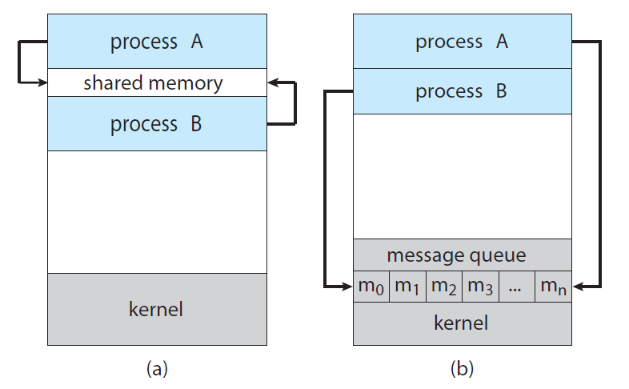

- Communication models. (a) Shared memory. and (b) Message Passing.

<br>

#### Shared-memory 시스템의 IPC

**Producer - Consumer Problem**

- 협력 프로세스의 개념을 설명하는 문제
- 협력 프로세스의 공통 패러다임
- 내용 : 생산자는 소비자가 소비하는 정보를 생산한다
  - 컴파일러는 어셈블리 코드를 생성하고 어셈블러는 이를 사용한다.
  - 웹 서버는 HTML파일을 생성하고 브라우저는 이를 사용한다.


**shared-memory solution**

- 생산자와 소비자가 동시에 실행될 수 있도록 버퍼를 사용할 수 있도록 함
  - 생산자는 버퍼를 채우고
  - 소비자는 버퍼를 비운다
- 이 버퍼를 공유 메모리로 만든다.
- 공유 메모리는 생산자 프로세스와 소비자 프로세스가 공유하는 메모리 영역
- 문제점 : 메모리 영여긍ㄹ 공유하게되면, 메모리를 쓸 공간을 개발자가 모두 설정해주어야 한다.

<br>

- 공유메모리로서의 버퍼 정의

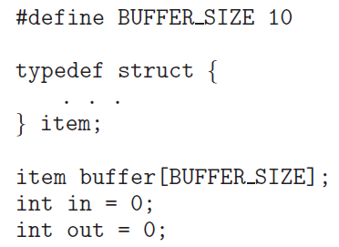

in과 out의 인덱스로 생산자가 in 인덱스에 데이터를 생성, 소비자가 out인덱스에서 소비

<br>

- 공유메모리를 사용하는 생산자

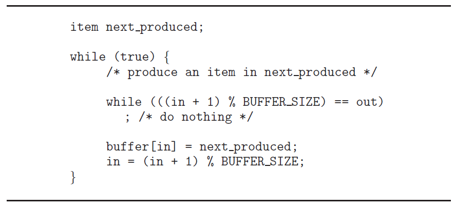

- item 변수를 만들어서 in의 위치에 넣음
- in 바로 다음이 out이면 기다린다.(while문)

<br>

- 공유메모리를 사용하는 소비자

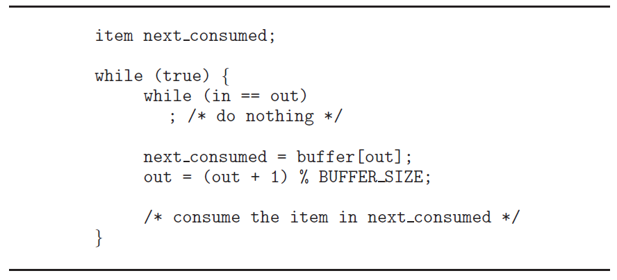

- in과 out이 같으면 기다린다.

<br>

**공유 메모리 사용 계획**

- 공유메모리를 사용하는 스킴은 두가지가 필요
- 이러한 프로세스들이 메모리 영역을 공유하는 것
- 공유 메모리에 액세스하고 조작하 기 위한 코드
  - application 개발자가 명시적으로 작성해야 한다.

<br>

#### massage-passing 시스템의 IPC

**massage-passing solution**

- 메시지 전달 기능을 통해 서로 통신
- 운영체제에게 협업을도울 수 있는 Kernel을 만들고 관리하게 한 후, message만 전달
- 두가지 작업
  - send(message)
  - recieve(message)
- 메시지 전달을  사용하는 생산자

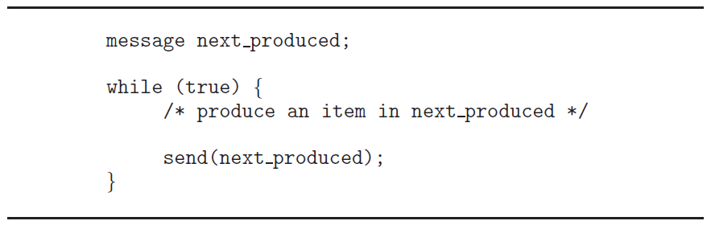

- 메시지 전달을 사용하는 소비자

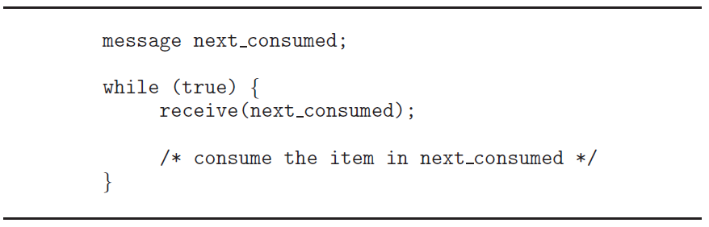

**communication link**

- 두 프로세스 P와 Q가 소통하기 위해서는, 서로 메시지를 주고받아야 한다.
- 다양한 구현방식
  - 직접 똑은 간접 커뮤니케이션
  - 동기(synchronous) 및 비동기(asynchronous) 통신
  - 자동(automatic) 또는 명시적(explicit) 버퍼링

<br>

**메시지 전달의 구현 방식**

- direct
  - 통신하고자하는 각 프로세스가 명시적으로 통신의 송신자와 수신자의 이름을 대는 것
  - 기초 구성
    - send(P, message)
    - receive(Q, message)
  - 특성
    - 자동으로 Link들이 생성
    - Link가 정확히 두 프로세스와 연관되어 있음
    - 한 쌍의 프로세스 사이에 정확히 한 Link가 존재
- indirect
  - 메시지는 mailbox나 port를 통해 송수신된다.
  - **ports**
    - mailbox
    - 추상적 객체로 볼 수 있다
    - 프로세스가 메시지를 보내거나 받는 저장소
  - 기초 구성
    - send(A, message)
    - receive(A, message)
  - 특성
    - 각 프로세스가 a shared mailbox를 가질 때에만 link가 형성된다
    - link는 두 개 이상의 프로세스와 연관된다
    - 한 쌍의 프로세스 사이에 다양한 link가 존재할 수 있다.
      - 각 link는 하나의 mailbox에 대응한다

<br>

**OS가 프로세스에게 제공하는 메커니즘**

- **Create** a new mailbox.
- **Send and Receive** messages through the mailbox.
- **Delete** a mailbox.

<br>

**구현을 위한 다른 디자인 옵션**

- blocking or non-blocking : synchronous or asynchronous
  - synchronous - blocking
  - asynchronous - non-blocking
    - 내가 보낸 것을 상대방이 받았는지 확신할 수 없음
    - 효율적임
- **blocking send**
  - 메시지가 수신될 때 까지 송신자는 차단된다.
- **non-blocking send**
  - 메시지가 수신되지 않아도 송신자가 송신한다.
- **blocking receive**
  - 메시지 수신이 가능할 때 까지 수신자는 차단된다.
- **non-blocking receive**
  - 메시지 수신이 유효하든 null 메시지이든 계속 검색한다.

<br>

### 6. 프로세스간 통신의 실제

#### IPC 시스템의 예시

> POSIX Shared Memory
>
> Pipes

<br>

**POSIX Shared Memory**

- Shared Memory:
- POSIX: Portable Operating System Interface (for uniX)
- memory-mapped files : 메모리에 매핑시킨 파일을 사용한다
  
  - 빠르다
- 과정
  1. shared-memory 객체 생성
     - `fd = shm_open (name, O_CREAT | ORDWR,0666);`
  2. 객체의 size를 byte로 정해준다
     - `ftruncate fd , 4096);`
  3. memory-mapped file 생성
     - `mmap (0, SIZE, PROT_READ | PROT_WRITE, MAP_SHARED, fd , 0);`

- 예시

  - 송신

    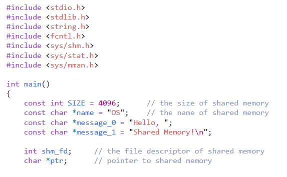

  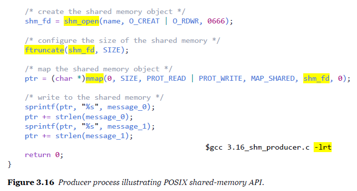

  >  송신 : mmap 생성 후 포인터를 옮겨서 글을 쓰고, 또 포인트를 옮기고 글을 쓴다.

  - 수신

    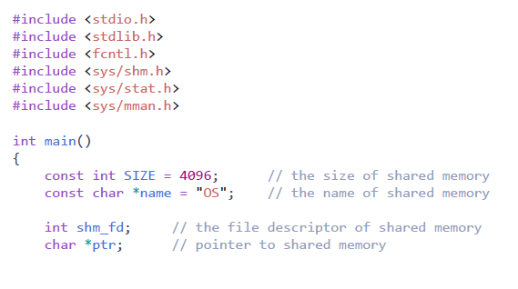

    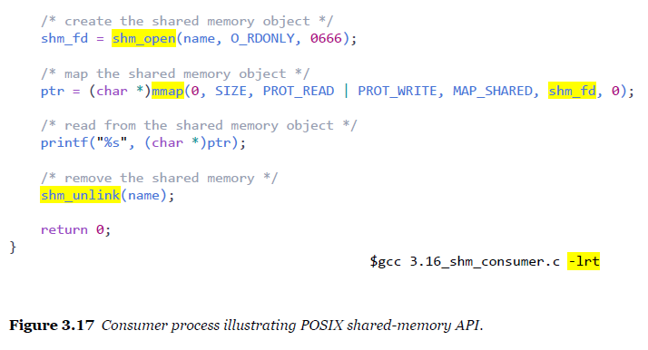

    >  shm_open 까지는 같고, mmap 파일을 read 하여 출력한다. shm_unlink를 통해 삭제한다.

```bash
$ gcc 3.16_shm_producer.c -lrt
$ gcc 3.16_shm_consumer./shm_consumer
Hello, Shared Memory!
$ gcc 3.16_shm_consumer./shm_consumer
Segmentation Fault
```

- 한번 더 읽으면 이미 삭제되어 없다고 뜸.

<br>

**Pipes**

- Message Passing
- One of the earliest IPC mechanisms on UNIX systems.
- 두개의 프로세스가 통신하는 도구로서 작용
- 4가지 사항
  - unidirectional or bidirectional:
    - 단방향 혹은 양방향 통신
  - half-duplex or full-duplex:
    - 반이중 통신 혹은 전이중 통신
    - 전이중통신 : 송수신을 위해 독립된 회선 사용
    - 반이중통신 : 한쪽이 송신하는 동안 다른쪽에서 수신, 전송 방향을 교체
  - 통신중인 프로세스 사이에 relationship이 존재하는 가
    - parent-child
  - over a network?
    - 네트워크를 통해서 통신할 수 있는지(-> socket)
- 파이프의 두가지 형태
  - ordinary pipes
    - 파이프를 생성한 프로세스 바깥에서 접근할 수 없다.
    - 보통 부모 프로세스가 파이프를 생성하여 생성한 자녀 프로세스와 통신하기 위해 사용
  - named pipes
    - 부모관계 없이 접근 가능

<br>

**ordinary pipes**

- producer - writes - write end
- consumer - reads - read end
- unidirectional
  - 단방향, 한방향으로의 통신만 가능
  - 양방향 통신은 두개의 파이프를 사용

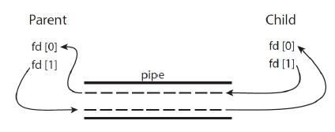

- UNiIX system에서의 ordinary pipe

  - `pipe(int fd[])`
  - `fd[0]` : the read end of the pipe
  - `fd[1]`: the write end

  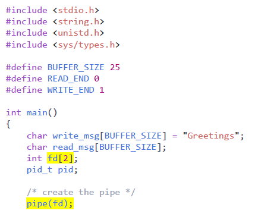

  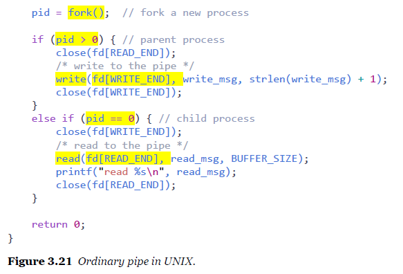

  > folk를 하는 순간 pid가 0보다 크면 부모- write, 작으면 자식-read

<br>

#### 클라이언트-서버 시스템의 통신

- 두가지 전략
- sockets
  - 통신을 위한 양 종단을 의미
  - 32bit, 64bit에 따라 불편함 발생
- RPCs(Remote Procedure
  - 네트워크 시스템상의 프로세스 간의 호출을 추상화
  - 원격에 있는 함수를 호출

<br>

**socket**

- 포트 번호와 연결된 IP 주소로 식별된다.

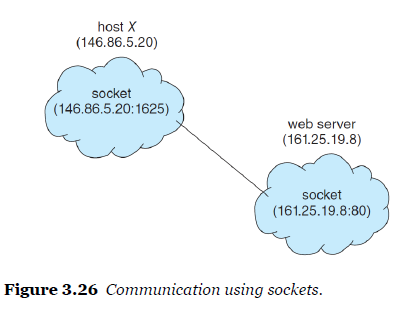

<br>

**JAVA의 socket**

- 자바는 socket에 대한 더 쉬운 인터페이스를 제공하고 세가지 소켓이 있다.
- socket class : connection - oriented (TCP)
  - 기본적, 안정성
  - 데이터 송수신 신호를 받아야만 다음 단계 진행
- DatagramSocket class : connectionless (UDP)
  - 실시간 라이브 등에 사용하는 통신방식
- MulticastSocket class : multibple recipients

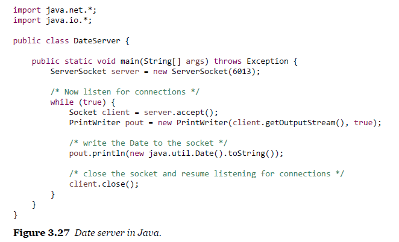

- 서버 소켓을 생성. 클라이언트 소켓을 줄 필요가 없음. 6013포트 번호에서 받겠다고 기다리고 있음.
  - 대기하고 있는 상황이 server.accept()
  - 정보가 오면 print. (예시에서는 현재 시간)
  - client(close) 닫음. 메시지 오면 또 서버소켓 생성 (반복, 정해진 포트개수를 초과하면 서버터지는 것)

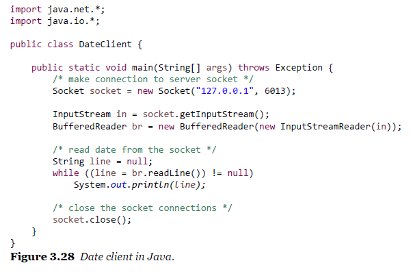

- 출력하는 상황. 소켓을 열면 생성한 쪽에서는 일이 끝났고 또 데이터 요청을 기다림

<br>

**RPC (Remote Procedure Call)**

> RMI, COM, DCOM, CORBA, EJB 등 엔터프라이즈 환경에서는 많이 씀

> class 안에 있는 변수들 (class, int, str...) 다 함께 객체 직렬화(0101...로 변환)를 해서 보낸다.  

- 원격 서비스의 전형적인 형태
- 네트워크 연결된 시스템들간 사용을 위한 proceduure-call mechanism을 추상화
- 클라이언트가 remote host의 procedure을 발생시킨다.
  - **프로시저를 로컬로 호출**한다.

- 클라이언트 쪽에 stub을 제공함으로서 통신이 발생하는 디테일을 숨긴다.
- **stub** 
  - 클라이언트 측의 스텁은 서버를 찾고 매개 변수를 **mashals**(마샬링)한다.
  - 스텁이 메시지를 받는다 - 마샬링 된 매개 변수의 압축을 풀고 - 서버에서 절차를 수행

<br>


> # Quiz

1. IPC의 두가지 방식

   - Two fundamental models of inter-process communication are:

   1) shared-memory and message-passing 

   2) pipes and sockets 

   3) sockets and remote procedure call 

   4) ordinary pipes and named pipes

   답 : 1) shared-memory and message-passing 

<br>

2. **생산자-소비자 문제, shared memory**

   - 생산자-소비자 문제를 shared memory로 해결하는 방법에 대한 설명으로 가장 옳은 것은?

   1) 운영체제가 알아서 shared memory의 생성과 소멸을 처리해 주므로, 구현하기가 편하다.

    2) POSIX 표준에서는 shared memory를 지원하지 않는다. 

   3) shared memory는 memory-mapped file로만 만들 수 있다.

   4) 생산자는 공유 버퍼에 메시지를 write()하고, 소비자는 공유 버퍼로부터 read()한다. 

   답 : 4) 생산자는 공유 버퍼에 메시지를 write()하고, 소비자는 공유 버퍼로부터 read()한다. 
   
   

<br>

3. 

   - Message-Passing 방식의 IPC에 대한 설명으로 가장 옳은 것은?

   1) message-passing 방식은 두 개의 프로세스간 통신에서만 사용할 수 있다. 
   2) message를 생산자가 소비자에게 직접 전달하는 direct 통신 방식이다. 
   3) 메시지의 전송이 완료될 때까지 block되는 send를 사용하면 asynchronous 통신을 할 수 있다. 
   4) mailbox(또는 port)를 사용한 message-passing은 indirect 통신을 가능하게 한다.

   답 : 4)
   
   1) 메일함에 담아놓는 방식이라 그렇지 않다.
   
   2) 직접 전달하지 않는다. 간접.
   
   3) block - 동기화

<br>

4. 

   - UNIX의 pipe에 대한 설명으로 가장 틀린 것은?

   1) ordinary pipe는 생산자-소비자 방식으로 두 개의 프로세스가 서로 통신하는 메커니즘이다. 
   2) ordinary pipe는 한쪽 끝단에서 write를 하고, 다른쪽 끝단에서 read를 하므로 단방향 통신만 할 수 있다. 
   3) ordinary pipe로 양방향 통신을 하기 위해서는 두 개의 파이프를 사용하면 된다. 
   4) ordinary pipe를 사용하는 두 개의 프로세스가 반드시 부모-자식 관계일 필요는 없다.

   답 : 4)
   
   부모-자식 관계를 안하려면 ordinary pipe가 아니라 named pipes

<br>

5. 

   - 소켓에 대한 설명으로 가장 옳은 것은?

   1) 원격에 있는 프로시저를 호출하기 위한 용도로 활용된다. 
   2) 클라이언트 영역의 stub과 서버 영역의 skeleton으로 구현이 나뉘어 진다. 
   3) IP 주소와 port 번호를 결합하여 하나의 소켓을 특정(identify)할 수 있다. 
   4) 일반적으로 소켓은 connection-oriented (TCP) 용으로만 사용할 수 있다.

   답 : 3)
   
   1번은 RPC의  stub.

<br>

---

<br>


Answers (indended by the Question Provider): 1) 1 2) 4 3) 4 4) 4 5) 3

