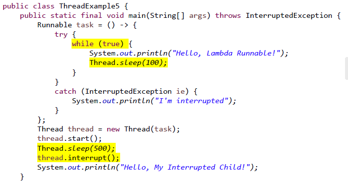

## Chapter 4. Thread & Concurrency

### 7. 쓰레드의 이해

*"가벼운 프로세스"*

#### overview

> process는 단일 제어 스레드가 있는 실행 프로그램
> -> 여러 제어 스레드를 가질 수도 있지 않을까?

**thread**

- lightweight process (LWP)

- CPU 점유의 가장 기초적인 단위

- 구성

  - **thread ID**
    - pid가 아니라 tid
  - **program counter**
  - **register set**
  - **stack**

  -> thread 별로 달라짐

- **코드, 데이터, 파일**은 공유

 

**multithreading**

- 사용동기
  - 기존 문제 : 열린 port에 클라이언트의 access하면 새로운 socket을 연결해서 데이터를 주고받는데 이때 새로운 연결이 들어오면 기다려야 하는데, 용량이 큰 경우 오래 걸릴 것.
  - server는 thead에게 요청을 처리하도록 하고 계속 요청을 대기할 수 있음.

- 장점
  - **Responsiveness** 
    - 응답성
    - 계속 실행 가능하다. blocking issue가 발생하지 않는다.
    - 유저 인터페이스에서 중요한 지점으로, 어떤 process가 차단될 일이 없다.
  - **Resource Sharing**
    - 자원공유
    - 스레드가 자원을 공유(코드, 데이터, 파일)
  - **Economy**
    - 프로세스 생성보다 경제적
    - 스레드 스위칭은 컨텍스트 스위칭보다 낮은 오버헤드
  - **Scalability**
    - 확장성
    - 프로세스는 다중 프로세서 아키텍처를 활용

 

#### Thread Library

**Threads in Java**

- 스레드는 Java 프로그램의 실행 모델로, Java는 스레드의 생성 및 관리에 대한 다양한 기능을 제공한다.

- Java에서 명시적으로 스레드를 생성하는 세가지 기술

  1. 상속

     - thread에서 파생된 새 클래스를 만든다.
     - `public void run()` 메서드를 재정의한다

  2. 계속 실행가능한 인터페이스를 구현한다

     - 계속 실행가능한 인터페이스(runnable interface)를 구현하는 새 클래스를 정의한다.
     - `public void run()` 메서드를 재정의한다

  3. Lambda 표현식 사용(버전 1.8 부터)

     - 익명의 클래스를 만드는 느낌

     - 새로운 클래스를 정의하는 대신, runnable한 람다 표현식을 사용.

- 방법 1: Thread 클래스 상속받기

  

  

  - .start로 생성
  - hello my child 먼저 출력되고 hello thread가 반복되어 출력
    - 부모 스레드 끝나고 자식 스레드가 실행 

- 방법 2: Runnable 인터페이스 구현하기

  

  

- 방법 3: Runnable 람다 표현식 사용하기
  

- 부모 쓰레드의 대기 : wait?

  
  - 프로세스는 wait를 썼지만 부모 쓰레드는 join을 씀
    - thread.start()로 자식 스레드가 실행되고 thread.join으로 부모 스레드의 남은 부분이 마지막에 실행

- 쓰레드의 종료 : stop? : interrupt!

  

 

#### Multicore Programming

> 그냥 코어가 스레드하나씩 잡고 일을 한다면..?

- 멀티코어 시스템의 멀티 스레딩
  - '코어가 많아진다'는 곧 동시성의 향상을 의미한다.
    - 예 ) 10만개의 덧샘을 4개로 나눠 계산 후 합치기
  - 동시성 향상을 위해 다중 코어를 보다 효율적으로 사용
  - 4개의 스레드가 있는 애플리케이션이라면
    - 단일 코어 : 스레드는 시간이 지남에 따라 interleave(사이사이에 끼워넣는다)
    - 다중 코어 : 일부 스레드가 병렬적으로 실행될 수 있다.

 

**멀티 코어 시스템의 프로그램이 과제**

- identifying tasks
  - 작업 식별
  - 개별적인 일로 나눌 수 있는 영역을 찾아야 한다
- balance
  - 균형 : 동등한 가치의 작업을 동등하게 수행한다고 보장해야 한다.
  - *하나는 바빠서 놀고 하나는 바쁘지 않게*
- data splitting
  - 데이터 분할
  - 데이터를 분리하여 실행해야 한다
- data dependency
  - 데이터 종속성
  - *나눠서 실행했으면 잘 합쳐야 한다*
  - 작업 실행이 데이터 의존성을 수용하기 위해 동기화되었는지 확인해야 한다
- testing and debugging
  - 단일 스레드보다 어렵다

**구조**

- data parrallelism 과 task parrallelism

- data랑 task를 함께 사용하는 hadoop 등 분산병렬처리시스템을 활용하기 때문에 크게 중요하지 않음
  - map reduce가 쓰임

 

**Amdaahl's Law**

S:시스템에서 연속적으로 수행되어야 하는 부분

N:코어의 개수

- 모두가 병렬처리 가능하다면 빨간선이지만 50퍼센트만 연속적으로 수행되어야 해도 가장 아래 보라색 선이 된다.
- 코어가 많다고 무조건 좋을 수 없다.

 

### 8. 멀티쓰레딩(Pthread)

#### Multithreading Models

**thread의 두가지 타입**

> 어디서 사용하는지에 따라

- user thread
  - 코어를 자기 마음대로 넘나들지 않음
  - java (green thread -> native thread )
  - 커널 위에서 지원되며 커널 지원 없이 관리된다.
- kernel thread
  - 코어에서 직접 사용할 수 있는 thread
  - **운영체제에서 직접** 지원 및 관리

 

**user and kernel thread의 세가지 관계**

- Many to One Model
- One to One Model
- Many to Many Model

 

#### Thread libraries

- 생성 관리를 위한 API
- 주로 세가지
  - POSIX Pthreads (mac)
  - Windows thread
  - Java thread.

**Pthreads**

- refers to the POSIX standard (IEEE 1003.1c)
- 구현이 아닌 스레드 동작에 대한 사양

- param 이 run에 대응

- 속성을 준다음 pthread_create가 자바에서는 new thread와 같음
- join으로 대기 runner가 값을 넘겨준걸 최종 출력하게 될 것.
- runner가 실질적인 계산 수행

 

- 유니크한 프로세스 6개
  - 첫번째 `fork()` : p0실행 - fork - p1
  - 두번째 if문 `fork()` : 0이 아니라 또 fork p0 -> p2 , p1->p3
  - `thread_create` -> p1, p3에서 2개 생성 
  - 마지막 `fork()` p1->p4, p3 -> p5
- 유니크한 스레드 2개
- 

 

#### Implicit Threading(암시적 스레딩) 전략

- 동시 및 병렬 앱의 디자인
- 즉 멀티 코어 시스템의 멀티 스레딩 설계는 너무 어려움
- 그래서 어려움을 컴파일러와 런타임 라이브러리에게 맡긴다.

**네 가지 대안**

- Thread Pools
  - 작업을 기다리는 풀에 여러 스레드를 생성
- Fork & Join
  - 명시적 스레딩이지만 암시적 스레딩의 훌륭한 후보.
- OpenMP
  - c / c++로 작성된 프로그램을 위한 일련의 컴파일러 지시문 및 API
- Grand Central Dispatch (GCD)
  - macOS 및 iOS 운영 체제를 위해 Apple에서 개발

 

**OpenMP**

> 병렬된 지역을 식별해줌 

- 병렬 영역을 병렬로 실행할 수 있는 코드 불록으로 식별
- 병렬 영역의 코드 소스에 컴파일러 지시문을 삽입
- 이러한 지시문은 OpenMP 런타임 라이브러리에 영역을 병행적으로 실행하도록 지시

- pragma가 컴파일러. 블록에 있는 걸 parallel하게 해달라. 명령에 `-fopenmp`옵션 필요함
  - 실행시켜보면 여러번 실행됨

- 스레드 개수를 지정하면 그 만큼만 출력됨. 순서는 정해져있지않음

- 천만개의 a, b, c값이 있는데, a와 b의 값을 더해서 c에 집어넣는걸 해봄.

  

> # Quiz

1. 

   - From execise 4.2: Using Amdahl's Law, calculate the speedup gain of an application that has a 60 percent parallel component for (a) two processing cores and (b) four processing cores. 위 연습문제의 정답으로 가장 옳은 것은?

     1) (a) 1.43 (b) 1.81 
     2) (a) 1.81 (b) 1.43 
     3) (a) 2.56 (b) 2.13 
     4) (a) 2.13 (b) 2.56

   답 : 

 

2. 

   - user-thread와 kernel-thread에 대한 설명으로 가장 틀린 것은?

   1) user thread는 사용자 모드에서 동작하고, kernel thread는 커널 모드에서 동작한다.
    2) Many-to-one 쓰레드 모델에서는 다수의 kernel thread가 1개의 user thread를 지원한다. 
   3) user thread와 kernel thread는 반드시 생성한 process에 결합되어 있어야만 한다. 
   4) One-to-one 쓰레드 모델은 concurrency의 측면에서 Many-to-one 모델보다 우수하다. 

   답 : 2)

 

3. 

   - From Exercise 4.10: Which of the following components of program state are shared across threads in a multithreaded process? 위 연습문제의 정답에 해당하는 것을 모두 고르시오.

   1) register values 

   2) heap memory 

   3) global variables 

   4) stack memory

   답 : 

 

4. 

   - 멀티쓰레드 프로그래밍 모델의 장점에 대한 설명으로 가장 틀린 것은?

   1) 반응성이 좋다: 프로세스가 유저 인터페이스를 처리하느라 blocked 되어 있을 때도 실행을 계속할 수 있다. 

   2) 자원 공유에 유리하다: 다른 프로세스와 shared memory를 사용할 수 있으므로 자원 공유에 유 리하다. 

   3) 경제성이 좋다: 프로세스간 context switch보다 쓰레드간 context switch가 훨씬 가볍다.

    4) 확장성이 좋다: CPU가 여러 개이거나 core가 여러 개인 경우에 이를 잘 활용할 수 있다. 

   답 : 

 

5. 

   - Java에서의 멀티쓰레드 프로그래밍에 대한 설명으로 가장 틀린 것은?

   1) Thread 클래스를 상속하여 public void run() 메소드를 오버라이딩한다.

    2) Runnable 인터페이스를 상속하여 public void run()을 오버라이딩한다.

    3) Thread 클래스의 인스턴스를 생성하여 해당 인스턴스의 run() 메소드를 호출한다.

    4) Thread 클래스 생성자의 매개변수로 Runnable 인터페이스를 상속한 객체 인스턴스를 줄 수 있 다. 

   답 : 

 

6. 

   - OpenMP에 대한 설명으로 가장 틀린 것은?

   1) 컴파일러 지시어(directive)를 이용하여 병렬 처리를 할 수 있다. 

   2) 병렬 처리 가능한 코드 영역을 #pragma omp parallel 로 지정할 수 있다. 

   3) omp_set_num_threads() 함수로 병렬 처리할 쓰레드 갯수를 설정할 수 있다. 

   4) OpenMP는 쓰레드를 미리 생성하여 pool에 저장해 놓기 때문에 thread 생성 시간을 절약한다

   답 : 

 

7. 

   - 다음 Pthread 예제의 출력으로 가장 옳은 것은?

   1) 10 20 30

    2) 20 30 10 

   3) 30 20 10 

   4) 10 30 20

   

   답 : 

 

8. 

   - 다음 Java 프로그램 예제의 출력으로 가장 옳은 것은?

   

   1) B C A A A D 

   2) B C D A A A 

   3) B A A A C D 

   4) B C A D A A

   답 :

1) 1 2) 2 3) 2, 3 4) 2 5) 3 6) 4 7) 2 8) 1