# Chapter 5. CPU Scheduling

### 09. CPU 스케줄링

### 기본 개념

- 다중프로그램인 운영체제에서는 필수

- 다중프로그래밍(multiprogramming)의 목적
  - 일부 프로세스가 항상 실행되도록 한다.
  - CPU 사용률을 최대화한다.

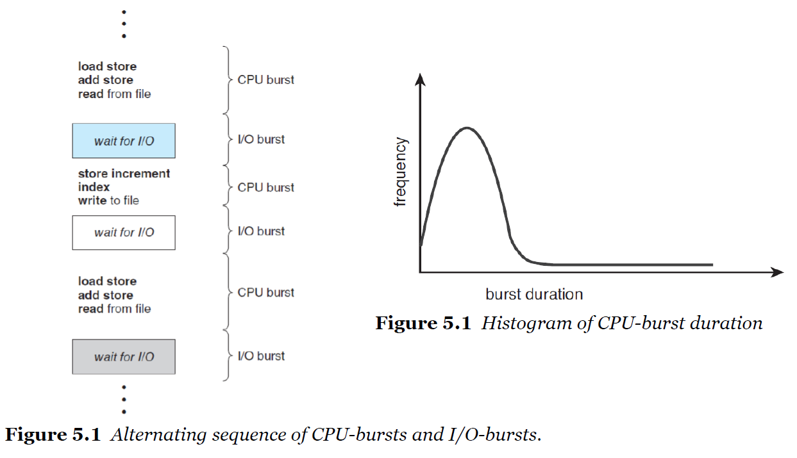

- CPU burst (running) / I/O burst(waiting)
- CPU burst time과 I/O burst time이 있고 프로세스가 이 두 상태를 왔다갔다 한다.
- 둘 중 CPU burst time이 많으면 CPU  bound
  I/O burst time이 많으면 I/O bound이다.
- 오른쪽 그림을 보면, CPU bound보다 I/O bound가 많음을 알 수 있다.
  scheduling을 통한 time-sharing이 효과적인 이유이다.

**CPU scheduler**

- 메모리의 프로세스에서 실행할 준비가 되어있는 프로세스를 선택하고 해당 프로세스에 CPU를 할당한다.

- 다음 프로세스를 선택하는 방법?
  - 연결 리스트? 이진 트리?
  - 선입선출(FIFO) 큐 : First In, First Out 
  - Priority Queue : 어떻게 프로세스의 우선순위를 결정할 수 있을까?

**Preemptive vs Non-preemptive**

> 선점형 / 비선점형

- 비선점 스케쥴링

  > 쫓아낼 수 없다

  - 프로세스는 스스로가 CPU를 해제할때까지 CPU를 유지한다
  - 종료하거나 대기 상태로 전환을 통해 CPU를 해제한다.

- 선제적 스케쥴링

  > 쫓아낼 수 있다

  -  스케줄러가 프로세스를 선점할 수 있다.

**CPU 스케줄링을 위한 의사 결정**

1. 프로세스가 실행 중에서 대기 상태로 전환될 때 running -> waiting
2. 프로세스가 실행 중에서 준비 상태로 전환될 때 running -> ready
3. 프로세스가 대기 상태에서 준비 상태로 전환될 때 waiting -> waiting
4. 프로세스가 종료될 때 terminates

- 1, 4 번은 선택의 여지가 없이 비선점형
- 2, 3번은 선점형 또는 비선점형 선택 ( 선점형이 좋겠지?)

**dispatcher**

- CPU 스케줄러에 의해 선택된 프로세스에게 CPU 코어를 제어할 수 있도록 권한을 주는 모듈
- context-switching을 해주는 모듈
- dispatcher의 기능
  - 한 프로세스에서 다른 프로세스로 컨텍스트 전환
  - 사용자 모드로 전환
  - 사용자 프로그램을 재개하기 위해 적절한 위치로 점프

- dispatcher은 가능한 한 빨라야 한다.
  - 모든 컨텍스트 전환 때마다 발생하기 때문
  - **dispatcher latency**
    - 한 프로세스를 중지하고 다른 프로세스를 시작하는 시간

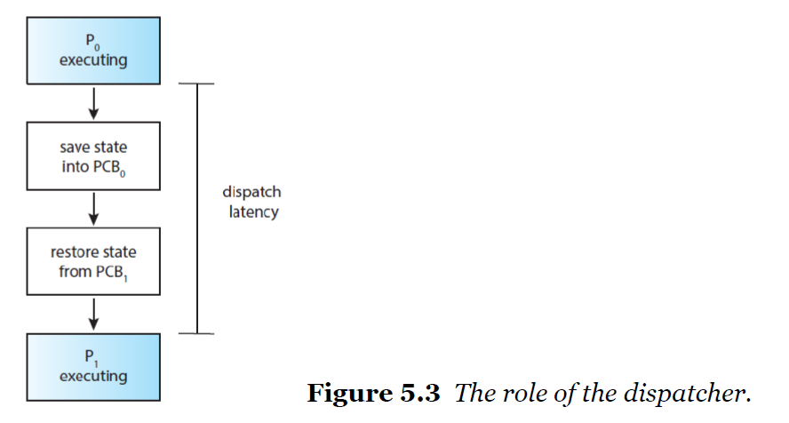

- P0과 P1을 컨텍스트 전환할 때 PCB0을 저장하고 PCB1을 복원해야 한다.
  - 이 시간이 dispatch latency인데, 이 시간이 실제로 CPU를 사용하는 시간보다 더 길어지면 계속 전환만 할 것
  - 가급적 짧아야 한다.

- 실제로 context switch가 얼마나 자주 일어날까?
  - Ubuntu 명령어 ` vmstat 1 3` (1초에 3번 확인)
  - 명령어 `cat /proc/1/status`
    - 자발적인 컨텍스트 스위치: 62회

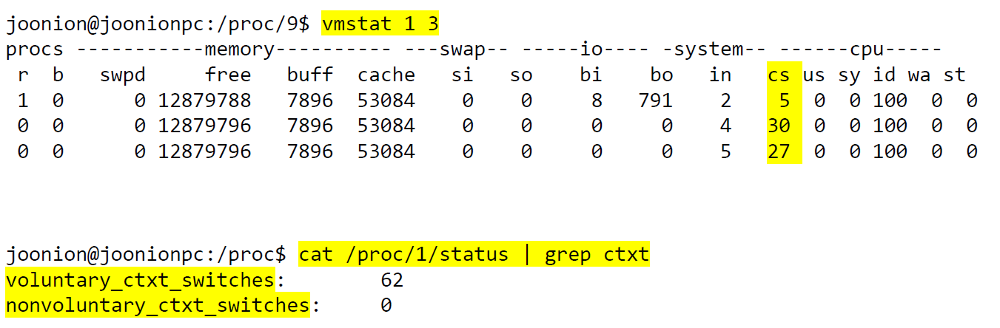

 

---

 

#### Scheduling Criteria

> 스케쥴링 기준

- CPU 사용률
  - CPU가 계속 일하도록 유지
- Throughput (처리량)
  - 시간당 완료된 프로세스 수
- Turnaround time (처리 시간)
  - 프로세스를 실행하는데 얼마나 걸리는가?
  - 제출 시점부터 완료 시점까지
- **Waiting time** (대기 시간)
  - 프로세스가 준비 대기열에서 대기하는 데 걸리는 시간
  - ready  queue의 대기시간을 합한 것
  - 이를 최소화시키면 앞의 세 개도 달성 및 최소화 가능

- Response time (응답 시간)
  - 응답을  시작하는 데 걸리는 시간

 

### 10. 스케줄링 알고리즘

**CPU Scheduling Problem**

- ready queue의 어떤 프로세스에게 CPU의 코어가 할당 될지를 결정

- 스케쥴링문제에 대한 솔루션
  - FCFS : First Come, First Served (선착순)
    - 초창기 운영체제에서 사용
  - SJF : Shortest Job First 최단 작업 우선 (SRTF : Shortest Remaining Time First 최단 남은 시간 우선)
  - RR : Round Robin (시분할 : time-sharing) (필수)
  - Priority based (우선 순위 기반)
  - MLQ : Multi Level Queue (다중 레벨 대기열)
  - MLFQ : Multi Level Feedback Queue (다중 레벨 피드백 큐) (가장 현대적)

**FCFS Scheduling**

- First Come, First Served
  가장 간단한 CPU 스케줄링 알고리즘

- 먼저 CPU를 요청하는 프로세스에게 먼저 CPU가 할당된다.

- FIFO queue로 쉽게 구현할 수 있다.

- 주의점

  - FCFS 정책에 따른 평균 대기 시간(average waiting time)

    - 일반적으로 최소가 아님.
    - 프로세서의 CPU-burst times이 크게 다를 경우 상당히 다를 수 있음

  - Preemptive or non-preemptive?

    - 비선점(non-preemptive)

  - 동적 상황에서의 성능

    - 만약 하나의 CPU bound와 많은 I/O bound 프로세스가 있따면?

  - 호송 효과(Convony Effect)

    > 똥차 효과.. 스포츠카들이 빨리 가고싶어도 똥차가 막고있으면 빨리 못간다.

    - 다른 모든 프로세스는 하나의 큰 프로세스가 CPU에서 나올 때까지 기다린다
    - 이는 CPU와 기기이용이 짧은 프로세스가 먼저 갈 수 있도록 하는 것보다 충분히 활용되지 못하는 결과를 가져온다.

- 예시

  - 시간 0에 도착하는, 밀리 초 단위로 주어진 CPU버스트의 길이가 주어진 프로세스 세트

    - Process / Burst Time
      P1 / 24
      p2 / 3
      p3 / 3

    - 프로세스가 𝑃1, 𝑃2, 𝑃3 순서로 도착하는 경우

      - FCFS 정책에서 제공하는 Gantt 차트

        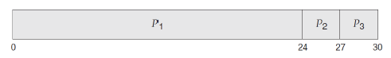

      - 이 일정의 대기 시간? (waiting time)

        - 𝑃1 = 0, 𝑃2 = 24, 𝑃3 = 27 대기 시간
          총 대기 시간 : (0 + 24 + 27) = 51
          평균 대기 시간 : 51 / 3 = 17
  
      - 이 일정의 처리 시간? (turnaround time)
      
        - P1=24, P2=27, P3=30
          총 처리 시간: (24 + 27 + 30) = 81
          평균 처리 시간: 81/3 = 27
      
    - 프로세스가 𝑃2, 𝑃3, 𝑃1 순서로 도착하는 경우
    
      - FCFS 정책에서 제공하는 Gantt 차트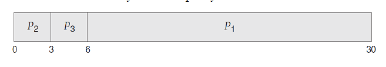
      - 이 일정의 대기 시간? (waiting time)
        - 𝑃1 = 6, 𝑃2 = 0, 𝑃3 = 3 대기 시간
          총 대기 시간 : (6 + 0 + 3) = 9
          평균 대기 시간 : 9 / 3 = 3
      - 이 일정의 처리 시간? (turnaround time)
        - P1=3, P2=9, P3=30
          총 처리 시간: (3 + 9 + 30) = 42
          평균 처리 시간: 42/3 = 14
    
    

**SJF Scheduling**

- Shortest-Job-First scheduling

  - shortest-next-CPU-burst-first scheduling

- 프로세스의 다음 CPU burst 길이와 연관된다.

  - CPU가 사용할 수 있게 되면 다음 CPU burst가 가장 작은 프로세스에 할당한다.

- 만약 두개 이상의 프로세스의 next CPU burst가 동일하다면

  - FCFS를 사용해서 승부를 본다!(break tie with)

- 주의점

  - 확실히 최적
  - 주어진 프로세스 세트에 대해서 최소 평균 대기 시간을 제공
  - 짧은 프로세스를 긴 프로세스 앞으로 옮기는 것은
    - 짧은 프로세스의 대기시간을 줄여줌으로써, 평균 대기 시간이 감소함
  - 선점형일 수도 있도 비선점형일 수도 있다.
    - 5초짜리가 들어갔는데 1초짜리가 왔다.
      - 그대로 두면 비선점형 쫓아내고 1초가 들어가면 선점형 (선점형이 유리하겠지)
  - 선택해야 할 것
    - 새 프로세스가 준비 대기열에 도착할 때
    - 이전 프로세스가 계속 실행되는 동안
    - 만약 새로 도착한 프로세스가 현재 실행중인 프로세스의 나머지보다 짧다면?

- 구현?

  - next CPU burst의 길이를 (엄격하게) 알 수 있는 방법이 없다.
  - SJF 스케쥴링의 추정을 시도해보자
    - next CPU의 길이를 예측해 볼 수 있을 것.
    - predicted CPU burst가 가장 짧은 프로세스를 고르자.

- 예측?

  > 과거를 보면 미래를 알 수 있다.

  - 이전 CPU burst의 측정된 길이의 지수 평균(exponential average)
  - 𝝉𝒏+𝟏=𝜶𝝉𝒏+(𝟏−𝜶)𝝉𝒏
    - 𝝉𝒏 : 𝒏번째 CPU 버스트의 길이
    - 𝝉𝒏+𝟏 : 다음 CPU 버스트에 대한 예측 값
    - (0≤𝛼≤1인 경우)
    - 𝛼값이 클수록 과거에 치중 (과거에 대한 가중치)

  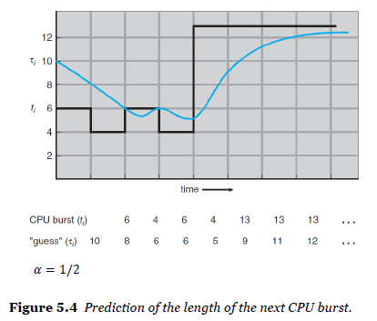

- 예시

  - Process / Burst Time
    P1 / 6
    p2 / 8
    p3 / 7
    p4 / 3
  - FCFS 정책에서 제공하는 Gantt 차트

  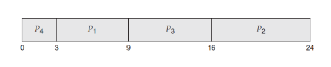
  - P4-P1-P3-P2 순으로 실행
  - 이 일정의 대기 시간? (waiting time)
    - 𝑃1 = 3, 𝑃2 = 16, 𝑃3 = 9, P4 = 0 대기 시간
      총 대기 시간 : (3 + 16 + 9 + 0) = 28
      평균 대기 시간 : 28 / 4 = 7
  - 이 일정의 처리 시간? (turnaround time)
    - P1=9, P2=24, P3=16, P4=3
      총 처리 시간: (9 + 24 + 16 + 3) = 52
      평균 처리 시간: 52/4 = 13

**SRTF Scheduling**

- SRTF Scheduling
  Shortest Remaining Time First
  선점형 Preemptive SJF scheduling
- 비선점 SJF는 CPU burst가 끝날때까지 기다려주는 반면, SRTF는 현재 실행중인 프로세스를 선점한다.

- 예시

  - Process / Arrival Time / Burst Time
    P1 / 0 / 8
    p2 / 1 / 4 
    p3 / 2 / 9
    p4 / 3 / 5

  - FCFS 정책에서 제공하는 Gantt 차트

    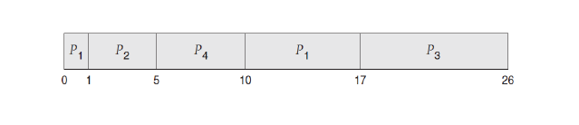

  - 이 일정의 대기 시간? (waiting time)

    - 총 대기 시간 : ((10-1) + (1-1) + (17-1) + (5-3)) = 26
      평균 대기 시간 : 26 / 4 = 6.5

**RR Scheduling**

> 빙글빙글 돈다~

- Round-Robin
  time quantum이 있는 선점형 FCFS
- time quantum (time slice)

  - 시간의 작은 단위, 일반적으로 10초에서 100밀리초의 길이.
  - ready queue는 circular queue로 처리된다.
  - 스케쥴러가 ready queue를 돌아다니며
    - 각 프로세스에 최대 1time quantum의 간격으로 시간을 할당한다.
- 두가지 경우

  - 프로세스의 CPU burst가 1 time quantum 미만일 수 있다.
    - 프로세스가 스스로 CPU를 해제할 것.
    - 스케쥴러는 ready queue의 다음 프로세스를 진행할 것
  - CPU burst가 1 time quantum보다 긴 경우
    - 타이머가 꺼지고 OS에 인터럽트가 발생
    - 컨텍스트 전환이 실행된다.
    - 프로세스는 ready queue의 tail에 배치된다.
- 주의점
  - 평균 대기시간이 좀 더 길어질 수 있다
    - 하지만 다른것과 섞어쓰면 유용하다
  - 선점형이다
    - 프로세스의 CPU burst가 one time quantum을 초과하면 프로세스를 뺏기고 ready queue로 다시 들어간다
  - RR 스케쥴링 알고리즘의 수행은 time quantum의 size에 크게 의존한다

- 예시

  - Process / Burst Time
    P1 / 24
    p2 / 3
    p3 / 3

  - 4밀리초단위의 time quantum을 사용할 때

    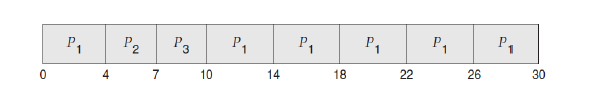

  - 이 일정의 대기 시간? (waiting time)

    - 𝑃1 = 10-4=6, 𝑃2 = 4, 𝑃3 = 7 대기 시간
      총 대기 시간 : (6 + 4 + 7) = 17
      평균 대기 시간 : 17 / 3 = 5.66
  
- RR 스케쥴링 알고리즘의 수행은 time quantum의 size에 크게 의존한다

  - 최대면 FCFS가 되버리고,  0.1이면 아무것도 안되고 계속 context switches 반복

  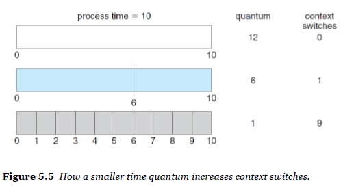

  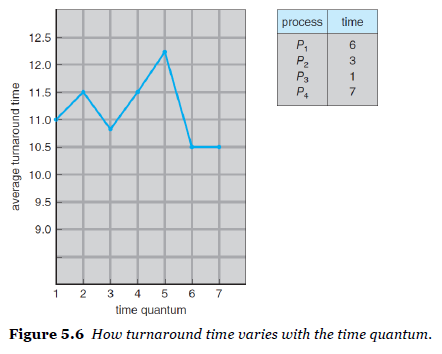

**Priority base Scheduling**

- 우선순위 스케쥴링
- 우선순위는 각 프로세스와 연관된다.
  - CPU는 우선순위가 가장 높은 프로세스에 할당된다
  - 우선순위가 동일한 프로세스는 FCFS 순서로 예약된다
- SJF는 우선순위 기반 스케줄링의 특별한 경우
  - 이 경우 우선순위는 다음 CPU 버스트의 역(inverse)이다
    - predicted next CPU busrt가 크면클수록 우선순위를 높게(숫자를 낮게) 준다. 
- 낮은 숫자가 높은 우선순위를 나타낸다고 가정한다
- 주의점.
  - 선점형(SRTF) 또는 비선점형(SJF)
  - The problem of starvation (indefinite blocking) 기아 문제
    - 차단된 프로세스 : 실행할 준비가 되었지만 CPU를 기다린다
    - 우선순위가 낮은 일부 프로세스는 무기한 대기할 수 있다.
  - 기아 문제에 대한 해결책은 노화(aging)
    - 점차적으로 시스템에서 오랫동안 기다린 프로세스의 우선순위를 높인다.

- 예시
  - Process / Burst Time / Priority
    P1 / 10 / 3
    p2 / 1 /1
    p3 / 2 / 4
    p4 / 1 / 5
    p5 / 5 / 1

  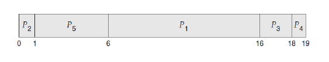

  - 평균 대기 시간: 8.2

**RR 및 우선 순위 스케줄링 결합**

- 우선순위가 가장 높은 프로세스를 실행하고
- RR스케쥴링을 사용하여 동일한 우선순위의 프로세스를 실행

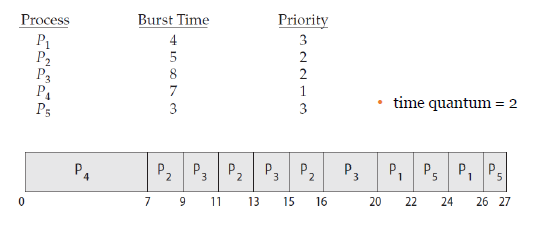

**Multi Level Queue(MLQ) Scheduling**

- priority-based지만 여러 레벨이 있음.
  - 게임 중에 전화, 카톡, 디스플레이, 네트워크, 소리... 
  - 각각에다 ready que를 따로 줌.
    - 실시간, 시스템, 인터렉티브, 일반적인 프로세스 별로 ready que를 나눔

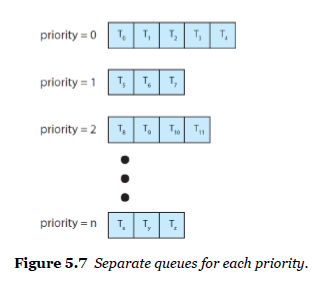

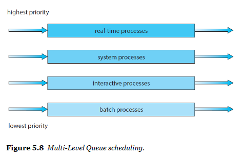

**Multi Level Feedback Queue(MLFQ) Scheduling**

- 실전 O/S (+multicore)

- 분리해놓으면 다른 레벨을 아예 진행 못하는 경우가 생김
- 처음엔 8만, 그다음엔 16만, 그다음엔 그냥 시간을 다 할당해주는 구조
- CPU-bound가 높은 프로세스들은 단계적으로 더 많은 시간을 할당받고, 다른 짧은 시간의 프로세스들은 빠르게 처리되고 나간다.

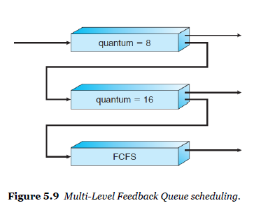

#### 스레드 스케쥴링

- 대부분의 최신 운영 체제에서 스케줄링되는 건 프로세스가 아닌 커널 스레드.
- 사용자 스레드는 스레드 라이브러리에 의해 관리된다.
- 따라서 커널은 이를 인식하지 못하고, 궁극적으로 관련 커널 스레드에 매핑된다. 

#### 실시간 CPU 스케줄링

- Soft Realtijme vs Hard Realtime
- soft realitime
  - 중요한 실시간 프로세스가 언제 예정될지에대해 보장하진 않지만 중요한 프로세스가 중요하지 않은 프로세스보다 선호된다는 것은 보장한다.
- hard realitime
  - task가 마감일까지 수행되어야한다는 더 엄격한 요구사항이 있음

> 연습
>
> 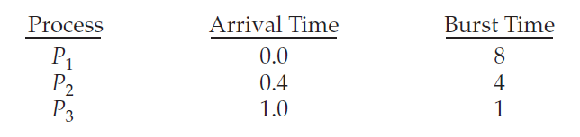
>
> 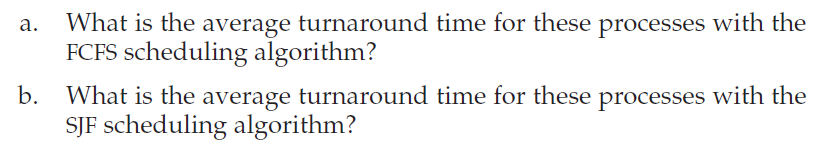
>
> 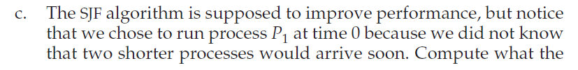
>
> 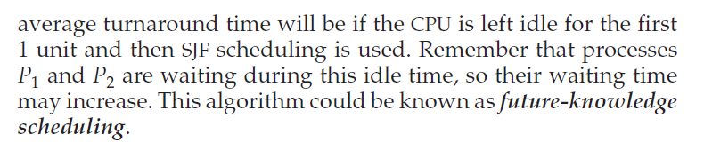

> # Quiz

1. The ________ is a module that gives control of the CPU's core to the process selected by the CPU scheduler.

   - 1) dispatcher 2) distributor 3) deployer 4) dissipator

   답 : 1) dispatcher

 

2. 다음 중 CPU 스케줄러를 설계할 때 목표로 삼기에 가장 어색한 것은?

   - 1) CPU의 사용효율(utilization)을 높이겠다. 
     2) 단위시간당 처리하는 프로세스의 개수(throughput)을 늘리겠다. 
     3) 프로세스가 대기하는 시간(waiting time)을 줄이겠다. 
     4) 프로세스의 응답시간(response time)을 늘리겠다. 

   답 : 4) 프로세스의 응답시간(response time)을 늘리겠다. 

 

3. 선점형(preemptive), 비선점형(nonpreemptive) 스케줄러에 대한 설명으로 가장 옳은 것은?

   - 1) Shortest-Job-First(SJF)는 짧은 CPU burst를 가진 프로세스를 먼저 처리하는 preemptive 스 케줄러다. 
     2) First-Come, First-Served(FCFS)는 먼저 도착한 프로세스를 먼저 처리하는 preemptive 스케 줄러다. 
     3) CPU를 점유한 프로세스가 waiting 상태에서 ready 상태로 갈 때는 반드시 non-preemptive 스 케줄링을 해야 한다. 
     4) Round-Robin 스케줄러는 time quantime이 지나면 CPU를 점유한 프로세스를 내보내는 preemptive 스케줄러다.

   답 : 

 

4. CPU scheuler에 대한 설명으로 가장 틀린 것은?

   - 1) FCFS를 구현하기 위해서는 FIFO Queue를 ready-queue의 자료구조로 사용할 수 있다.
     2) Shortest-Remaining-Time-First 스케줄러는 Preemptive SJF라고 할 수 있다.
     3) Round-Robin 스케줄러는 Preemptive FCFS라고 할 수 있다. 
     4) Multi-Level Feedback Queue 스케줄러는 여러 개의 ready-queue에 우선순위에 따라 영구적 으로 한 개의 큐에 프로세스를 배정한다. 
     5) Soft-real-time 요구사항을 만족하는 Real-Time OS의 스케줄러는 Priority-based CPU 스케 줄러를 사용한다. 

   답 : 

 

5. Process Arrival time CPU Burst 
   P1 0 5 
   P2 1 7 
   P3 3 4 

   위와 같이, P1, P2, P3 프로세스의 도착시간과 CPU Burst가 주어졌다. FCFS와 RR 스케줄러를 사용 하면 프로세스의 완료 순서가 각각 어떻게 될까? (RR 스케줄러의 time quantum은 2를 사용한다.)

   - 1) FCFS: P1, P2, P3 RR2: P1, P2, P3 
     2) FCFS: P1, P3, P2 RR2: P1, P3, P2 
     3) FCFS: P1, P2, P3 RR2: P1, P3, P2 
     4) FCFS: P1, P3, P2 RR2: P1, P2, P3

   답 : 

 

6. Process Arrival time CPU Burst 
   P1 0 ms 9 ms 
   P2 1 ms 4 ms 
   P3 2 ms 9 ms 
   위와 같이 프로세스 P1, P2, P3의 도착시간과 CPU Burst가 주어졌다. 만약 Preemptive SJF 스케줄러를 사용한다면 평균 대기시간(average waiting time)은 얼마인가? 단, 스케줄러는 프로세스가 도착할 때와 프로세스가 완료할 때만 동작한다고 가정한다.

   -  1) 5.00 ms 2) 4.33 ms 3) 6.33 ms 4) 7.33 ms

   답 : 

 

7. Process Arrival time CPU Burst 
   P1 0 10 
   P2 3 6 
   P3 7 8 
   P4 8 3
   위와 같이 P1, P2, P3, P4 프로세스의 도착시간과 CPU Burst가 주어졌다. Preemptive SRTF(Shortest-Remaining-Time-First) 알고리즘을 사용하다고 했을 때, 평균 총처리시간 (average turnaround time)은 얼마인가? 

   - 1) 10.25 2) 11.25 3) 12.25 4) 13.25 5) 14.25

   답 : 

 

8. Process CPU Burst Priority 
   P1 10 3 
   P2 1 1 
   P3 2 3 
   P4 1 4 
   P5 5 2 
   위와 같이 5개의 프로세스에 대한 CPU Burst와 우선순위가 주어졌다. 적용하는 스케줄러별로 total waiting time이 잘못 짝지어진 것은?

   - 1) nonpreemptive FCFS = 47 
     2) nonpreemptive SJF = 16 
     3) RR (time quantum = 1) = 26 
     4) nonpreemptive Priority-based (smaller number, higher priority) = 41

   답 : 

1) 1 2) 4 3) 4 4) 4 5) 3 6) 1 7) 3 8) 1, 3