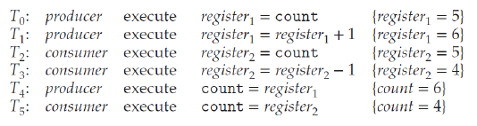
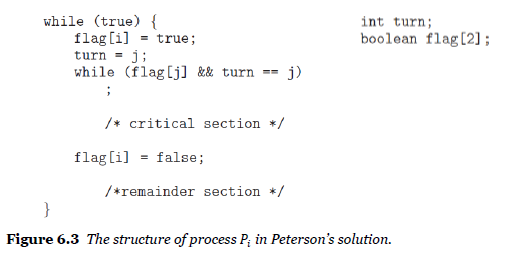

# Chapter 6. Synchronization Tools

> 프로세스뿐만아니라 스레드에서도 이러한 동기화를 사용

## Part 1

#### 배경

**Cooperating Processes 협력 프로세스**

- 서로 영향을 받거나 영향을 받는 것을 의미
- 논리적 주소 공간을 공유(Thread)하거나 데이터를 공유 할 수 있다.
- 그러나 공유 데이터에 대한 동시 액세스는 데이터 불일치(data inconsistency)를 발생시킬 수 있다.
- 따라서 데이터 일관성을 유지하기 위한 논리적 주소 공간을 공유하는 협력 프로세스들이 질서있는 실행을 보장하도록 해야한다.

> 동시 실행 = 비동기적 = Concurrent. 일때도 문제 발생 (동기적일때도 물론 문제는 발생하지만 다름)

**integrity of data**

- 여러 프로세스 (또는 스레드)가 공유하는 데이터의 무결성
  - 동시 실행 (Concurrent execution)
    - 프로세스는 명령 스트림의 어느 지점에서든 중단될 수 있다
    - 프로세싱 코어는 다른 프로세스에 할당될 수 있다
  - 병렬 실행 (Parallel execution)
    - 둘 이상의 명령 스트림(다른 프로세스를 나타냄)이 별도의 프로세싱 코어에서 동시에 실행 

- producer consumer problem

  - 두 프로세스가 데이터를 공유하고 비동기적으로 실행되는 경우

  - 버퍼의 항목을 계산하려면

    - 0으로 초기화 된 정수 변수 개수를 추가

    - 버퍼에 새 항목을 추가 할 때마다 증가

      

    - 버퍼에서 하나의 항목을 제거 할 때마다 감소

      

**Data inconsistency**

- 두 프로세스가 개별적으로는 맞지만, 동시에 실행하면 올바르게 작동하지 않을 수 있다

- count의 값이 현재 5라고 가정.

  - 생산자와 소비자가 동시에 실행
  - 두 선언 : count ++; 그리고 count-;
  - 그러면 변수 개수의 값은 4, 5 또는 6이 될 수 있다.

- 또 다른 예시1

  

  > sum 변수를 가지고 tid1과 tid2가 비동기적으로 run이라는 함수 실행 . 2만이 나와야하지만 계속 값이 바뀜

- 또 다른 예시2

  > 스레드1은 증가시키고 스레드2는 감소시켜보자 => 0이 나와야
  >
  > 실제로는 값이 맞을때도있지만 틀릴때도 나옴

  

- 이러한 결과가  발생하는 이유

  > context switch가 어디서 발생하는지 몰라서 발생

  - count ++, count -- 두 선언이 각각 한문장으로 보이지만
    기계어 레벨에서는 이렇게 구현된다.

    

  - 𝑟𝑒𝑔𝑖𝑠𝑡𝑒𝑟1과 𝑟𝑒𝑔𝑖𝑠𝑡𝑒𝑟2는 동일한 물리 레지스터 일 수 있지만,
    이 레지스터의 내용은 인터럽트 핸들러 (또는 스케줄러)에 의해 저장되고 복원되었다.

  - count ++, count --의 동시실행은 낮은 레벨의 선언이 먼저 제시되고 임의의 순서로 인터리브 되는 순차실행과 동일하다.  즉 어디서  컨텍스트 스위치가 발생하는지에 따라 값이 달라질 수 있다. 중간에 발생할 경우 문제가 된다.

    

> 이러한 상황들을

**Race Condition**

- 경쟁 조건
- 여러 프로세스(또는 스레드)가 동일한 데이터에 동시에 접근하고 조작하며, 실행에 대한 결과는 액세스가 발생하는 특정 순서에 따라 달라지는 상황
- 경쟁 조건으로부터 보호하기 위해 한번에 하나의 프로세스만 공유 데이터를 조작할 수 있도록 할 수 있다. (e.g. the variable count)
  - 이를 보장하기 위해 프로세스가 어떤 방식으로든 동기화되어야 한다. 
    => process (or thread ) synchronization

Race Condition in Java Threads:

int count가 공유 데이터인가? No. run1에 있는 것과 2의 count가 다름

=> static을 쓰면 Race Condition 발생

클래스변수가 됨. count를 공유하게됨.

- 여러가지 문제에서 발생하는 Race condition은 계좌 이체에서도 발생한다. => dead lock 부분에서 다룸

### The Critical Section Problem

> 말은 어렵지 않다..!

- 임계영역 문제
- 시스템이 𝑛개의 프로세스로 이루어졌다고 하자 {𝑃0, 𝑃1, ⋯, 𝑃𝑛-1}.
  - 각  프로세스에는 임계영역이라고하는 코드 세그먼트를 둔다.
  - 이 임계영역에서는 프로세스가 데이터에 액세스하고 업데이트 할 수있다 
    즉 하나 이상의 다른 프로세스와 공유된다.
- 가장 중요한 기능은
  - 하나의 프로세스가 중요 섹션에서 실행 중일 때 
    중요 섹션에서는 다른 프로세스를 실행할 수 없다는 것이다.

- 두 개의 프로세스가 중요 섹션에서 동시에 실행되지 않게 한다.
  - 데이터를 협력적으로 공유하기 위해 프로세스가 활동을 동기화하는 데 사용할 수있는 프로토콜을 설계한다.

**코드 섹션들**

> 코드의 구분

- 입력 섹션(The entry section)

  - 중요 섹션에 들어갈 수있는 권한을 요청하는 코드 섹션

- 중요 섹션(The critical section)은 입력 섹션 뒤에 있다.

  > 예시에서의 count++, count--

- 종료 섹션(The exit section)은 중요 섹션을 따른다.

- 나머지 섹션(The remainder section)은 나머지 코드의 섹션입니다.

- General structure of a typical process.

  

**솔루션에 대한 세 가지 요건**

> 세가지를 다 충족해야 문제를 풀었다고 할 수 있으나, 어려워서 실제 잘 사용되지 않음

1. Mutual Exclusion (상호 배제)

   - 𝑃𝑖 프로세스가 중요 섹션에서 실행중인 경우
     다른 프로세스가 중요 섹션에서 실행될 수 없다.
   - 상호배제를 하면 deadlock과 starvation(기아)가 발생

2. Progress : (avoid deadlock)

   >  진행률 : (교착 상태 방지) (deadlock : 진퇴양난.)
   > 아무도 들어가지 못하는 상황이 발생하면 안된다.

   - 중요 섹션에서 실행중인 프로세스가없고 일부 프로세스가 중요 섹션에 들어가기를 원하는 경우,
     다음 프로세스의 선택이 중요 섹션에 입력 될 수 있다.
     - 다음은 무기한 연기 될 수 없다

3. Bounded Waiting : (avoid starvation)

   > 한정된 대기 : (기아 방지)
   >
   > 계속 다른 프로세스가 들어와서 실행되지못하면 안된다.

   - 프로세스가 중요 섹션에 들어가도록 요청한 후와 해당 요청 전에,
     다른 프로세스가 중요 섹션에 들어갈 수있는 횟수에 대한 제한 (또는 제한)이 부여된다.

   

**간단한 해결방안 (단일 코어 환경) :**

- Prevent interrupts

  - 공유 변수가 수정되는 동안 인터럽트가 발생하지 않도록 한다.

    > 실행되는동안 interrupt를 disable시켜버리면 됨.

- 현재 명령 시퀀스가 선점없이 순서대로 실행될 수 있음을 확신 할 수 있다.

- 다른 명령이 실행되지 않으므로 공유 데이터가 예기치 않게 수정 될 수 없다.

- not feasible in a multiprocessor 

  - 불행히도 다중 프로세서 환경에서는 불가능
    - 모든 interrupt를 막기에는 시스템 성능이 확 떨어지기 때문

**Two general approaches:**

- 두 가지 일반적인 접근 방식:선점 커널 및 비 선점 커널.
- Non preemptive kernel: 비 선점 커널
  - 커널 모드 프로세스는 커널 모드를 종료하거나 차단하거나 자발적으로 CPU를 양보 할 때까지 실행된다.
  - 본질적으로 커널 데이터 구조에 대한 경쟁 상태(race conditions)가 없다
  - 하지만 느려서 쓰지 않을 것.
- Preemptive kernel: 선점 커널
  - 커널 모드에서 실행중인 프로세스를 선점 할 수 있다
  - 본질적으로 설계하기 어렵지만 반응이 더 좋기 때문에 유리

## Part 2

### Peterson’s Solution

- 중요 섹션 문제에 대한 소프트웨어 솔루션
- Dekker’s Algorithm
  - 두 개의 프로세스에 대해서
- Eisenberg and McGuire’s Algorithm
  - 𝑛-1 턴의 대기시간에 lower bound를 가지는 𝑛개의 프로세스
- Peterson’s Algorithm
  - 중요한 섹션 문제에 대한 고전적인 소프트웨어 솔루션.
  - 최신 컴퓨터는 로드 및 저장과 같은 기본 기계어 명령을 수행하므로 Peterson의 솔루션이 올바르게 작동한다는 보장은 없다

**Peterson’s solution**

> 이 문제를 해결할 수 있는 가장 고전적인 해결책

- 중요한 섹션과 나머지 섹션간에 실행을 번갈아 실행하는 두 개의 프로세스로 제한시킨다

> flag와 turn: 두 집이 있는데 각 집에 사람이 있고 각각 개를 키우고 있다. 그 개들은 만나면 싸우기 때문에 두 사람은 동시에 산책을 하지 않는다. 산책할때는 깃발을 꽂아서 자기 turn에만 산책하고, 그때 다른 사람은 산책하지 않는다.
> flag:산책갈준비가됐는지
>
> turn:실제로 산책감

- 실제로 실행해보면 오차가 줄긴했지만 발생.

- 하 지 만

  - 아키텍처가 로드 및 저장과 같은 기본 기계어 명령을 수행하는 경우 Peterson의 솔루션이 올바르게 작동 할 것이라는 보장은 없다. 컴파일러가 다른 변수를 갖고 수행하는 명령어들을 재정렬하기도 하기 때문.

  - 그러나 Peterson의 솔루션은

    - CSP 해결에 대한 좋은 알고리즘 설명을 제공

    - 상호 배제, 진행 및 경계 대기의 요구 사항과 관련된 몇 가지 복잡성을 보여준다
      (mutual exclusion , progress , and bounded waiting)

- Peterson의 솔루션이 정확
  - 상호 배제가 유지된다.
    - 각 𝑃𝑖는 flag [j] == false 또는 turn == i 인 경우에만 중요 섹션에 들어간다.
  - 진행 요건이 충족되었습니다. ( No deadlock) (교착 상태 없음)
  - 제한된 대기 요구 사항이 충족됩니다. ( No starvation) (기아 상태 없음)

=> 이론적으로 이해하면 됨.

### Hardware Support for Synchronization

> 동기화를위한 하드웨어 지원

**Hardware based Solutions**

- 중요 섹션 문제를 해결하기위한 지원을 제공하는 하드웨어 지침
- 동기화 도구로 직접 사용 가능
- 보다 추상적 인 메커니즘의 기초를 형성하는 데 사용할 수 있음

**Three primitive operations**

> 세가지 기본 작업

- memory barriers or fences (기억 장벽 또는 울타리)
- hardware instructions (하드웨어 지침)
- atomic variables (원자 변수)

**Atomicity (원자성)**

- An atomic operation(원자적 작업)은 one uninterruptible unit of operation(무정전 작업 단위)
- 최신 컴퓨터 시스템은 특별한 하드웨어 지침을 제공
  - 즉, 
    단어의 내용을 테스트 및 수정하거나
    두 단어의 내용을 테스트하고 교환 할 수있는 원자적 지침

- 두 가지 유형의 개념적 원자 지침
  - `test_and_set()` and `compare_and_swap()`

**The test_and_set ()**

- 전역 부울 변수 잠금이 선언되고 false로 초기화된다.
  - lock이 true인동안 context switching이 일어나지 않음

**The compare_and_swap ()**

> swap을 통해 i면 j로 바꿔주고 j면 그대로 두고 뭐 그런 식!

- **전역 부울 변수 잠금이 선언**되고 0으로 초기화

**Atomic Variable**

(원자 변수)

- 일반적으로 compare_and_swap () 명령어는 atomic variable와 같은 다른 도구를 구성하는 데 사용된다.
- atomic variable
  - 정수 및 부울과 같은 기본 데이터 유형에 대한 원자 연산을 제공
  - race condition이 있는 single variable가있을 수있는 상황에서 상호 배제를 보장하는 데 사용할 수 있다.

- Java implementation of Peterson’s solution:

> # Quiz

1. 프로세스 동기화(synchronization)에 대한 설명으로 가장 옳은 것은?

   - 1) 여러 프로세스가 공유 자원에 접근할 때, 병렬적(parallel)인 처리를 할 때는 항상 동기화가 필요 하지만, 병행적(concurrent)인 처리를 할 때는 항상 동기화가 필요하지는 않다. 
     2) 생산자-소비자 문제를 두 개의 프로세스가 shared memory로 처리할 때는 동기화를 해 주어야 하지만, 두 개의 쓰레드가 같은 주소 공간에서 buffer를 저장할 때는 동기화가 필요하지 않다. 
     3) 여러 쓰레드가 어떤 공유하는 변수에 접근하여 값을 변경하지 않고 읽기만 하는 경우에는 경쟁상황이 발생하지 않으므로 동기화를 해 줄 필요가 없다. 
     4) 프로세스 동기화(synchronization)는 프로세스가 공유하는 자원에 접근하는 일련의 순서를 정하도 록 한다. 따라서 공유하는 프로세스들이 항상 같은 순서로 순차적으로 자원에 접근할 수 있게 하여 경쟁 상황을 방지한다. 

   답 :  3

 

2. 임계영역(Critical Section)에 대한 설명으로 가장 틀린 것은?

   - 1) critical-section은 어떤 프로세스의 코드 영역 중에서 여러 프로세스가 공유하는 자원에 접근하는 코드 영역을 말하고, entry-section과 exit-section 사이에 위치한다. 
     2) entry-section은 임계 영역에 진입하기 위한 권한을 획득하는 코드 영역을 말하고, 항상 critical-section 이전에 위치해야 한다. 
     3) exit-section은 임계 영역을 빠져나와서 권한을 반환하는 코드 영역을 말하고, 항상 critical-section 이후에 위치해야 한다.
      4) remainder-section은 entry-, exit-, critical-section이 아닌 코드 영역을 말하고, 항상 exit-section 이후에 와야 한다. 

   답 : 4

 

3. 임계 영역 문제 (Critical-Section Problem)에 대한 솔루션이 해결해야 할 요구사항에 포함하지 않아 도 되는 것은?

   - 1) Mutual Exclusion 
     2) Progress (No deadlock) 
     3) Bounded Waiting (No starvation) 
     4) Scalability

   답 : 4 (확장성)

 

4. **임계 영역 문제 (Critical Section Problem)의 해결책에 대한 설명으로 가장 옳은 것은?**

   - 1) Single-core 시스템에서는 단순하게 인터럽트를 방지하는 것만으로 임계영역 문제를 해결할 수 없다. 
     2) 비선점형(nonpreemptive) 커널에서는 경쟁 상황이 발생하지 않으므로 임계영역 문제를 고려할 필요가 없다. 
     3) 피터슨 알고리즘은 상호 배제 문제를 확실하게 해결했지만, 데드락과 기아 문제를 해결하기 위한 하드웨어적인 지원이 필요하다.
      4) 원자적 변수(Atomic Variable)는 공유 변수에 대한 접근을 하는 명령어(instruction)를 하드웨어 적으로 만들어 지원해 주는 임계 영역 문제 해결책이다.

   답 : 2

   3이 틀린 이유: 데드락과 기어문제도 해결함, 기계어 명령과 관련하여 문제가 발생하는것.

 

5. 아래와 같이 피터슨 알고리즘을 구현했을 때, A, B, C, D에 들어갈 값으로 잘못 짝지어진 것을 모두 고르시오.

   - 
   - 1) A = 0 
     2) B = 1 
     3) C = 0 
     4) D = 1

   답 : 1,3,,4

 

6. 수업시간에 다룬 producer-consumer 예제에서, producer가 두 개의 쓰레드로 실행되고, consumer가 두 개의 쓰레드로 실행되었다고 가정해 보자. 만약 count의 값이 현재 5인 상태에서, 네 개의 쓰레드가 한 번씩 concurrent하게 실행되었다면, 다음 중 최종 count의 값을 가능한 값을 모두 고르시오.

   - 1) 3 
     2) 4 
     3) 5 
     4) 6 
     5) 7

   답 : 12345

 

7. **하드웨어 솔루션으로 임계구역 문제를 해결할 때, 이에 대한 설명으로 가장 틀린 것은?**

   - 1) 임계영역 문제를 해결하기 위한 하드웨어 솔루션은 atomicity(원자성)를 보장하는 명령어를 제공 한다. 
     2) test_and_set 명령어는 불린 변수인 lock을 이용한다. 
     3) compare_and_swap 명령어는 전역 변수인 lock을 이용한다
     4) atomic_variable 명령어는 변수에 대한 접근을 제어하는 하드웨어 명령어

   답 : 4. .명령어가 아니라 정수 및 부울과 같은 기본 데이터 유형에 대한 원자 연산을 제공하는 변수

 

8. **임계구역 문제에 대한 설명으로 가장 틀린 것은?**

   - 1) 경쟁 상황(race condition)이 발생할 수 있는 코드 영역을 임계구역(critical section)이라 한다. 
     2) 피터슨 알고리즘은 임계구역 문제에 대한 소프트웨어 해결책이고, compare_and_swap은 하드웨 어 해결책이다. 
     3) atomic variable을 이용하여 생산자-소비자 문제의 동기화를 해결할 수 있다. 
     4) Java에서 Peterson 알고리즘을 그대로 구현하면 data inconsistency가 발생하지 않는다. 

   답 : 4