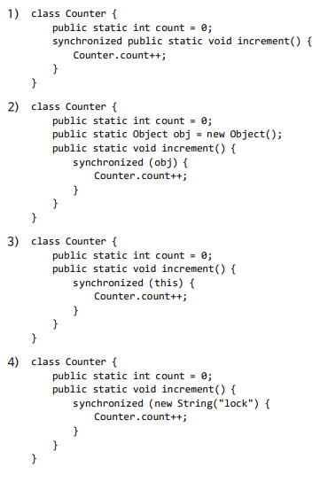

# Chapter 6. Synchronization Tools

## Part 3

### Mutex Locks (뮤텍스 잠금)

**CSP를 해결하기위한 고급 소프트웨어 도구**

- Mutex Locks : 가장 간단한 도구
- Semaphore : 더 강력하고 편리하며 효과적입니다.
- Monitor : 뮤텍스와 세마포어의 단점 극복
- Liveness : 프로세스가 진행되도록 보장.

**Mutex Locks**

> 들어갈때 열쇠 가지고 가고 나올 때 열쇠 반납해라

- mutex : mutual exclusion (상호 배제)
  - 중요한 부분을 보호하고 경쟁 조건을 방지하기 위해, 
  - 프로세스는 중요 섹션에 들어가기 전에 잠금을 획득하고 중요 섹션을 종료 할 때 잠금을 해제해야 한다.

- Mutex Locks에 대한 두 가지 기능과 하나의 변수

  - `acquire()` and `release()`
    - acquire () 및 release () 호출은 원자적으로 수행되어야 한다.
    - compare_and_swap 작업을 사용하여 구현할 수 있다.
  - `available` 잠금이 사용 가능한지 여부를 나타내는 값을 갖는 부울 변수

  

>  Solution to the critical section problem using mutex locks.
>
> 

> The definition of acquire() and release():
>
> 

**Busy waiting**

> 무한루프..

- 중요 섹션에 들어 가려는 다른 프로세스는 acquire () 호출에서 계속 반복해야 한다.
- Busy waiting은 
  단일 CPU 코어가 여러 프로세스에서 공유되는 실제 다중 프로그래밍 시스템에서 
  확실히 문제.
- 다른 프로세스가 생산적으로 사용하기 위해 CPU 사이클을 낭비합니다.

**Spinlock**

- busy waiting 방법을 사용하는 mutex lock 유형
- lock이 available이 될 때까지 기다리는 동안 프로세스가 회전
  - 계속 CPU를 잡아먹음
- 그러나 스핀 록에는 이점이 있다.
  - 잠금을 기다리니 컨텍스트 전환이 필요하지 않다. 즉 바로 진입할 수 있다. (ready queue에 안간다)
    - 컨텍스트 전환에는 상당한 시간이 걸릴 수 있으니..
- 멀티 코어 시스템의 특정 상황에서 스핀 록은 잠금에 선호되는 선택
  - 다른 스레드가 다른 코어에서 중요 섹션을 수행하는 동안
    하나의 스레드가 하나의 처리 코어에서 회전 할 수 있다.

****

### Semaphore

- semaphore: 신호장치 . 신호기 .

- A semaphore 𝑆 is

  - 초기화와는 별개로 정수 변수 (an integer variable)
  - 두 개의 표준 원자 연산을 통해서만 액세스된다.
  - `wait()` and `signal()`or sometimes `P()` and `V()`

- `wait()` and `signal()`의 정의

  

  > S가 0보다 작을때는 S--, 시그날에서는 S++

  - `wait ()` 및 `signal ()` 작업에서 세마포어의 정수 값에 대한 모든 수정은 Atomic하게 실행되어야 한다.

**Binary and Counting Semaphores**

- Binary Semaphore
  - 이진 세마포어
  - 0과 1 사이의 범위 : mutex lock과 사실상 유사하게 동작
- Counting Semaphore
  - 무제한으로 늘어남(-INF~INF). 무제한 도메인에 대한 범위.
  - 여러개의 인스턴스가있는 리소스에 사용할 수 있습니다.

**counting semaphore의 사용**

> 세마포를 가용한 자원의 개수로 초기화

- Initialize: 사용 가능한 리소스 수에 대한 세마포어 초기화
- 프로세스가 리소스를 사용하는 경우
  - 세마포어에서 wait () : 카운트 감소
- 프로세스가 자원을 해제 할 때
  - 세마포의 signal () : 카운트 증가
- 카운트가 0이되면 모든 리소스가 사용된 상태.
  - 그러면 리소스를 사용하려는 프로세스는 카운트가 0보다 커질 때까지 차단됩니다

**세마포어를 사용하여 동기화 문제 해결**

- 두 개의 프로세스 𝑃1과 𝑃2가 동시에 실행되는 것을 고려
  - 𝑃1with a statement 𝑆1, 
    and 𝑃1with a statement 𝑆2
- 𝑆2는 𝑆1이 완료된 후에 만 실행되어야한다고 가정
  - 𝑃1과 𝑃2가 **0으로 초기화** 된 세마포 동기화(**synch**)를 공유하도록 한다
    - 시그날을 줘야 비로소 실행됨

**세마포어 구현 **

- 역시 busy waiting 발생

- 이 문제를 P () 및 V ()의 정의를 수정함으로서 극복
- **Waiting Queue(대기 큐)를 사용**
  - 프로세스가 wait () 작업을 실행하고 세마포어가 양수가 아님을 발견하면 바쁜 대기보다는 대기하고 스스로를 일시 중지하고 대기 대기열로 이동한다.
  - 다른 프로세스가 실행되면 signal () 작업 대기 프로세스를 다시 시작하고 준비 대기열에 넣을 수 있다
  - 제어가 CPU스케쥴러로 넘어가고, 스케쥴러는 다음으로 실행될 프로세스를 Ready Queue에서 선택

> sum 한개 인스턴스가 아니라 sum 배열 [0] - [4]로 5개의 인스턴스 사용

## Part 4

### Monitors

**세마포어 사용의 어려움**

- 세마포어는 동기화에 편리하고 효과적, 하지만 타이밍 오류가 발생할 수 있다.
- 특정 실행 시퀀스가 발생하는 경우. 이러한 시퀀스가 항상 발생하는 것은 아니며 감지하기가 어렵다.

**세마포어 문제의 예시**

- 모든 프로세스는 1로 초기화 된 이진 세마포어 뮤텍스를 공유

- 각 프로세스는 CS에 들어가기 전에 대기 (뮤텍스)하고 나중에 신호 (뮤텍스)를 해야한다.
- 이 순서가 관찰되지 않으면 두 프로세스가 동시에 critical sections에있을 수 있다.

- 상황 1

  - 단일 프로세스가 제대로 작동하지 않더라도 어려움이 발생
  - 프로그램이 세마포어 뮤텍스에서 wait () 및 signal ()이 실행되는 순서를 교환한다고 가정

  

- 상황 2

  - 프로그램이 signal ()을 wait ()로 대체한다고 가정
  - 프로세스가 wait (), signal () 또는 둘 다를 생략한다고 가정

  

- 해결 방법

  - 이러한 상황은 정직한 프로그래밍 오류 또는 협조하지 않는 프로그래머로 인해 발생
  - 프로그래머가 세마포어 (또는 뮤텍스 잠금)를 잘못 사용하면 다양한 유형의 오류가 쉽게 생성 될 수 있다.

  - 간단한 동기화 도구
    - 고급 언어 구성으로 통합
    - 모니터 : 하나의 기본 높은 수준의 동기화 구성.

**monitor type**

- 모니터 유형은 프로그래머 정의 작업 세트를 포함하는 ADT
- 모니터 내에서 상호 배제와 함께 제공되는 값은 해당 유형의 인스턴스 상태를 정의하는 변수를 선언합니다.

> # Quiz

1. 국수를 아주 좋아하는 철학자 5명이 모였습니다. 
   그들은 원형 테이블에 둘러 앉아 "삶이란 무엇인가?"라는 질문에 대한 해답을 고민하기 시작했습니다. 원형 테이블의 중앙에는 국수가 놓여 있었고, 테이블에는 모두 다섯 개의 젓가락이 놓여 있었습니다. 즉, 철학자들 한 명의 왼쪽과 오른쪽에 각각 한 개의 젓가락이 놓여 있다는 뜻입니다. 따라서 철학자들은 왼쪽과 오른쪽 양쪽의 젓가락을 이용하여 국수를 먹을 수 있습니다. 국수는 무한리필되기 때문에 5명의 철학자들은 해답을 찾을 때까지 생각을 하기로 했습니다. 하지만 어느날 그들은 모두 굶어 죽었습니다. 왜 그랬을까요?

   이 문제는 자원(젓가락)을 공유하는 프로세스(철학자)의 동기화 문제로 유명한 메타포어인 "철학자들의 저녁식사" 문제입니다. 위 문제의 설명으로 적절한 것을 모두 고르시오.

   - 1) 시계 방향으로 돌아가면서 먹기로 약속을 정했으면 아무도 굶어죽지 않았을 것이다. 
     2) 모두가 왼쪽에 있는 젓가락을 먼저 집고, 오른쪽 젓가락을 나중에 집기로 약속을 한다면, 아무도 굶어죽지 않을 것이다. 
     3) 인접한 두 철학자들이 서로 동시에 식사를 하지 않기로 약속을 한다면, 아무도 굶어죽지 않을 것이 다. 4) 홀수 번호의 철학자는 먼저 왼쪽 젓가락을 집고, 다음에 오른쪽 젓가락을 집도록 하고, 반대로 짝 수 번호인 철학자는 오른쪽 젓가락을 먼저 집고, 다음에 왼쪽 젓가락을 집도록 하면 아무도 굶어죽 지 않을 것이다. 

   답 : 

 

2. Counting Semaphore에 대한 설명으로 가장 틀린 것은?

   - 1) 여러 프로세스 간의 동기화 문제를 해결하는 데 사용할 수 있다. 
     2) 여러 프로세스의 상호배제(mutual exclusion)를 지원하기 위해서 세마포어의 초기값을 n으로 지 정할 수 있다. 
     3) 주로 사용 가능한 자원의 인스턴스가 여러 개인 경우에 카운팅 세마포어를 사용할 수 있다. 
     4) 카운팅 세마포어를 사용하면 deadlock과 starvation 문제도 해결할 수 있다.

   답 : 

 

3. 다음 중 동기화 문제 해결을 위한 monitor 방법에 대한 설명으로 가장 옳지 않은 것은?

   - 1) 모니터 내부의 자원(변수)에 접근하고자 하는 프로세스는 반드시 모니터 내부의 함수를 호출해야 한다. 2) 모니터 내부의 함수를 사용하는 프로세스는 상호배제(mutual exclusion)가 보장된다. 
     3) 모니터에서는 동기화를 위해 wait()와 signal()을 사용하고, signal() 함수를 호출하면 모니터 큐 에서 대기한다. 
     4) 자바에서는 모니터락을 지원하므로 synchronized 키워드로 간단하게 임계구역을 지정할 수 있다.

   답 : 

 

4. 주니온은 서울 출장을 가기 위해 KTX 열차표를 온라인으로 발매했는데, 해당 좌석에 가보니 동일한 시 간에 동일한 좌석으로 발매된 열차표를 가진 승객이 있었다. 이 경우 KTX 온라인 발권 시스템에 어떤 문제가 발생했다고 보는 것이 가장 합리적일까?

   - 1) 좌석표 데이터에 대한 접근을 할 때 mutual exclusion을 제대로 보장해 주지 못했을 것이다. 
     2) 여러 개의 발권 쓰레드가 deadlock에 빠져 progress 조건을 만족하지 못했을 것이다. 
     3) 주니온의 발권 처리 프로세스의 우선순위가 낮아 starvation이 발생했을 것이다. 
     4) 발권 처리 과정에서 bounded waiting을 하느라 중복 발행을 하게 되었을 것이다.

   답 : 

 

5. Dijkstra가 제안한 동기화 문제에 대한 소프트웨어 솔루션으로, 경쟁 상황이 발생하는 임계 영역을 가 지는 여러 개의 프로세스에 대해 상호 배제를 보장하는 두 개의 연산인 P()와 V()를 제공하는 해결책 을 무엇이라고 할까?

   - 1) 뮤텍스 
     2) 세마포어 
     3) 모니터 
     4) 라이브니스

   답 : 

 

6. Multi-Level Feedback Queue 스케줄링 알고리즘은 여러 개의 우선순위가 다른 ready queue를 사 용하여 하나의 ready queue에서 처리를 마치지 못한 프로세스를 우선순위가 더 높은 ready queue 에 feedback 시켜줌으로서 우선순위를 높여준다. 이것을 우리는 노화(aging) 기법이라고 부르기도 한 다. aging 기법이 필요한 이유와 가장 관련이 높은 것은?

   - 1) mutual exclutioin 
     2) progress 
     3) bounded waiting 
     4) critical section

   답 : 

 

7. Process Synchronization에 대한 설명으로 가장 옳은 것은?

   - 1) 어떤 Scheduler를 사용하더라도 race condition은 기피할 수 없으므로 Mutual Exclusion, Progress, Bounded Waiting 을 고려해서 Critical Section Problem 을 해결해야 한다. 
     2) Semaphore 는 정수 변수로서 오로지 wait과 signal 연산만을 통해서 접근할 수 있으며 반드시 0으로 초기화를 해 주어야 한다. 
     3) Spinlock은 busy waiting을 하며 lock을 획득하는 방식이므로 멀티코어 시스템에서는 비효율적 이므로 사용하면 좋지 않다. 
     4) Monitor는 모니터 내부에서는 항상 하나의 프로세스만이 활성화되도록 보장해 주므로, 프로그래머 가 동기화 제약 조건을 명시적으로 프로그래밍해야 할 필요가 없다는 장점이 있다. 

   답 : 

 

8. **Semaphore를 사용했을 때 발생할 수 있는 문제점으로 옳은 것을 모두 고르시오.**

   - 1) 반드시 Spinlock(busy waiting)이 발생한다. 
     2) Deadlock & Starvation이 발생할 수 있다.
      3) wait(), signal()을 순서에 맞게 사용하지 않으면 mutual exclusion 문제가 발생할 수 있다.
     4) mutual exclusion 문제는 절대로 발생할 수가 없다. 

   답 : 2, 3

9. Peterson's algorithm과 같은 software적인 해결책은 SMP (Symmetric Multiprocessor System) 환경과 같은 modern computer system에서는 제대로 작동할 수 있다는 보장이 없다. 그 해결책으로 하드웨어적인 instruction이나 mutex, semaphore와 같은 소프트웨어적인 API를 사용하여 프로세스 간 동기화를 보장하는 방법을 사용한다. ① 이런 기법들은 모두 이것을 획득하도록 하여 critical section을 보호한다. 이것 혹은 이것을 이용하는 기법을 무엇이라 하는가? ② 동기화를 위한 이런 방 법을 구현하는 데 있어서, test_and_set()이나 compare_and_swap()과 같은 하드웨어 instruction 이나 mutex/semaphore의 wait(), signal() 구현은 모두 이 성질을 만족해야만 한다. 이 성질을 무 엇이라 하는가?
   - 위에서 밑줄 친 부분에 들어갈 용어로 가장 알맞게 짝지어진 것은? 
     1) locking, atomicity 
     2) busy waiting, atomicity 
     3) locking, integrity
      4) busy waiting, integrity

답 : 1

10. 다음 Java 코드 중에서 mutual exclution이 보장되기 어려운 코드를 모두 고르시오.

