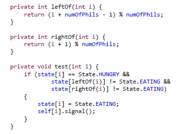

## Chapter 7. Synchronization Examples

### 15. 동시성 제어의 고전적 문제들

**대규모 동시성 제어 문제의 예**

- 제한된 버퍼 문제 (The Bounded Buffer Problem)
  - 생산자 소비자 문제 (The Producer Consumer Problem)
- 독자 작가 문제 (The Readers Writers Problem)
- 식사 철학자 문제 (The Dining Philosophers Problem)

**제한된 버퍼 문제 (The Bounded Buffer Problem)**

- 각각 하나의 항목을 보유 할 수있는 n 개의 버퍼로 구성된 풀의 생산자 소비자 문제를 생각해보자
- 생산자는 소비자를 위해 전체 버퍼를 생성
- 소비자는 생산자를 위해 빈 버퍼를 생성

**공유 데이터 구조**

- 이진 세마포어 뮤텍스 (A binary semaphore mutex)
  - 버퍼 풀에 대한 액세스를 상호 배제
  - 값 1로 초기화됩니다.
  - 두 개의 계산 세마포가 각각 비어 있고 가득 참
  - 비어있는 버퍼와 가득 찬 버퍼의 수를 계산하는 데 사용
  - 비어 있으면 𝑛 값으로 초기화되고, 전체 값은 0 값으로 초기화된다
  - 순서가 중요하고 복잡해서 잘 사용하지 않는다.

**독자 작가 문제 (The Readers Writers Problem)**

- 동시에 실행되는 프로세스가 공유 데이터에 대한 판독기 또는 작성자 인 경우 어떻게 될까?
  - 예 : 여러 동시 프로세스간에 공유되는 데이터베이스.
- 작성자가 업데이트 (즉, 읽기 및 쓰기)하는 반면, 독자는 데이터베이스를 읽기만 원할 수 있다
- 두 명 이상의 독자가 공유 데이터에 동시에 액세스하더라도 부작용은 발생하지 않는다.
- 그러나 작성자와 다른 프로세스 (독자 또는 작성자)가 동시에 데이터베이스에 액세스하면 혼란이 발생할 수 있다.

**독자 작가 문제의 몇 가지 변형**

- 우선 순위(Priorities)는 모든 변형과 관련됩니다.
- 최초의 독자 작가 문제  (리더 우선권)
  - 독자가 단순히 작가가 기다리고 있다는 이유만으로 다른 독자가 끝낼 때까지 기다려서는 안된다.
- 두 번째 독자 작가 문제 (라이터 우선권)
  - 작성자가 객체에 액세스하기 위해 대기중인 경우 새로운 독자는 읽을 수 없다.
  - 첫번째보단 강력한 solution이지만 여전히 복잡함
- 이 두 가지 경우 기아(starvation)가 발생할 수 있다.

- 최초의 독자 작가 문제에 대한 해결책

  - 판독기 프로세스는 다음 데이터 구조를 공유

    

    - rw_mutex는 독자와 작성자가 공유해서 사용
    - mutex는 critical section에 대한 read_count 변수가 업데이트 될 때 상호 배제를 보장하는 데 사용된다.
    - read_count는 현재 객체를 읽고있는 프로세스 수를 추적한다.

**독자 작가 문제에 대한 해결책**

- writer가 critical 섹션에 있고 𝑛readers가 대기중인 경우 한 리더가 rw_mutex에 대기하고 𝑛-1readers가 mutex에 대기
- 또한 작가가 signal (rw_mutex) 를 실행할 때
  - 대기중인 독자 또는 대기중인 단일 작성자의 실행을 재개 할 수 있다.
  - 선택은 스케줄러에 의해 이루어진다.

**독자 작가 잠금**

- 독자 작가 문제와 그 해결책은 독자 작가 잠금을 제공하도록 일반화되었다.
- 판독기 작성기 잠금을 얻으려면 잠금 모드 (읽기 또는 쓰기)를 지정해야 한다.
- 여러 프로세스가 읽기 모드에서 리더 라이터 잠금을 획득 할 수 있지만
  - 작가에게 독점 액세스가 필요하기 때문에 하나의 프로세스만 쓰기 잠금을 획득 할 수 있다.

### 16. 철학자들은 왜 굶어 죽었을까?

**식사 철학자 문제**

- 5 개의 젓가락을 공유하면서 평생을 생각하고 먹는 다섯 명의 철학자를 생각해보자.
  - 때때로 철학자는 배가 고파서 그녀에게 가장 가까운 두 개의 젓가락을 집으려고 한다.
- 배고픈 철학자가 두 젓가락을 동시에 가지고있을 때 그녀는 젓가락을 놓지 않고 먹는다.
- 교착 상태(deadlock)와 굶주림(starvation) 이없는 방식으로 여러 프로세스에 여러 리소스를 할당해야한다

**세마포어 솔루션**

- 하나의 간단한 해결책은 각 젓가락을 세마포어로 표현하는 것이다.
  - 각 젓가락에 이진 세마포어를 하나씩 걸어주는 것
- 철학자는 𝑤𝑎𝑖𝑡 () 연산을 실행하여 젓가락을 얻는다.
- 그녀는 𝑠𝑖𝑔𝑛𝑎𝑙 () 작업을 실행하여 젓가락을 놓는다.

 

**교착 상태와 기아 문제**

- 간단한 세마포어 솔루션으로 상호 배제 보장
- 그러나 교착 상태 또는 기아는?
  - 다섯 명의 철학자가 동시에 배고프다고 가정
  - 그리고 각자 왼쪽 젓가락을 잡고 오른쪽 젓가락을 잡으려고 한다.
  - 교착 상태가 발생

**교착 상태 문제에 대한 가능한 해결책**

- 최대 4 명의 철학자가 테이블에 동시에 앉을 수 있다.
- 두 젓가락을 모두 사용할 수있는 경우에만 철학자가 젓가락을 집어 들도록 허용.
- 비대칭 솔루션을 사용 (asymmetric solution)
  - 홀수 철학자가 먼저 왼쪽 젓가락을 집어 든 다음 오른쪽 젓가락을 집는 반면 짝수 철학자는 오른쪽 젓가락을 집어 든다.
  - 주의: 교착 상태가없는 솔루션이 반드시 기아의 가능성을 제거하는 것은 아니다.

**모니터 솔루션**

- 철학자가 젓가락을 모두 사용할 수있는 경우에만 집어 들도록 허용
- 철학자의 세 가지 상태를 구별해야 한
  - 생각하는, 배고픈, 먹는.
- 철학자는 이웃 두 사람이 먹는 상태가 아닌 경우에만 자신의 상태를 먹는 상태로 설정할 수 있다.
- 또한 철학자가 배고프지 만 필요한 젓가락을 구할 수 없을 때 자신을 지연시킬 수있는 조건 변수가 필요

**식사 철학 문제에 대한 해결책 :**

- 젓가락의 분배는 모니터 인 DiningPhilosopher에 의해 제어된다.
- 각 철학자는 식사를 시작하기 전에 𝑝𝑖𝑐𝑘𝑢𝑝 작업을 호출하여 철학자의 과정을 중단해야 한다.
- pickup ()이 성공적으로 완료되면 철학자는 음식을 먹고 𝑝𝑢𝑡𝑑𝑜𝑤𝑛 작업을 호출 할 수 있다.
- 상호 배제가 보장되고 교착 상태가 발생하지 않지만 기아는 여전히 가능

#### 대안적 접근

**스레드로부터 안전한 동시 애플리케이션**

- 동시 애플리케이션은 뮤텍스 잠금, 세마포어 및 모니터와 같은 기술을 사용하여 멀티 코어 시스템에서 우수한 성능을 제공
- 그러나 그들은 경쟁 조건과 교착 상태와 같은 활력 위험의 위험이 증가
- 스레드로부터 안전한 동시 애플리케이션 설계를위한 대안이 있다.
  1. 트랜잭션 메모리
  2. OpenMP
  3. 함수형 프로그래밍 언어

 

### 16-1. 철학자들의 저녁식사 Java 버전

 