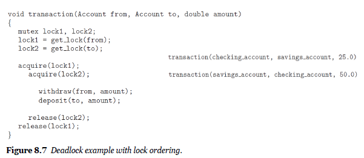

## Chapter 8. Deadlocks

### 17. 데드락의 이해

#### 시스템 모델

**교착상태(데드락)**

- 프로세스 집합의 모든 프로세스가 집합의 다른 프로세스에 의해서만 발생할 수있는 이벤트를 기다리는 상황
- 대기중인 스레드 (또는 프로세스)가 요청한 리소스가 다른 대기중인 스레드 (또는 프로세스)에 의해 유지되기 때문에 <u>다시 상태를 변경 할 수없는 상황</u>

> 라이브락
> 교착 상태가 어떤 스레드 집합의 모든 스레드가 같은 집합에 속한 다른 스레드에 의해서만 받생할 수 있는 이벤트를 기다리면서 봉쇄되면 발생하는 반면에, 라이브
> 락은 스레드가 실패한 행동을 계속해서 시도할 때 받생한다. 라이브락은 두 사람이 복도를 지나가려고 할 때 가끔 받생하는 현상과 유사하다. 한 사람은 오른쪽으
> 로 움직이고 다른 한 사람은 왼쪽으로 움직이면서 여전히 서로의 진행을 방해한다. 그런 다음 한 사람은 왼쪽으로 이동하고 다른 한 사람은 오른쪽으로 움직인다.
> 봉쇄되지는 않았지만 앞으로 진행할 수 없다.

시스템 모델

- 다수의 경쟁 스레드에 분배 될 한정된 수의 자원으로 구성된 시스템을 고려해 보자.
- 리소스 유형은 몇 개의 동일한 인스턴스로 구성
  - 예 : CPU주기, 파일 및 I / O 장치 (예 : 프린터, 드라이브 등)
- 스레드가 리소스 (개수가 아닌) **타입**의 인스턴스를 요청하면 인스턴스 할당이 요청을 충족해야 한다.
- 스레드는 Request - Use - Release와 같이 리소스를 사용할 수 있습니다. 
  - Use에 여러개의 인스턴스가 들어갈 수 있음

#### 다중 스레드 응용 프로그램의 교착 상태

- 네 가지 필수 조건
  1. 상호 배제 :
  하나 이상의 리소스가 공유 불가능(non-sharable) 모드로 유지된다.
  2. Hold and Wait (점유 대기)
      스레드는 하나 이상의 리소스를 보유하고 다른 스레드가 보유한 추가 리소스를 획득하기 위해 대기한다.
  3. 선점 없음
      자원을 선점 할 수 없다.
  4. 순환 대기
      대기의 종속성 그래프가 원형 인 대기 스레드 세트가 있다.

#### 교착 상태 특성화

- **리소스 할당 그래프**는 교착 상태를보다 정확하게 설명하기 위한 방향 그래프
- 정점 세트 𝑉 및 가장자리 세트 𝐸로 구성
- V의 두 가지 노드 유형
  - 𝑇 = {𝑇1, 𝑇2, ⋯, 𝑇𝑛} : 시스템의 모든 활성 스레드 집합.
  - 𝑅 = {𝑅1, 𝑅2, ⋯, 𝑇𝑚} : 시스템의 모든 리소스 타입 집합.
- A directed edge : 𝑇𝑖 → 𝑅𝑗 request edge
  - 스레드 𝑇𝑖가 𝑅𝑗의 인스턴스를 요청했음을 나타낸다
- A directed edge : 𝑅𝑗 → 𝑇𝑖 assignment edge
  - 𝑅𝑗의 인스턴스가 스레드 𝑇𝑖에 할당되었음을 나타낸다

(싸이클이 없어 데드락이 발생하지 않는 구조)

(두개의 싸이클이 있고 데드락이 발생하는 구조)

(한개의 싸이클이 있지만 데드락이 발생하지 않는 구조)

- 중요한 관찰
  - 자원 할당 그래프에 싸이클이 없으면 시스템이 교착 상태가 아니다.
  - 자원 할당 그래프에 싸이클이 있는 경우 시스템이 교착 상태에 있을 수도 있고 아닐 수도 있다.

#### 교착 상태 처리 방법

- 문제를 모두 무시하고 시스템에서 교착 상태가 발생하지 않는 것처럼 가장
- 프로토콜을 사용하여 교착 상태를 방지하거나 방지하여 시스템이 교착 상태가되지 않도록 한다.
  - 교착 상태 방지(Prevention) ($ 8.5) (거의 불가능, 하더라도 매우 비쌈)
  - 교착 상태 회피(Avoidence) ($ 8.6) : 은행가의 알고리즘(Banker's Algorithm)
- 시스템이 교착 상태가되도록 허용 한 다음, 이를 감지하고 복구 (detect and recover)
  - 교착 상태 감지
  - 교착 상태에서 복구

#### 교착 상태 방지

- 교착 상태가 발생하려면 네 가지 필수 조건이 각각 유지되어야
- 따라서 이러한 조건 중 하나 이상이 유지 될 수 없도록함으로써 교착 상태 발생을 방지 할 수 있다.
  1. Mutual Exclusion (상호 배제)
  2. Hold and Wait (잠시 기다릴 것)
  3. No Preemption (선점 없음)
  4. Circular Wait (순환 대기)

**Mutual Exclusion**

- 하나 이상의 리소스는 공유 할 수 없어야 한다.
- 일반적으로 대부분의 응용 프로그램에는 적용 할 수 없다.
- <u>일부 리소스는 본질적으로 공유 할 수 없다.</u>
- 예를 들어 뮤텍스 잠금은 여러 스레드에서 공유 할 수 없다.

**Hold and Wait**

- 스레드가 리소스를 요청할 때마다 다른 리소스를 보유하지 않음을 보장 할 수 있다.
- <u>대부분의 응용 프로그램에서는 비실용적</u>

**No preemption**

- 선점이 있음을 보장하기 위해 프로토콜을 사용해야 한다.
- 스레드가 일부 리소스를 보유하고 있으며 즉시 할당 할 수없는 다른 리소스를 요청하는 경우. 그러면 스레드가 현재 보유하고있는 모든 리소스가 선점된다.
- 선점된 리소스는 스레드가 대기중인 리소스 목록에 추가된다.
- 스레드는 이전 리소스를 다시 얻을 수있을 때만 다시 시작되며 새 리소스는 일반적으로 <u>대부분의 응용 프로그램에 적용 할 수 없다.</u>

**Circular Wait**

- 때때로 실용적
- 모든 리소스 유형의 전체 순서를 지정하고 각 스레드가 증가하는 열거 순서로 리소스를 요청하도록 요구
- 이 두 프로토콜을 사용하면 순환 대기 조건이 유지 될 수 없음이 입증된다.
- 그러나 잠금 순서를 적용한다고해서 교착 상태가 방지되는 것은 아니다.
  - 잠금을 동적으로 획득 할 수있는 경우.

(transaction: atomic operation, 쪼갤 수 없는 원자적 작업 ex: 계좌이체  )

(grand lock을 쓰는 방법, )

**교착 상태 방지의 단점**

- 요청 방법을 제한하여 교착 상태를 방지하고 필요한 조건 중 하나 이상이 발생하지 않도록 한다.
- 그러나 교착 상태 방지의 가능한 부작용은 낮은 장치 활용도와 시스템 처리량 감소

#### 교착 상태 회피

> 기다려야하는지 미리 확인

- 시스템이 향후 교착 상태를 방지하기 위해 스레드가 기다려야하는지 여부를 각 요청에 대해 결정하도록 한다.

- 자원 요청 방법에 대한 추가 정보가 필요
- 예를 들어 𝑅1 및 𝑅2 리소스가있는 시스템에서
  - 스레드 𝑃는 먼저 𝑅1을 요청한 다음 𝑅2를 해제하기 전에 요청
  - 스레드 𝑄가 𝑅2 다음 𝑅1을 요청
- 사전 정보가 주어지면 시스템이 교착 상태가되지 않도록 보장하는 알고리즘을 구성 할 수 있다.
  - 필요한 **각 타입의 최대 리소스 수**를 허용하도록 하자.
  - 리소스 할당 상태를 **사용 가능하고 할당 된 리소스의 수**와 스레드의 **최대 수요**로 설정

**Safe State(안전한 상태)**

- 시스템이 어떤 순서로 각 스레드 (최대 값까지)에 리소스를 할당하고 교착 상태를 피할 수 있다면 상태는 안전합니다.
- 시스템은 안전한 시퀀스가있는 경우에만 안전한 상태
- 스레드 시퀀스 〈𝑇1, 𝑇2, ⋯, 𝑇𝑛〉은 안전한 시퀀스.
- 각 스레드 𝑇𝑖에 대해 𝑇𝑖이 여전히 요청할 수있는 리소스가 현재 사용 가능한 리소스 + 보유한 리소스로 충족 될 수있는 경우 => 모두 할당해 줄 수 있음
  모두 𝑇𝑗, 𝑗 <𝑖

**기본 사실**

- 안전한 상태는 교착 상태가 아니다.
- 반대로 교착 상태는 안전하지 않은 상태
- 그러나 모든 안전하지 않은 상태가 교착 상태 인 것은 아니다. 
- 안전하지 않은 상태는 교착 상태로 이어질 수 있다.

**회피 알고리즘**

> 아예 unsafe상태로 가지 말자.

- **안전한 상태(safe state)**의 개념이 주어지면 시스템이 교착 상태에 들어 가지 않도록하는 회피 알고리즘을 정의 할 수 있다.
- 아이디어는 단순히 시스템이 항상 안전한 상태로 유지되도록하는 것
- 처음에는 시스템이 안전한 상태에 있다.
- 스레드가 현재 사용 가능한 리소스를 요청할 때마다 시스템은 리소스를 할당 할 수 있는지 여부를 결정
- 할당이 시스템을 안전한 상태로 유지하는 경우에만 요청이 허용된다.

**자원 할당 그래프**

- 자원 할당 그래프를 다시 방문
- 시스템에 각 자원 유형의 인스턴스가 하나만 있다고 가정
- 그런 다음 클레임 에지라고하는 새로운 유형의 에지를 소개한다.
- 클레임 에지 : 𝑇𝑖 → 𝑅𝑗는 스레드가 향후 언젠가 리소스를 요청할 수 있음을 나타낸다.
- 그런 다음 방향 그래프에서주기 감지 알고리즘으로 안전성을 확인할 수 있다.
- 주기가 없으면 리소스 할당이 시스템을 안전한 상태로 유지하므로 요청을 즉시 승인 할 수 있다. (be granted)
- 주기가 감지되면 리소스 할당으로 인해 시스템이 안전하지 않은 상태가되므로 요청을 승인 할 수 없다. (cannot be granted)

### 18. 데드락과 뱅커 알고리즘:

**뱅커 알고리즘**

- RAG는 각 리소스 유형의 여러 인스턴스가있는(multiple instances) 리소스 할당 시스템에는 <u>적용되지 않는다.</u>
- 은행가의 알고리즘은 이러한 시스템에 적용 할 수 있지만 RAG보다 덜 효율적이고 복잡하다.
- 왜 은행가?
  - 은행은 더 이상 모든 고객의 요구를 충족시킬 수없는 방식으로 사용 가능한 현금을 할당하지 않는다.

**데이터 구조**

- 𝑛을 시스템의 스레드 수로하고 𝑚을 리소스 유형의 수로 둔다.
- Available : 벡터는 사용 가능한 리소스 유형의 수를 나타낸다.
- Max :  매트릭스는 각 스레드의 최대 수요를 정의한다.
- Allocation : 매트릭스는 현재 각 스레드에 할당된 각 유형의 자원 수를 정의한다.
- Need : 매트릭스는 각 스레드의 나머지 리소스 필요를 나타낸다.

- 𝑨𝒗𝒂𝒊𝒍𝒂𝒃𝒍𝒆 [𝒎] :
  - 𝐴𝑣𝑎𝑖𝑙𝑎𝑏𝑙𝑒 [𝑗] == 𝑘, 𝑘개의 𝑅𝑗 인스턴스를 사용할 수 있습니다.
- 𝑴𝒂𝒙 [𝒏 × 𝒎] :
  - 𝑀𝑎𝑥 [𝑖] [𝑗] == 𝑘이면 𝑇𝑖는 최대 𝑘개의 𝑅𝑗 인스턴스를 요청할 수 있습니다.
- 𝑨𝒍𝒍𝒐𝒄𝒂𝒕𝒊𝒐𝒏 [𝒏 × 𝒎] :
  - 𝐴𝑙𝑙𝑜𝑐𝑎𝑡𝑖𝑜𝑛 [𝑖] [𝑗] == 𝑘, 𝑇𝑖가 현재 할당 된 𝑘개의 𝑅𝑗 인스턴스
- 𝑵𝒆𝒆𝒅 [𝒏 × 𝒎] :
  - 𝑁𝑒𝑒𝑑 [𝑖] [𝑗] == 𝑘이면 𝑇𝑖 𝑘개 더 많은 𝑅𝑗 인스턴스가 필요할 수 있습니다.

**안전 알고리즘**(safety Algorithm)

**리소스 요청 알고리즘**(Resource-Request Algorithm)

- 예시적인 예 :
  - 5 개의 스레드 세트 : 𝑇 = {𝑇0, 𝑇1, 𝑇2, 𝑇3, 𝑇4}
  - 세 가지 리소스 유형 집합 : 𝑅 = {𝐴, 𝐵, 𝐶}
  - 각 리소스 유형의 인스턴스 수 : 𝐴 = 10, 𝐵 = 5, 𝐶 = 7
  - 시스템의 현재 상태를 나타내는 스냅 샷

- 우리는 시스템이 현재 안전한 상태라고 주장한다. (안전 알고리즘)

  - 실제로 〈𝑇1, 𝑇3, 𝑇4, 𝑇2, 𝑇0〉 시퀀스는 안전 기준을 충족

  

- 새 요청이 제출되면

  - 𝑇1이 𝐴 인스턴스 1 개와 𝐶 인스턴스 2 개를 요청한다고 가정
  - 𝑅𝑒𝑞𝑢𝑒𝑠𝑡1 = (1,0,2)
  - 이 요청의 승인 여부 결정 (리소스 요청 알고리즘)

  

- 이제 이 새로운 시스템 상태가 안전한지 확인 (안전 알고리즘)

  - 안전 알고리즘은 〈𝑇1, 𝑇3, 𝑇4, 𝑇0, 𝑇2〉가 안전을 만족한다는 것을 알아낸다.

  

- 이번에는 𝑇4의 (3,3,0) 요청으로 결정

(2단계에서 reject)

- 𝑇0의 (0,2,0) 요청은 어떤가?

(1, 2단계는 통과하지만 안전상태가 아님. 계속 tffff 상태임. 그래서 reject)

#### 교착 상태 감지

> avoidence도 유용하지만 절대 deadlock이 걸리면 안되는 시스템이 아니라면 부담스러움.
>
> => 데드락을 허용해주고 감지된다면, 복구하자.

- 시스템이 교착 상태를 방지하거나 회피하지 않으면 교착 상태가 발생할 수 있다.
- 이 환경에서 시스템은 다음을 제공 할 수 있다
  - 교착 상태가 발생했는지 확인하기 위해 시스템 상태를 검사하는 알고리즘
  - 교착 상태에서 복구하는 알고리즘

- 각 리소스 타입의 단일 인스턴스
  - 리소스 할당 그래프의 변형인 **wait-for graph**를 유지
  - 주기적으로 그래프 대기에서 사이클을 검색하는 알고리즘을 호출

- 리소스 유형의 여러 인스턴스
  - wait-for 그래프는 각 리소스 유형의 여러 인스턴스가있는 시스템에는 적용되지 않음
  - 은행가의 알고리즘에서 사용되는 것과 유사한 교착 상태 감지 알고리즘을 설계 할 수 있다.

**데이터 구조**

- 𝑨𝒗𝒂𝒊𝒍𝒂𝒃𝒍𝒆[𝒎]:

- 𝑨𝒍𝒍𝒐𝒄𝒂𝒕𝒊𝒐𝒏 [𝒏 × 𝒎] :

- 𝑹𝒆𝒒𝒖𝒆𝒔𝒕 [𝒏 × 𝒎] :
  - 각 스레드의 현재 요청을 나타낸다.
- 𝑅𝑒𝑞𝑢𝑒𝑠𝑡 [𝑖] [𝑗] == 𝑘이면 𝑇𝑖가 𝑅𝑗의 더 많은 인스턴스를 𝑘 요청

**감지 알고리즘(Detection Algorithm)**

예시적인 예 :

- 5 개의 스레드 세트 : 𝑇 = {𝑇0, 𝑇1, 𝑇2, 𝑇3, 𝑇4}
- 세 가지 리소스 유형 집합 : 𝑅 = {𝐴, 𝐵, 𝐶}
- 각 리소스 유형의 인스턴스 수 : 𝐴 = 7, 𝐵 = 2, 𝐶 = 6
- 시스템의 현재 상태를 나타내는 스냅 샷

- 이 경우 우리는 시스템이 교착 상태가 아니라고 주장
  - 시퀀스 〈𝑇0, 𝑇2, 𝑇3, 𝑇1, 𝑇4〉는 모든 i에 대해 𝐹𝑖𝑛𝑖𝑠ℎ [𝑖] == 𝑡𝑟𝑢𝑒

- 이 경우 우리는 시스템이 이제 교착 상태라고 주장
  - 스레드 𝑇1, 𝑇2, 𝑇3 및 𝑇4로 구성된 교착 상태

탐지 알고리즘은 언제 호출해야 하는가?

- 교착 상태가 얼마나 자주 발생하는가?
- 