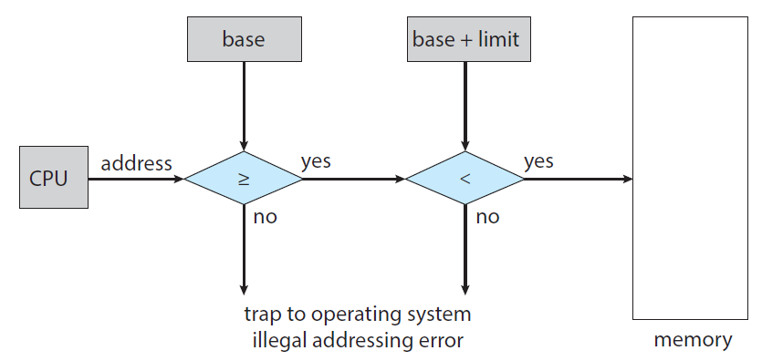

## Chapter 9. Main Memory

 

### 19. 주메모리의 관리

#### 배경

> 그동안은 Process에 관련된 것을 배웠다면 이제는 어떻게 Memory에 적재되고 효과적으로 사용되는지 에 대해 알아볼 것이다.
> 즉, CPU가 각각의 Process의 PC를 어 떻게 효율적으로 처리했는지를 알아봤다면,
> 이제는 각각의 Process가 어떻게 Mult Processing을 할 수 있게 Memory를 사용하는지에 대해 알아본다.

**프로세스**

- 실행중(in execution)인 프로그램
- 즉, 주 메모리에 보관 된 일련의 명령

**메모리**

- 각각 자체 주소가있는 큰 바이트 배열(array of bytes)로 구성
- CPU는 프로그램 카운터를 사용하여 메모리에서 명령어를 가져 오며,
  명령어는 메모리로부터의 로드 또는 메모리에 저장을 하도록 한다.

**메모리 공간**

- 각 프로세스에 <u>별도의 메모리 공간</u>이 있는지 확인
- 한 쌍의 레지스터 : 기본 레지스터(base register) 및 제한 레지스터(limit register)는 법적 주소(legal addresses) 범위를 결정하는 기능을 제공한다. (continuous 전제)

 

#### 메모리 공간 보호

- 메모리 공간 보호는 CPU 하드웨어가 사용자 모드에서 생성 된 모든 주소를 레지스터와 비교하여 수행된다.
- 주소가 base보다 크고 base+limit보다 작으면 접근 허용 아니면 error

 

#### 주소 바인딩

- 프로그램은 바이너리 실행 파일로 디스크에 상주
  - 실행하려면 프로그램을 메모리로 가져와야 한다 (=> 그제서야 프로세스가 됨)
  - 프로세스의 주소는 주소 00000000으로부터 시작하지 않습니다.
- 소스의 주소는 일반적으로 상징적
- 컴파일러는 일반적으로 상징적인(symbolic) 주소를 재배치(relocatable) 가능한 주소에 바인딩한다
  - a.out, a.exe를 생성할뿐 어느 메모리 주소에 있는지는 모름. 
- 링커 또는 로더는 다시 변동 가능한(relocatable) 주소를 절대(absolute) 주소에 바인딩한다.
- source program에선 symbolic, object file에서는 relocatable, executable file에서는 logical, program in memory에서는 physical

 

#### 논리적(Logical) .vs. 물리적(Physical) 주소 공간

- 논리적 주소 : CPU가 생성 한 주소
- 물리적 주소 : 메모리 유닛에 표시되는 주소
  - 즉, 메모리 주소 레지스터에 로드 된 것
- 논리적 주소는 CPU가 생성하고 사용자가 볼 수 있음
  묻리적 주소는 실제 Memory에 해당하는 주소이기에 사용지가 볼 수 없고 매번 바뀌지 않음

- 논리 주소 공간 : 사용자 프로그램에 의해 생성 된 모든 논리 주소 집합
- 물리적 주소 공간 : 이러한 논리적 주소에 해당하는 모든 물리적 주소의 집합

> 먼저 모든 File들은 실행되기 전까지, Memory에 올라가기 전까지는 모두 Disk에 Binary File 로 올라가 있을 것이다.
> 따라서 이 Binary File을 메모리에 올렸을 때, Process 가 된다.
> 실질적인 주소는 0/s Kernel 이 결정해주므로 정확한 주소는 알지 못한다.
> 따라서, Linker, Loader 가 실질작직인 주소로 Binding 해준다. 

 

#### MMU (Memory Management Unit)

> 메모리 관리 장치

- 논리적 주소에서 물리적 주소로 매핑하는 하드웨어 장치.

**relocation register**

- MMU의 기본 레지스터
  - a=10을 346에 저장한다고하면 실제론 14346에 입력됨

 

#### 동적 로딩(Dynamic Loading)

> 모든 실행되는 파일의 전부를 Memory에 올릴 순 없을 것이다. 예를들어, Memory의 크기는 16GB라고 했을 때, 실행중인 프로그램이 그 크기를 넘어간다면 굉99징히 손해.
> 따라서, 모든 routine을 한꺼번에 load하지말고 필요할 때만 load 하자.

- 전체 프로그램과 데이터가 실제 메모리에 있어야 하는가?

- 동적 로딩 : 메모리 공간 활용도 향상

  - 루틴은 호출 될 때까지 로드되지 않는다.

- 동적 로드의 장점은 <u>루틴이 필요할 때만 로드</u>된다는 것

- 재배치 가능한 링크 로더가 호출되어 원하는 루틴을 로드하고,

  이 변경 사항을 반영하도록 프로그램의 주소 테이블을 업데이트

 

#### 동적 연결 및 공유 라이브러리

**DLLs: Dynamically Linked Libraries**

- 동적으로 연결된 라이브러리
- <u>프로그램이 실행될 때</u> 사용자 프로그램에 링크 된 시스템 라이브러리

**정적 연결(static linking)**

- 시스템 라이브러리는 다른 객체 모듈처럼 취급되며,
  로더에 의해 바이너리 프로그램 코드로 결합된다.

**동적 연결(dynamic linking) : 동적로드와 유사**

- 여기서 링크는 <u>실행 시간까지 연기</u>된다

**공유 라이브러리(shared library)**

- 공유 라이브러리 : 주 메모리에있는 DLL의 한 인스턴 만 여러 사용자 프로세스간에 공유 될 수 있으므로 DLL을 공유라고도 한다.

 

> 고민이 생긴다..

#### 연속 메모리 할당

- 가능한 가장 효율적인 방법으로 메인 메모리를 할당해야 한다
- 메모리는 일반적으로 두 개의 파티션으로 나뉜다.
  - 운영 체제용
  - 사용자 프로세스용
- 여러 사용자 프로세스가 동시에 메모리에 상주

- 메모리로 가져 오기를 기다리는 프로세스에 사용 가능한 메모리를 할당하는 방법은?
- 연속 메모리 할당
  - 각 프로세스는 다음 프로세스를 포함하는 섹션에 인접한 단일 메모리 섹션에 포함된다.

**메모리 보호**

- 두 가지 아이디어를 결합하여 프로세스가 소유하지 않은 메모리에 액세스하지 못하도록 방지
  - 재배치 레지스터 + 제한 레지스터

**메모리 할당**

- 가변 파티션 방식(Variable Partition scheme) : 가장 간단한 방법 중 하나
- 메모리의 가변 크기 파티션에 프로세스를 할당
-  여기서 각 파티션에는 정확히 하나의 프로세스가 포함될 수 있다.

- process 9 위에 있는 hole 관리가 문제

**동적 스토리지 할당 문제**

- 여유 구멍 목록에서 𝑛 크기 요청을 충족하는 방법
  - 이 문제에 대한 트리 유형의 솔루션 :
    - First Fit은 충분히 큰 첫 번째 보류를 할당합니다.
    - Best Fit : 충분히 큰 가장 작은 구멍을 할당합니다.
    - Worst Fit : 가장 큰 구멍을 할당합니다.

 

#### 분열 Fragmentation

- 외부 조각화 (external fragmentation)

  > 가변적인 메모리를 할당, 해제할 때 발생하는 문제

  > 프로세스 사이

  - 메모리는 많은 수의 작은 구멍으로 조각화
  - 요청을 충족시키기에 충분한 총 메모리 공간이있을 수 있을 수 있으나 사용 가능한 공간이 연속적이지 않음.

- 내부 조각화 (internal fragmentation)

  > . 내부 조각화는 프로세스에 할당 된 메모리가 프로세스에서 요청한 메모리보다 약간 큰 경우 할당된 블록에 여유 공간이 생겨 발생. => 메모리는 가변크기블록으로 분할되어야 하며 프로세스에 가장 적합한 블록을 할당해야

  > 내부 분열 문제를 완전히 제거하지는 못하지만 어느 정도는 줄일 수 있음

  > 프로세스 내부. 그런데 안씀. 다른 프로세스도 못씀. ㅠ 

  - 프로세스에 할당 된 메모리는 요청 된 메모리보다 약간 클 수 있다.
  - 파티션 내부에있는 사용되지 않은 메모리

(영역에 나눠서 쪼개서 올리는 것. 여러가지 장점이 있지만 variable 사이즈. 결국 segmentation안쓰고 paging을 사용)

> 내부 단편화 문제는 메모리를 가변 크기 블록으로 분할하고 요청 프로세스에 가장 적합한 블록을 할당하여 해결할 수 있습니다. 그러나 외부 단편화를위한 솔루션은 압축이지만 구현하기에 비용이 많이 들기 때문에 프로세스가 물리적 메모리를 비 연속적으로 획득하도록 허용해야합니다. 이렇게하려면 페이징 및 분할 기법을 도입해야합니다
>
> 내부 단편화 문제는 줄일 수는 있지만 완전히 제거 할 수는 없습니다. 페이징 및 세그먼테이션은 프로세스가 비 연속적으로 메모리를 차지할 수있게함으로써 외부 분열로 인해 해제 된 공간을 활용하는 데 도움이 된다.

### 20. 페이징과 스와핑

#### Paging

- 허용하는 메모리 관리 체계
- 연속적이지 않은 프로세스의 물리적 주소 공간
- 페이징은 연속적인 메모리 할당의 두 가지 문제를 극복한다.
  - 외부 조각화(external fragmentation)를 방지한다.
  - 크기가 작은 hole들을 압축(compaction)할 필요가 없음
- 운영 체제와 컴퓨터 하드웨어 간의 협력을 통해 구현된다 (하드웨어의 도움 없이는 불가)

**페이징을 위한 기본 방법**

- 물리적 메모리를 고정 된 크기의 블록 프레임으로 나누고 논리적 메모리를 동일한 크기의 페이지 블록으로 나누기

  - 프레임에 페이지가 대응

- 즉 논리적 주소 공간은 물리적 주소 공간과 완전히 분리된다.

  - 논리적 주소 공간만 잘 구분하면 물리적 주소 공간 할당은 운영체제가 알아서 담당.

- CPU에 의해 생성 된 모든 주소는 두 부분으로 나뉜다.

  - 페이지 번호 p
  - 페이지 오프셋 d : 타겟 주소의 베이스 주소로부터 떨어진 정도

  

**The page number**

- 프로세스 별 페이지 테이블에 대한 인덱스로 사용된다.

논리적 주소를 물리적 주소로 변환하기 위해 CPU가 취한 단계 개요

1. 페이지 번호 𝑝를 추출하여 페이지 테이블의 색인으로 사용한다.
2. 페이지 테이블에서 해당 프레임 번호 𝑓를 추출한다.
3. 페이지 번호 𝑝를 프레임 번호 𝑓로 바꾼다.

 

(page table도 결국 메모리 안에 있는거다. 그래서 TLB를 사용)

#### The page size (like the frame size )

- 페이지 크기 : 하드웨어에 의해 정의된다
- 2의 거듭 제곱 : 일반적으로 페이지 당 4KB에서 1GB까지 다양
- 논리 주소 공간의 크기가 2의𝑚승이고 페이지 크기가 2의𝑛승이면 상위 𝑚−𝑛 비트가 페이지 번호를 지정

(𝑛=2,𝑚=4)

(프로세스가 실행될 시스템에 도착하면 페이지로 표현 된 프로세스의 크기가 메모리 할당을 위해 검사된다)

#### 페이지 테이블의 하드웨어적 기반

- CPU 스케줄러가 실행할 프로세스를 선택할 때 컨텍스트 전환을 위해 페이지 테이블을 다시 로드해야합니다.
- 페이지 테이블에 대한 포인터는 각 프로세스의 PCB에 다른 레지스터 값과 함께 저장되어야합니다.

(page table이 큼)

**PTBR page table base register 페이지 테이블 기본 레지스터)**

- 페이지 테이블을 가리키고 페이지 테이블은 주 메모리에 보관됩니다.
- 컨텍스트 전환은 더 빠르지 만 여전히 메모리 액세스 시간은 더 느립니다.
- (단점)두 개의 메모리 액세스가 필요합니다. 하나는 페이지 테이블 항목 용이고 다른 하나는 실제 데이터 용입니다.

**Translation Look aside Buffer (TLB)**

- 작고 빠른 검색 하드웨어 캐시 메모리

- 비효율을 방지하기위해 버퍼 도입

**효율적인 메모리 액세스 시간**

- TLB hit : 관심 페이지 번호가 TLB에있는 경우
- TLB 미스 : 관심 페이지 번호가 TLB에없는 경우
- 적중률 : TLB에서 관심 페이지 번호가 발견 된 횟수의 백분율
  - 예를 들어 메모리에 액세스하는 데 10ns가있는 시스템에서
    80 % 적중률 : EAT = 0.80 × 10 + 0.20 × 20 = 12𝑛𝑠.
    99 % 적중률 : EAT = 0.99 × 10 + 0.01 × 20 = 10.1𝑛𝑠.

#### 페이징을 통한 메모리 보호

- 각 프레임과 관련된 보호 비트에 의해 수행된다
- 유효한 유효하지 않은 비트 : 일반적으로 페이지 테이블의 각 항목에 첨부 된 하나의 추가 비트
- 이 비트가 valid로 설정되면 연관된 페이지가 프로세스의 논리 주소 공간에 있습니다. (법적)
- 이 비트가 유효하지 않은 것으로 설정되면 페이지는 프로세스의 논리 주소 공간에 없습니다. (불법적)
- 잘못된 주소는 유효한 유효하지 않은 비트를 사용하여 트랩된다.

#### 공유 페이지

- 페이징의 장점은 공통 코드를 공유 할 수 있다는 것
  - 다중 프로그래밍 환경에서 중요한 고려 사항
- 표준 C 라이브러리 libc를 생각해보자
  - 각 프로세스는 자체 libc 사본을 주소 공간에로드
  - 그러나 코드가 재진입 코드 인 경우 공유 할 수 있음
  - 재진입 코드는 자체 수정 코드가 아님, 즉 실행 중에 변경되지 않음

#### 페이지 테이블의 구조

**페이지 테이블 구조화**

- 논리적 주소 공간이 크면 페이지 테이블 자체가 지나치게 커진다.

- 페이지 테이블을 구성하기위한 몇 가지 기술이 필요

1. 계층 적 페이징 (Hierarchical Paging)

- 논리 주소 공간을 여러 테이블로 나눈다

(A two level page table architecture.)

2. 해시 된 페이지 테이블 (Hashed Page Table)

- 32 비트보다 큰 주소 공간을 처리하기 위해
  해시 값이 가상 페이지 번호 인 해시 테이블을 사용한다.

3. 반전 된 페이지 테이블 (Inverted Page Table)

> pid를 추가해주는 것.

- 페이지 테이블을 갖는 대신, 프로세스에 대한 정보가있는 가상 주소로 구성된 각 실제 페이지에 대해 반전 된 페이지 테이블 하나의 항목을 사용
- 제일 유용

#### Swapping

- 스와핑은 모든 프로세스의 전체 물리적 주소 공간이 시스템의 실제 물리적 메모리를 초과 할 수 있도록 한다.
- 따라서 시스템의 다중 프로그래밍 수준이 증가
- 프로세스 명령과 데이터는 실행될 메모리에 있어야 한다.
- 그러나 프로세스 또는 프로세스의 일부를 일시적으로 메모리에서 백업 저장소로 스왑한 다음 계속 실행하기 위해 메모리로 다시 가져올 수 있

**Standard Swapping**

- 주 메모리와 백업 저장소간에 전체 프로세스를 이동

- 전체 프로세스를 교체하는 데 드는 비용이 너무 많음

**Swapping with Paging(페이징으로 교체)**

- 전체 프로세스 대신 프로세스의 페이지를 교체 할 수 있음
- 이 전략은 여전히 물리적 메모리가 초과 구독되는 것을 허용
- 그러나 스와핑에는 적은 수의 페이지 만 포함
- => 오늘날 페이징은 페이징과 스와핑을 의미
  - 페이지 아웃 : 페이지를 메모리에서 백업으로 이동
  - 페이지 인 : 페이지를 백업 저장소에서 메모리로 이동
  - 페이징은 가상 메모리와 함께 잘 작동