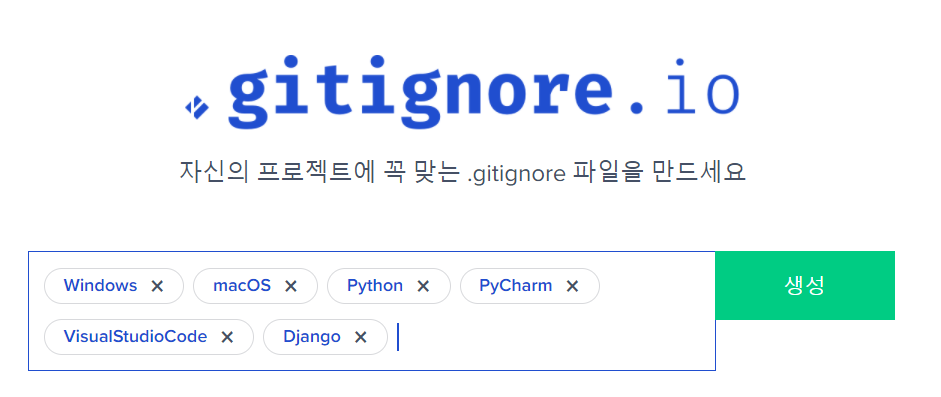

[TOC]


# CLI

- 명령줄 인터페이스(Command-Line Interface / Command-Line user Interface / Character User Interface)
- (쉘 혹은 콘솔으로 부르기도 함)
- 윈도우에선 CMD, Powershell, 리눅스에선 Terminal

## CMD

## Git Bash

> ###### 디스플레이

- 파란색으로 표시 : 폴더 이름

- Initialized empty Git repository in C:/Users/e~~~e/first-git/.git/

  git 앞에 점 → 숨겨진 폴더인 것을 알 수 있음

- 오른쪽에 마스터! → .git이 있는 위치에서 뜬다고 생각하면 됨

- 아무것도 안나왔다? → 어지간하면 잘 된 것

- 너무 길게 나와서 드래그를 내려도 안보인다? -> 방향키로 가능

> 약속

- 폴더가 ```.```으로 시작한다면 숨겨진 폴더.
- `..`: 상위 폴더, `.`: 현재 폴더(하위 폴더를 포함)
- `*`: anything. ex)`*.log`
- 명령어와 명령어 사이 띄어쓰기 구분 필요
- `pip`: python package manager

> ###### 단축키

- 붙여넣기: Shift + Ins
- 복사: Ctrl + ins
- clear: Ctrl + L
- 특정 상황에서 빠져나가기 : Ctrl + c

| 명령어                                                       |                             기능                             | 비고                                                         |
| ------------------------------------------------------------ | :----------------------------------------------------------: | ------------------------------------------------------------ |
| `$ pwd`                                                      |              내가 어디에 있는지 알아내는 명령어              | Print Working Directory                                      |
| `$ cd`                                                       |                  폴더 이동, 더블클릭과 같음                  | **change directory**<br />띄어쓰기 필요<br />`~`: 홈<br />`/`: 루트, 최상위<br />`..`: 상위 폴더<br />`폴더이름/`: 해당 폴더 |
| `$ clear`                                                    |                 단축키 Ctrl +L, 내용 다 지움                 |                                                              |
| `$ ls`                                                       |                        목록 보여주기                         |                                                              |
| `$ ls -a`                                                    |                (숨긴 목록 포함) 목록 보여주기                | all의 약자. 다 보여주라는 뜻. 숨김 폴더까지 보여짐           |
| `$ dir`<br />`$ dir/w`                                       | 디렉토리에 있는 파일 목록<br />한 화면에 5줄 씩 파일 이름만 출력 | 간단하게 볼륨명만 볼때 사용.<br />볼륨일련번호와 파일몇개인지, 크기 볼 수 있음 |
| `$ touch test.py `<br />`$ tocuh.test.md`<br />`$ touch a.txt b.txt c.txt` |           파일 생성<br />(파이썬, 마크다운, 다중)            | ```$ touch 파일이름.확장자```                                |
| `$ mkdir test`                                               |                          폴더 생성                           | **make directory**<br />```$ mkdir 폴더이름```               |
| `$ code .`                                                   |                VS code를 이용해 코드를 열어줌                |                                                              |
| `$ 명령어 --help`                                            |                            도움말                            |                                                              |

<br>

##### add, commit, push

> ###### 개념 설명

- `add` : working directory -> index
  - 비유 : 분장실에 있던 파일을 사진을 찍기 전 특정 파일을 무대에 올리는 것
- `remote`:
  - 비유 : 사진을 어떤 무대로 찍을지 지정하는 것
- `commit`:
  - 비유 : 사진에 메모를 작성
  - git이라는 사진사에게 사용자라는 의뢰자가 누군지 알려줘야 함
  - 무대에서 사진을 찍기 때문
  - 잔디심기의 기준!
- `log`
  - 비유 : 사진첩

> ###### 기본 순서

1. 파일 수정 + 저장
2. 변경사항 확인: `git diff`
3. `add` : `git add .` or `git add 파일명.확장자`
4. `commit`대상 확인: `git status` -> (`changes to be committed:` / `changes not staged for commit:`/ `nothing to commit`)
5. `commit` : `git commit -m "파일명.확장자 메모내용"`
6. `push` : `git push origin master`
7. Github 들어가서 확인

| 명령어                                                       | 기능                                     | 부가설명                                                     |
| ------------------------------------------------------------ | ---------------------------------------- | ------------------------------------------------------------ |
| `$ git init`                                                 | `(master)` 지정                          | initialize의 약자. 생성하다.<br />''깃아 나 이제 이 파일을 깃으로 관리할거야''<br />`.git` 안에 숨김 폴더로 항목을 생성해 기능할 수 있도록 함. `ls -a`으로 보면 `.git/`을 볼 수 있음<br />주의 : `~`(home)에서 `git init`을 하는 순간 내 모든 홈폴더 내용이 git으로 관리됨 |
| `$ touch .ignore`                                            | git으로 관리하지 않을 파일 조건 지정     | gitignore.io에서 코드 생성하여 VScode에 붙이기               |
| `$ rm -r .git/`                                              | `(master)` 해제                          | `git init`의 실행 취소                                       |
| `$ git status`                                               | 상태 보기                                | `Changes to be committed`:<br />`modified`: 가 초록색 -> commit 가능<br />`modified`: 가 빨강색 -> commit 불가능, add 필요<br />`nothing added to commit`:<br />add 안했을 확률 높음 |
| `$ get remote add`<br />`$ git remote add origin https://github.com/Helia-17/first-git.git`<br />`$ git remote -v` | 화살표 지정                              | 어떤 곳으로 보낼지 화살표 지정하는 기능<br />보통 1번만 필요 |
| `$ git remote -v`                                            | 화살표 확인                              | `remote`를 점검하는 경우                                     |
| `$ git remote remove origin`                                 | 화살표 해제                              | `remote`를 잘못 지정한 경우                                  |
| `$ git add helloworld.py`<br />`$ git add .`                 | 특정 파일 `add`<br />변경된 파일들 `add` | `add` : git의 sub-commagit and 중 하나                       |
| `git diff`                                                   | 이전 커밋과 현재 상황을 비교하여 보여줌  | `git diff`로 변화를 보고 `git add .`으로 한번에 `add`하면 편함. |
| `$ git commit -m "메모내용"`                                 | `commit`                                 | `-m` : message option, 뺄 수 없음<br /><br />`'파일명.확장자 변경사항'`'<br />~로 시작하면 보통 short name 옵션<br />`Author identity unknown<br/>*** Please tell me who you are.`<br />->이름과 이메일을 등록해야 함<br />`Aborting commit due to empty commit message.` -> 메세지를 남겨야 함<br />`nothing to commit, working tree clean`<br />->무대에 아무도 없다는 말. (안올렸거나 이미 `commit`을 했거나) |
| `$ git config --global user name "Helia"`<br />`$ git config -- global user name "jyk.helia@gmail.com"` | 이름과 이메일 등록                       |                                                              |
| `$ git congif --global -l`                                   | 이름과 이메일 확인                       | `user.email=jyk.helia@gmail.com`<br />`user.name=Helia`      |
| `$ git log`                                                  | `commit`확인                             | 잘 찍혔는지 확인                                             |
| `$ git push origin master`                                   | `push`                                   | 백업의 기능. 매일 하지 않아도 됨(once a month)               |

<br>

> ###### 취소하기

- 버전에 따라 명령어가 다름. git bash에 나타나는 명령어를 쓰는 것이 제일 좋은 방법

1. git add 취소하기

```python
# Staging Area(git add 명령 수행한 후의 상태)에 넣은 파일을 빼고 싶을 때가 있다.
# 뒤에 파일명이 없으면 add한 파일 전체를 취소한다.
# 깃의 버전에 따라 명령어가 다름
$ git rm -cached [file] # 2.3 이후
$ git reset HEAD [file] # 2.3 이전
# 확인
$ git status
```

2. git commit 수정하기

```bash
# 1. commit message 덮어쓰기
$ git commit --amend
# 화면이 vim으로 바뀜
```

- vim
  - https://www.openvim.com/
- 텍스트 에디터는 입력 모드, 이동 모드 두가지가 있음
- `I`를 누르면 입력모드를 실행, 끼워넣기 모드가 됨
  - 직접 commit message 수정
- `ESC`를 누르면 취소
- 저장하기
  - 입력모드를 나와서 진행
  - `:` + `wq` 
    - write quit 저장하고 나가다
- 확인하기
  - `git log`

3. git commit 파일 끼워넣기

- git add [끼워넣으려는 파일]
- `git commit --ammend`
  - 하나의 commit으로 뭉쳐진다
- 저장하기 `:wq`
  - 입력 모드가 아닐때 가능

3. git commit 취소하기

```python
# 1. commit을 취소하고 해당 파일들은 staged 상태로 워킹 디렉토리에 보존
$ git restore --staged[file] # 2.3 이후
$ git reset --soft HEAD^
# 2. commit을 취소하고 해당 파일들은 unstaged 상태로 워킹 디렉토리에 보존
$ git reset --mixed HEAD^ # 기본 옵션
$ git reset HEAD^ # 위와 동일
$ git reset HEAD~2 # 마지막 2개의 commit을 취소
# 3. commit을 취소하고 해당 파일들은 unstaged 상태로 워킹 디렉토리에서 삭제
$ git reset --hard HEAD^
# 확인
$ git log
```

- git reset 명령 옵션
  –soft : index 보존(add한 상태, staged 상태), 워킹 디렉토리의 파일 보존. 즉 모두 보존.
  –mixed : index 취소(add하기 전 상태, unstaged 상태), 워킹 디렉토리의 파일 보존 (기본 옵션)
  –hard : index 취소(add하기 전 상태, unstaged 상태), 워킹 디렉토리의 파일 삭제. 즉 모두 취소

- commit message  변경

```python
$ git commit --amend
```

- 워킹 디렉토리를 원격 저장소의 마지막 commit 상태로 되돌리기

```python
# 단, 원격 저장소에 있는 마지막 commit 이후의 워킹 디렉토리와 add했던 파일들이 모두 사라지므로 주의해야 한다.
```

3. git commit 특정 시점으로 돌아가기(취소)

   ```bash
   $ git log --online
   ```

   - 각각의 유니크한 commit 아이디가 있음

   ```bash
   $ git reset --hard # 한단계 전으로 감
   $ git reset --hard [고유번호] # 돌아간 commit 다음 파일들은 unstaged 상태
   $ git reset --soft [고유번호] # staging area에 저장. 돌아간 commit까지의 수정사항들은 staged 상태
   $ git reset [고유번호] # 돌아간 commit 다음 파일들은 unstaged 상태
   ```

   - 코드의 history가 삭제 되는지, 안되는지에 따라 option이 바뀜

<br>

3. git push 취소하기

- 주의점
  - 자신의 local 내용을 remote에 강제로 덮어쓰기를 하는 것이기 때문에 주의
  - 되돌아간 commit 이후의 모든 commit 정보가 사라지기 때문에 주의
  - 특히 협업 프로젝트에서는 동기화 문제 발생 가능성. 팀원과 상의 후 진행할 것

```python
# 1. 워킹 디렉토리에서 commit을 되돌린다
# 가장 최근의 commit을 취소 (기본 옵션: --mixed)
$ git reset HEAD^
```

```python
# 원하는 시점으로 워킹 디렉토리를 되돌린다.
# Reflog(브랜치와 HEAD가 지난 몇 달 동안에 가리켰었던 커밋) 목록 확인
$ git reflog 또는 $ git log -g
## 원하는 시점으로 워킹 디렉터리를 되돌린다.
$ git reset HEAD@{number} 또는 $ git reset [commit id]
```

```python
# 2. 되돌려진 상태에서 다시 commit을 한다
$ git commit -m "Write commit messages"
```

```python
# 3. 원격 저장소에 강제로 push한다
$ git push origin [branch name] -f
# 또는
$ git push origin +[branch name]
# Ex) master branch를 원격 저장소(origin)에 강제로 push
$ git push origin +master
```

- TIP 경고를 무시하고 강제로 push 하기
  [방법 1] -f 옵션
  –force 옵션과 동일하다.
  [방법 2] +[branch name]
  해당 branch를 강제로 push한다.

<br>

> ##### git undo

```bash
$ git status
```

github에 잘못 올라간 폴더 및 파일 삭제하기

https://bskyvision.com/990


<br>

> ###### ignore

- 필요성 : 계속 필요없는 파일들이 생겨남
- http://gitignore.io/  - 속성 설정 - 생성 - `$ touch .gitignore`
- 

> 자세히 알아보기 : 어떤 파일을 무시하나?
>
> - 캐시 파일
>   - 장고 프로젝트 시 `__pycache__`라는 폴더 : 프로젝트를 실행함으로써 생기는 캐시 파일로 사실상 프로젝트 구동 여부와 상관없음. `.pyc` 파일들 또한 같은 이유에서 무시
> - 데이터베이스와 관련된 파일인 `db.sqlite3` : 사용하는 경우가 있음
> - 그 외 사용자의 아이디 및 패스워드를 담고 있는 파일 등과 같은 것들


**뒤늦게 추가한 .gitignore 파일이 바로 적용되게끔 하는 방법!**

> $ git rm -r --cached .
>
> $ git add .
>
> $ git commit -m "[fixed 되었다는 메시지 작성]"
>
> $ git push origin [branch]

<br>

> ##### untracked 파일 삭제하기

- git clean 명령은 추적 중이지 않은 파일만 지우는 게 기본 동작
  즉, `.gitignore` 에 명시하여 무시되는 파일은 지우지 않는다.

```python
$ git clean -f # 디렉터리를 제외한 파일들만 삭제
$ git clean -f -d # 디렉터리까지 삭제
$ git clean -f -d -x # 무시된 파일까지 삭제
```

- option
  - -d 옵션
    디렉터리까지 지우는 것
  - -x 옵션
    무시된 파일(.DS_Store나 .gitignore에 등록한 확장자 파일들)까지 모두 지우는 것
    Ex) .o 파일 같은 빌드 파일까지도 지울 수 있다.
  - -n 옵션
    가상으로 실행해보고 어떤 파일들이 지워질지 알려주는 것


### 발생하는 에러들

- error: The following untracked working tree files would be overwritten by merge:
  오류 발생한 파일 위치 및 이름
  Please move or remove them before you can merge.
  Aborting

   

  지금의 경우는 untracked working tree file 에 문제가 있다고 하네요.
  아래의 명령어로 거의 해결된다고 보시면 됩니다.

   

  ```
  $ git clean -d -f -f
  ```

---


# 코드 작성


## VScode 

> ###### 코드

-  스트링은 `''`으로 통일! (`""` x)

- 복사 시 드래그 대신 세 번 클릭하는 습관 들이기, 전체 복사는 ctrl + a

- 마크다운 및 미리보기 가능 but Typora 권장

  | 약어 |          |      |
  | ---- | -------- | ---- |
  | res  | requests |      |
  |      |          |      |
  |      |          |      |

> ###### 터미널

- 방향키 윗키를 누르면 바로 위에 것을 가져옴

- 오타를 방지하기 위해서 자동완성기능을 잘 사용하는 것이좋음

- t를 누르고 tab을 누르면 t를 자동완성해줌.

- 거기서 tab을 두번 누르면 이중에 뭘 입력할건지 보여줌

  | 명령어                                            |                                                     |                                                              |
  | ------------------------------------------------- | --------------------------------------------------- | ------------------------------------------------------------ |
  | `$ pip install requests`                          | requests 설치                                       | (도구상자 꺼내기)                                            |
  | `$ pip install beautifulsoup4`                    | beautifulsoup4 설치                                 | 인간이 보기위해 번역 작업                                    |
  | `$ python 파일명.py`                              | 실행                                                |                                                              |
  | gcc 파일명.c                                      | a.out 실행파일 생성(컴파일 완료)                    | gcc test.c 로 하면 `a.exe`이 생김                            |
  | ./a.out                                           | 실행파일 실행                                       | `./` :  현재 폴더를 뜻함                                     |
  | gcc 파일명.c -c                                   | 목적(obejct)파일 생성                               | 목적 파일은 여러개의 C 소스 파일로 이루어진 프로그램을 컴파일할 때 필요 |
  | gcc 파일명.c -o 파일명(.exe)                      | c언어 결과물 생성(이름 같음)                        | 괄호부분 생략 가능                                           |
  | gcc 파일명.c -o 파일명; ./파일명                  | 이름이 같은 c언어 결과물을 생성하고 곧바로 실행     | 현재 단계에서 자주 쓸 것<br />gcc -o test test.c             |
  | gcc 파일명.c -c; gcc 파일명.o -o 파일명; ./파일명 | 이름이 같은 c언어 결과물과 목적파일을 생성하고 실행 |                                                              |
  | rm 파일명.확장자                                  | 파일 삭제                                           | 한번 더 물어볼 경우 y나 yes입력. (vscode에서는 아닌듯)       |
  |                                                   |                                                     |                                                              |
  |                                                   |                                                     |                                                              |
  |                                                   |                                                     |                                                              |
  |                                                   |                                                     |                                                              |

> ##### 단축키

|                                  | 단축키           |                                       |
| -------------------------------- | ---------------- | ------------------------------------- |
| setting 열기                     | ctrl + ,         | F1 누른 뒤 setting 검색도 가능        |
| 프로젝트 전체 내에서 문자열 찾기 | ctrl+shift+f     |                                       |
| 내어쓰기, 인덴트 없애기          | shift + tab      | 드래그 해서 모든 인덴트 없애기도 가능 |
| select language mode             | ctrl+k -> m      | 언어별 자동완성기능 바꾸기            |
| 테마 바꾸기                      | ctrl+k -> ctrl+T |                                       |

#### VS Code 에서 터미널 띄우기

VS Code 내부에서 터미널을 띄울 수도 있다. 

- VS Code 로 해당 디렉터리를 열은 뒤, 상단 메뉴의 View > Terminal . (한글 메뉴의 경우 보기 > 터미널).

- 윈도우 사용자의 경우엔, 위 작업을 하기 전에 VS Code 에서 cmd 대신 Git Bash 를 사용하기 위하여 VS Code 에서 Ctrl + , 를 눌러 설정에 들어간 후, terminal 을 검색 후 Terminal > External > Windows Exec 부분에 Git Bash 의 경로인 C:\Program Files\Git\bin\bash.exe 를 넣어야.


### prettier

- `npx prettier "index.js"`
- `npx prettier "index.js"`
  - 다음과 같이 `--write` 옵션으로 위 커맨드를 실행하면 `index.js` 파일의 내용이 포멧팅된 코드로 바로 대체


## jupyter notebook

- REPL(Read Eval Print Loop) : 
  - 읽고(read), 평가하고(eval), 출력하는(print) 반복(loop)
  - =CLI위에서 사용
- 딥러닝, 머신러닝, 데이터 분석 등에서 자주 사용

> 초기 설정

`$ pip install notebook`

- 글꼴 설정 : D2Coding Ver 1.3.2
  크롬 설정 - 모양 - 글꼴 맞춤설정 - 고정폭 글꼴

|                                                          | 단축키        |                                      |
| -------------------------------------------------------- | ------------- | ------------------------------------ |
| Command Mode -> Edit Mode<br />Edit Mode -> Command Mode | Esc / Enter   | Command mode (파랑)/ Edit Mode(초록) |
| 실행                                                     | Shift + Enter |                                      |
| 위/ 아래에 셀 생성                                       | a/ b          | (above) / (below)                    |
| 셀 제거                                                  | dd            | (delete) - 재확인함                  |
| 마크다운 문법                                            | m             | 개념을 적을 수 있음                  |
| 파이썬 입력                                              | y             | (python)                             |
| 잘라내기                                                 | x             | cut selected cells                   |
| 실행 취소                                                | z             | undo cell deletion                   |
| Keyboard Shortcuts                                       | h             | (help)                               |

- 커널 초기화 : kernel - Restart
- (업데이트 중단 - 주피터 다운그레이드 필요)목차 생성 확장 프로그램 `$ pip install jupyter_contrib_nbextensions` - Edit - nbextensions config - disable 체크 해제, Table of contents


## PyCharm 

|        | 단축키             |      |
| ------ | ------------------ | ---- |
| Rename | ctrl + F6          |      |
| Run    | ctrl + shift + F10 |      |
|        |                    |      |
|        |                    |      |
|        |                    |      |
|        |                    |      |
|        |                    |      |
|        |                    |      |
|        |                    |      |


## Typora

|                               |                         |      |
| ----------------------------- | ----------------------- | ---- |
| 소스코드 화면 / 미리보기 화면 | Ctrl + /                |      |
| 표 삽입                       | Ctrl + t                |      |
| 제목 설정                     | # 또는 Ctrl + 1 ~ 6     |      |
| 코드 입력                     | ``                      |      |
| 인용구                        | > 또는 Ctrl + Shift + q |      |
| 목차 보기 / 숨기기            | Ctrl + Shift + L        |      |


---


# 코드 공개


## Github

- repository : 레포라고 부름, 하나의 폴더 개념
- private / public : public으로 성장 과정을 모두 보여줄 것을 추천
- 폴더 설명 상세히 써서 구분하기 쉽도록 할 것

## Git Lab

+ 최신화
  1. 프로젝트 그대로 가져오기 :`$ git clone https://lab.ssafy.com/05/seoul01/homeworkshop-pull.git` - (Gitlab) clone - Clone with HTTPS
     - 특정 브랜치만
       - `git clone -b {branch_name} --single-branch {저장소 URL}`
  2. pull : `$ git pull origin master` (전제, 마스터 폴더로 이동해있어야함)


---


# 커뮤니케이션


## Trello

- 카드에 코드 추가: 백틱 세번 + 언어 + 백틱 세번 (ex. ```+ python + yourcode +```
- 카드 삭제: archaive - delete

## Slack


참고) https://gmlwjd9405.github.io/2018/05/25/git-add-cancle.html