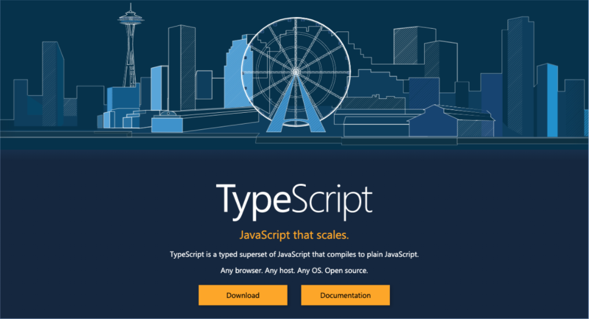
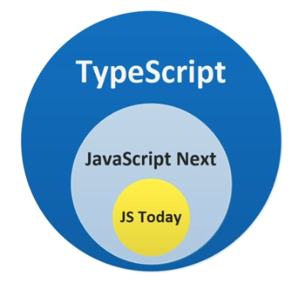

# TypeScript

> 패스트캠퍼스 프론트엔드 개발 올인원 패키지 - 해리 in TypeScript Part.

코스 슬라이드 자료
http://bit.ly/fastcampus-typescript-online

> [한 눈에 보는 타입스크립트]: https://edu.goorm.io/learn/lecture/22106/%ED%95%9C-%EB%88%88%EC%97%90-%EB%B3%B4%EB%8A%94-%ED%83%80%EC%9E%85%EC%8A%A4%ED%81%AC%EB%A6%BD%ED%8A%B8/info

# Chapter. 01 타입스크립트 시작하기


- 타입스크립트에 소개 및 기본 문법 
- 타입스크립트 컴파일러
- 새로운 자바스크립트 (ES6+)와 타입스크립트
- 제네릭, 데코레이터 그리고 고급 타입 (Partial, Pick, )
- 사자잡기 게임을 타입스크립트로 만들기


## 01. TypeScript 소개 및 개발환경 구성



- a superset of JavaScript

**타입스크립트 개요**



- 오픈소스 프로그래밍 언어
- 자바스크립트의 상위 집합으로 ECMA스크립트의 최신 표준을 지원
- 정적인 언어로 컴파일 시간에 타입을 검사 (자바스크립트는 동적)
- 장점
  - 강력한 타입으로 대규모 애플리케이션 개발에 용이
    - 여러명의 개발자와 협업해서 개발 시 특정한 매서드에서 특정한 타입을 요구하기 때문에 실수를 방지할 수 있음
  - 유명한 자바스크립트 라이브러리와의 편리한 사용
  - 개발 도구에서의 강력한 지원


**개발환경 구성**

- Node.js 설치
  https://nodejs.org/ko/
- 비주얼스튜디오 코드 설치
  https://code.visualstudio.com/download
- 개발프로젝트 만들기

- `$ yarn global add typescript`
- 에러가 뜬다면 `$ sudo npm install typescript -g` (window sudo 제외)
- 컴파일 명령어
  - `tsc`
  - `tsc hello.ts`를 하면 `hello.js`파일이 만들어짐


## 02. TypeScript 컴파일러

- Typescript 컴파일러 설치 (window sudo 제외)
  `$ sudo npm install -g typescript`

- 타입스크립트 컴파일러 실행
  `$ tsc greeting.ts`
  greeting.ts -> `$ tsc greeting.ts` -> greeting.js

- 기본적으로 구형(es5)으로 컴파일 됨

  - hello.ts

  ```typescript
  var hello = "hello";
  let hello2 = "hello2";
  ```

  - `$ tsc hello.ts`
  - hello.js

  ```javascript
  var hello = "hello";
  var hello2 = "hello2";
  ```


### **컴파일 버전 바꾸기**

#### `--target`

- `$ tst hello.ts --target es6`


### 라이브러리 옵션 주기

#### `--lib`

- promise의 경우 어떨까

  - hello.ts

  ```typescript
  var hello = "hello";
  let hello2 = "hello2";
  
  let timeoutPromise = new Promise ((resolve, reject) => {
    setTimeout(() => {
      resolve("1 sec");
    }, 1000);
  })
  timeoutPromise.then(console.log);
  ```

  - `$ tsc hello.ts`

  ```bash
  hello.ts:4:22 - error TS2304: Cannot find name 'newPromise'.
  ```

  - `$ tsc hello.ts --lib es2015.promise`
    - es2015.promise를 쓰겠다
    - 다른게 없다고 함

  ```bash
  error TS2318: Cannot find global type 'Array'.
  
  error TS2318: Cannot find global type 'Boolean'.
  
  error TS2318: Cannot find global type 'Function'.
  
  error TS2318: Cannot find global type 'IArguments'.
  
  error TS2318: Cannot find global type 'Number'.
  
  error TS2318: Cannot find global type 'Object'.
  
  error TS2318: Cannot find global type 'RegExp'.
  
  error TS2318: Cannot find global type 'String'.
  
  
  Found 8 errors.
  ```

  - `$ tsc hello.ts --lib es5,es2015.promise,es2015.iterable,dom`
  - `$ tsc hello.ts --lib es2015,dom`
    - 좀 더 편하게 전체 추가

  - `hello.js`
    - arrow function이 일반 function 구조로 바뀜

  ```javascript
  var timeoutPromise = new Promise(function (resolve, reject) {
      setTimeout(function () {
          resolve("1 sec");
      }, 1000);
  });
  
  ```

  - `$ node hello.js`
    - 컴파일  결과 실행

  ```bash
  1 sec
  ```


> typescript파일을 열때 뜨는 에러들 -> 중복선언. 파일 닫으면 없어짐
>
> - 나중에 특정 컴파일 대상을 제한함으로서 해결 가능


### 모듈 제어하기

- util.ts

```typescript
export default function add(a, b) {
  return a + b;
}
```

- hello.ts

```typescript
import add from './util';
const value = add(1, 2);
console.log(value)
```

- `$ tsc hello.ts --lib es2015,dom`

  - hello.js
    - require구조로 바뀜, arrow function도 일반 구조로 바뀜

  ```javascript
  var util_1 = require("./util");
  var value = (0, util_1["default"])(1, 2);
  console.log(value);
  ```

- `$ node hello.js`

```bash
3
```

- `$ tsc hello.ts --target es6 --lib es2015,dom`

  - hello.js
    - arrow function과 원래 구조 그대로 유지

  ```javascript
  timeoutPromise.then(console.log);
  import add from './util';
  const value = add(1, 2);
  console.log(value);
  ```

  - `$ node hello.js`
    - syntax arror

  ```bash
  SyntaxError: Cannot use import statement outside a module
  ```

#### `--module`

- target은 es6지만 모듈 시스템은 commonjs로 바꿀 수 있음

  `tsc hello.ts --target es6 --lib es2015,dom --module commonjs`

  - hello.js

  ```javascript
  "use strict";
  Object.defineProperty(exports, "__esModule", { value: true });
  var hello = "hello";
  let hello2 = "hello2";
  let timeoutPromise = new Promise((resolve, reject) => {
      setTimeout(() => {
          resolve("1 sec");
      }, 1000);
  });
  timeoutPromise.then(console.log);
  const util_1 = require("./util");
  const value = (0, util_1.default)(1, 2);
  console.log(value);
  ```

  - util.js

  ```javascript
  "use strict";
  Object.defineProperty(exports, "__esModule", { value: true });
  function add(a, b) {
      return a + b;
  }
  exports.default = add;
  ```


### 어떤 옵션이 적용되어있는지 보기

#### `--showConfig`

- json형태로 보여줌

```javascript
{
    "compilerOptions": {
        "target": "es6",
        "lib": [
            "es6",
            "dom"
        ],
        "module": "commonjs"
    },
    "files": [
        "./hello.ts"
    ]
}
```


## 03. TypeScript 컴파일러 설정파일

#### `tsconfig.json`

- 별도로 컴파일러 설정파일 만들기
- 프로젝트의 최상단 폴더에 위치
- JSON 객체 형태
- 포함될 함수들을 include의 value로 넣음
  - src폴더의 하위 폴더에 있는 모든 ts파일을 함수로 포함하겠다

```json
{
  "include": [
    "src/**/*.ts"
  ]
}
```


### TypeScript 프로젝트 만들기

- 노드 기반

#### `npm init -Y`

```bash
Wrote to C:\Users\Helia\TypeScript\package.json:

{
  "name": "typescript",
  "version": "1.0.0",
  "description": "",
  "main": "hello.js",
  "scripts": {
    "test": "echo \"Error: no test specified\" && exit 1"
  },
  "keywords": [],
  "author": "",
  "license": "ISC"
}
```

- node 모듈은 컴파일러 대상에서 제외해줘야
- tsconfig.json

```json
{
  "include": [
    "src/**/*.ts"
  ],
  "exclude": [
    "node_modules"
  ]
}
```


### 컴파일러에 대한 옵션

- tsconfig.json

```json
{
  "include": [
    "src/**/*.ts"
  ],
  "exclude": [
    "node_modules"
  ],
  "compilerOptions": {
    "module": "commonjs",
    "rootDir": "src",
    // 컴파일된 파일들이 만들어지는 최상위 폴더 설정
    "outDir": "dist",
    "target": "es5"
  }
}
```

- src안으로 ts파일들을 옮긴다

- util.js

```javascript
export default function add(a, b) {
  return a + b;
}

export default function minus(a, b) {
  return a - b;
}
```

- hello.ts

```typescript
import add from './util';

const value = add(1, 2);
console.log(value)
```

- 컴파일 `$ tsc` 
  - es5형태로 컴파일됨
- 실행 `$ node dist/hello.js`

```bash
3
```


- 이렇게도 가능

```json
{
  "include": [
    "src/**/*.ts"
  ],
  "exclude": [
    "node_modules"
  ],
  "compilerOptions": {
    "module": "es6",
    "rootDir": "src",
    // 컴파일된 파일들이 만들어지는 최상위 폴더 설정
    "outDir": "dist",
    "target": "es6"
  }
}
```

- index.html 만들기

```html
<!DOCTYPE html>
<html lang="en">
<head>
  <meta charset="UTF-8">
  <meta http-equiv="X-UA-Compatible" content="IE=edge">
  <meta name="viewport" content="width=device-width, initial-scale=1.0">
  <title>Document</title>
</head>
<body>
  <!-- 이 부분 작성 -->
  <script type="module" src="./dist/hello.js"></script>
</body>
</html>
```

- 다른 파일도 정확한 path를 입력해야함

  - hello.ts

  ```typescript
  import add from './util.js';
  ```

  - `$ tsc`
  - 브라우저에서 html 열기

  ```bash
  Access to script at 'file:///C:/Users/Helia/TypeScript/dist/hello.js' from origin 'null' has been blocked by CORS policy: Cross origin requests are only supported for protocol schemes: http, data, chrome, chrome-extension, chrome-untrusted, https.
  ```

- 해결방법:

[로컬에서-CORS-policy-관련-에러가-발생하는-이유]: https://velog.io/@takeknowledge/%EB%A1%9C%EC%BB%AC%EC%97%90%EC%84%9C-CORS-policy-%EA%B4%80%EB%A0%A8-%EC%97%90%EB%9F%AC%EA%B0%80-%EB%B0%9C%EC%83%9D%ED%95%98%EB%8A%94-%EC%9D%B4%EC%9C%A0-3gk4gyhreu

`$ yarn add http-server -g`

`$ npx http-server`

```bash
3
```


### module은 es6, target은 es5로 주고싶은 경우 + 개발자도구에서 es6 코드를 보고 싶을 때

- tsconfig.json

```json
{
  "include": [
    "src/**/*.ts"
  ],
  "exclude": [
    "node_modules"
  ],
  "compilerOptions": {
    "module": "es6",
    "rootDir": "src",
    "outDir": "dist",
    "target": "es5",
    // sourceMap 설정
    "sourceMap": true
  }
}
```

- 개발자모드 source탭에서 볼 수 있음


### 컴파일 시 커멘드를 제거하고 싶을 때

- tsconfig.json

```json
{
  "include": [
    "src/**/*.ts"
  ],
  "exclude": [
    "node_modules"
  ],
  "compilerOptions": {
    "module": "es6",
    "rootDir": "src",
    "outDir": "dist",
    "target": "es5",
    "sourceMap": true,
    // 주석 지우기
    "removeComments": true
  j
}
```


### any가 type으로 정의되지 않도록 할 때

- 함수의 파라미터의 type을 정의해주지 않으면 default값은 any, 어떤 것이든 가능
  이를 방지하기 위해 추가할 수 있는 옵션

- tsconfig.json

```json
{
  "include": [
    "src/**/*.ts"
  ],
  "exclude": [
    "node_modules"
  ],
  "compilerOptions": {
    "module": "es6",
    "rootDir": "src",
    "outDir": "dist",
    "target": "es5",
    "sourceMap": true,
    "removeComments": true,
    // any가 type으로 지정되지 않도록
    "noImplicitAny": true
  }
}
```

- any가 있는 채로 compile 하게 되면 에러로 알려줌

```bash
src/util.ts:1:29 - error TS7006: Parameter 'a' implicitly has an 'any' type.

1 export default function add(a, b) {
                              ~

src/util.ts:1:32 - error TS7006: Parameter 'b' implicitly has an 'any' type.

1 export default function add(a, b) {
                                 ~

src/util.ts:5:23 - error TS7006: Parameter 'a' implicitly has an 'any' type.

5 export function minus(a, b) {
                        ~

src/util.ts:5:26 - error TS7006: Parameter 'b' implicitly has an 'any' type.

5 export function minus(a, b) {
                           ~


Found 4 errors.
```


## 04. 변수선언

- var, let, const 사용 가능

```typescript
var score1 = 0;
let score2 = 200;
const defaultScore = 0;
```

- var와 let 차이: 함수 스코프

  - var은 함수 단위의 블록 스코프를 가짐
  - 함수 안에서 선언된 var은 함수 밖에서는 접근할 수 없음

  ```typescript
  function outer() {
    function inner() {
      var score = 0;
    }
    inner()
    // 접근 불가능.
    console.log(score);
  }
  ```

  - 함수 안에서 정의한걸 더 안에서 접근은 가능

  ```typescript
  function outer() {
    var score = 0;
    function inner() {
      console.log(score);
    }
    inner()
  }
  outer();
  ```

  - if 블럭으로 처리하면 if 블럭 안에서 처리했어도 함수 전체에서 접근 가능

  ```typescript
  function outer() {
  
    if (true) {
      var score = 0;
    }
    // 접근 가능
    console.log(score)
  }
  outer();
  ```

  - let이라면 접근 불가능. let은 블록스코프이기 대문

  ```typescript
  function outer() {
  
    if (true) {
      let score = 0;
    }
    // 접근 불가능 
    console.log(score)
  }
  outer();
  ```

  - let에 숫자할당했다가 문자를 할당하면 에러 발생. 초기 값 할당하고 변수 선언할수록 타입이 지정됨

  ```typescript
  function outer() {
  
    if (true) {
      let score = 0;
      score = 30;
      score = "30";
    }
  }
  outer();
  ```

  ```bash
  src/variables.ts:10:5 - error TS2322: Type 'string' is not assignable to type 'number'.
  
  10     score = "30";
  ```

  - for 루프 안에서 콘솔을 찍으면 var은 함수 단위기 때문에 루프 다 돈 후 var 값에 접근함

    ```typescript
    function outer() {
    
      if (true) {
        var score = 0;
      }
    
      for (var i = 0; i < 3; i++) {
        setTimeout(function() {
          console.log(i)
        }, 100)
      }
    
      console.log(score)
    }
    outer();
    ```

    - `$ tsc` / `$ ls dist`

    ```bash
    $ node dist/variables.js
    0
    3
    3
    3
    ```

  - let이라면? 순회될때마다 다른 공간을 가짐

    - `$ tsc` / `$ ls dist`

    ```bash
    $ node dist/variables.js
    0
    1
    2
    ```

  

### 변수 선언 시 type 지정하기

- variables.ts

```typescript
// type 지정, 값은 할당하지 않은 상태
let score: number;
// type에 맞는 값 할당
score = 30;
```

- const라면? 선언시 초기값을 무조건 채워줘야 함

```typescript
const score: number = 100;
```

```typescript
// type annontation 생략 가능
const score = 100;
// 재할당 불가능 -> 에러
score = 30;
```

```typescript
if (true) {
  const score = 100;
}
// let과 마찬가지로 블록스코프 밖에서 접근 불가 -> 에러
console.log(score);
```


## 05. 기본타입


## 06. 인터페이스


## 07. 함수형 타입


## 08. enum 타입

