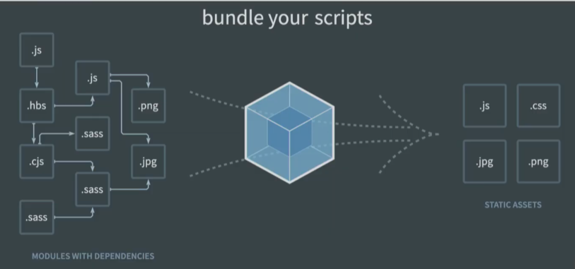

[TOC]


# Vue CLI


## Component (컴포넌트)

> "재사용", `const app  = new Vue()` 했던 Vue 인스턴스 하나가 Vue 컴포넌트 하나가 된다.

- 기본 HTML 엘리먼트를 확장하여 재사용 가능한 코드를 캡슐화 하는데 도움을 줌
- CS에서는 다시 사용할 수 있는 범용성을 위해 개발된 소프트웨어 구성 요소를 의미
- 즉, 컴포넌트는 개발을 함에 있어 유지보수를 쉽게 만들어 줄 뿐만 아니라,
  재사용성의 측면에서도 매우 강력한 기능을 제공
- Vue 컴포넌트 === Vue 인스턴스
- 예시
  - 단일 파일 관리
    - 하나가 수정됨으로써 변경되야 할 것이 매우 많아서 코드가 길어지면 변수관리와 유지보수가 어려워짐
  - 한 화면을 구성하는 여러 컴포넌트가 기능별로 있다면
    - 처음엔 어려울 수 있으나 사이트가 커져도 변수관리와 유지보수가 용이함

- 주의: 파일 하나가 반드시 하나의 컴포넌트를 의미하지는 않음.(app1, app2...)

- Vue Component 구조
  - 부모-자식의 트리 구조
  - 트리의 각 노드는 .vue라는 하나의 파일
  - 컴포넌트의 이름은 Pascal Case를 사용


## SFC

**SFC (Single File Component)**

- Vue의 컴포넌트 기반 개발의 핵심 특징
- 하나의 컴포넌트는 .vue라는 하나의 파일 안에서 작성되는 코드의 결과물
- 화면의 특정 영역에 대한 HTML, CSS, JavaScript 코드를 하나의 파일(.vue)에서 관리
- 즉, .vue 확장자를 가진 싱글 파일 컴포넌트를 통해 개발하는 방식
- Vue 컴포넌트 === Vue 인스턴스  === .vue 파일


## Vue CLI

- .Vue.js 개발을 위한 표준 도구

- 프로젝트의 구성을 도와주는 역할을 하며 Vue 개발 생태계에서 표준 tool 기준을 목표로 함

- 확장 플러그인, GUI, ES2015 구성 요소 제공 등 다양한 tool 제공

  - [Vue CLI]: cli,vuejs.org


**Node.js**

> javscript는 태생적 한계로 브라우저 안에서만 사용할 수 있었음.

- 자바스크립트를 브라우저가 아닌 환경에서도 구동할 수 있도록 하는 자바스크립트 런타임 환경

  > Node.js는 Chrome V8 JavaScript엔진으로 빌드된 JavaScript 런타임입니다.
  >
  > 즉 JavaScript를 실행하기위한 환경

- 브라우저 밖을 벗어 날 수 없던 자바스크립트 언어의 태생적 한계를 해결

- • Chrome V8 엔진을 제공하여 여러 OS 환경에서 실행할 수 있는 환경을 제공

- 즉, 단순히 브라우저만 조작할 수 있던 자바스크립트를 SSR에서도 사용 가능하도록 함 (여러 OS에서 사용 가능)

- 발표

  - 2009년 Ryan Dahl

    

**NPM (Node Package Manage)**

> Node.js를 설치해야 하는 이유
>
> NPM이라는 환경에서 패키지를 설치하고 의존성을 관리

- 자바스크립트 언어를 위한 패키지 관리자
  - Python의 pip가 있다면 Node.js 에는 NPM
  - pip와 마찬가지로 다양한 의존성 패키지를 관리
- Node.js의 기본 패키지 관리자
- Node.js와 함께 자동으로 설치 됨


**Vue CLI 설치**

- vue-cli 설치
  `$ npm install -g @vue/cli`

  - `-g`: 전역
  
- 버전 확인
  `$ vue --version`

- 버전 업데이트

  `$ npm update -g @vue/cli`

- 프로젝트 생성
  `$ vue create my-first-vue-app`
  - vue 2와 vue 3
    - vue 3는 아직 공식문서도 덜 나왔고, 개발진행중
    - vue 2로 선택.
  
- run server
  `$ npm run serve`
  
  - 포트변경
    - 앱 루트의 [`myApp/config/index.js`](https://github.com/vuejs-templates/webpack/blob/develop/template/config/index.js#L17)에서
      `dev` 블록 내에서 `port` 값을 수정
  
- VS code extension: Vetur 

(bash)

```bash
$ node -v
v14.15.0
$ npm update -g @vue/cli
$ vue --version
@vue/cli 4.5.13
```

(vscode의 git bash로 실행 - 인터페이스 조작을 위해)

```bash
$ vue create my-first-vue-app
 $ cd my-first-vue-app
 $ npm run serve
```

프로젝트 안으로 이동 뒤 서버 켜기


## Babel & Webpack

**Babel**

> Javascript는 작성된 코드의 스펙트럼이 굉장히 다양함.
>
> 구버전으로 사용되는 어플리케이션에도 대응하겠다.
>
> 원시코드와 목적코드를 compile하는 것을 Babel이 해준다.

- JavaScript Transcomiler
- 자바스크립트의 신버전 코드를 구버전으로 번역/변환 해주는 도구
- 자바스크립트 역사에 있어서 파편화와 표준화의 영향으로 작성된 코드의 스펙트럼이 매우 다양
  - 최신 문법을 사용해도 브라우저의 버전별로 동작하지 않는 상황이 발생
  - 같은 의미의 다른 코드를 작성하는 등의 대응이 필요해졌고 이러한 문제를 해결하기 위한 도구
- 원시 코드(최신 버전)를 목적 코드(구 버전)으로 옮기는 번역기가 등장하면서 개발자는 더 이
  내 코드가 특정 브라우저에서 동작하지 않는 상황에 대해 크게 고민하지 않을 수 있음

```javascript
// Babel Input: ES2015 arrow function
[1, 2, 3].map((n) => n + 1);

// Babel Output: ES5 equivalent
[1, 2, 3].map(function(n) {
return n + 1;
});
```


**Webpack**



- **static module bundler**
- 모듈 간의 의존성 문제를 해결하기 위한 도구


**Module**

> 스크립트 하나(전역스코프만 사용)로 개발하는 기존 방식에 한계점이 드러남에 따라 필요할 때 모듈을 하게 됨.
> 이제 필요한 기능들을 불러와서 사용

- 모듈은 단지 파일 하나를 의미 (ex. 스크립트 하나 === 모듈 하나)

- 배경
  - 브라우저만 조작할 수 있었던 시기의 자바스크립트는 모듈 관련 문법 없이 사용 되어짐
  - 하지만 자바스크립트와 애플리케이션이 복잡해지고 크기가 커지자
    전역 스코프를 공유하는 형태의 기존 개발 방식의 한계점이 드러남
  - 그래서 라이브러리를 만들어 필요한 모듈을 언제든지 불러오거나
    코드를 모듈 단위로 작성하는 등의 다양한 시도가 이루어짐
- 과거 모듈 시스템
  - AMD, CommonJS, UMD
- 모듈 시스템 2015년 표준으로 등재 되었으며 현재는 대부분의 브라우저와 Node.js가 모듈 시스템을 제


**Module 의존성 문제**

> *이 모듈은 버전 4.2에서만 동작합니다.*

- 모듈의 수가 많아지고 라이브러리 혹은 모듈 간의 의존성(연결성)이 깊어지면서 특정한 곳에서
  발생한 문제가 어떤 모듈 간의 문제인지 파악하기 어려워짐 (의존성 문제)
- Webpack은 모듈 간의 의존성 문제를 해결하기 위해 존재하는 도구


(의존성 문제 예시)

```html
<!-- index.html -->
<body>
...
<script src="a.js"></script>
<script src="b.js"></script>
</body>
```

```javascript
// a.js
const a = 1
console.log(a)

// b.js
a = 2 // 재할당!?!?
```

```bash
Uncaught TypeError: Assignment to constant variable.
b.js:1
```

- node_module의 의존성 깊이가 정말 생각보다 깊음. (관련 밈이 있을 정도.. - HEAVIST OBJECTS IN THE UNIVERSE = node_modules)


**Bundler**

> 의존성문제는 보통 모듈들의 순서에서 발생함.

- 모듈 의존성 문제를 해결해주는 작업이 Bundling이고 이러한 일을 해주는 도구가 Bundler이고,
  Webpack은 다양한 Bundler 중 하나
- 모듈들을 하나로 묶어주고 묶인 파일은 하나(혹은 여러 개)로 만들어짐
- • Bundling된 결과물은 더 이상 서-순에 영향을 받지 않고 동작하게 됨
- Bundling 과정에서 문제가 해결되지 않으면 최종 결과물을 만들어 낼 수 없기 때문에
  유지 & 보수의 측면에서도 매우 편리해짐
  - snowpack, parcel, rollup.js 등의 webpack 이외에도 다양한 모듈 번들러 존재
- Vue CLI는 이러한 Babel, Webpack에 대한 초기 설정이 자동으로 되어 있음


**Vue CLI 구조**

- `node_modules`
  - 엄청난 깊이
  - Node.js 환경의 여러 의존성 모듈이 작성되어있음
  
- `public/favicon.ico`
  
  - 아이콘
  
- `public/index.html`
  
  - Vue앱의 뼈대가 되는 html 파일
  - `src/main.js`에서 마운트되는 대상이 되는 엘리먼트들이 존재. 실제로 열리는 문서
  
- `src`
  - 우리가 뛰어 놀 곳
  - `assets`
    - webpack에 의해 빌드된 정적 파일
  - `components`
    - 하위 컴포넌트 파일들
  - `App.vue`
    - 최상위 컴포넌트
  - `main.js`
    - webpack이 빌드를 시작할 때 가장 먼저 불러오는 entry point
    - 실제 단일 파일에서 DOM과 data를 연결 했던 것과 동일한 작업이 이루어지는 곳
    - Vue 전역에서 활용 할 모듈을 등록할 수 있는 파일

- `.gitignore`
  - 자동으로 만들어줌.
  - git init이 선언된채로 프로젝트가 만들어짐
  - 가상환경을 올리지 않았던 것처럼 node_modules는 올라가지 않음(짱많잖아..)
  
- `babel.config.js`

  - babel 관련 설정이 작성된 파일

- `package.json`
  
  - Scripts- 사용 할 명령어 script
  - 명령어, 개발환경, 배포환경에서 사용할 모듈들
    - dependencies- 개발 + 배포 환경에서까지 활용 할 모듈
    - devDependencies - 개발 단계에서만 활용 할 모듈
  - `requirements.txt`와 같은 역할
  - 자동적으로 업데이트
  
- `package-lock.json`
  >  "동료 개발자와 동일한 종속성을 유지하도록 도와줌"

  - 자동적으로 업데이트
  - node-modules에 설치되는 모듈과 관련해서 모든 의존성을 설정 및 관리
  - 팀원 및 배포 환경에서 정확히 동일한 종속성을 설치하도록 보장하는 표현
    사용 할 패키지의 버전을 고정
  - 개발 과정 간의 의존성 패키지 충돌 방지


**App.vue**

- 3분할 구조
  - template(HTML), script(JS), style(CSS)
- 하위 컴포넌트 등록 - script에 import(등록), export default {}(불러오기), template에 사용
  - 하나의 화면을 여러개의 컴포넌트들로 구성


**하위 컴포넌트**

- 생성시 이름은 Pascal Case
- vue 입력 + enter => 자동 3분할
  - 각 영역마다 하나의 구역을 생성해주어야 함(div, ul, section.. 주로 div태그 사용)
- script의 export default
  - name은 해당 컴포넌트 .vue의 파일명과 같게. 안같아도 되지만 안같아야 할 이유가 없음.
- style의 "scoped" 속성
  - style을 딱 해당 컴포넌트에만 적용
  - App.vue의 style에는 scoped 속성이 없음


**하위 컴포넌트 불러오기**

- 상위 컴포넌트에서 진행

```vue
<template>
  <div id="app">
    
    <!-- 메세지가 상위 컴포넌트에 정의되어있고 하위 컴포넌트에서 사용됨. 내려보내진 것. -->
    <HelloWorld msg="Welcome to Your Vue.js App"/>
    <!-- 3. 보여주기 -->
    <!-- 자체 닫는태그 작성 -->
    <NewComponent/> 
  </div>
</template>

<script>
import HelloWorld from './components/HelloWorld.vue'
// 1. 불러오기
import NewComponent from './components/NewComponent.vue'

export default { // default : 이름을 짓지 않겠다
  name: 'App',
  components: { //여기에 export내용을 불러오는 것이나 다름없음.
    HelloWorld,
    // 2. 등록하기
    NewComponent,
  }
}
</script>
```

- 개발자도구 - Vuedevtools에서 컴포넌트별 구역 확인 가능

- msg 하위 컴포넌트에는 `{{ msg }}` 로 존재.

  - 내려받았다는 것을 명시를 해야 함.

    ```vue
    <script>
    export default {
      name: 'HelloWorld',
      props: {
        msg: String // 명시
      }
    }
    </script>
    ```


## Pass Props & Emit Events

> 데이터는 아래로 내려갈 수 있고 올라올 수는 없다. 아래에서는 이벤트를 통해서 알릴 뿐이다.

- 컴포넌트는 부모-자식 관계에서 가장 일반적으로 함께 사용하기 위함
- 부모는 자식에게 데이터를 전달(Pass props) 하며,
  자식은 자신에게 일어난 일을 부모에게 알림(Emit event)
  - 부모와 자식이 명확하게 정의된 인터페이스를 통해 격리된 상태로 유지할 수 있음
- . "props는 아래로, events는 위로"
- 부모는 props를 통해 자식에게 데이터를 전달하고, 자식은 events를 통해 부모에게 메시지를 보냄


**Props**

- prop는 상위 컴포넌트의 정보를 전달하기위한 사용자 지정 특성
- 하위 컴포넌트는 props 옵션을 사용하여 **수신 하는 props를 명시적으로 선언해야** 함
- 즉, 데이터는 props 옵션을 사용하여 하위 컴포넌트로 전달 됨
- 주의
  - **하위 컴포넌트의 템플릿에서 상위 데이터를 직접 참조할 수 없음**

- props 이름 컨벤션
  - in HTML
    - kebab-case
  - in script
    - camelCase


**단방향 데이터 흐름**

- 모든 props는 하위 속성과 상위 속성 사이의 단방향 바인딩을 형성
- 부모의 속성이 변경되면 자식 속성에게 전달되지만, 반대 방향으로는 안됨
  - 자식 요소가 의도치 않게 부모 요소의 상태를 변경함으로써
  - 앱의 데이터 흐름을 이해하기 어렵게 만드는 일을 막기 위함
- 부모 컴포넌트가 업데이트될 때 마다 자식 요소의 모든 prop들이 최신 값으로 업데이트 됨


- pass props 예시

  ```vue
  <template>
  <!-- App.vue -->
  
  <NewComponent my-message="This is a prop data"/>
  
  </template>
  ```

  ```vue
  <template>
  <!-- 자식 vue -->
    <div>
      <h2>New Component!</h2>
      <h2>{{ myMessage }}</h2>
    </div>
  </template>
  
  <script>
  export default {
    name: 'NewComponent', 
    props: { //가능한 상세하게 정의하면 좋음.
      myMessage: {
        type: String,
        required: true, // 내려오는 값이 반드시 있어야 한다는 뜻
      }
    }
  }
  </script>
  ```

  - 기존 helloworld전체 주석처리
  - props를 자세하게 써야하는 이유
    - 컴포넌트 API 문서화의 역할을 함 
    - 에러 메시지가 다르게 출력됨


**Emit event**

- $emit(event)
  - 현재 인스턴스에서 이벤트를 트리거
  - 추가 인자는 리스너의 콜백 함수로 전달
- 부모 컴포넌트는 자식 컴포넌트가 사용되는 템플릿에서 v-on을 사용하여
  자식 컴포넌트가 보낸 이벤트를 청취 (v-on을 이용한 사용자 지정 이벤트)
  - v on 디렉티브는 해당 요소 또는 컴포넌트에서 특정 이벤트 발생 시 전달받은 함수
    를 실행한다


**event 이름**

- 컴포넌트 및 props와는 달리, 이벤트는 자동 대소문자 변환을 제공하지 않음

- HTML의 대소문자 구분을 위해 DOM 템플릿의 v-on 이벤트 리스너는
  항상 자동으로 소문자 변환되기 때문에 v-on:myEvent 는 자동으로 v-on:myevent로 변환

- 이러한 이유로 이벤트 이름에는 kebab-case를 사용하는 것을 권장

  ```vue
  this.$emit('myEvent')
  ```

  ```vue
  <!-- 이벤트가 동작하지 않음 -->
  <my-component @my-event="doSomething"></my-component>
  ```

   => x, my-event로 할것


- emit event 예시

  - 자식 vue

  ```vue
  <template>
  
  	<input @keyup.enter="childInputChange" v-model="childInputData" type="text">
  
  </template>
  
  <script>
  export default {
    name: 'NewComponent',
    data: {
      childInputData: '',
    },
    props: {
      myMessage: {
        type: String,
        required: true,
      }
    },
    methods: {
      childInputChange: function () {
        this.$emit('child-input-change')
      }
    }
  }
  </script>
  ```

  - 에러

  ```bash
  error  `data` property in component must be a function  vue/no-shared-component-data
  ```

  함수의 반환값으로 지정하지않으면 이 데이터를 모든 인스턴스가 공유. 다른 메서드들이 다 참조할 수 밖에 없게 됨. 고로 함수로 작성해야 함. (블록스코프가 만들어짐)

  - 수정

  ```VUE
    data: function () {
      return {
      childInputData: '',
      }
    },
  ```

  - 보내기

  ```vue
  <script>
  export default {
    name: 'NewComponent',
    data: function () {
      return {
      childInputData: '',
      }
    },
    props: {
      myMessage: {
        type: String,
        required: true,
      }
    },
    methods: {
      childInputChange: function () {
        this.$emit('child-input-change', this.childInputData) //this.$data.childInputData인데 생략
      }
    }
  }
  </script>
  ```

  - 부모 vue

  ```vue
  <template>
  <NewComponent my-message="This is a prop data" @child-input-change"parentGetChange"/>
  </template>
  
  <script>
  import HelloWorld from './components/HelloWorld.vue'
  // 1. 불러오기
  import NewComponent from './components/NewComponent.vue'
  
  export default {
    name: 'App',
    components: {
      HelloWorld,
      // 2. 등록하기
      NewComponent,
    },
    methods: {
      parentGetChange: function (inputText) {
        console.log(`자식으로부터 ${inputText}를 받았다!`)
      }
    }
  }
  </script>
  ```

  - eventinfo의 payload에 데이터가 들어가있음.


## Vue Router

- Vue.js의 공식 라우터

- 중첩된 라우트/뷰 매핑 모듈화 된, 컴포넌트 기반의 라우터 설정 등
  SPA 상에서 라우팅을 쉽게 개발 할 수 있는 기능을 제공

- https://router.vuejs.org/en/

- vue cli에서는 플러그인으로 존재해서 add만 하면 됨

  - 주의사항: App.vue를 덮어쓰므로 실행 전에 백업해야 함.

  ```bash
  $ vue add router
  ```

  - commit 권장한다. 그냥 할거야? (commit 안했으면 물어봄)
  - history mode 쓸거니? y

- 변화
  - router-link 생김
  - style 추가
  - router 폴더 생성, views 폴더 생성
  - a태그가 화면에 나타남
    - 페이지 전환을 담당하는데 SPA는 페이지전환을 하는 게 아니라 정보를 받아와서 보여주는거임.
    - 누르면 전환이 됨?
    - 마치 이동한 것처럼 표현을 해주지만 서버의 요청 없이 페이지 전환이 된 것처럼 보여줌.


**Vue Router**

> router의 index.js가 django의 urls.py와 유사한 역할.

- router-link
  - index.js 파일에 정의 한 경로에 등록한 특정한 컴포넌트와 매핑
  - HTML5 히스토리 모드에서, router-link는 클릭 이벤트를 차단하여 브라우저가 페이지를 다시
    로드하지 않도록 함
  - a 태그지만 우리가 알고 있는 GET 요청을 보내는 a 태그와 조금 다르게
    기본 GET 요청을 보내는 이벤트를 제거한 형태로 구성
  - 어디로 렌더링할지가 바로 router-view


- router-view
  - 실제 component가 DOM에 부착되어 보이는 자리를 의미
  - router-link를 클릭하면 해당 경로와 연결되어 있는 index.js에 정의한 컴포넌트가 위치


- History mode

  > 뒤로가기, 앞으로가기는 할 수 있어야지!

  - HTML history API를 사용해서 router를 구현한 것
  - 브라우저의 히스토리는 남기지만 실제 페이지는 이동하지 않는 기능을 지원


> 사용자 입장에서는 하나를누르면 다른 페이지로 넘어가는 것처럼 보이는 것이 편함. url을 바꾸기 위해서 이러한 기능을 구현한 것


**Vue Router가 필요한 이유 1**

1. SPA 등장 이전
- 서버가 모든 라우팅을 통제
- 요청 경로에 맞는 HTML를 제공
2. SPA 등장 이후
- 서버는 index.html 하나만 제공
- 이후 모든 처리는 HTML 위에서 JS 코드를 활용해 진행
- 즉, 요청에 대한 처리를 더 이상 서버가 하지 않음 (할 필요가 없어짐)

3. 라우팅 처리 차이
- SSR
  - 라우팅에 대한 결정권을 서버가 가짐
- CSR
  - 클라이언트는 더 이상 서버로 요청을 보내지 않고 용답 받은 HTML 문서안에서
    주소가 변경되면 특정 주소에 맞는 컴포년트를 렌더링
  - 라우팅에 대한 결정권을 클라이언트가 가짐
- Vue Router는 라우팅의 결정권을 가진 Vue.js에서 라우팅을
  편리하게 할 수 있는 Tool을 제공해주는 라이브러리


- router/index.js

```js
import About from "../views/About.vue" // 추가

const routes = [
  {
    path: '/',
    name: 'Home',
    component: Home
  },
  {
    path: '/about',
    name: 'About',
    component: About, // 추가
  }
]

const router = new VueRouter({
  mode: 'history',
  base: process.env.BASE_URL,
  routes
})
```

- About.vue - 불러오고 등록하는 과정

```vue
<template>
  <div>
    <h1>this is about page</h1>
    <NewComponent/>
  </div>
</template>

<script>
// import NewComponent from '../components/NewComponent.vue'
// @ === '/src'
import NewComponent from '@/components/NewComponent.vue'

export default {
  name: 'About',
  components: {
    NewComponent,
  }
}
</script>
```

- 어디에서 가져와야하는지 헷갈리니까 shortcut을 제공함


**Route Alias**

- url 외우기 어려우니 이름 붙여주기
- index.js.의 라우트 이름을 사용

```js
const routes = [
  {
    path: '/',
    name: 'Home',
    component: Home
  },
  {
    path: '/about',
    name: 'About',
    component: About, 
  }
]
```

- App.vue 변경전

```vue
<template>
  <div id="app">
    <div id="nav">
      <router-link to="/">Home</router-link> |
      <router-link to="/about">About</router-link>
    </div>
    <router-view/>
  </div>
</template>
```

- App.vue 변경후

```vue
<template>
  <div id="app">
    <div id="nav">
      <router-link to= 'Home'>Home</router-link> |
      <router-link to= 'About'>About</router-link>
    </div>
    <router-view/>
  </div>
</template>
```


- App.vue에서 날아간 vue router 플러그인 추가하면서 날아간 연걸코드를 NewComponent(하위) - About(상위)로 이어주기
- about.vue

```vue
<template>
  <div>
    <h1>this is about page</h1>
    <NewComponent my-message="this is prop data" @child-input-change="parentGetChange"/>
  </div>
</template>

<script>
// import NewComponent from '../components/NewComponent.vue'
import NewComponent from '@/components/NewComponent.vue'

export default {
  name: 'About',
  components: {
    NewComponent,
  },
  methods: {
    parentGetChange: function (textInput) {
      console.log(`이것은 하위 컴포넌트 NewComponnent로 부터 받은 ${textInput}`)
    }
  }
}
</script>
```


>  **vue 파일은 어디로 가야하는가?**
>
> components폴더와 views폴더 두가지가 있음


**components vs views**

- 컴포넌트를 만들어 갈 때 정해진 구조가 있는 것은 아님
- ·주로 아래와 같이 구조화 하여 활용
- App.vue
  - 최상위 컴포넌트
- views/
  - router(index.js)에 매핑되는 컴포넌트를 모아두는 폴더
  - ex) App 컴포넌트 내부에 About & Home 컴포넌트 등록
-  components
  -  router에 매핑된 컴포넌트 내부에 작성하는 컴포넌트를 모아두는 폴더
  -  ex) Home 컴포넌트 내부에 HelloWorld 컴포넌트 등록


# 실습

- 처음부터 vue router 추가

## **점심메뉴 추천 페이지**

```bash
$ vue create my-second-vue-app
$ cd my-second-vue-app
$ vue add router
```

- src폴더에 `TheLunch.vue`추가

  - 하위 컴포넌트가 없고 단독적인 경우 이름으로 명시.(The를 붙인다)

  ```vue
  <template>
    <div>
  
    </div>
  </template>
  
  <script>
  export default {
    name: 'TheLunch',
    
  }
  </script>
  
  <style>
  
  </style>
  ```

- `router/index.js`

```vue
import Vue from 'vue'
import VueRouter from 'vue-router'
import TheLunch from '@/views/TheLunch.vue'

Vue.use(VueRouter)

const routes = [
  {
    path: '/lunch',
    name: 'TheLunch',
    component: TheLunch
  },
  
]

const router = new VueRouter({
  mode: 'history',
  base: process.env.BASE_URL,
  routes
})

export default router

```

- Home과 About 컴포넌트, HelloWorld컴포넌트는 사용하지 않으므로 삭제

- `App.vue`

```vue
<template>
  <div id="app">
    <div id="nav">
      <router-link :to="{ name: 'TheLunch' }">Lunch</router-link> |
    </div>
    <router-view/>
  </div>
</template>
```

- lodash npm 설치

```bash
$ npm i --save lodash
```

- `npm i lodash`도 가능, `--save`는 package.json의 dependecies에 기록될지말지임.

```vue
<script>
import _ from 'lodash'
export default {
  name: 'TheLunch',
  data: function () {
    return {
      lunch: ['간장계란밥', '스팸', '시레기국밥'],
      selectedLunchMenu: '',
    }
  },
  methods: {
    pickOneLunchMenu: function() {
      this.selectedLunchMenu = _.sample(this.lunch)
    }
  }
  
}
</script>
```


## **로또 페이지**

- views에 `TheLotto.vue` 추가

- `router/index.js`에서 import, routes에 추가

  ```vue
  import TheLotto from '@/views/TheLuotto.vue'
  
  {
      path: '/lotto',
      name: 'TheLotto',
      component: TheLotto
    }
  ```

  

- App.vue

```vue
<template>
  <div id="app">
    <div id="nav">
      <router-link :to="{ name: 'TheLunch' }">Lunch</router-link> |
      <router-link :to="{ name: 'TheLotto' }">Lotto</router-link> |
    </div>
    <router-view/>
  </div>
</template>

```


- 여기까지하면 주소이동 가능, 내용은 없음
- TheLotto.vue 작성

```vue
<template>
  <div>
    <h2>로또 번호 추첨</h2>
    <button @click="getLottoNums">로또 추첨!</button>
    <p>{{ selectedLottoNums}}</p>
  </div>
</template>

<script>
import _ from 'lodash'

export default {
  name: 'TheLotto',
  data: function () {
    return {
      sampleNums: [], // 뽑기
      selectedLottoNums: [], // 정렬
    }
  },
  methods: {
    getLottoNums: function() {
      const numbers = _.range(1, 46)
      this.sampleNums = _.sampleSize(numbers, 6)
      this.selectedLottoNums = _.sortBy(this.sampleNums)
    }
  }

}
</script>
```


### **다이나믹 라우팅 매칭** (동적 인자 전달)

>  lotto/10/이면 10개만큼 뽑아주는 기능

- `index.js`의 routes path 변경

```javascript
  {
    path: path: '/lotto/:lottoNum',, //슬래시 필요..ㅠ!
    name: 'TheLotto',
    component: TheLotto
  }
```

- `TheLotto.vue`에서 바뀐 접근

```vue
<template>
  <div>
    <h2>로또 번호 추첨</h2>
    <button @click="getLottoNums">로또 추첨!</button>
    <p>{{ $route.params }}</p>
    <!-- <p>{{ selectedLottoNums}}</p> -->
  </div>
</template>

<script>
//
  methods: {
    getLottoNums: function() {
      const numbers = _.range(1, 46)
      this.sampleNums = _.sampleSize(numbers, this.$route.params.lottoNum) // 6이었던 것 변경
      this.selectedLottoNums = _.sortBy(this.sampleNums)
    }
  }  
//
</script>
```


# 실습2 - TODO

**전체 형태 잡기**

1. `index.js` routes 생성
   - 주의 : `path: '/create',`) 
2. views 에서 vue 파일 만들기

3. vue 작성

   - script 이름설정

   - template에 div태그 만들고 페이지 명시(h1:index입니다)

4. index.js에서 import
   - python과 다르게 import - from임에 주의
     - `import Index from '@/views/Index.vue'`

5. 주소 수정 App.vue
   - `   <router-link to="/">Index</router-link>``   
   - `` <router-link to="/create">Create</router-link>`


**개별 뷰 구현**

- data를 오브젝트를 리턴하는 함수의 형태로 입력

```vue
<script>
export default {
  name: 'Index',
  data: function () {
    return {
      todos: []
    }
  }
}
</script>
```

- 기존의 방식 for문으로 돌려서 출력하기

```vue
    <li v-for="(todo, idx) in todos" :key="idx">
      {{ todo.content }}
    </li>
```

- components/TodoItem.vue생성
  - 구조잡고, 이름입력, 이번엔 template 최상위 구역을 li로 생성


**prop 구현하기**

index.vue에서 import, components추가

```vue
<script>
import TodoItem from '@/components/TodoItem.vue'

export default {
  name: 'Index',
  components: {
    TodoItem // 앞뒤가같아서 생략한거임
  },
</script>
```

- 템플릿에 `<하위컴포넌트명/>`
  - 우리가 마음대로 태그를 만드는거라고 생각하면 됨

```vue
<template>
  <div>
    <h1>index입니다</h1>
    <TodoItem/>
  </div>
</template>
```

- `    <TodoItem v-for="(todo, idx) in todos" :key="idx"/>`
  
- 반복작업을 시켜보자
  
- 변수 이름과 변수로 데이터속성을 넣어줌

  `<TodoItem v-for="(todo, idx) in todos" :key="idx" :todoData="todo"/>`

  todoData의 "todo"에 v-for의 todo가 들어감 (오브젝트)

- TodoItem.vue

  ```vue
  <template>
    <li>
      {{ todoData.content }}
    </li>
  </template>
  
  <script>
  export default {
    name: 'TodoItem',
    props: {
      todoData: Object
    },
  }
  </script>
  
  <style>
  
  </style>
  ```

  - 출력 일단` {{ todoData }}` 해보고 `{{ todoData.content }}`


**Create 기능 만들기**

- create.vue 양방향 연결

```vue
<template>
  <div>
    <h1>create입니다</h1>
    <input type="text" v-model="userInput">
  </div>
</template>

<script>
export default {
  name: 'Create',
  data: function () {
    return {
      userInput: ''
    }
  }
}
</script>
```

- input 데이터 가져와서 index.vue의 todos에 저장해줘야함. => App.vue에 데이터를 저장
  - App.vue scripts
  - Index.vue에있던 todos.잘라 가져오기, 
  - template에 router -view 추가 `<router-view todos="todos"/>`

```vue
<template>
  <div id="app">
    <div id="nav">
      <router-link to="/">Index</router-link> |
      <router-link to="/create">Create</router-link>
    </div>
    <router-view :todos="todosApp"/>
  </div>
</template>

<script>
export default {
  name: 'App',
  data: function () {
    return {
      todosApp: [
        {content: '공부하기', isCompleted: false},
        {content: '저녁먹기', isCompleted: true}
      ]
    }
  }
  }
</script>
```

- index.vue에서 prop가져오기

```vue
<script>
import TodoItem from '@/components/TodoItem.vue'

export default {
  name: 'Index',
  components: {
    TodoItem
  },
  data: function () {
    return {

    }
  },
  props: {
    todos: Array
  }
}
</script>
```


**PROP  흐름** 정리

- App.vue

```vue
<template>
  <div id="app">
    <div id="nav">
      <router-link to="/">Index</router-link> |
      <router-link to="/create">Create</router-link>
    </div>
    <!-- 2. 자식에게 넘겨줌 -->
    <router-view :todos="todosApp"/>
  </div>
</template>

<script>
export default {
  name: 'App',
  data: function () {
    return {
      // 1. 부모 데이터
      todosApp: [
        {content: '공부하기', isCompleted: false},
        {content: '저녁먹기', isCompleted: true}
      ]
    }
  }
  }
</script>
```

- Index.vue

```vue
<template>
  <div>
    <h1>index입니다</h1>
    <!-- 4. 데이터 사용 -->
    <TodoItem v-for="(todo, idx) in todos" :key="idx" :todo-data="todo"/>
  </div>
</template>

<script>
import TodoItem from '@/components/TodoItem.vue'

export default {
  name: 'Index',
  components: {
    TodoItem
  },
  data: function () {
    return {

    }
  },
  // 3. 데이터 받기
  props: {
    todos: Array
  }
}
</script>
```


**create도 prop 받기**

- 이벤트 설정, 이벤트 시 실행할 메서드 설정

```vue
<input type="text" v-model="userInput" @keyup.enter="addTodo">
```

- 메서드 작성
  - 먼저 `console.log(this.userInput)` 찍어볼것.
  - `this.$emit('add-todo', this.userInput)`: 
    - 케밥케이스
    - 데이터를 같이 인자로 넘겨줌
- .App.vue에서 이벤트 받기
  - addTodo가 실행되면 createTodo를 실행할게!
  - router로 이어지지 않아도 데이터 교환 가능. 컴포넌트면 규칙에 맞게 입력하면 됨.

```vue
<template>

	<router-view :todos="todosApp" @add-todo="createTodo"/>

</template>

<script>
    
  methods: {
    createTodo: function(input) {
      // console.log(input)
      const todo = {
        content: input,
        isCompleted: false
      }
      
      this.todosApp.push(todo)
    }
  }
    
</script>
```

- 정리

  1. `@keyup.enter="addTodo"`
  2. `this.$emit('add-todo')`

  3. `@add-todo="createTodo"`
  4. `createTodo: function() {`

- Create.vue에서 데이터 보내준 뒤 인풋창 공백처리

```vue
<script>

  methods: {
    addTodo: function () {
      this.$emit('add-todo', this.userInput)
      // console.log(this.userInput)
      this.userInput = ''
      
    }
  }
    
</script>
```

