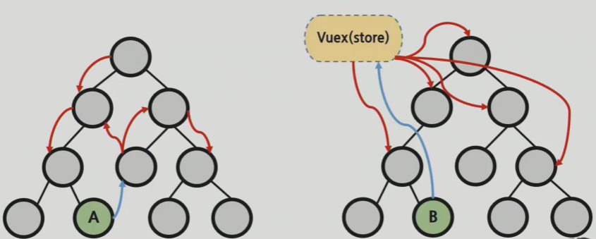
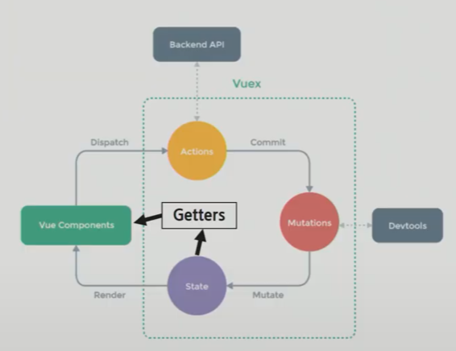

[TOC]


#  Vuex

> 상태 관리 패턴 + 라이브러리
>
> 데이터를 서버에서 조작하면 보여주는건 프론트엔드, 어떻게 유연하게 보여줄지가 초점

**Vuex**

- statement management pattern + library for vue.js
  - <u>상태</u> 관리 패턴 + 라이브러리

- 상태를 <u>전역 저장소</u>로 관리할 수 있도록 지원하는 라이브러리
  - state가 예측 가능한 방식으로만 변경될 수 있도록 보장하는 규칙 설정
  - 애플리케이션의 모든 컴포넌트에 대한 **중앙 집중식 저장소** 역할
- Vue의 공식 devtools와 통합되어 기타 고급 기능을 제공


**state**

> 상태(state)-> 데이터(data)

- state는 <u>data</u>이며 해당 어플리케이션의 핵심이 되는 요소

- 각 컴포넌트에서 관리 (.html의 경우 new Vue (t), SFC에서는 .vue에 해당)
- DOM은 data(state)에 반응하여 DOM을 렌더링

> 중앙집중형태로 데이터를 관리하고자 함


**Pass props & Emit event**

- 각 컴포넌트는 독립적으로 데이터를 관리
- 데이터는 단방향 흐름으로 부모 → 자식 간의 전달만 가능하며 반대의 경우 이벤트를 통해 전달
- 장점
  - 데이터의 흐름을 직관적으로 파악 가능 (오해의 소지가 없다)
- 단점
  - 컴포넌트 중첩이 깊어지는 경우 동위 관계의 컴포넌트로의 데이터 전달이 불편해짐


**in Vuex**



- 중앙 저장소에서 state를 모아놓고 관리
- 규모가 큰 (컴포넌트 중첩이 깊은) 프로젝트에 매우 편리
- 각 컴포넌트에서는 중앙 집중 저장소의 state만 신경쓰면 됨
- 이를 공유하는 다른 컴포넌트는 알아서 동기화


## Vuex core concept

**단방향 데이터 흐름**

> State -> View -> Action -> State - > ...

- 상태(state)는 앱을 작동하는 원본 소스 (data)
- 뷰(view)는 상태의 선언적 매핑
- 액션(action)은 뷰에서 사용자 입력에 대해 반응적으로 상태를 바꾸는 방법 (methods)


**단방향 데이터 흐름의 단점**

- 공통의 상태를 공유하는 여러 컴포넌트가 있는 경우 빠르게 복잡해짐
- 예를 들면, 지나치게 중첩된 컴포넌트를 통과하는 prop


**상태 관리 패턴**

> 트리의 깊이가 중요하지 않게 됨

- 컴포넌트의 공유된 상태를 추출하고 이를 전역에서 관리 하도록 함
- 컴포넌트는 커다란 뷰가 되며 모든 컴포넌트는 트리에 상관없이
  상태에 엑세스 하거나 동작을 트리거 할 수 있음
- 상태 관리 및 특정 규칙 적용과 관련된 개념을 정의하고 분리함으로써
  코드의 구조와 유지 관리 기능 향상


### Vuex 구성 요소

1. State

2. Actions
3. Mutations
4. Getters




#### Vuex 구성 요소 1- State

> state 하나만 변경하면 해당 state를 공유하는 컴포넌트의 DOM이알아서 바뀜

- 중앙에서 관리하는 모든 상태 정보 (data)
- Mutations에 정의된 메서드에 의해 변경
- 여러 컴포넌트 내부에 있는 특정 state를 중앙에서 관리
  - 이전의 방식은 state를 찾기 위해 각 컴포넌트를 직접 확인
  - Vuex를 활용하는 방식은 Vuex Store에서 컴포넌트에서 사용하는 state를 한 눈에 파악 가능
- state가 변화하면 해당 state를 공유하는 컴포넌트의 DOM은 (알아서) 렌더링
- 컴포넌트는 이제 Vuex Store에서 state 정보를 가져와 사용
- **dispatch()**를 사용하여 Actions 내부의 메서드를 호출


#### Vuex 구성 요소 2-Actions

> data를 직접 관리하지는 않는다. 그건 mutations이 한다.
>
> Compopnent -(dispatch)-> Action -(commit)-> Mutations

- Component에서 dispatch() 메서드에 의해 호출
- Backend API와 통신하여 Data Fetching 등의 작업을 수행
  - 동기적인 작업 뿐만 아니라 비동기적인 작업을 포함 가능
- 항상 context가 인자로 넘어옴
  - store.js 파일 내에 있는 모든 요소에 접근해서 속성 접근 & 메서드 호출이 가능
  - 단, (가능하지만) <u>state를 직접 변경하지 않음</u>
- mutations에 정의된 메서드를 commit 메서드로 호출
- state는 오로지 mutations 메서드를 통해서만 조작
  - 명확한 역할 분담을 통해 서비스 규모가 커져도 state를 올바르게 관리하기 위함


#### Vuex 구성 요소 4- Getters

> 상태가 기준.  state를 변경하지 않는다. 그냥 활용
>
> State -> Getters -> Vue Components

- state를 변경하지 않고 활용하여 계산을 수행 (computed와 유사)
  - 실제 계산된 값을 사용하는 것처럼 getters는 저장소의 상태(state)를 기준으로 계산
  - 예를 들어, state에 todo list의 해야 할 일의 목록의 경우 todo가 완료된 목록만
    필터링해서 보여줘야 하는 경우가 있음
  - getters에서 completed의 값이 true인 요소가 필터링 해서 계산된 값을 담아 놓을 수 있음
- getters 자체가 state 자체를 변경하지는 않음
  - state를 특정한 조건에 따라 구분(계산)만 함
  - 즉, 계산된 값을 가져옴


**정리**

- State

  - (중앙에서 관리하는) 모든 데이터(==상태)
  -  data

- Mutations

  - state를 변경하는 로직
  - 동기적인 작업
  - 첫 번째 인자로 항상 state를 받고 commit()을 통해 호출

- Actions

  - state를 직접 변경하지 않고
    mutations에 정의된 메서드를 호출해서 변경
  - 데이터 fetch 및 처리 & 가공, 비동기 작업
  - 첫 번째 인자로 항상 context를 받고
    dispatch()를 통해 mutations의 메서드

- Getters

  - 저장소의 상태를 기준으로 계산해야 하는 값

  - 실제 상태(data)를 변경하지 않음
  - computed와 유사
    

## Todo app with Vuex

### 기초 작업

```bash
$ vue create todo-list-vuex-project
$ cd todo-list-vuex-project
$ vue add vuex
```

https://vuex.vuejs.org/guide/

폴더구조가 바뀜

src/store/index.js/

```js
import Vue from 'vue'
import Vuex from 'vuex'

Vue.use(Vuex)

export default new Vuex.Store({
  state: {
  },
  mutations: {
  },
  actions: {
  },
  modules: {
  }
})
```


- modules: 다섯번째 구성요소. 스토어자체가 커졌을때 모듈화를 위해 사용
- getter: 따로 작성해야


- 필요없는 기본구성 삭제하기

### 컴포넌트 생성 및 연결

- TodoListItem.vue생성

- TodoList.vue 생성

  -  vue기본구조, div, name: 'TodoList',

  - 하위 컴포넌트 불러오고

    - .vue 생략가능

    ```js
    import TodoListItem from '@/components/TodoListItem'
    ```

  - 등록하고

    ```js
    export default {
      name: 'TodoList',
      components: {
        TodoListItem,
      }
    }
    ```

  - 사용하기

    ```html
    <TodoListItem/>
    ```

    

- TodoForm.vue 생성
  - App.vue에 등록 예정
  - 기본 구조만 만들어줌

- App.vue에 TodoForm.vue와 TodoList.vue 등록 

  ```js
  import TodoForm from './components/TodoForm'
  import TodoList from './components/TodoList'
  ```

  ```js
  export default {
    name: 'App',
    components: {
      TodoForm,
      TodoList,
    }
  }
  ```

  ```html
  <TodoForm/>
  <TodoList/>
  ```


- index.js의 state에 샘플 데이터 작성
  ```js
  export default new Vuex.Store({
    state: {
      todos: [
        {
          title: '할 일1',
          completed: false,
        },
        {
          title: '할 일2',
          completed: false,
        }
      ]
    },
    mutations: {
    },
    actions: {
    },
    modules: {
    }
  })
  ```

  

### 데이터 사용해보기 

- TodoLisft.vue

  - 접근: `$store.state.todos`

  ```html
  <TodoListItem v-for="(todo, idx) in $store.state.todos" :key="idx"/>
  ```

- 계산을 해두면 편할 것. computed

  - 접근: `this.$store.state.todos`

  - 그럼 그냥 todos로 바꿀 수 있음

    ```html
    <TodoListItem v-for="(todo, idx) in todos" :key="idx"/>
    ```

  - 데이터 보내기

    - 왼쪽`:todo`이 보내는 데이터의 이름

    ```js
        <TodoListItem
          v-for="(todo, idx) in todos"
          :key="idx"
          :todo="todo"
        />
    ```

- TodoListItem.vue

  - 데이터 받기

    ```vue
    <template>
      <div>
         {{ todo.title }}
      </div>
    </template>
    
    <script>
    export default {
      name:' TodoListItem',
      props: {
        todo: {
          type: Object,
        }
      }
    }
    </script>
    
    <style>
    
    </style>
    ```


### CRUD

> 위에서 read는 함

#### create

- TodoForm.vue

  **폼작성**

  ```html
      <input type="text">
      <button>Add</button>
  ```

  - 모든 데이터를 state에서만 사용하는것은 아님. 

  ```js
  export default {
    name: 'TodoForm',
    data: function () {
      return {
        todoTitle: '',
      }
    }
  }
  ```

  - v-model로 연결

  ```html
  <input type="text" v-model="todoTitle">
  ```

  

  **메서드 작성**

  - 엔터를 치거나 버튼을 누르면

  ```html
      <input type="text" v-model="todoTitle" @keyup.enter="createTodo">
      <button @click="createTodo">Add</button>
  ```

  - 메서드

  ```js
    methods: {
      createTodo: function () {
        console.log('Todo 생성!')
      }
    }
  ```

  

- index.js

  **상태 변경**

  - mutations가 state의 상태를 변경해줘야

  - mutations는 actions이 호출

    

  mutations

  - 왜 upper인지: 데이터를 조작하는 함수들
  - 첫번째 인자는 state
  - 호출하려면 액션도 필요

  ```js
    mutations: {
      CREATE_TODO: function (state) {
        console.log(state)
      }
    },
  ```
  

**직접 호출 해보기**

- Todoform.vue
  - vue의 두번째 탭에서 확인 가능
  - payload: undefined
    - mutation의 create함수에 두번째 인자를 넣지 않았기 때문에 undefined

  ```js
    methods: {
      createTodo: function () {
        this.$store.commit('CREATE_TODO')
      }
    }
  ```

  - 추가하기위한 아이템  넣기
    - 매서드 안에 오브젝트 변수
    - 이제 mutations에서 값을 받을 수 있음
    - 저장되면 input값은 초기화

  ```js
    methods: {
      createTodo: function () {
        const todoItem = {
          title: this.todoTitle,
          completed: false,
        }
        this.$store.commit('CREATE_TODO', todoItem)
        this.todoTitle = ''
      }
    }
  ```

- index.js

  - todoItem으로 두번째 인자로 값을 넣어준다
  - this.state해도 되지만 굳이? state로 시작
  - 콘솔창을 확인해보면 state값이 나옴

  ```js
    mutations: {
      CREATE_TODO: function (state, todoItem) {
        state.todos.push(todoItem)
      }
    },
  ```


**mutation을 호출하는 action**

> action은 외부에 요청을 보내고 response를 받아오면 `res.data.fields`...등 어떤 정보를 받았는지 mutations에 건네주는 것.

- index.js

  - actions에서는 그냥 camelCase를 사용
  - 일단 출력해보자

  ```js
    actions: {
      createTodo: function (context) {
          console.log(context)
      }
    },
  ```

  - action을 호출하기위해서는 commit 필요

- Todoform.vue

  ```js
        this.$store.dispatch('createTodo')
  ```

  - 콘솔창을 보면 아까의 데이터보다 더 많이 들어있고 그 안에 state도 있음
    - 인자가 많은 이유
      - action은 모든 프로퍼티에 대해 조회가 가능하기 때문임.
      - mutations은 상태만 조작하기때문에 상태를 넘겨줬음


**올바른 위치로 옮겨 각각 올바른 역할을 할 수 있도록**

- TodoForm.vue

  - commit직접 호출은 멈추자

    - 해당 내용 삭제

    ```js
    this.$store.commit('CREATE_TODO', todoItem)
    ```

    - action에 두번째 인자로 todoItem을 주자
      - 실제로 vue 컴포넌트 안에서는 dispatch만 사용하게 될 것

    ```js
    this.$store.dispatch('createTodo', todoItem)
    ```

- index.js

  - 액션이 CREATE_TODO를 호출함. mutation으로부터 두번째인자로 todoItem을 받음

  - commit은 action으로 받은 오브젝트에 있음

    - `context.commit(mutation, payload)`로 mutation을 호출 가능
      - context내부에 있는 commit으로 mutation을 호출
    - mutation의 첫번째 인자는 state로 고정이므로 payload값인 todoItem이 두번째 인자로 넘어감.

    ```js
      actions: {
        createTodo: function (context, todoItem) {
            context.commit('CREATE_TODO', todoItem)
        }
      },
    ```

- 현재까지

  - Vue Component(TodoForm) =(Dispatch)=> Actions =(Commit)=> Mutations ==> State(todos) =(Render)=> VueComponent 출력

  

  > 1. 컴포넌트에서 dispatch 를 활용해 actions를 호출
  > 2. action에 정의된 메서드는 commit 을 활용해 mutations를 호출
  > 3. mutations에 정의된 메서드는 state 를 조작한다.


**공백 입력 방지 두가지 방법** 

- Todoform.vue

  - if문으로 확인

    ```js
    if (todoItem.title.trim()) {
        this.$store.dispatch('createTodo', todoItem)
    }
    ```

  - 또는 바인딩 과정에서 trim사용 가능

    ```html
    <input type="text" v-model.trim="todoTitle" @keyup.enter="createTodo">
    ```


**context에서 필요한 값들만 **

- destruturing

  - context를 분해하여 코드에서 context를 생략하고 commit
  - create는 commit만 사용하니까 state에서 commit만 쓰겠다는 뜻
  - state는 안써도 됨 => `{ commit }`

  ```js
  actions: {
      createTodo: function ({ commit, state } todoItem) { // state 안쓰니 제거하는게 좋음
          // context.commit('CREATE_TODO', todoItem)
          commit('CREATE_TODO', todoITem)
      }
  },
  ```


### disructuring

> https://developer.mozilla.org/en-US/docs/Web/JavaScript/Reference/Operators/Destructuring_assignment

disructuring.js

```js
const context = {
  commit: function () {
    console.log('안녕하세요 commit!')
  },
  state: {
    todo: '할 일 1',
  },
  getters: {},
  mutations: {},
}
```

```js
//1. 하나 하나 할당
const commit = context.commit
const state = context.state

console.log(commit()) // 안녕하세요 commit!
console.log(state) // { todo: '할 일 1' }
```

```js
//2. 이름으로 가져온다.
const { commit, state } = context // 비구조화
console.log(commit()) // 안녕하세요 commit!
console.log(state) // { todo: '할 일 1' }
```

```js
// 한 개만 가져와도 됨
const { commit } = context
console.log(commit())
```

- node.js 설치 이후에는 javascript를 직접 실행할 수 있음

```bash
$ node 00_destructuring.js
```


#### delete

- TodoListItem.vue

  ```html
  <span>{{ todo.title }}</span>
  <button>Delete</button>
  ```
  - event에 따른 메서드 

  ```js
       <span>{{ todo.title }}</span>
       <button @click="deleteTodo">Delete</button>
  ```

  - 메서드

  ```js
    methods: {
      deleteTodo: function () {
      console.log('Todo 삭제')
      }
    }
  ```


**실제로 삭제해보기mutation호출을 위한 action**

- index.js

  - mutation호출을 위한 action

  ```js
      deleteTodo: function ({ commit }, todoItem) {
        commit('DELETE_TODO', todoItem)
      }
  ```

  - mutation 틀

  ```js
      DELETE_TODO: function (state, todoItem) {
        console.log(state)
      }
  ```


- TodoListItem.vue

  - 메서드에서 dispatch로 mutation 호출

  ```js
      deleteTodo: function () {
        this.$store.dispatch('deleteTodo', this.todo)
      }
  ```

  - 버튼을 눌러보면 객체가 나옴
    - state인 todos 전체가 들어오는 문제점. 추가처리 필요


**삭제할 todo 찾기**

- index.js

  - mutation 내용

  ```js
      DELETE_TODO: function (state) {
        // 1. todoItem이 첫번째로 만나는 요소의 index를 가져옴
        const index = state.todos.indexOf(todoItem)
        // 2. 해당 인덱스 1개만 삭제하고 나머지 요소를 토대로 새로운 배열 생성
        state.todos.splice(index, 1)
      }
  ```

  `splice()`: 삭제 또는 교체하거나 새 요소를 추가할 수 있음
  배열에서 지정된 요소를 찾을 수 있는 첫번째 인덱스를 반환하고 존재하지않으면 -1을 반환. 리턴이 있음

  

#### update

> 타이틀을 눌렀을 때 취소선이 그어지고 해제되도록

**todo 선택하기**

- TodoListItem.vue

  ```html
  <span @click="updateTodo">{{ todo.title }}</span>
  ```

  - 메서드

  ```js
      updateTodo: function () {
        console.log('수정!')
      }
  ```

  - 액션호출

  ```js
  this.$store.dispatch('updateTodo', this.todo)
  ```

- index.js

  - action 내용

    - 세개 다 destructuring.

    ```js
        updateTodo: function ({ commit }, todoItem) {
          commit('UPDATE_TODO', todoItem)
        },
    ```

  - mutation

    ```js
        UPDATE_TODO: function (state, todoItem) {
          console.log(state) // state 전체
          console.log(todoItem) // 해당 todo
        }
    ```


**취소선 긋기**

- completed속성이 true-false로 토글되어야 함

- 배열을 for문으로 돌면서 점검하고 배열 객체를 반환해야.

  - map이나 foreach사용가능

  ```js
      UPDATE_TODO: function (state, todoItem) {
        state.todos = state.todos.map((todo) => {
          if (todo === todoItem) {
            return { ...todo, completed: !todo.completed }
          }
          return todo
        })
      }
  ```

  - `{ ...todo, completed: !todo.completed }`: spread syntax
    - 그대로 들고와서 completed만 반대로 바꿈


### spread syntex

> https://developer.mozilla.org/ko/docs/Web/JavaScript/Reference/Operators/Spread_syntax

```js
const todoItem = {
  todo: '첫 번째 할 일',
  dueDate: '2020-12-25',
  importance: 'high',
  completed: false
}
// completed 값만 변경한다고 가정
```

```js
//1. 첫 번째 방법
const todoItem = {
  todo: '첫 번째 할 일',
  dueDate: '2020-12-25',
  importance: 'high',
  completed: true
}

console.log(myUpdateTodo)
```

```js
//2. 두 번째 방법
const myUpdateTodo = {
  ...todoItem,
  completed: true
}

console.log(myUpdateTodo2)
```

마지막에 있는 값이 덮어씌워지는 구조.

```bash
$ node 01_spread_syntax.js
{
  todo: '첫 번째 할 일',
  dueDate: '2020-12-25',
  importance: 'high',
  completed: true
}
{
  todo: '첫 번째 할 일',
  dueDate: '2020-12-25',
  importance: 'high',
  completed: true
}
```

- 객체 리터럴에서의 전개

```js
var obj1 = { foo: 'bar', x: 42 };
var obj2 = { foo: 'baz', y: 13 };

var clonedObj = { ...obj1 };
// Object { foo: "bar", x: 42 }

var mergedObj = { ...obj1, ...obj2 };
// Object { foo: "baz", x: 42, y: 13 }
```


**스코프 스타일 만들기**

```js
<style scoped>
  .completed {
    text-decoration: line-through;
  }
</style>
```

- 적용하기
  - completed가 true면 class가 부여된다

```js
     <span 
      @click="updateTodo"
      :class="{ completed: todo.completed }"
    >{{ todo.title }}</span>
```


### Getters : 진행 / 완료된 투두 개수

- index.js
  - 모듈 위에 작성
  - mutate와 마찬가지로 state도 첫번째에 인자가 옴.
    - 기준으로 state를 가지고 다른 연산을 하기 때문
  - completed가 true인 개수를 count한다던가 다른 방법도 있음.

  ```js
    getters: {
      completedTodosCount: function (state) {
        return state.todos.filter((todo) => {
          return todo.completed === true
        }).length
      }
    },
  ```

- App.vue

  ```html
  <h2>Completed Todo: {{ completedTodosCount }}</h2>
  ```

  - 바로 쓸 수 없고 계산된 값을 가져와야

  ```js
    computed: {
      completedTodosCount: function () {
        return this.$store.getters.completedTodosCount
      }
    }
  ```

  반복되는 느낌이 들지만 나중엔 없어질 것.


투두 앱 구현보다 store설정을 위해서 작성하는 코드가 더 많아짐

작은 규모의 앱은 vue로, 큰 규모일때 vuex일 때 유용

초기 코스트가 많이 들어감

> Flux 라이브러리는 안경과 같습니다. 필요할 때 알아볼 수 있습니다.


> 실습

```js
$ vue add vuex
```


homework

F 필요할 때 중앙관리를 사용. 반드시는 아님

T mutation이 사용되는 이유

F mutations - commit / action - dispatch

T


mutation과 action은 역할이 다르고, mutation은 state를 조작하기 위해 만들어졌다.

mutation은 state를 수정하기 위한 것.

action은 mutation을 동작시키기 위한 것이다.

mutation은 동기적으로만 동작하고

action은 동기, 비동기 모두 가능하다.


