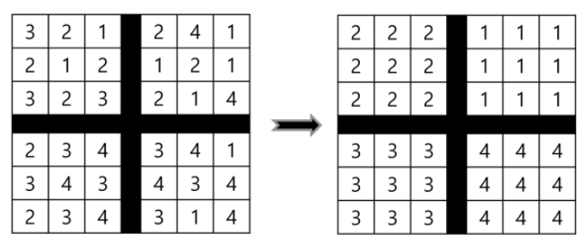
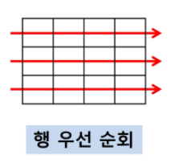
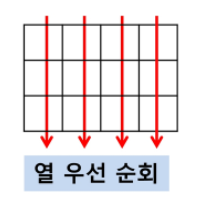
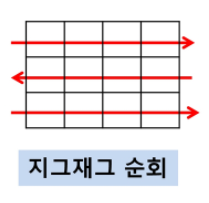
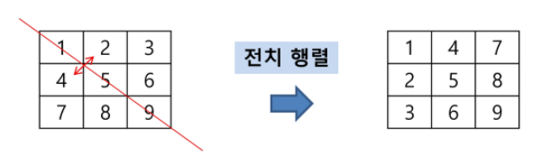

# 배열 : 2차 배열

### 2차원 배열의 선언

- 1차원 List를 묶어놓은 List
- 2차원 이상의 다차원 List는 차원에 따라 Index를 선언
- 2차원 List의 선언: 세로길이(행의 개수), 가로길이(열의 개수)를 필요로 함
- Python 에서는 데이터 초기화를 통해 변수선언과 초기화가 가능함 (arr = [[0,1,2],[3,4,5]])

- 예시 : 숫자 퍼즐

  규칙 : 중앙의 선을 기준으로 대칭인 위치에 있는 원소와 교환 가능
  이 규칙을 이용해 퍼즐을 오른쪽 그림처럼 만들어 보자.

  

<br>

### 2차원 배열의 접근

배열 순회 : n X m 배열의 n*m 개의 모든 원소를 빠짐없이 조사하는 방법

<br>

> ####  행 우선 순회



```python
# i 행
# j 열
for i in range(len(Array)):
    for j in range(len(Array[i])):
        Array[i][j] # 필요한 연산 수행
```

<br>

> ####  열 우선 순회



```python
# i 행
# j 열

for j in range(len(Array[0])): # Array[0]이나 [N-1]이나 같음
    for i in range(len(Array)):
        Array[i][j] # 필요한 연산 수행
```

<br>

> ####  지그재그 순회



```python
# i 행
# j 열

for i in range(len(Array)):
    for j in range(len(Array[0])): # 여기까진 행 우선 순회와 같음
        Array[i][j + (m-1-2*j)*(i%2)]
        # i%2 -> 홀수행(인덱스가짝수)이면 0이 됨.
        # 짝수행(인덱스가홀수)이면 i%2는 1이 되고 m-1-2*j가 반영됨.
        # j + (m-1-2*j) = m-1 -j 즉 끝에서 j만큼 앞으로 오라는 것.
```

<br>

> ####  델타를 이용한 2차 배열 탐색

*방향키처럼, 게임처럼 한칸한칸 움직이기*

- 2차 배열의 한 좌표에서 4방향의 인접 배열 요소를 탐색하는 방법

```python
# i 행
# j 열
arr[0...n-1][0...n-1]
dx[] <- [0, 0, -1, 1] # 상하좌우
dy[] <- [-1, 1, 0, 0]

for x in range(len(arr)):
    for y in range(len(arr[x])):
        for i in range(4):
            testX <- x + dx[i]
            testY <- y + dy[i]
            test(arr[testX][textY]) # 인접 배열 요소 확인 가능
```

<br>

> ####  전치 행렬



```python
# i 행
# j 열
arr = [[1,2,3],[4,5,6],[7,8,9]]
for i in range(3):
    for j in range(3):
        if i < j: # 우하향 대각선을 기준으로 오른쪽 위만 해당
            arr[i][j], arr[j][i] = arr[j][i]
```


# 부분집합 생성

### T2

> ####  T3

**bold**: 

<br>

# 바이너리 서치(Binary Search)

### T2

> ####  T3

**bold**: 

<br>

# 셀렉션 알고리즘(Selection Algorithm)

### T2

> ####  T3

**bold**: 

<br>

# 선택 정렬(Selection Sort)

### T2

> ####  T3

**bold**: 

<br>

# 실습 1, 2

### T2

> ####  T3

**bold**: 

<br>

> ### 알아두기

*****

**bold title**

