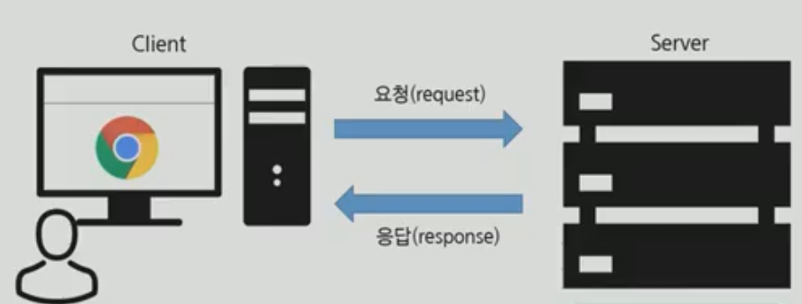
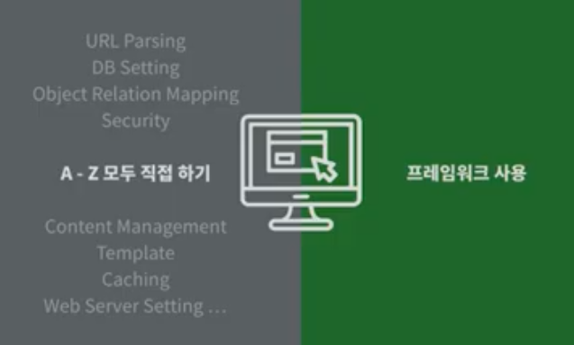

[TOC]

# Django01_intro

**Django**

- Static Web : 미리 저장된 정적파일(HTML, CSS, JS)을 제공

- Dynamic Web

  - Client-side : HTML, CSS, JS
  - Server-side : JSP, SQL, PHP

- 우리가 알고 있는 웹의 프로토콜

  

<br>

**web framework**

- 웹 페이지를 개발하는 과정에서 겪는 어려움을 줄이는 것이 주 목적.

- 통상 데이터베이스 연동, 템플릿 형태의 표준, 세션 관리, 코드 재사용 등의 기능을 포함하고 있다.



- 파이썬으로 작성된 오픈소스 웹 어플리케이션 프레임워크로, 모델-뷰-컨트롤러 모델 패턴을 따르고 있다.

<br>

**모델 - 뷰- 컨트롤러Model-View-Controller, MVC)**

- 장고는 MVT

|                     | MVC        | django(MVT)  |
| ------------------- | ---------- | ------------ |
| 데이터베이스 관리   | Model      | **M**odel    |
| 레이아웃(화면)      | View       | **T**emplate |
| 중심 컨트롤러(심장) | Controller | **V**iew     |

<br>

---

<br>

## Intro

> 1. python version 3.8 확인
> 2. vscode django extension 설치 및 설정 확인

**설치**

```bash
$ pip install django
```

- 특정 버전 설치

  ```bash
  $ pip install django==x.x.x
  ```

- 설치 확인

  ```bash
  $ pip list
  # python -m django --version
  ```

<br>

**프로젝트 생성**

> [주의]
>
> project 를 생성할 때, Python 이나 Django 에서 사용중인 이름은 피해야 한다. 
>
> `-` 도 사용할 수 없다. (ex. django, test, class, django-test...)

1. 기본적으로  폴더를 만들고 그 안에 생성하는 구조

```bash
$ django-admin startproject <프로젝트명>
```

2. 폴더 생성 없이 현재 경로에 생성

```bash
$ django-admin startproject <프로젝트명> .
```

- `django-admin` : 프로젝트 생성 시 사용
  `python manage.py` : 그 이외 사용

<br>

**프로젝트 구조**

- `__init__.py`
  - 빈 파일
  - Python에게 이 디렉토리를 하나의 Python 패키지로 다루도록 지시 `DON'T TOUCH`
- `settings.py`
  - 웹사이트의 모든 설정을 포함
  - 우리가 만드는 어떤 application이라도 등록이 되는 곳이며, static files의 위치, database 세부 설정, 보안 관련 설정 등이 작성
  - `LANGUAGE_CODE = 'en-us'`, `LANGUAGE_CODE = 'ko-kr'`
    `TIME_ZONE = 'Asia/Seoul'`
    - 언어, 시간대 수정
  - `DEBUG = True`
    - 디버그 모드,  배포 시 False로 변경해야 함
  - `AUTH_PASSWORD_VALIDATORS`
    - 비밀번호 길이가 너무 짧은지, id와 유사한지, 숫자로만 이뤄져있는지 등등을 검증
- `urls.py`
  - 사이트의 url와 view의 연결을 지정
  - 사용자 요청을 가장 먼저 받아들이는 곳.
- `wsgi.py`
  - Web Server Gateway Interface
  - 장고 어플리케이션이 웹서버와 연결 및 소통하는 것을 도움 (배포)
- `asgi.py`
  - new in 3.0
  - Asynchronous Server Gateway Interface
  - 장고 어플리케이션이 비동기식 웹 서버와 연결 및 소통하는 것을 도움

<br>**서버 실행**

- 기본 실행

  ```bash
  $ python manage.py runserver
  ```

  - vs code 터미널에서 입력 - 주소 클릭해서 확인
  - 기본적으로 내부 IP의 8000번 포트로 개발 서버를 띄움

- 포트 바꾸기

  ```bash
  $ python manage.py runserver 8080
  ```

  - **접속 포트**
    - 127.0.0.1:8000 == localhost:8000 : local 환경을 뜻하며, 8000은 8000번 포트로 접속하겠다는 의미.

    - 다른 프로젝트로 인해 8000번 포트를 사용중이라면, 포트번호를 바꿔 실행할 수 있다

    - `python manage.py runsever <사용하려는 포트번호>`

- 서버 IP 바꾸기

  ```bash
  $ python manage.py runserver 0:8000
  ```

- 같은 네트워크를 공유하고 있는 다른 컴퓨터에서 접속하고 싶을 때
  - IP 주소를 0:으로 해주고, `settings.py` 파일에 `ALLOWED_HOST=['*']`를 해주면 된다!
  - 각 컴퓨터에 부여된 ip주소를 작성하고, 뒤에 포트까지 붙여주면 접속할 수 있다
  
- IP 주소 확인 방법 (윈도우 - ipconfig / 리눅스 - ifconfig) 
  - 예를 들어 IP 주소가 1.2.3.4라면 주소창에 1.2.3.4:8000 을 작성해주면 같은 네트워크를 공유하고 있는 다른 컴퓨터도 해당 서버에 접속 할 수 있게 된다
  - https://ychae-leah.tistory.com/137
  
- - 

<br>

**Application 생성**

```bash
$ python manage.py startapp articles
```

- **App 생성(startapp)후 INSTALLED_APPS에 등록할 것**

<br>

**Application 등록**

> 반드시 **app 생성 후 등록** 순서를 지켜야한다.

- 방금 생성한 app을 사용하려면 프로젝트에 등록 해야 한다.

  ```python
  # settings.py
  
  INSTALLED_APPS = [
  	'articles',
      'django.contrib.admin',
      'django.contrib.auth',
      'django.contrib.contenttypes',
      'django.contrib.sessions',
      'django.contrib.messages',
      'django.contrib.staticfiles',
  ]
  ```

  - 미리 등록되어 있는 것들은 장고 내장 어플

  > INSTALLED_APPS의 app order
  >
  > ```python
  > INSTALLED_APPS = [
  >  # Local apps
  >  'blogs',
  > 
  >  # Third party apps
  >  'haystack',
  > 
  >  # Django apps
  >  'django.contrib.admin',
  >  'django.contrib.auth',
  >  'django.contrib.contenttypes',
  >  'django.contrib.sessions',
  >  'django.contrib.sites',
  > ]
  > ```

<br>

**Application (app)**

- 실제로 어떠한 역할을 해주는 친구가 app.
- 프로젝트는 이러한 app의 집합이고, 실제 요청을 처리하고 페이지를 보여주고 하는 것들은 이 app의 역할.
- 하나의 프로젝트는 여러 개의 app을 가질 수 있다.
  - app은 하나의 역할 및 기능 단위로 쪼개는 것이 일반적
  - 그러나 작은 규모의 서비스에서는 잘 나누지 않으며 반드시 이렇게 나눠야 한다 같은 기준 또한 없다.
- **일반적으로 app 이름은 `복수형`으로 작성 하는 것을 권장한다.**
  - 추후 변수와 헷갈리는 것을 방지하기 위해서다.

<br>

**Application 구조**

- `admin.py`
  - 관리자용 페이지 관련 기능을 작성 하는 곳.
- `apps.py`
  - 앱의 정보가 있는 곳. 
  - 우리는 수정할 일이 없다.
- `models.py`
  - **MVT의 M**
  - 앱에서 사용하는 Model(Database)를 정의하는 곳.
- `tests.py`
  - 테스트 코드를 작성하는 곳.
- `views.py`
  - **MVT의 V**
  - view가 정의 되는 곳. 
- templates 폴더(생성)
  - 각 App 이름으로 만들어진 폴더 내에 HTML 파일들을 생성


**MTV 패턴**


**model**

- 응용프로그램의 데이터 구조를 정의하고 데이터베이스의 기록을 관리(추가, 수정, 삭제)

**template**

- 파일의 구조나 레이아웃을 정의
- 실제 내용을 보여주는 데 사용 (presentation)

**view**

- HTTP 요청을 수신하고 HTTP 응답을 반환
- Model을 통해 요청을 충족시키는데 필요한 데이터에 접근
- 그리고 탬플릿에게 응답의 서식 설정을 맡김

<br>

**.py 3대장 기억하기**

- `urls.py` : 주소(URL) 관리
- `views.py` : 페이지 관리 (페이지 하나 당, 하나의 함수)
- `models.py` : 데이터베이스 관리

<br>

**Internationalization**

> https://docs.djangoproject.com/en/3.1/topics/i18n/
>
> http://www.i18nguy.com/unicode/language-identifiers.html
>
> https://en.wikipedia.org/wiki/List_of_tz_database_time_zones

```python
# settings.py

LANGUAGE_CODE = 'ko-kr'

TIME_ZONE = 'Asia/Seoul'
```

<br>

`runserver` **Automatic reloading**

- 개발 서버는 요청이 들어올 때마다(코드가 저장될 때 마다) 자동으로 Python 코드를 다시 불러온다. 
- 코드의 변경사항을 반영하기 위해서 굳이 서버를 재가동 하지 않아도 된다. 
- 그러나, 파일을 추가하는 등의 몇몇의 동작(커스텀 필터, 새로운 모듈 추가 등)은 개발 서버가 자동으로 인식하지 못하기 때문에, 이런 상황에서는 서버를 재가동 해야 적용되는 경우도 있다.

<br>

---

<br>

### 요청과 응답

**urls.py**

- 장고 서버로 요청(request)이 들어오면, 그 요청이 어디로 가야하는지 인식하고 관련된 함수(view)로 넘겨준다.

- `views.py` 에서 만든 함수를 연결시켜준다.

  ```python
  # first_project/urls.py
  
  from django.contrib import admin
  from django.urls import path
  from articles import views
  
  urlpatterns = [
      path('admin/', admin.site.urls),
      path('index/', views.index),
  ]
  ```

  - `from articles import views` 
    - 어플패키지에서 views 가져오기
      - 패키지와 모듈처럼 함수 가져오기 가능
  - urlpatterns = [ `path('admin/', admin.site.urls),`
    - urlpatterns에서 path함수로 이동하고자 하는 url 작성
      - urlpatterns : 출입구. 어디로 가는지 그 이정표는 path가 기능
        - path함수를 통해 주소패턴 추가 가능. 주소 뒤에 엔드슬래시(/)필요
        - 주어진 주소 뒤에 붙일 수 있음.
  - `index/` 
    - 엔드슬래시(/)
      - 구글에 django url append_slash 검색 -> 끌 수는 있지만 권장하지 않음
    - 메인페이지는 일반적으로 index라고 한다
  - `admin/`
  - - 제공되는 프레임워크가 드뭄. 굉장히 편리한 기능.

<br>

**views.py**

- HTTP 요청을 수신하고 HTTP 응답을 반환하는 함수 작성
- Model을 통해 요청에 맞는 필요 데이터에 접근
- tempate에게 HTTP 응답 서식을 맡김

```python
# articles/views.py

def index(request): # 첫번째 인자는 반드시 request
    return render(request, 'index.html') # render의 첫번째 인자도 반드시 request
```

- render : 잘 포장해서 보여주는 것. 
  render라는 함수를 실행한 결과물을 보내줌. response 객체, HTML

- 템플릿 경로

  - render의 첫번재는 request, 두번째 인자는 템플릿 경로.
  - 템플릿 경로 작성 시에 장고가 템플릿까지는 인식함.  그래서 `index.html`만 쓰면 됨.

- context

  ```python
  def greeting(request):
      foods = ['apple', 'banana', 'coconut',]
      info = {
          'name' : 'Harry'
      }
      # key-value 값을 맞춰주는 게 좋음
      context = {
          'info' : 'info',
          'foods' : foods,
      }
      return render(request, 'greeting.html', context,)
      # 딕셔너리 형태로 데이터가 템플릿에 붙음
  ```
  - 뒤의 cath & throw에서 다룸

<br>

**Templates**

- `views.py`에서 지정한 `index.html` 파일을 만들자.

- 반드시 `templates`로 생성해야 인식된다.

- Django에서 template이라고 부르는 HTML 파일은 기본적으로 **app 폴더안의 templates 폴더 안에 위치**한다. 

- 구분을 위해 app이름의 폴더를 내부에 생성한다.
  결과적으로 **app 폴더 안의 templates 폴더 안의 app 폴더** 안에 html 파일을 둔다.

  ```html
  <!-- articles/templates/articles/index.html -->
  
  <h1>만나서 반갑습니다!</h1>
  
  <h1>안녕하세요. 저는 {{ name }} 입니다.</h1>
  ```

  - 변수 사용하기 (띄어쓰기 권장)

<br>

---

<br>

## Template

> https://docs.djangoproject.com/en/3.1/topics/templates/#module-django.template
>
> 데이터 표현을 제어하는 도구이자 표현에 관련된 로직

<br>

### Django template language

> https://docs.djangoproject.com/en/3.1/ref/templates/language/
>
> https://docs.djangoproject.com/ko/3.1/ref/templates/builtins/#built-in-template-tags-and-filters

- django template에서 사용하는 built-in template system
- 조건, 반복, 변수 치환, 필터 등의 기능을 제공
- Django 템플릿 시스템은 단순히 Python이 HTML에 포함 된 것이 아님
  - 프로그래밍적 로직이 아니라 프레젠테이션을 표현하기 위한 것
- 파이썬처럼 일부 프로그래밍 구조(if, for 등)를 사용할 수 있지만 이건 해당 Python 코드로 실행되는 것이 아님

<br>

**DTL Syntax**

templates 내의 html파일에서 사용

- render()를 사용하여 views.py에서 정의한 변수를 template 파일로 넘겨 사용하는 것

1. variables

- `{{ variables }}`
- 변수명은 영,숫자와 밑줄(_)의 조합으로 구성될 수 있으나 밑줄로는 시작 할 수 없음
- 변수명에 공백이나 구두점 문자를 사용할 수 없음
- `dot(.)`를 사용하여 변수 속성에 접근
- render()의 세번째 인자 context로 {'key' : value}와 같이 딕셔너리 형태로 넘겨주며, 여기서 정의한 key에 해당하는 문자열이 template에서 사용 가능한 변수명이 됨

<br>

2. Filters

- `{{ variable|filter }}`
- 표시할 변수를 수정
- 파이프(|)를 사용하여 적용
- 60개의 built-in template filters를 제공
  - **공식문서**:  https://docs.djangoproject.com/en/3.1/ref/templates/builtins/
- chained가 가능하며 일부 필터는 인자를 받기도 함(콜론으로 인자를 받음)
- `{{ name|lower }}` : name 변수를 모두 소문자로 출력
- `{{ variable|truncatewords:30}}` : 출력을 30자까지만 한다.

<br>

3. Tags

- ``
- 출력 테스트를 만들거나 반복 또는 논리를 수행하여 제어 흐름을 만드는 등 보다 복잡한 일들을 수행
- 일부 태그는 시작과 종료 태그가 필요(`` ... ``)

<br>

4. Comments

- `{# lorem #}`
- django template에서 줄의 주석을 표현하기 위해 사용
- 아래처럼 유효하지 않은 템플릿 코드가 포함될 수 있음
  - `{# text #}`
- 한 줄 주석에만 사용할 수 있음(줄 바꿈이 허용되지 않음)
- 여러 줄 주석은 와 사이에 입력

<br>

+. 반복문

자동완성 ex)`for`만 치고 엔터

```django

	<li>{{ foods }}</li>

```

<br>

### Template inheritance

> https://docs.python.org/ko/3.9/library/pathlib.html#module-pathlib

- 템플릿 상속은 기본적으로 코드의 재사용성에 초점을 맞춤

- 템플릿 상속을 사용하면 사이트의 모든 공통 요소를 포함하고, 하위 템플릿이 재정의(override) 할 수있는 블록을 정의하는 기본 “skeleton” 템플릿을 만들 수 있음

  ```python
  # settings.py
  
  TEMPLATES = [
      {
          ...,
          'DIRS': [BASE_DIR / 'firstpjt' / 'templates'],
  ...
  ]
  ```

  - `app_name/templates` 디렉토리 외 추가 경로 설정

<br>

**`` tag**

- 자식(하위)템플릿이 부모 템플릿을 확장한다는 것을 알림
- 반드시 템플릿 최상단에 위치해야 함(== 템플릿의 첫번째 템플릿 태그여야 함)
  - 즉, 2개 이상 사용할 수 없음

<br>

**`` tag**

- 하위 템플릿에서 재지정(overriden)할 수 있는 블록을 정의

- 하위 템플릿이 채울 수 있는 공간

- 가독성을 높이기 위해 선택적으로 `` 태그에 이름 지정

- 사실상 두번써야함. 부모 템플릿과, 자식 템플릿에서.

  ```django
  
  
  ```

<br>

> 상속 실습

1. 프로젝트 내 `templates`와 `base.html `생성

   - firstpjt>firstpjt>templates>base.html

   - django가 찾고있는 파일은 오직 App 내의 templates 파일뿐이므로 프로젝트폴더 안에 바로 있는 templates폴더(1번에서 만듬)도 경로로 등록해주어야 함

   - 경로 등록

     - setting.py - TEMPLATES - 'DIRS': [`BASE_DIR / 'firstpjt' / 'templates'`]

     ```python
     TEMPLATES = [
         {
             'BACKEND': 'django.template.backends.django.DjangoTemplates',
             'DIRS': [BASE_DIR / 'firstpjt' / 'templates'],
             'APP_DIRS': True,
             'OPTIONS': {
     .
     .
     ```

     - ` 'APP_DIRS': True,` : 앱 경로 안에 Templates 폴더까지는 경로로 알고 있다는 것
     - `'DIRS': [],` : 이 곳에 새롭게 경로 등록해주기. app이외에 pjt의 templates폴더를 알려줘야!
     - `'DIRS': [BASE_DIR / 'firstpjt' / 'templates'],` : 파이썬의 pathlib. 객체지향 파일시스템 경로

2. 부모 html

   - `  `
   - css, js 가져오기

   ```html
   // 부모 html
   <!DOCTYPE html>
   <html lang="en">
   <head>
     <meta charset="UTF-8">
     <meta http-equiv="X-UA-Compatible" content="IE=edge">
     <meta name="viewport" content="width=device-width, initial-scale=1.0">
     <title>Document</title>
     <link href="https://cdn.jsdelivr.net/npm/bootstrap@5.0.0-beta2/dist/css/bootstrap.min.css" rel="stylesheet" integrity="sha384-BmbxuPwQa2lc/FVzBcNJ7UAyJxM6wuqIj61tLrc4wSX0szH/Ev+nYRRuWlolflfl" crossorigin="anonymous">
   </head>
   <body>
     // navbar 위치 자리
       
     <div class="container">
     
     
     </div>
     <script src="https://cdn.jsdelivr.net/npm/bootstrap@5.0.0-beta2/dist/js/bootstrap.bundle.min.js" integrity="sha384-b5kHyXgcpbZJO/tY9Ul7kGkf1S0CWuKcCD38l8YkeH8z8QjE0GmW1gYU5S9FOnJ0" crossorigin="anonymous"></script>
   </body>
   </html>
   ```

3. 자식 html

   - 최상단에 ``
     - 자식 템플릿이 부모 템플릿을 확장한다는 것을 명시
   - `  `
     - 새롭게 확장할 영역을 block 태그로 감싼다

   ```html
   // 자식 html
   
   
   
     <h1>s내용</h1>
   
   ```

<br>

**Template system**

>- Django template system (feat.django 설계 철학)
>
>*template에서 for문, if문 등을 사용할 수 있다보니 모든 것을 template에서 해결하려고 할 수 있지만, template은 오직 표현만 담당해야하고 로직은 view에서 작성해야 한다.*
>
>https://docs.djangoproject.com/ko/3.1/misc/design-philosophies/#template-system

1. 표현과 로직(view)을 분리

- 우리는 템플릿 시스템이 표현을 제어하는 도구이자 표현에 관련된 로직일 뿐이라고 봅니다. 
- 템플릿 시스템은 이러한 기본 목표를 넘어서는 기능을 지원하지 말아야 합니다.

2. 중복을 배제

- 대다수의 동적 웹사이트는 공통 헤더, 푸터, 네이게이션 바 같은 사이트 공통 디자인을 갖습니다. 
- Django 템플릿 시스템은 이러한 요소를 한 곳에 저장하기 쉽게 하여 중복 코드를 없애야 합니다. 

<br>

## HTML Form

> 데이터를 받고 전송.

<br>

**HTML `<form>` element**

- 웹에서 사용자 정보를 입력하는 여러 방식(text, button, checkbox, file, hidden, image, password, radio, reset, submit)을 제공하고, 사용자로부터 할당된 데이터를 서버로 전송하는 역할을 담당
- 핵심 속성
  - action : 입력 데이터가 전송될 URL 지정
  - method : 입력 데이터 전달 방식 지정

<br>

**HTML `<input>` element**

- 사용자로부터 데이터를 입력 받기 위해 사용
- `type` 속성에 따라 동작 방식이 달라짐
- 핵심 속성
  - **name**
    - 데이터의 키 역할을 함 
    - input 안에 name="q"라면 `q=검색어`의 형태로 정보가 넘어감 
      `https://www.google.com/search?q=삼성`
  - 중복 가능, 양식을 제출했을 때 name이라는 이름에 설정된 값을 넘겨서 값을 가져올 수 있음
  - 주요 용도는 GET/POST 방식으로 서버에 전달하는 파라미터(name 은 key , value 는 value)로 `?key=value&key=value` 형태로 전달

<br>

### HTTP request methods

**HTTP**

> HyperText Transfer Protocol

- HTML 문서와 같은 리소스들을 가져올 수 있도록 해주는 프로토콜(규칙, 규약)
- 웹에서 이루어지는 모든 데이터 교환의 기초
- HTTP는 주어진 리소스가 수행 할 원하는 작업을 나타내는 request methods를 정의
- HTTP request method 종류
  - GET, POST, PUT, DELETE ...
    - **get - data에 손을 대지는 않음. 정보를 조회** 
    - post - 작성, 데이터 조작
    - put - 수정
    - delete - 삭제
- HTTPS? 
  - secure이 붙은 것. 강화된 버전이라고 생각하면 됨

<br>

**GET**

- 서버로부터 **정보를 조회**하는 데 사용
- 데이터를 가져올 때만 사용해야 함
- 데이터를 서버로 전송할 때 body가 아닌 **Query String Parameters**(URL!!!!)를 통해 전송
- 우리는 서버에 요청을 하면 HTML 문서 파일 한 장을 받는데 이때 사용하는 요청의 방식이 GET

<br>

**throw & catch**

*Views에 함수로 정의할 view는 두개가 필요하다.*

1. *view 데이터 받을 Template를 출력*
2. *view 보내진 데이터 받는 view*

*즉 view도 두 개, template도 두 개가 필요함*

- throw

  ```python
  # first_project/urls.py
  
  path('throw/', views.throw),
  ```

  ```python
  # articles/views.py 
  # 입력받을 html로 보내는 view 정의
  def throw(request):
      return render(request, 'throw.html')
  ```

  ```html
  <!-- articles/templates/throw.html -->
  
  <form action="/catch/" method="GET">
    <label for="message">Throw</label>
    <input type="text" id="message" name="message">
    <input type="submit">
  </form>
  ```

  - action은 view에 함수가 있어야 하지만 미리 작성

  - 라벨은 id값과 연결됨

    key값을 통해 data인 value를 가져오기 때문에 `name = "message"` 반드시 필요!

    '데이터'를 입력하고 제출을 누르면 주소의 끝이` /?message=데이터#` 로 변화

- catch

  ```python
  # first_project/urls.py
  
  path('catch/', views.catch),
  ```

  ```python
  # articles/views.py
  
  def catch(request):
      message = request.GET.get('message')
      context = {
          'message': message,
      }
      return render(request, 'catch.html', context)
  ```

  - `message = request.GET.get('message')` 뜯어보기
    - request 항목안의 요소 : USER, GET, POST, FILES, COOKIES, META. 보통 원하는 것은 GET에 있음

      -> request.GET 프린트해보면

      ```python
      <QueryDict: {'message': ['안녕하세요!!!']}
      ```

       -> Dict의 형태. 여기서 key에 접근해서 value를 가져와야 함.

  ```django
  <!-- articles/templates/catch.html -->
  
  <h1>너가 던져서 내가 받은건 {{ message }}야!</h1>
  <a href="/throw/">뒤로</a>
  ```


<br>

**Request object** 

> https://docs.djangoproject.com/en/3.1/ref/request-response/#module-django.http

- 요청 간의 모든 정보를 담고 있는 변수
- 페이지가 요청되면 Django는 요청에 대한 메타 데이터를 포함하는 `HttpRequest` 객체를 만들고
- 그런 다음 Django는 적절한 view 함수를 로드하고 `HttpRequest`를 뷰 함수의 첫 번째 인수로 전달. 
- 그리고 각 view는 `HttpResponse` 개체를 반환한다.

<br>

---

<br>

## URLs

> - Dispatcher (발송자, 운항 관리자)로서의 URL
> - 웹 애플리케이션은 URL을 통한 클라이언트의 요청에서부터 시작됨

<br>

### Variable routing

> <>

- 동적 라우팅
  - 주소 자체를 변수처럼 사용해서 동적으로 주소를 만드는 것

```python
# urls.py

urlpatterns = [
    ...,
    # path('hello/<name>/', views.hello),
    path('hello/<str:name>/', views.hello),
]
```

```python
# views.py

def hello(request, name):
    context = {
        'name': name,
    }
    return render(request, 'hello.html', context)
```

```django
<!-- hello.html -->




  <h1>만나서 반가워요 {{ name }}님!</h1>

```

<br>

### App URL mapping

> *project - urls.py가 다 감당하기엔 너무 힘들 거란 말이지...? 각자 자기의 url을 가지도록 하자.*
>
> app의 view함수가 많아지면서 사용하는 path() 또한 많아지고, app 또한 더 작성되기 때문에
> projects의 urls.py에서 모두 관리하는 것은 코드 유지보수에 좋지 않음
>
> 하나의 프로젝트의 여러 앱이 존재한다면, 각각의 앱 안에 urls.py을 만들고 프로젝트 urls.py에서 각 앱의 urls.py 파일로 URL 매핑을 위탁하게 가능

**두번째 app 생성 및 등록**

```bash
$ python manage.py startapp pages
```

```python
INSTALLED_APPS = [
    'articles',
    'pages',
    ...,
]
```

<br>

- 문제가 발생하는 지점

  ```python
  from django.contrib import admin
  from django.urls import path
  from articles import views
  from pages import views #추가?
  ```

  여기서 문제 발생 ->  이미 App articles가 views로 작성 중이었음

  - 따라서 이렇게 덧붙여주는 방법? 

  ```python
  from articles import views as article_views
  from pages import views as page_views
  ```

  아래도 다 수정해야해서 매우 번거로움.

```python
# pjt - urls.py
from django.contrib import admin
from django.urls import path, include # include 추가

urlpatterns = [
    path('admin/', admin.site.urls), # 어드민만 남음
    path('articles/', include('articles.urls')),
    path('pages/', include('pages.urls')),    
]
```

```python
# articles/urls.py

from django.urls import path
from . import views 

app_name = 'articles'

urlpatterns = [
    path('index/', views.index, name='index'),
    path('greeting/', views.greeting, name='greeting'),
    path('dinner/', views.dinner, name='dinner'),
    path('throw/', views.throw, name='throw'),
    path('catch/', views.catch, name='catch'),
    path('hello/<str:name>/', views.hello, name='hello'),
]
```

- `from . import views` : 첫번째 폴더에 있는 views를 들고 와.
- name은 원래 이름과 같게 설정하는 것이 보편적.

```python
# pages/urls.py

from django.urls import path
from . import views 

app_name = 'pages'

urlpatterns = [
    path('index/', views.index, name = 'index')
]
```

> [주의] urlpatterns list가 없는 경우 에러가 발생한다.

- django는 명시적 상대경로(`from .module import ..`)를 권장한다.

<br>

### Including other URLconfs

```python
# firstpjt/urls.py

from django.contrib import admin
from django.urls import path, include


urlpatterns = [
    path('admin/', admin.site.urls),
    path('articles/', include('articles.urls')),
    path('pages/', include('pages.urls')),
]
```

<br>

`include()`

> `include('앱이름.urls')`~/articles/ 이렇게 접근하면 articles(urls.py)로 보낸다.

- 다른 URLconf(app1/urls.py)들을 참조할 수 있도록 도움
- 함수 include()를 만나게 되면, URL의 그 시점까지 일치하는 부분을 잘라내고, 남은 문자열 부분을 후속 처리를 위해 include된 URLconf로 전달

<br>

### Naming URL patterns

- Django는 URL에 이름을 지정하는 방법을 제공하므로써 뷰 함수와 템플릿에서 특정 주소를 쉽게 참조할 수 있도록 도움

```python
# articles/urls.py

urlpatterns = [
    path('index/', views.index, name='index'),
    path('greeting/', views.greeting, name='greeting'),
    path('dinner/', views.dinner, name='dinner'),
    path('throw/', views.throw, name='throw'),
    path('catch/', views.catch, name='catch'),
    path('hello/<str:name>/', views.hello, name='hello'),
]
```

<br>

**url tag 사용하기**

```django
<!-- index.html -->




  <h1>만나서 반가워요!</h1>
  <a href="">greeting</a>
  <a href="">dinner</a>
  <a href="">throw</a>

```

<br>

`{$ url '' %}`

- 주어진 URL 패턴 이름 및 선택적 매개 변수와 일치하는 절대 경로 주소를 반환
- 템플릿에 URL을 하드 코딩하지 않고도 DRY 원칙을 위반하지 않고 링크를 출력하는 방법

<br>

---

## Namespace

> 개체를 구분할 수 있는 범위를 나타내는 namespace

**두번째 app의 index 페이지 작성**

```python
# pages/urls.py

from django.urls import path
from . import views 


urlpatterns = [
    path('index/', views.index, name='index'),
]
```

```python
# pages/views.py

def index(request):
    return render(request, 'index.html')
```

```django
<!-- pages/templates/index.html -->




  <h1>두번째 앱의 index</h1>

```

```django
<!-- articles/templates/index.html -->




  <h1>만나서 반가워요!</h1>
  <a href="">greeting</a>
  <a href="">dinner</a>
  <a href="">dtl-practice</a>
  <a href="">throw</a>

  <h2><a href="">두번째 앱 index로 이동</a></h2>

```

<br>

**2가지 문제**

1. articles app index 페이지에서 두번째 앱 index로 이동 하이퍼 링크를 클릭 시 현재 페이지로 이동
   - URL namespace
2. pages app index url로 이동해도 articles app의 index 페이지 출력
   - Template namespace

<br>

### URL namespace

**app_name attribute 작성**

```python
# pages/urls.py

app_name = 'pages'
urlpatterns = [
    path('index/', views.index, name='index'),
]
```

```python
# articles/urls.py

app_name = 'articles'
urlpatterns = [
    ...,
]
```

<br>

**`app_name` attribute**

- URL namespace를 사용하면 서로 다른 앱에서 동일한 URL 이름을 사용하는 경우에도 이름이 지정된 URL을 고유하게 사용 할 수 있음
- urls.py에 `app_name` attribute 값 작성

<br>

**참조**

- `:` 연산자를 사용하여 지정
  - 예를들어, app_name이 `articles`이고 URL name이 `index`인 주소 참조는 `articles:index`

<br>

**URL tag 변경**

```django
<!-- articles/templates/index.html -->




  <h1>만나서 반가워요!</h1>
  <a href="">greeting</a>
  <a href="">dinner</a>
  <a href="">throw</a>

  <h2><a href="">두번째 앱 index로 이동</a></h2>

```

<br>

### Template namespace

- Django는 기본적으로 `app_name/templates/` 경로에 있는 templates 파일들만 찾을 수 있으며, INSTALLED_APPS에 작성한 app 순서로 tamplate을 검색 후 렌더링

- 임의로 templates의 폴더 구조를 `app_name/templates/app_name` 형태로 변경해 임의로 이름 공간 생성 후 변경된 추가 경로 작성

  ```python
  # articles/views.py
  
  return render(request, 'articles/index.html')
  ```

  ```python
  # pages/views.py
  
  return render(request, 'pages/index.html')
  ```