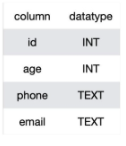
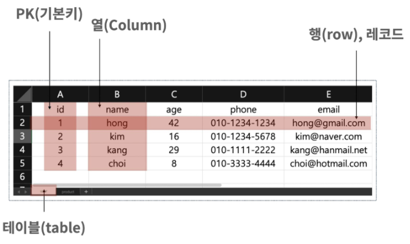
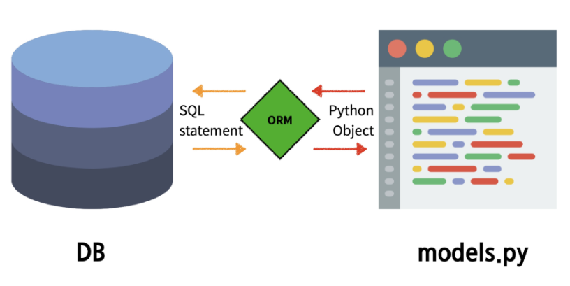
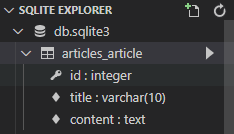
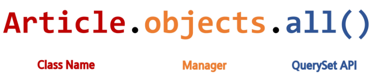

# Django Model

### Database

- **데이터베이스(DB)** 

  - 체계화된 데이터의 모임

- **쿼리(Query)**

  > 쿼리를 날린다 = 데이터베이스를 조작하는 명령어를 실행한다

  - 데이터를 조회하기 위한 명령어
  - 조건에 맞는 데이터를 추출하거나 조작하는 명령어

<br>

## Database의 기본 구조

- **스키마(Schema)**

  

  - 데이터베이스의, 제약 조건 (자료의 구조, 표현방법, 관계) 등을 정의한 구조(structure)

- 테이블(Table)

  

  - 열과 행의 값을 사용해 조직된 데이터 요소들의 집합. SQL 데이터베이스에서는 '관계'라고도 한다
  - **필드 (field) / 컬럼 (column) / 속성 : 열**
    - 각 열에는 고유한 데이터 형식이 지정된다. (INTEAGER TEXT NULL 등)
  - **레코드 (record) / 행(row) / 튜플 : 행**
    - 테이블의 데이터는 행에 저장된다. 
    - 즉, 한 테이블에 n명의 고객정보가 저장되어 있다면, 행은 n개가 존재한다.
  - PK(기본키)
    - 각 행(레코드)의 고유값으로 Priamary Key로 불린다. (id) , (필수)
    - 반드시 설정하여야하며, 데이터베이스 관리 및 관계 설정시 주요하게 활용된다. 

<br>

# Model

- 웹 어플리케이션의 데이터를 구조화하고 조작하기 위한 도구
  - 데이터베이스보다 큰 개념

- 저장된 데이터베이스의 구조(layout)
- django는 model을 도구로 삼아 데이터에 접속하고 관리
- 단잃란 데이터에 대한 정보들을 가짐
  - 사용자가 저장하는 데이터들의 필수적인 필드들과 동작들을 포함
- 일반적으로 각각의 model은 하나의 데이터베이스 테이블에 매핑

<br>

# ORM



- "**Object-Relational-Mapping**" : 객체 - 관계(DB) - 매핑
-  객체 지향 프로그래밍 언어를 사용하여 **호환되지 않는 유형의 시스템간**에 (Django - SQL ) 데이터를 변환하는, 즉 **해석하는 프로그래밍 기술**이다. 
- 이것은 프로그래밍 언어에서 사용할 수 있는 '가상 객체 데이터베이스'를 만들어 사용한다.

<br>

### 장단점과 사용이유

- 장점
  - SQL을 잘 알지 못해도 DB 조작이 가능
  - SQL의 절차적 접근이 아닌 객체 지향적 접근으로 인한 높은 생산성
- 단점
  - ORM 만으로 완전한 서비스를 구현하기 어려운 경우가 있음
- **현대 웹 프레임워크의 요점은 웹 개발의 속도를 높이는 것.(생산성)**

> *우리는 DB를 객체(object)로 조작하기 위해 ORM을 사용한다*

<br>

# Migrations

- django가 model에 생긴 변화(필드를 추가했다던가 모델을 삭제했다던가 등)를 반영하는 방법
- Migration(마이그레이션) 실행 및 DB 스키마를 다루기 위한 몇가지 명령어
  - **makemigrations**
  - **migrate**
  - sqlmigrate
  - showmigrations

<br>

### Migrations Command -1.

####  1. makemigrations

- model을 변경한 것에 기반한 **새로운 마이그레이션(like 설계도)를 만들 때** 사용

#### 2. migrate

- 마이그레이션을 **DB에 반영**하기 위해 사용
- 설계도를 실제 DB에 반영하는 과정
- 모델에서의 변경 사항들과 DB의 스키마가 동기화를 이룸

#### 3. sqlmigrate

- 마이그레이션에 대한 **SQL 구문을 보기** 위해 사용
- 마이그레이션이 SQL 문으로 어떻게 해석되어서 동작할지 미리 확인 할 수 있음

#### 4. showmigrations

- 프로젝트 전체의 마이그레이션 상태를 확인하기 위해 사용
- **migrate 됐는지 안됐는지 여부**를 확인 할 수 있음

<br>

### 반드시 기억해야 할 3단계

#### 1. models.py 

- model 변경사항 발생

#### 2. python manage.py makemigrations 

- migrations 파일 생성

#### 3. python manage.py migrate

- DB 적용

<br>

> #  실습1

### 1. App 내 models에서 class 생성

1.1 `class Article():`단수형과 파스칼 형식

1.2 `class Article(models.Model):` models`라는 모듈 안에서 `Model`이라는 부모클래스를 상속받음

1.3 하나하나의 컬럼에 대하여 정의(=필드명)

```python
class Article(models.Model):
    title = 
    content = 
```

- PK는 자동으로 생성되니 제외하고 정의

- 모델 필드 작성 (데이터베이스의 열 = 컬럼)

  - 각각의 데이터가 어떤 타입인지 정해진 클래스를 가져옴

  ```python
  from django.db import models
  
  class Article(models.Model):
      title = models.CharField(max_length = 10) # 길이의 제한이 있는 텍스트에 대해 사용
      content = models.TextField() # 텍스트에 대해 사용
  ```

title은 추후 input, content는 textarea로 사용하게 될 것

### 2. 새로운 마이그레이션 생성

### `$ python manage.py makemigrations`

- migrations 폴더에 0001_initial.py 파일이 생성됨 -> ORM

- 이후 ORM을 통해  SQL로 DB로 넘어감

- 수정하면 안됨

  ```python
  from django.db import migrations, models
  
  
  class Migration(migrations.Migration):
  
      initial = True
  
      dependencies = [
      ]
  
      operations = [
          migrations.CreateModel(
              name='Article',
              fields=[
                  ('id', models.AutoField(auto_created=True, primary_key=True, serialize=False, verbose_name='ID')),
                  ('title', models.CharField(max_length=10)),
                  ('content', models.TextField()),
              ],
          ),
      ]
  ```

### 3. 마이그레이션을 DB에 반영

### `$ python manage.py migrate`

#### 3-1. VS Code 확장프로그램 설치 : SQLite



- `db.sqlite3`을 오른쪽 클릭 - Open Database- 좌측 하단에 SQLITE EXPLOER 등장 - 확인 가능
  - class Article을 만들면 `앱 이름_모델 이름`으로 테이블이 생성
  - 테이블을 누르면 스키마가 보임
- 이미 작성되어있는 django의 내장 앱도 적용되어 테이블도 여러개가 나옴

#### +  SQL 확인

#### `$ python manage.py sqlmigrate articles 0001`

```
$ python manage.py sqlmigrate articles 0001
BEGIN;
--
-- Create model Article
--
CREATE TABLE "articles_article" ("id" integer NOT NULL PRIMARY KEY AUTOINCREMENT, "title" varchar(10) NOT NULL, "content" text NOT NULL);
COMMIT;
```

#### + 마이그레이션 상태 확인

#### `$ python manage.py showmigrations`

```
$ python manage.py showmigrations
admin
 [X] 0001_initial
 [X] 0002_logentry_remove_auto_add
 [X] 0003_logentry_add_action_flag_choices
articles
 [X] 0001_initial
auth
 [X] 0001_initial
 [X] 0002_alter_permission_name_max_length
 [X] 0003_alter_user_email_max_length
 [X] 0004_alter_user_username_opts
 [X] 0005_alter_user_last_login_null
 [X] 0006_require_contenttypes_0002
 [X] 0007_alter_validators_add_error_messages
 [X] 0008_alter_user_username_max_length
 [X] 0009_alter_user_last_name_max_length
 [X] 0010_alter_group_name_max_length
 [X] 0011_update_proxy_permissions
 [X] 0012_alter_user_first_name_max_length
contenttypes
 [X] 0001_initial
 [X] 0002_remove_content_type_name
sessions
 [X] 0001_initial
```

### 4. models.py의 테이블에 필드 추가 

####   `created_at = models.DateTimeField(auto_now_add=True)`

####   `updated_at = models.DateTimeField(auto_now=True)`

- 인자 헷갈리지 않도록 주의
- DateTimeField()는 DateField의 상속을 받음

```python
from django.db import models

# Create your models here.
class Article(models.Model):
    title = models.CharField(max_length = 10)
    content = models.TextField()
    created_at = models.DateTimeField(auto_now_add=True)
    updated_at = models.DateTimeField(auto_now=True)
```

### 5. 데이터베이스의 구조를 변경하는 마이그레이션 생성 + 반영

```python
$ python manage.py makemigrations
You are trying to add the field 'created_at' with 'auto_now_add=True' to article without a 
default; the database needs something to populate existing rows.

 1) Provide a one-off default now (will be set on all existing rows)
 2) Quit, and let me add a default in models.py
Select an option:
```

- 기본값을 자동으로 설정하고 마이그레이션 생성할지, 취소하고 직접 설정할건지 물음 

```python
Please enter the default value now, as valid Python
You can accept the default 'timezone.now' by pressing 'Enter' or you can provide another value.
The datetime and django.utils.timezone modules are available, so you can do e.g. timezone.now
Type 'exit' to exit this prompt
[default: timezone.now] >>>
```

- enter를 누르면 해준다고 함.

```python
Migrations for 'articles':
  articles\migrations\0002_auto_20210310_1104.py
    - Add field created_at to article
    - Add field updated_at to article
```

- 반영도 해주자 (까먹지 말 것)
- 확인은 SQLITE EXPLORER 새로고침으로 가능

```python
$ python manage.py migrate
Operations to perform:
  Apply all migrations: admin, articles, auth, contenttypes, sessions
Running migrations:
  Applying articles.0002_auto_20210310_1104... OK
```


# Database API

> *DB와의 대화*

### DB API

- DB를 조작하기 위한 도구
- django가 기본적으로 ORM을 제공함에 따른 것으로 DB를 편하게 조작할 수 있도록 도와줌
- Model을 만들면 django는 객체들을 만들고 읽고 수정하고 지울 수 있는 database-abstract API를 자동을 ㅗ만듦
- database-abstract API 혹은 database-access API라고도 함

#### DB API 구문 - Making Queries : 



- **Manager**
  - django 모델에 데이터베이스 query 작업이 제공되는 인터페이스
  - 기본적으로 모든 django 모델 클래스에 **objects**라는 Manager를 추가
    - objects가 DB를 조작하기 위한 명령어를 들고 있음. 고정
- **QuerySet**
  - 데이터베이스로부터 전달받은 객체 목록
  - queryset 안의 객체는 0개, 1개 혹은 여러 개일 수 있음( 마치 리스트)
  - 데이터베이스로부터 조회, 필터, 정렬 등을 수행 할 수 있음

<br>

- #### ex) `Article.objects.all()`

  : 아티클아 너가 가지고 있는데이터 전부 다 줘

  - QuerySet의 형태로 받아볼 수 있음

- QuerySet API를 어떻게 활용하냐가 중요
  
- 공식문서 : https://docs.djangoproject.com/en/3.1/ref/models/querysets/#queryset-api-reference
  
- 장고가 기본적으로 제공하는 shell : `python manage.py shell`

  ```text
  $ python manage.py shell
  Python 3.8.5 (default, Sep  3 2020, 21:29:08) [MSC v.1916 64 bit (AMD64)] on win32
  Type "help", "copyright", "credits" or "license" for more information.
  (InteractiveConsole)
  >>> exit
  ```

  #### + 파이선 쉘 업그레이드`$ pip install ipython`

  - 설치 목록 확인 :` pip list`

- #### `$ pip install django-extensions` 확장 프로그램 설치

  - https://django-extensions.readthedocs.io/en/latest/
  - 쉘이 기능이 몇개 없기 때문에

  ```text
  $ python manage.py shell_plus
  # Shell Plus Model Imports
  from articles.models import Article
  from django.contrib.admin.models import LogEntry
  from django.contrib.auth.models import Group, Permission, User
  from django.contrib.contenttypes.models import ContentType
  from django.contrib.sessions.models import Session
  # Shell Plus Django Imports
  from django.core.cache import cache
  from django.conf import settings
  from django.contrib.auth import get_user_model
  from django.db import transaction
  from django.db.models import Avg, Case, Count, F, Max, Min, Prefetch, Q, Sum, When
  from django.utils import timezone
  from django.urls import reverse
  from django.db.models import Exists, OuterRef, Subquery
  Python 3.8.5 (default, Sep  3 2020, 21:29:08) [MSC v.1916 64 bit (AMD64)] on win32
  Type "help", "copyright", "credits" or "license" for more information.
  (InteractiveConsole)
  >>>
  ```

  #### 실행 `$ python manage.py shell_plus`

  - 모델조작에 필요한 모듈을 다 불러와줌

<br>

# CRUD

- 대부분의 컴퓨터 소프트웨어가 가지는 기본적인 데이터 처리 기능인
  Create( 생성), Read(읽기), Update(갱신), Delete(삭제)를 묶어서 일컫는 말
  - .all() : R에 해당

### CREATE

- save() method
  - saving objects
  - 객체를 데이터베이스에 저장
  - 데이터 생성 시 save()를 호출하기 전에는 객체의 ID값이 무엇인지 알 수 없음

### READ

- all(), get(), filter()

### UPDATE

- get()으로 값을 가져온 후 생성처럼 편집 후 저장하면 업데이트 된다.

  ```text
  a = Article.objects.get(pk=1)
  
  a.title = 'update'
  a.content = 'updated title'
  a.save()
  ```

### DELETE

- delete()

  - 별도로 save 필요없음

  ```text
  a = Article.objects.get(pk=1)
  a.delete()
  ```

  - 1번이 사라졌을 때 다음에 작성한다면 1번을 메꾸는 것이 아니라 6번이 생성된다.
  - 삭제된 pk값은 다시 재사용하지 않는다

<br>

### Field lookups

- 조회 시 특정 조건을 적용시키기 위해 사용
- QuerySet Method(get, filter, exclude)에 대한 키워드 인수로 사용 됨
- 공식 문서 참고 https://docs.djangoproject.com/en/3.1/topics/db/queries/ - 우측 사이드바 - fieldlookups
  https://docs.djangoproject.com/en/3.1/topics/db/queries/#field-lookups: 

<br>

### 

> #  실습2

#### 1. `$ pip install django-extensions` 확장 프로그램 설치

#### 1.1. Configuration - settings.py

```python
INSTALLED_APPS = (
    ...
    'django_extensions',
)
```

#### 1.2 `$ python manage.py shell_plus`Shell  실행

#### + 파이선 쉘 업그레이드`$ pip install ipython`

> 실습 1 진행

#### 2. CRUD

#### 2.1 `Article.objects.all()`

```text
In [4]: Article.objects.all()
Out[4]: <QuerySet []>
```

#### 2.2 `article = Article()` 인스턴스 생성

```text
In [5]: article = Article()

In [6]: article
Out[6]: <Article: Article object (None)>
```

- 아직 게시글로 간게 아니라 파이썬의 인스턴스일 뿐임
- `dir(Ariticle)`:Article이 가지고있는 모든 정보 볼 수 있음

#### 2.3 title과 content값을 넣어줘야,

####  `article.title = 'first'`,`article.content = 'django!'`

```python
In [7]: article.title = 'first'

In [8]: article.title
Out[8]: 'first'

In [9]: article.content = 'django!'

In [10]: article.content
Out[10]: 'django!'
```

#### 2.4 save해야 `article.save()` 

```
In [11]: article.save()

In [12]: article
Out[12]: <Article: Article object (1)>
```

SQLITE EXPLORER - articles-article에서 확인 가능


### 3. 레코드, 행을 추가하는 세가지 방법

```text
# 1. 인스턴스 => 저장
a = Article()
a.title = 'asdf'
a.content = 'fdsa'
article.save() # return이 없음
```

```text
# 2. 인스턴스 => 저장
b = Article(title='asdf', content='fdsa')
b.save() # return이 없음, 저장한 변수로 유효성검사 할 수 있어서 많이 쓰임
```

```text
# 3. 클래스 => 오브젝트 => 생성
# return이 있다
Article.objects.create(title='third',content='django!!!')
```


#### + 반복문

```
for article in articles:
	print(article.title)
```

#### + 키로 접근

```text
In [5]: article.pk
Out[5]: 2

In [6]: article.id
Out[6]: 2
```


#### + 사용자 친화적으로 shell_plus에서 조회하기

- models.py

```python
from django.db import models

# Create your models here.
class Article(models.Model):
    title = models.CharField(max_length = 10)
    content = models.TextField()
    created_at = models.DateTimeField(auto_now_add=True)
    updated_at = models.DateTimeField(auto_now=True)

    def __str__(self):
        return self.title
```

```
In [1]: Article.objects.get(pk=1)
Out[1]: <Article: first>
```


### 5. DB API - READ

## 5.1. all()

## 5.2. get()

```text
In [6]: article = Article.objects.get(pk=4)

In [7]: article
Out[7]: <Article: title4>
```

- 객체가 없으면 DoesNotExist 에러 발생
- 객체가 여러개일 경우  MultipleObjectsReturned 에러 발생
- 위와 같은 특징을 가지고 있기 때문에 unique 혹은 Not NULL

## 5.3. filter()

오류 없이 여러개를 조회 가능

```text
In [11]: Article.objects.filter(content='django!')
Out[11]: <QuerySet [<Article: title1>, <Article: title5>]>
```

- 하나가 나온다면 쿼리셋에 하나만 담아서 돌려줌

<br>

### 6. Field lookups

- 필드명__contains='str'

  ```text
  In [12]: Article.objects.filter(content__contains='!')
  Out[12]: <QuerySet [<Article: title1>, <Article: title2>, <Article: title3>, <Article: title4>, <Article: title5>]>
  ```

- 필드명__gt=int
  필드에서 int보다 큰 값을 가진 것을 찾아즘

  ```text
  In [13]: Article.objects.filter(pk__gt=1)
  Out[13]: <QuerySet [<Article: title2>, <Article: title3>, <Article: title4>, <Article: title5>]>
  ```

  

# Admin site

- 사용자가 아닌 서버의 관리자가 활용하기 위한 페이지
- Aritcle class를 admin.py에 등록하고 관리
- django.contrib.auth 모듈에서 제공
- record 생성 여부 확인에 매우 유용하며 직접 record를 삽입할 수도 있음


### T2

> ####  실습

### 1. admin.py에 Models 가져오기

```python
from django.contrib import admin
from .models import Article # 명시적 상대경로
# from . import models

# Register your models here.
```

### 2. 계정 만들기

```python
from django.contrib import admin
from .models import Article

# Register your models here.
admin.site.register(Article)
# admin site에 register하겠다.
```

#### 3. `$ python manage.py createsuperuser`

```text
Username (leave blank to use 'helia'): admin
Email address:
Password:
Password (again):
This password is entirely numeric.
Bypass password validation and create user anyway? [y/N]: y
Superuser created successfully.
```

- 이메일 패스 가능
- 패스워드는 커서가 움직이지 않지만 작성중인것임
- DB의 auth_user에서 확인 가능

#### 4. runserver - /admin/에서 로그인 가능

#### + article 화면 변경 - admin.py -

```python
from django.contrib import admin
from .models import Article

# Register your models here.
class ArticleAdmin(admin.ModelAdmin):
    list_display = ('pk', 'title', 'contents', 'created_at', 'updated_at',)
    # 튜플이나 리스트 형태로 작성, 보여줄 정보 선택

admin.site.register(Article, ArticleAdmin) # ArticleAdmin 추가해주어야!
# admin site에 register하겠다.
# admin.site.register(Article) 함수 정의 없이 이렇게만도 가능
```

#### + 이외의 커스텀은 공식문서 참고

https://docs.djangoproject.com/en/3.1/ref/contrib/admin/

**bold**: 

<br>

> ### 알아두기

*****

**마이그레이션에 숫자가 붙는 이유**

- 버전 관리를 위해서
- 문제가 생기면 해당 마이그레이션 전으로 돌아갈 수 있게 각각의 시점을 기록해 둠

