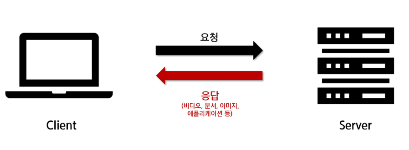
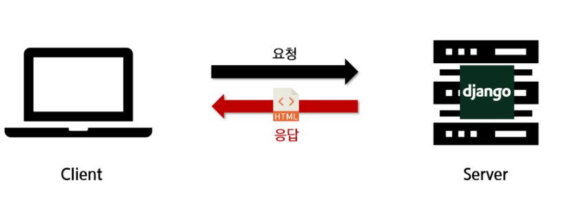
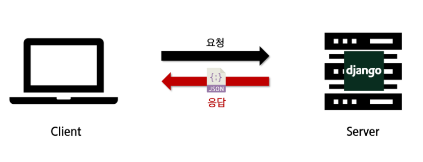

[TOC]

<br>

# REST API

<br>

**API(Application Programming Interface)**

- 프로그래밍 언어가 제공하는 기능을 수행할 수 있게 만든 인터페이스
  - 어플리케이션과 프로그래밍으로 소통하는 방법
- 프로그래밍을 활용해서 할 수 있는 어떤 것
- CLI, GUI는 각각 명령줄과 그래픽(아이콘)을 통해서 특정 기능을 수행하는 것이며 API는 프로그래밍을 통해 그 일을 수행할 수 있음
- 다양한 interface 중 하나
  - CLI(ex. git bash), GUI(바탕화면 바로가기), API(ex.코드)

<br>

**Web API**

- 웹 어플리케이션 개발에서 다른 서비스에 요청을 보내고 응답을 받기 위해 정의된 명세
- 현재 웹 개발은 추가로 직접 모든 것을 개발하지 않고 여러 Open API를 가져와서 활용하는 추세
  - ex) 구글, 카카오 지도 API, 우편번호, 도로명, 지번 소 검색 API 등
    - 보통 읽어들이기 때문에 GET이 많음

<br>

**API Server**

> "프로그래밍을 통한 요청에 JSON을 응답하는 서버를 만들자"







**Response JSON 응답 객체**

- ex) Youtube Data API, Naver Papago 번역 API, Kakao Map API, TMDB API

<br>

## RESTful API

**REST**

> **REpresentational State Transfer**
>
> 어떤 의미를 가지고 있는지 명확하면 REST로 볼 수 있다.
>
> "자원과 주소를 지정하는 방법"

- 웹 설계 상의 장점을 최대한 활용할 수 있는 아키텍처 **방법론**
- 네트워크 아키텍쳐 원리의 모음
  - 자원을 정의
  - 자원에 대한 주소를 지정하는 방법
- REST원리를 따르는 시스템 혹은 API를 **RESTful API**라고 하기도 함

<br>

> SOAP vs REST? (정처기)
>
> |      | SOAP     | REST            |
> | ---- | -------- | --------------- |
> |      | 프로토콜 | 아키텍쳐 스타일 |

<br>

## REST 구성

- URI (자원)
- HTTP Method (행위)
- Representation (표현)

<br>

### 1. URI

- Uniform Resource Identifier
- 통합 자원 식별자
- 인터넷의 자원을 나타내는 유일한 주소
- 인터넷에서 자원을 식별하거나 이름을 지정하는데 사용되는 간단한 문자열
- 하위 개념
  - URL, URN

<br>

###  URL

- Uniform Resource Locator
- 통합 자원 위치
- 네트워크 상에 자원(리소스)이 어디 있는지(주소)를 알려주기 위한 약속
- 자원 HTML 페이지, CSS 문서, 이미지 등이 될 수 있음
- '웹 주소' 또는 '링크'라고도 불림

<br>

### URN

- Uniform Resource Name
- 통합 자원 이름
- URL과 달리 자원의 위치에 영향을 받지않는 유일한 이름 역할을 함 (독립적 이름)
- 자원의 이름이 변하지 않는 한 자원의 위치를 이곳저곳 옮겨도 문제없이 동작
- ex) ISBN (국제표준도서번호), ISBN 0-486-27557-4: (로미오와 줄리엣)

<br>

**URL과 URN 비교 예시**

- "서울시 강남구 테헤란로 헬리아아지트"
- 만약 헬리아아지트가 새로운 곳으로 이사 가게 된다면,
  - 더 이상 '서울시 강남구 테헤란로 헬리아아지트'라는 주소(URL)로 헬리아아지트는 찾을 수 없음
  - 새로운 주소(URL) '인천광역시 연수구 헬리아아지트'로 찾아야 함
  - 하지만 헬리아아지트가 다른 곳으로 가더라도 URN을 통해 헬라이아지트라는 것을 식별 가능
  - 즉, 헬리아아지트라는 고유한 이름(URN)은 변함 없음

<br>

**URL과 URN**

- URN은 자원의 ID를 정의하고, URL은 자원을 찾는 방법을 제공
- 따라서 URN과 URL은 상호 보완적

<br>

**URI 구조**

`http://localhost:3000/posts/3`

- `http`: Scheme / Protocol
- `localhost`: Host
- `3000`: Port
- `posts`,`3`: Path

`http://google.com/search?q=http`

- `q=http`: Query

`http://getbootstrap.com/docs/4.1/layout/overview#containers`

- `#containers`: fragment

<br>

**URI 설계 주의사항**

- 밑줄(_)이 아닌 하이픈(-)을 사용
  - URI의 가독성
- 소문자 사용
  - 대소문자에 따라 다른 자원으로 인식하게 됨
- 파일 확장자는 포함시키지 않음

<br>

**URL과 URI**

- URI는 크게 URL과 URN으로 나눌 수 있지만
  URN을 사용하는 비중이 매우 적기 때문에 일반적으로 URL은 URI를 통칭하는 말로 사용하기도 함

<br>

PUT : 자원의 전체 교체, 자원 교체시 모든 필드 필요

(만약 전체가 아닌 일부만 전달할 경우, 전달한 필드외 모두 null or 초기값 처리되니 주의!)

PATCH : 자원의 부분 교체, 자원 교체시 일부 필드 필요

<br>

### 2. HTTP Method

**HTTP (HyperText Transfer Protocol**

- HTML 문서와 같은 자원들을 가져올 수 있도록 해주는 프로토콜 (규칙, 약속)
- 웹에서 이루어지는 모든 데이터 교환의 기초
- 클라이언트 - 서버 프로토콜
- 요청(requests)
  - 클라이언트(브라우저)에 의해 전송되는 메시지
- 응답(responses)
  - 서버에서 응답으로 전송되는 메시지

- HTTP 특징
  - 비연결 지향(connectionless)
    - 서버는 응답 후 접속을 끊음
  - 무상태(stateless)
    - 접속이 끊어지면 클라이언트와 서버 간의 통신이 끝나며 상태를 저장하지 않음

<br>

**HTTP Method**

- 자원에 대한 행위
- 즉, HTTP는 HTTP Method를 정의하여 주어진 자원에 수행하길 원하는 행동을 나타냄
- 의미론적으로 행위를 규정하기 때문에 '실제 그 행위 자체가 수행됨'을 보장하진 않음
- HTTP verbs 라고도 함

<br>

**HTTP Method 종류**

- GET
  - 특정 자원의 표시를 요청하며, 오직 데이터를 받기만 함
- POST
  - 서버로 데이터를 전송하며, 서버에 변경사항을 만듦
- PUT
  - 요청한 주소의 자원을 수정
- DELETE
  - 지정한 자원을 삭제

<br>

**RESTful 철학 예시**

X) GET /articles/1/read/

​	-> GET/ articles/1/

​	URI에 불필요한 정보 (행위 표현)가 포함

<br>

X) GET /articles/1/delete/

​	-> DELETE /articles/1/

​	URI는 자원에 대한 행위는 HTTP method로 표현

<br>

O)
GET /samsung.com/sec/
GET /samsung.com/sec/smartphones/
GET /samsung.com/sec/smartphones/galaxy-s/

<br>

### 3. Representation (표현)


**JSON**

```json
{"key": "value"}
```

- JavaScript Object Notation
  - lightweight data-interchange format
  - 자바스크립트 객체 문법을 따르며, 구조화된 데이터를 표현하기 위한 문자 기반 데이터 포맷
  - 일반적으로 웹 어플리케이션에서 클라이언트로 데이터를 전송할 때 사용
  - (자바스크립트 구문에 기반을 두고 있지만 차이점이 있으니 주의)

- 특징
  - 사람이 읽고 쓰기 쉽고 기계가 파싱(해석 & 분석)하고 만들어 내기 쉬움
    - 파이썬의 dictionary, 자바스크립트의 object처럼 C계열의 언어가 갖고 있는 자료구조로 쉽게 변환할 수 있는 key-value의 구조로 되어 있음
  - 자바스크립트가 아니어도 JSON을 읽고 쓸 수 있는 기능이 다양한 프로그래밍 언어 환경에서 지원됨


- JSON Parsing in Python

```python
import requests

URL = 'http://kobis.or.kr/kobisopenapi/webservice/rest..중략..json'
response = requests.get(URL)

# Dictionary로 Parsing
data = response.json()

# <class 'dict'>
print(type(data))
```

<br>

**REST 핵심 규칙**

1. URI는 정보의 자원을 표현해야 한다
2. 자원에 대한 (어떠한) 행위는 HTTP Method로 표현한다


**API Server**

- "프로그래밍을 통해 요청에 RESTful한 방식으로 JSON을 응답하는 서버 만들기"
- 예시 : KaKao Developers REST API 레퍼런스
  - 


<br>

**HTML 응답에서 JSON 응답으로의 변화**


<br>

**최종 구현**


<br>

---

<br>

# Django REST Framework

**DRF**

>  https://www.django-rest-framework.org/

- Web API 구축을 위한 강력한 toolkit를 제공
- REST framework 개발에 필요한 다양한 기능을 제공

<br>

**Serialization (직렬화)**

- 데이터 구조나 객체 상태를 동일하거나 다른 컴퓨터 환경에 저장하고 나중에 재구성할 수 있는 포맷ㄷㅇ드로 변환하는 과정
- 예를 들어 DRF의 Serializer는 Django의 Queryset 및 Model Instance와 같은 복잡한 데이터를, JSON, XML등의 유형으로 쉽게 변환할 수 있는 Python 데이터 타입으로 만들어 줌
- DRF의 Serializer는 Django의 Form 및 ModelForm 클래스와 매우 유사하게 작동

<br>

**Django와의 비교**

|          | Django    | DRF             |
| -------- | --------- | --------------- |
| Response | HTML      | JSON            |
| Model    | ModelForm | ModelSerializer |

<br><br><br><br><br><br><br><br>

```bash
$ django-admin startproject drf .
$ python -m venv venv
$ source venv/Scripts/activate
$ pip install django
$ python manage.py startapp articles # settings.py 앱 등록
```

<br>

## CRUD

```python
# urls.py
from django.urls import path, include

# urlpatterns에 추가
path('api/v1/', include('articles.urls')),
```

```python
# article/urls.py
from django.urls import path
from . import views

urlpatterns = [
    path('articles/', views.article_list), # 이제 앱 네임 필요없음
]
```

```python
# articles/views.py

from django.shortcuts import render

# Create your views here.

def article_list(request):
    pass
```


```python
# articles/models.py
from django.db import models

# Create your models here.
class Article(models.Model):
    title = models.CharField(max_length=50)
    content = models.TextField()
    created_at = models.DateTimeField(auto_now_add=True)
```

```bash
$ python manage.py makemigrations
$ python manage.py migrate
```

```bash
$ pip install django-seed
$ pip install djangorestframework
# settings.py 등록 ('django_seed', 'rest_framework',)
```

(전역에 한번도 설치를 안했어서 자동완성 쓰기위해)

```bash
$ deactivate
$ pip install djangorestframework
$ source venv/Scripts/activate
```

```bash
$ python manage.py seed articles --number=10
```


### serializer

- models.py를 생성하고 modelform을 사용하여 html을 전송했는데, 이제 modles.py를 기반으로 serializer을 이용함.
- 인자가 *kwargs
  - data=request.data는 request.POST
  - serializer.data는 이를 포장

```python
# articles/serializers.py
from rest_framework import serializers
from .models import Article

class ArticleListSerializer(serializers.ModelSerializer):
    class Meta():
        model = Article
        fields = '__all__'
```

- 이름에 굳이 List를 포함하는 이유 : 


CBV (Class Based View) : 기본 기능을 빠르게 만들기가 쉬움

FBV (Function Based View: 커스텀하기가 좋음


🔴GET /movies

🟡GET /movies/:id

🟢POST /movies

🟡PUT / movies/:id

🟡DELETE /movies/:id

> 🔴 : 전체를 가져와 보여주는 것이 목적
>
> 🟡 : 보여줄지, 수정할지 ,지울지 기존의 정보가 있는 상태
>
> 🟢 : 생성,. 기존의 정보가 없는 상태


```python
# articles/views.py

from django.shortcuts import render, get_list_or_404 # 추가
from.serializers import ArticleListSerializer

from rest_framework.response import Response
# render는 HTML을 보여주는데 목적, Response는 Json을 보여주는데 목적이 있음
from rest_framework.decorators import api_view
# 템플릿으로 예쁘게 json을 보여줌. 이게 사용자에게 보여지진 않음.

@api_view(['GET']) # GET이 디폴트지만 명시해주는게 좋음
def article_list(request):
    articles = get_list_or_404(Article)
    serializer = ArticleListSerializer(articles, many=True) # form의 역할을 대체, 복수임을 알림
    return Response(serializer.data)
```


### Postman

- 요청 주고받기를 미리 해볼 수 있음

- 확장 프로그램 설치

https://chrome.google.com/webstore/detail/postman/fhbjgbiflinjbdggehcddcbncdddomop?hl=ko

- chrome://apps/
- 사용해보기
  - http://127.0.0.1:8000/ 입력 (https는 안되는듯)
  - Pretty : 하이라이트 처리
    Raw : 로우
    Preview : 사용자 화면 미리보기
  - http://127.0.0.1:8000/api/v1/articles/ 입력
    - json형식만 보내주는 걸 볼 수 있음
- save 또는 ctrl + s로 프로젝트를 폴더별로 저장해서 여러가지를 편하게 테스트해볼 수 있음


```python
# articles/serializers.py

# 클래스 추가
class ArticleSerializer(serializers.ModelSerializer):
    class Meta():
        model = Article
        fields = '__all__'
```

```python
# articles/urls.py

path('articles/<int:article_pk>/', views.article_detail), # 추가
```

```python
# import문
get_object_or_404 # django.shortcuts 추가
from .models import Article, Comment
ArticleSerializer # .models 추가

# detail, 특정 게시물만 요청
@api_view(['GET'])
def article_detail(request, article_pk)
    article = get_object_or_404(Article, pk=article_pk)
    serializer = ArticleSerializer(article)
    # 복수형으로 하지 않는 건 하나의 구조 안에 여러 요소를 가지고 있기 때문. form과 같음
    return Response(serializer.data)
```

- serializer은 데이터가 아니라 복수(가능) 데이터의 집합체 


**생성 구현 (POST)**

- id값을 미리 알 수 없으므로 pk가 없는 주소를 사용(article_list함수)
- POST방식이므로 기존의 GET으로 전체 데이터 조회를 if문 분기처리

```python
# views.py

@api_view(['GET', 'POST']) # POST 추가
def article_list(request):
    if request.method == 'GET':
        articles = get_list_or_404(Article)
        serializer = ArticleListSerializer(rticles, many=True) # form의 역할을 대체, 복수임을 알림
        return Response(serializer.data)
    elif request.method == 'POST': # 보통 유효성검사를 고려했었던 것과 달리 HTML을 보내는게 아니기 때문에 유효하지 않은 데이터라는 것만 알려주면 될 것.
        serializer = ArticleListSerializer(data=request.data)
        if serializer.is_valid():
            serializer.save()
            return Response(serializer.data)
        return Response(serializer.error, status=400) # 유효하지않은 것도 보여주기 위해, status 변경
```

- create를 위해서는 사용자에게 데이터를 우선 보내줘야 함.

  - POST로 바꾸면 Body란이 활성화 됨.
    - form-data형태의 key-value를 입력

  - Postman에서 form column하나 체크박스 해제하면 에러 문구 볼 수 있음
    - {"content":["This field is required."]}
    - 문제 : 오류가 나도 Status 200 OK로 떠 있음.
      - 해결 : status=400 옵션

```python
# def article_list(request):에서 에러를 보여주는
# 첫번째 방법
        if serializer.is_valid():
            serializer.save()
            return Response(serializer.data)
        return Response(serializer.errors, status=400) # 유효하지않은 것도 보여주기 위해
   
# 두번째 방법
        if serializer.is_valid(raise_exception=True): # 이 옵션이 밑의 줄과 똑같이 에러를 보여줌
            serializer.save()
            return Response(serializer.data)
        # return Response(serializer.errors, status=400) 
```


**삭제 구현 (DELETE)** 

```python
# views.py

@api_view(['GET', 'DELETE'])
def article_detail(request, article_pk):
    article = get_object_or_404(Article, pk=article_pk) # 언제든 쓰므로 앞으로 뺀다.

    if request.method == 'GET':
        serializer = ArticleSerializer(article)
        return Response(serializer.data)
    elif request.method == 'DELETE': # 찾아 삭제해야함
        article.delete()
        data = {
            'message': '성공적으로 삭제되었습니다.', # 보통은 True값을 줘서 FE에서 처리
            # 'success': True,
            # 'message': f'{article_pk}번글 삭제'
        }
        return Response(data, status=200) # status=204를 하면 삭제는 되면서 아예 메시지가 뜨지 않음
```


**수정 구현 (PUT)** 

```python
# views.py

@api_view(['GET', 'DELETE', 'PUT'])
def article_detail(request, article_pk):
    article = get_object_or_404(Article, pk=article_pk) # 언제든 쓰므로 앞으로 뺀다.

    if request.method == 'GET':
        serializer = ArticleSerializer(article)
        return Response(serializer.data)
    elif request.method == 'DELETE': # 찾아 삭제해야함
        article.delete()
        data = {
            'message': '성공적으로 삭제되었습니다.', # 보통은 True값을 줘서 FE에서 처리
            # 'success': True,
            # 'message': f'{article_pk}번글 삭제'
            # 'article_pk': article_pk
        }
        return Response(data, status=200) # status=204를 하면 삭제는 되면서 아예 메시지가 뜨지 않음
    elif request.method == 'PUT':
        serializer = ArticleSerializer(article, data=request.data)
        if serializer.is_valid(raise_exception=True):
            serializer.save()
            return Response(serializer.data)
```


## 1: N

**댓글 기능 구현**

- 모델링

```python
# models.py

class Comment(models.Model):
    article = models.ForeignKey(Article, on_delete=models.CASCADE) # on_delete 옵션 필수
    content = models.TextField()
    created_at = models.DateTimeField(auto_now_add=True)
```

```bash
$ python manage.py makemigrations
$ python manage.py migrate
$ python manage.py seed articles --number=10
```


```python
# serializers.py

from .models import Article, Comment

class CommentSerializer(serializers.ModelSerializer):
    class Meta():
        model = Comment
        fields = '__all__'
```


```python
# urls.py

path('comments/', views.comment_list), # 일단 comments만 조작해보자
```


```python
# views.py

from .models import Article, Comment
from.serializers import ArticleListSerializer, ArticleSerializer, CommentSerializer

@api_view()
def comment_list(request):
    comments = get_list_or_404(Comment)
    serializer = CommentSerializer(comments, many=True)
    return Response(serializer.data)
```


- 댓글 하나 조회

```python
# urls.py
path('comments/<int:comment_pk>/', views.comment_detail),
```

```python
# views.py
@api_view()
def comment_detail(request, comment_pk):
    comment = get_object_or_404(Comment, pk=comment_pk)
    serializer = CommentSerializer(comment)
    return Response(serializer.data)
```


**댓글 생성**

- 게시물과 댓글 합치기

```python
# urls.py
path('articles/<int:article_pk>/comments/', views.comment_create),
```

```python
# views.py

@api_view(['POST'])
def comment_create(request, article_pk):
    article = get_object_or_404(Article, pk=article_pk)
    serializer = CommentSerializer(data=request.data)
    if serializer.is_valid(raise_exception=True):
        serializer.save(article=article) # 여기서 저장
        return Response(serializer.data)
```


- 문제점

{"article":["This field is required."]}

```python
# serializers.py 수정
class CommentSerializer(serializers.ModelSerializer):
    class Meta():
        model = Comment
        fields = '__all__'
        read_only_fields = ('article',) # 추가
        # commit=False와 같이 article을 저장하지 않겠다는 것. views의 함수에서 저장된다.
```


**댓글 수정, 삭제 기능**

- comment_detail에 추가

```python
# views.py

@api_view(['GET', 'PUT', 'DELETE'])
def comment_detail(request, comment_pk):
    comment = get_object_or_404(Comment, pk=comment_pk)

    if request.method == 'GET':
        serializer = CommentSerializer(comment)
        return Response(serializer.data)
    elif request.method == 'PUT':
        pass
    elif request.method == 'DELETE':
        comment.delete()
        data = {
            'message': True,
        }
        return Response(data, status=204)
```


### NESTED

- 조회할 때 댓글이랑 게시물이 연결되어있지 않은 문제

  - index에서 댓글도 따로 요청해야하고 게시물 요소도 따로 요청해야 함

  => NESTED 구조를 만들어야

- 방법 1

```python
# serializers.py

class ArticleSerializer(serializers.ModelSerializer):
    # article과 연결되어있는 comment들을 다 가져온다.
    # 사용자에게 정보를 받는게 목적이 아니므로 is_valid통과 위해 read_only옵션 설정
    comment_set = serializers.PrimaryKeyRelatedField(many=True, read_only=True)  
    class Meta():
        model = Article
        fields = '__all__'
```

- 결과

```json
{
    "id": 16,
    "comment_set": [
        6
    ],
    "title": "Production focus money.",
    "content": "Television laugh vote something south long red. Just religious wall join open assume thus.",
    "created_at": "1973-01-28T16:26:04Z"
}
```

#### N의 개수 세기

- 방법 2 

```python
class CommentSerializer(serializers.ModelSerializer):
    class Meta():
        model = Comment
        fields = '__all__'
        read_only_fields = ('article',)

class ArticleSerializer(serializers.ModelSerializer):
    comment_set = CommentSerializer(many=True, read_only=True) # serializer 자체를 가져올 수 있음. 위치는 가져오는 게  위에 있어야
    comment_count = serializers.IntegerField(source='comment_set.count', read_only=True) # 숫자로 변환해서 저장해주는 필드

    class Meta():
        model = Article
        fields = '__all__'
```

- 두 serializer의 위치 바꿔줬음
- 결과 : 내용도 볼 수 있음, 댓글개수가 model에는 없지만 serializer를 통해 볼 수 있게 되었음

```json
{
    "id": 16,
    "comment_set": [
        {
            "id": 6,
            "content": "Economy move issue thus send beautiful turn. Song cell manage positive.",
            "created_at": "1970-08-09T14:32:07Z",
            "article": 16
        }
    ],
    "comment_count": 1,
    "title": "Production focus money.",
    "content": "Television laugh vote something south long red. Just religious wall join open assume thus.",
    "created_at": "1973-01-28T16:26:04Z"
}
```