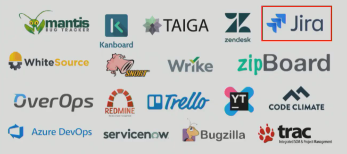
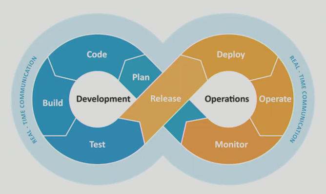
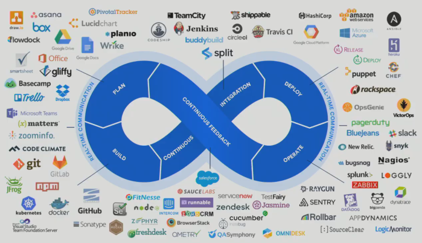
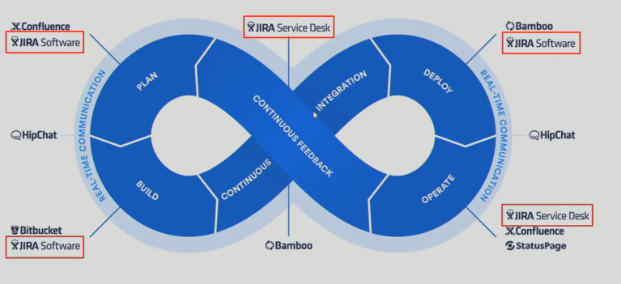
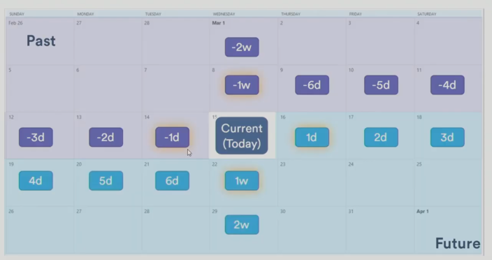
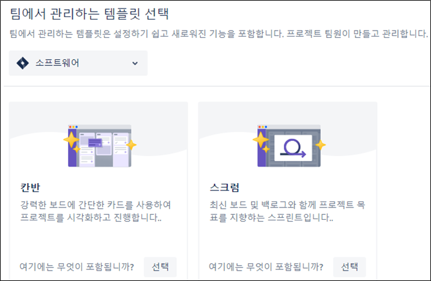
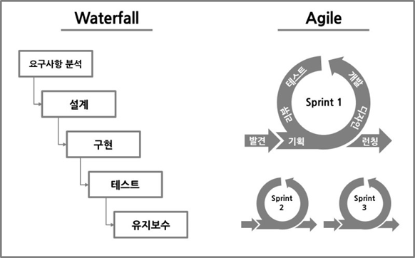

[TOC]


# JIRA


> 참고 자료
>
> - JQL(JIRA Query Language) 로 JIRA Issue 검색하기
>   https://www.lesstif.com/jira/jql-jira-query-language-jira-issue-18220188.html
>
> - Issue filter 관리
>   https://www.lesstif.com/jira/issue-filter-18220186.html
>
> - Scrum Board
>   https://bit.ly/3qcPMh1
>
> - JIRA DashBoard
>
>   https://www.lesstif.com/jira/jira-dashboard-40435784.html


## JIRA

- 이슈 트래킹 시스템
  - 이슈: 개발 프로세스를 진행함에 있어서 개발해야하는 항목의 단위
  - 지라가 많은 점유율을 가지고 있음
- 아틀라시안이 개발한 PMS 소프트웨어로, 버그 추적, 이슈 추적, 프로젝트 관리 기능을 제공한다.
- 내부적으로 사용하던 버그 추적 프로그램 ‘Bugzilla’의 이름에서 착안




- 왜 많은 기능들이 필요할까?

### DevOps



- Development와 Operations의 합성어
  - 과거에는 분리되었으나 문제점이 있었음
    - 인수인계의 시간이 필요
    - 개발팀에서는 다양성을 추구, 운영팀에서는 안정성을 추구
  - 애자일 -> 개발과 운영이 밀접하게 진행되어야 할 필요성 증대

<br>

#### DevOps를 잘 수행하기 위한 조건

1. 반복적인 작업들을 Tool을 이용해서 자동화
2. 팀원 모두가 알고 있는 하나의 공유된 지표가 필요
3. 장애나 이슈가 있을 때 혼자만 알지 말고 팀원들과 공유 필요

=> 2, 3을 지라가 해결


#### DevOps Tools



#### Atlassian DevOps & Jira




### 사용해보기

- Issue Type
  - Story
    - 사용자여정(로그인을 한다, 회원가입을 한다, 게시글을 작성한다)
  - Task
    - 하나의 할일
  - Bug
  - Epic
    - 하나의 큰 틀 -> 이 안에 story, task, bug가 들어감
    - 하나의 테마라고 생각하면 편함
    - ex) 유저 관리, 서버 세팅
  - 구조
    - 여러개의 Epic
      - 하나의 Epic안에 여러개의 Story, Task, Bug
      - 하나의 Story안에 여러개의 Task

- 자세한 설명은 Description에 작성
- Assignee: 담당자
- Reporter: 생성자
- Status
  - View Workflow
    - 이슈가 어떤 단계로 흘러가는지에 대한 도식이 나옴
- Component
  - Backend, Frontend, UX, 인프라 등등으로 나눌 수 있음
  - Issue를 생성할때 맞는 분야를 선택 가능 
- JQL
  - 상단 Issues - search for issue
  - 필터에서 원하는 프로젝트 선택 - assignee에서 current user선택
  - 필터 옆 Advanced 선택 => Advanced Query
  - 처음에 베이직쿼리(UI)로 한 뒤 세부 검색을 Advanced Query(CLI)로 사용
    - save as로 저장 가능 - details에서 확인, 수정권한 주기 가능 ( Edit Current Filter)

<br>

## JQL(JIRA Query Language)

**JQL**

- Jira Issue 를 검색하기 위한 구조적 언어
  - SQL과 비슷한 문법을 갖고 있다.
  -  Jira의 각 필드들에 맞는 특수한 예약어 들을 제공
  - 쌓인 Issue 들을 재가공해 유의미한 데이터를 도출해 내는데 활용
    (Gadget, Agile Borad 등)
  - 기본 검색은 UI 기반 => 세밀한 검색이 어려움
    - 특히 not 이나 not in 구문. 하지만 JQL에서는 `project not in (a, b)`
- JQL + JIRA의 데이터
  - 다양한 조건으로 이슈를 검색, 분석 가능
  - MS Excel 이나 [다른 포맷으로 export](https://confluence.atlassian.com/display/JIRA/Working+with+Search+Result+Data)하여 보고서 작성 가능

<br>

### How To Use

- **이슈**→ **이슈검색** 클릭
- **고급**을 클릭해서 JQL 입력 화면으로 전환

<br>

### JQL Keywords

**AND**
**OR**
**NOT**
**EMPTY**
**NULL**
**ORDER BY**

<br>

### 구성 요소

- 검색 구문과 정렬 구문으로 나뉘어지며 검색 구문만 있거나 정렬 구문만 있을 수도 있다.

#### 검색 구문

- SQL 의 SELECT 와 유사
- INSERT나 UPDATE 구문이 없고 SELECT 와 FROM 구문이 생략되어 있고 컬럼대신 필드

```sql
필드이름 연산자 필드값
```

- 필드 이름
  -  Jira 상세 이슈에서 볼 수 있는 바로 그 필드
  - 주의할 점은 field 이름은 번역된 이름이 아니라 영어 필드 이름
  - 실제 보는 이슈 화면에서는 번역된 용어가 보임 => 자주쓰는 필드의 영문 이름을 외우고 또 아래에서 설명할 자동완성의 도움을 받는 수 밖에 없다.
- 필드값
  - 찾을 값을 넣어주면 되며 예로 필드이름 이 project 일 경우 검색 필드값에는 검색 대상 프로젝트 이름
  - 예) 프로젝트 필드가 TODO_KB 인 모든 이슈들을 나열

```sql
project = TODO_KB order by created DESC
```

#### 정렬 구문

- SQL 처럼 ORDER BY 구문을 사용해서 정렬
- 예시) 프로젝트 필드가 TODO_KB 인 모든 이슈를 생성일 기준으로 정렬

```sql
project = TODO_KB order by created DESC
```

<br>

### JQL Functions

**endOfDay(), startOfDay()**

- 00시 / 12시

**endOfWeek() (Saturday), startOfWeek() (Sunday)**

- startOfWeek(2d) -> 화요일
- endOfWeek(-1d)->이번주 금요일

**endOfMonth(), startOfMonth(), endOfYear(), startOfYear()**
**currentLogin()**

- 자주 사용하진 않지만 내가 로그인한 시점. 내가 로그인 한 이후의 업데이트 내역 등을 볼 때 사용

**currentUser()**

<br>

#### Function

- field_value 가 가변적일 경우 정해진 값 대신 function 을 사용해서 유연하게 변경되게 할 수 있다

  - 예로 현재 로그인한 사용자의 미해결 이슈를 표시하는 필터를 만들고 이를 전체에 공유할 경우 "현재 사용자" 부분은 로그인한 사용자의 정보로 교체되어야 한다 => function 을 지원

- function은 쿼리가 실행되기 전에 Jira가 호출하는 작은 프로그램으로 function 호출 결과가 쿼리에서 대체된다

  - 위의 예에서 현재 로그인한 사용자의 정보는 *currentUser()* 라는 function 을 필드 값으로 사용 가능

- 장점

  - 장점은 가변 정보를 하드 코딩하지 않음
  - 모든 사용자가 동일한 쿼리를 사용하여 검색 결과를 볼 수 있음

  ```sql
  assignee = currentUser() order by priority DESC
  ```

<br>

##### sprint function

- 현재 스프린트 표시

```sql
sprint in openSprints()
```

<br>

##### date 와 time

- created, updated, duedate 등 날짜와 관련된 필드를 대상으로 사용가능

- 다음은 변경일이 2주전과 3일전 사이의 모든 이슈 목록을 출력

  ```sql
  updated > -2w and updated < -3d
  ```

- 또는 시작 날짜와 종료날짜를 의미하는 startofXXX, endof 함수 등이 있음

  - XXX 에는 day 나 week, month, year 같은 키워드가 들어가며 예로 startOfmonth 는 달의 시작을 의미하므로 1이되며 endofMonth 는 해당 달이 몇 월인지에 따라 달라진다.

- 시작날자, 종료날자 관련 함수는 기본적으로는 이번 주, 이번 달, 올 해를 의미

  - 예로 다음은 이번 달에 생성된 모든 이슈를 출력

  ```sql
  created >= startofMonth() and created <= endofMonth()
  ```

- 만약 이전 일이나 이후일이 필요한 경우 옵션으로 숫자를 넣어서 표시할 수 있으며 마이너스일 경우 이전, 플러스일 경우 이후를 의미

  - 다음은 작년부터 올해까지 생성된 모든 이슈를 출력

  ```sql
  created >= startOfYear(-1) and created <= endofyear()
  ```

  - 만기가 다음주와 다다음주인 이슈들의 목록을 표시

  ```sql
  due >= startOfWeek(1) and due <= endofweek(2)
  ```

- 현재 시간을 나타내는 now()

<br>

### Operator(연산자) 

**=, !=,>, >=**
**in, not in**
**(~(contains), !~ (not contains)**
**is empty, is not empty, is null, is not null**


## Relative Dates




### Fileter Shares


### Dashboard, Gadget

- Menu 의 Dashboards - Manage Dashboards

- Dashboard내에서 가젯 생성 가능
  - 추천: Assigned to Me, Filter Results, heat Map, Pie Chart


### Scrum, Sprint, Kanban..



Sprint(한번에 어떤걸할걸지 확실히 정함)


#### Waterfall vs Agile



- 워터폴은 전통적인 개발 방법론으로, 요구분석부터 기획, 개발, 테스트, 출시까지를 순차적으로 진행
- 애자일은 기민하고 민첩하게 요구사항들을 충족, 개발하는 방식. 워터폴 방식과는 달리, 애자일은 기능단위의 프로토타입을 기반으로 한다.
- 애자일 방법론의 도구로 스크럼과 칸반


### REDMINE

개인적으로 이슈트래킹을 하고 싶다면 READMINE(Jira는 유료,.)