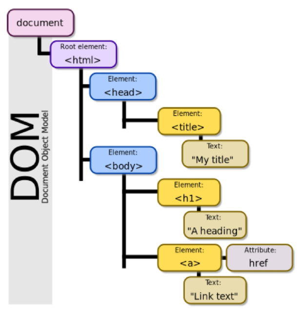
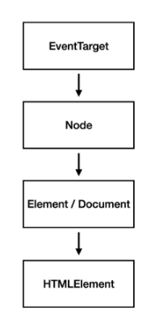
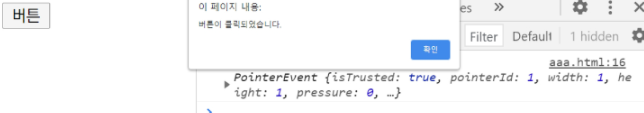
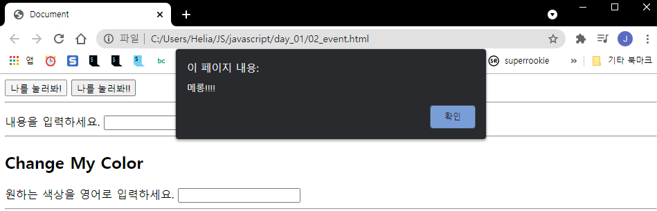
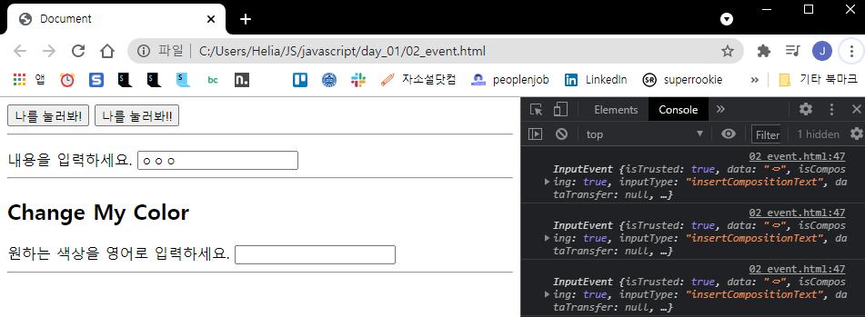
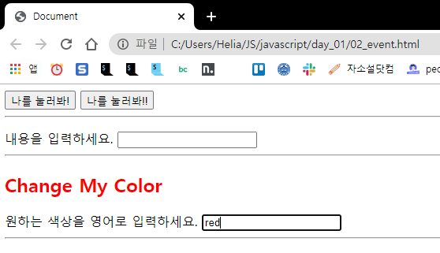
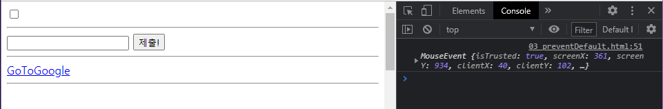
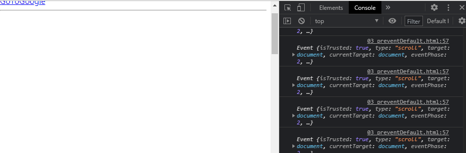
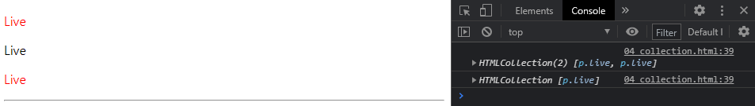
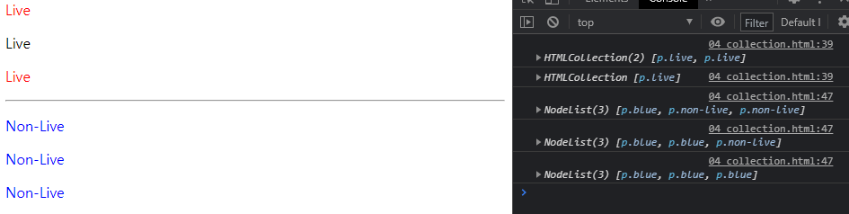

[TOC]

# JS Basis

> 자바스크립트 튜터 (시각화 ) : http://pythontutor.com/javascript.html#mode=edit

## Intro to JavaScript

### History of JavaScript

1. 핵심 인물
   - 팀 버너스리
     - WWW, URL, HTTP, HTML 최초 설계자
     - 웹의 아버지
   - 브랜던 아이크
     - JavaScript 최초 설계자
     - 모질라 재단 공동 설립자
     - 코드네임 피닉스 프로젝트 진행 (파이어폭스의 전신)
2. JS의 탄생
   - 1994 넷스케이프 커뮤니케이션스사의 Netscape Navigator (NN) 브라우저 전세계 80% 점유, 독점, 표준 역할
   - 넷스케이프 재직중이던 브랜던아이크가 HTML 동적 동작을 위해 JS 개발
     - 이름 변천사 : Mocha -> LiveScript -> JavaScript (1995)
   - 그러나 1995년 경쟁사 마이크로소프트에서 이를 채택 및 커스텀 -> Jscript를 만들어 IE 1.0에 탑재 -> 1차 브라우저 전쟁
3. 브라우저 전쟁
   - 1차 (1996-2008)
     - 넷스케이프 vs 마이크로소프트
     - 빌게이트 주도 하 MS는 1997년  IE 4 발표
       - 당시 시장점유율 90%
     - MS의 승리 - 2001년부터 IE 점유율이 90% 상회
       - 호환성 문제로 크로스 브라우징 등의 이슈 발생
     - 1998년 넷스케이프에서 나온 브랜던 아이크 외 후계자 - 모질라 재단 설립, 파이어 폭스로 IE에 대항
     - 브라우저 전쟁의 여파
       - Cross Browsing Issue
       - 표준화(통합)을 위한 노력
       - Vanilla JavaScript
   - 2차 (2009~)
     - MS vs Google
     - 2008년 Google의 Chrome 발표, 2011년 3년만에 파이어폭스 점유율 돌파, 2012년 전세계 점유율 1위 탈환
     - 승리 요인 : 압도적인 속도, 강력한 개발자 도구 제공, 웹 표준
4. 파편화와 표준화
   - 제 1차 브라우저 전쟁 이후 수 많은 브라우저에서 자체 자바스크립트 언어를 사용하게 됨
   - 결국 서로 다른 모습의 자바스크립트가 만들어 지면서 크로스 브라우징 이슈가 발생,
     웹 표준의 필요성 제기
   - 크로스 브라우징
     - W3C에서 채택된 표준 웹 기술을 채택해 서로 다른 브라우저에서 다르게 구현되는 기술을 비슷하게 만들며 웹 페이지를 제작하는 방법론 (동일성이 아닌 동등성)
     - 브라우저마자 렌더링에 사용하는 엔진이 다르기 때문
     - 1996년부터 넷스케이프는 표준 제정 필요성 주장
       - Ecmc 인터네셔널 (정보와 통신 시스템을 위한 국제적 표준화 기구)에 표준 제정 요청
     - 1997년 ECMAScript 1 (ES1)
     - 제 1차 브라우저 전쟁 이후 문제된 언어의 파편화를 해결하기 위해 크롬의 등장 이후 각 브라우저 회사 및 재단은 표준화에 더욱더 적극적으로 힘을 모으기 시작
5. 현재의 JS
   - 2015년 ES2015 (ES6) 탄생
     - "Next-gen of JS" 이라고 불리울 정도로 많은 혁신과 변화를 맞이한 버전
     - JS의 고질적인 문제들을 해결
     - 이때부터 버전 순서가 아닌 출시 년도를 붙이는 것이 공식 명칭이나 통상적으로 ES6이라 부름
     - 현재는 대부분의 표준이 ES6+로 넘어옴

<br>

**Vanila JavaScript**

- 크로스 브라우징, 간편한 활동 등을 위해 많은 라이브러리 등장 (대표적 jQuery)
- 최근 표준화된 브라우저, ES6 이후의 다양한 도구의 등장으로 순수 자바스크립트 활용의 증대

<br>

---

<br>

## DOM (Document Object Model)

**브라우저에서 할 수 있는 일**

- DOM 조작
  - 문서(HTML) 조작
- BOM 조작
  - navigator, screen, location, frames, history, XHR
- JavaScript Core (ECMAScript)
  - Data Structure(Object, Array), Conditional Expression, Iteration

1. DOM

   ```javascript
   window.document.title
   "웹페이지의 제목"
   window.document.title = "JavaScript"
   "JavaScript"
   window.document.title
   "JavaScript"
   ```

   - 웹페이지의 제목 조회, 변경 가능
   - 버튼 클릭 시 프린트 함수 실행되도록 가능 등
   - 자바스크립트도 객체지향언어이므로 .을 찍어서 접근

2. BOM

   ```javascript
   location.host
   "www.naver.com"
   location.pathname
   "/ksp/jsp/swp/swpMain.jsp"
   location.href
   "https://www.naver.com/ksp/jsp/swp/swpMain.jsp"
   ```

3. 프로그래밍 언어

   - 반복 가능

     ```javascript
     for (let i=0; i < numbers.length; i++) {
         console.log(numbers[i])
     }
     ```

<br>

**DOM 이란**

- HTML, XML 등과 같은 문서를 다루기 위한 언어 독립적인 문서 모델 인터페이스
- 문서를 구조화하고 구조화된 구성 요소를 하나의 객체로 취급하여 다루는 논리적 트리 모델
- 문서가 구조화되어 있으며 각 요소는 객체(object)로 취급
- 단순한 속성 접근, 메서드 활용 뿐만 아니라 프로그래밍 언어적 특성을 활용한 조작 가능
- 주요 객체
  - window :DOM을 표현하는 창. 가장 최상위 객체 (작성 시 생략 가능)
  - document : 페이지 콘텐츠의 Entry Point 역할을 하며, <body>등과 같은 수많은 다른 요소들을 포함
  - navigator, location, history, screen



<br>

**DOM - 해석**

- Parsing (파싱)
  - 구문 분석, 해석
  - 브라우저가 문자열을 해석하여 DOM Tree로 만드는 과정
    - PARSE - STYLE - LAYOUT

<br>

**BOM이란**

- Browser Object Model
- 자바스크립트가 브라우저와 소통하기 위한 모델
- 브라우저의 창이나 프레임을 추상화해서 프로그래밍적으로 제어할 수 있도록 제공하는 수단
  - 버튼, URL 입력창, 타이틀 바 등 브라우저 윈도우 및 웹 페이지의 일부분을 제어 가능
- window 객체는 모든 브라우저로부터 지원받으며 브라우저 window 자체를 지칭

```javascript
// 인쇄 창
window.print()

// 탭 창
window.open()

// 메세지 및 확인, 취소 버튼이 있는 대화상자 창
window.confirm()

// document도 브라우저 내에 종속되어 있기 때문에 window 전역 객체에 포함
window.document
```

<br>

### DOM 조작

**DOM 조작 - 개념**

- Document는 문서 한 장 (HTML)에 해당하고 이를 조작
- DOM 조작 순서
  1. 선택(select)
  2. 변경(manipulation)


<br>

**DOM 조작 - Document 위치**

- window - document

<br>

**DOM 관련 객체의 상속 구조**



- EventTarget
  - Event Listenr를 가질 수 있는 객체가 구현하는 DOM 인터페이스
- Node
  - 여러 가지 DOM 타입들이 상속하는 인터페이스
- Element
  - Document 안의 모든 객체가 상속하는 가장 범용적인 기반 클래스
  - 부모인 Node와 그 부모인 EventTarget의 속성을 상속

- Document
  - 브라우저가 불러온 웹 페이지를 나타냄
  - DOM 트리의 진입점(entry point) 역할을 수행
- HTMLElement
  - 모든 종류의 HTML 요소
  - 부모인 element의 속성 상속

<br>

**DOM 선택 - 선택 관련 메서드**

- `Document.querySelector()`
  - 제공한 선택자와 일치하는 element 하나 선택
  - 제공한 CSS selector를 만족하는 첫번째 element 객체를 반환 (없다면 null)
- `Document.querySelectorAll()`
  - 제공한 선택자와 일치하는 여러 element를 선택
  - 매칭할  하나 이상의  셀렉터를 포함하는 유효한 CSS selector를 인자(문자열)로 받음
  - 지정된 셀렉터에 일치하는 NodeList를 반환
- `getElementById()`
- `getElementByTagName()`
- `getElementByClassName`

=> 이 세개는 잘 사용하지 않음. 읽을 줄만 알자!

- 우리가 `querySelector()`, `querySelectorAll()`을 사용하는 이유
  - id, class 그리고 tag 선택자 등을 모두 사용가능하기 때문에 더 구체적이고 유연하게 선택 가능

<br>

**DOM 선택 - 선택 메서드별 반환 타입**

- 단일 element
  - `getElementById()`
  - `querySelector()`
- HTMLCollection (live collection)
  - `getElementsByTagName()`
  - `getElementByClassName()`
- NodeList(static collection)
  - `querySelectorAll()`

<br>

**DOM 선택 - HTML Collection & NodeList**

- 둘 다 배열과 같이 각 항목을 접근하기 위한 인덱스를 제공 ( 유사 배열 )
- HTMLCollection
  - name, id, 인덱스 속성으로 각 항목들에 접근 가능
- NodeList
  - 인덱스 번호로만 각 항목들에 접근 가능
  - 단, HTMLCollection과 달리 배열에서 사용하는 foreach함수 및 다양한 메서드 사용가능
- 둘 다 Live Collection으로 DOM의 변경사항을 실시간으로 반영하지만, **querySelectorAll()에 의해 반환되는 NodeList는 Static Collection**

<br>

**DOM 선택 - Collection**

- Live collection
  - 문서가 바뀔 때 실시간으로 업데이트
    - 내가 변수에 값을 할당했더라도 업데이트 되어 값이 바뀔 수 있음
  - DOM의 변경사항을 실시간으로 collection에 반영
  - 예시) HTMLCollection, NodeList
- Static Collection (non-live)
  - DOM이 변경되어도 collection 내용에는 영향을 주지 않음
  - `querySelectorAll()`의 반환 NodeList만 static

<br>

**DOM 변경 - 변경 관련 메서드**

- `Document.createElement()`
  - 주어진 태그명을 사용해 HTML 요소를 만들어 반환 =
- `ParentNode.append()`
  - 특정 부모 노드의 자식 노드 리스트 중 마지막 자식 다음에 Node 객체나 DOMString을 삽입 (반환값 없음)
  - **여러 개**의 Node 객체, DOM String을 추가 할 수 있음
- `Node.appendChild()`
  - **한 노드**를 특정 부모 노드의 자식 노드 리스트 중 마지막 자식으로 삽입(Node만 추가 가능)
  - 만약 주어진 노드가 이미 문서에 존재하는 다른 노드를 참조한다면 새로운 위치로 이동
- `ChildNode.remove()`
  - 이를 포함하는 트리로부터 특정 객체를 제거
- `Node.removeChild()`
  - DOM에서 자식 노드를 제거하고 제거 된 노드를 반환
  - Node는 인자로 들어가는 자식 노드의 부모 노드

<br>

**remove() vs removeChild()**

```javascript
// remove()
// id가 'content'인 태그를 제거
let el = document.querySelector('#content')
el.remove()

// removeChild()
// 부모 노드를 알 때 지정된 자식 요소를 제거
let parent = document.querySelector('#parent')
let child = document.querySelector('#child')
let oldChild = parent.removeChild(child)
```

<br>

**DOM 변경 - 변경 관련 속성 (property)**

- `Node.textContent`
  - 노드와 그 자손의 텍스트 컨텐츠(DOMString)를 표현 (해당 요소 내부의 raw text)
  - 노드의 모든 요소 컨텐츠를 가져옴
- `Node.innerText`
  - textContent와 동일하지만 raw text가 최종적으로 렌더링 된 모습을 표현 (사람이 읽을 수 있는 요소만 남김)
  - 즉, 줄 바꿈을 인식하고 숨겨진 내용을 무시하는 듯 최종적으로 스타일링이 적용 된 모습으로 표현
- `Element.innerHTML`
  - 요소(element) 내에 포함 된 HTML 마크업을 반환
  - XSS공격에 취약점이 있으므로 사용시 주의
- `Element.setAttribute(name, value)`
  - 지정된 요소의 값을 설정
  - 속성이 이미 존재하면 값을 업데이트, 그렇지 않으면 지정된 이름과 값으로 새 속성 추가
- `Element.getAttribute()`
  - 해당 요소의 지정된 값(문자열)을 반환
  - 인자는 값을 얻고자 하는 속성의 이름

<br>

**XSS (Cross-site scripting**

- 공격자가 웹 사이트 클라이언트 측 코드에 악성 스크립트를 삽입해 공격하는 방법
- 이 코드의 실행은 피해자가 하며 공격과 액세스 제어를 우회하고 사용자를 가장 할 수 있도록 함 (csrf 공격과 유사)
- 예시
  - 게시판이나 메일 등 악성 자바스크립트 코드를 삽입 해 개발자가 고려하지 않는 기능이나 공격이 작동
  - 공격에 성공하면 사용자의 쿠키나 세션 등 민감한 정보를 탈취

<br>

**innerText vs innerHTML**

```javascript
ulTag.innerText = '<li>춘천</li>'
ulTag.innerHTML = '<li>춘천</li>'
```

웹페이지에 innerText는 `<li>춘천</li>` 그대로 뜨지만 innerHTML은 `춘천`으로 뜸 

<br>

**DOM 변경 예시**

```javascript
const newLiTag = document.createElement('li') // undefined
newLiTag.innerText = '춘천'
newLiTag // <li>춘천</li>
const ulTag = document.querySelector('ul') // undefined
ulTag.appendChild(newLiTag)
ulTag
/* 
<ul>
    <li class="location">...</li>
    <li class="location">...</li>
    <li class="location">...</li>
    <li class="location">...</li>
    <li>
        ::marker
        "춘천"
    </li>
</ul>
*/
ulTag.removeChild(newLiTag) // <li>춘천</li>
```

```javascript
const h1 = document.querySelector('h1')
h1.textContent = 'Goodbye Helia'
h1.style.backgroundColor = 'red'
const h2 = document.querySelector('h2')
h2.getAttribute('id') // 'location-header'
h2.setAttribute('class, 'location')
```

<br>

주석

- 한줄 주석  `// 주석내용`
- 여러 줄 주석
  - /*
    comment 1
    comment 2
    */

<br>

---

<br>

## Event Listener

### Event

> 다양한 이벤트 유형 https://developer.mozilla.org/en-US/docs/Web/Events

- 네트워크 활동 혹은 사용자와의 상호작용 같은 사건의 발생을 알리기 위한 객체
- 이벤트는 마우스를 클릭하거나 키보드를 누르는 등 사용자 행동에 의해 발생할 수도 있고,
  특정 메서드를 호출(HTMLElement.click()하여 프로그래밍적으로도 만들어 낼 수 있음)
- 이벤트 처리기(Event-handler)
  - **`EventTarget.addEventListener()`**
  - 해당 메서드를 통해 다양한 요소에서 이벤트를 붙일 수 있음
  - `removeEventListener()`를 통해 이벤트를 제거 가능

<br>

**Event 기반 인터페이스**

- AnimationEvent, ClipboardEvent, DragEvent 등
- 그 중에서도 "UIEvent"
  - 간단한 사용자 인터페이스 이벤트
  - Event의 상속을 받음
  - MouseEvent, KeyboardEvent, InputEvent, FocusEvent 등의 부모 객체 역할을 함

<br>

**Event가 필요한 이유**

- load, mouseover, keydown, click
- "~ 하면 ~한다"
- "클릭하면 경고 창을 띄운다."
- "특정 이벤트가 발생하면 할 일을 등록한다."

<br>

**Event handler**

- `EventTarget.addEventListener()`
- 지정한 이벤트가 대상에 전달될 때마다 호출할 함수를 설정
- 이벤트를 지원하는 모든 객체(Element, Document, Window 등)를 대상으로 지정 가능
- `target.addEventListenr(type, listenr[, options])`
- type: 반응 할 이벤트 유형(대소문자 구분 문자열)
- listener: 지정된 타입의 이벤트가 발생 했을 때 알림을 받는 객체
- EventListener 인터페이스 혹은 JS function 객체(콜백 함수)여야 함

<br>

```python
# 파이썬

def hello():
    print('hi')

hello()

h = hello
h()
```

```javascript
// javascript

function hello() {
    console.log('hi')
}

hello()
```

- : 대신 {}
- `print()` 대신 `console.log()`
- 함수를 변수에다 저장해서 쓸 수도 있음. => 함수는 모두 1급 객체
  - 변수로 사용이 가능하다면 인자로 넣을 수 있다.

<br>

**call back function**

- 파이썬
  - ex) `path('<str:username>/', views.profile, name=profile)`
  - path라는 함수 안에서 `views.profile`이라는 함수가 연결되어 실행, 이를 call back이라고 함.
- 자바스크립트
  - javascript 아래 call back function은 인자가 두개
    - 하나는 'click',  하나는 event라는 함수

```javascript
btn.addEventListner('click', function (event){
    alert('버튼이 활성화되었습니다.')
    console.log(event)
})

```

<br>

> 복습
>
> EventTarget
>
> - Event Listenr를 가질 수 있는 객체가 구현하는 DOM 인터페이스

<br>

**addEventListenr**

- "특정 이벤트가 발생하면, 할 일을 등록하자"
- EventTarget.addEventListenr(type, lister)

```javascript
btn.addEventListner('click', function (event){
    alert('버튼이 활성화되었습니다.')
    console.log(event)
})
```



(버튼을 클릭하면, alert를 하겠다)

<br>

# 실습

## 이벤트 발생

> event.html

1. onclick

```javascript
// body

  <!-- 1. onclick -->
  <button onclick="alertMessage()">나를 눌러봐!</button>

// script
      const alertMessage = function () {
        alert('메롱!!!!')
      }
```




2. addEventListner

```javascript
// body
  <!-- 2. addEventListener -->
  <button id="my-button">나를 눌러봐!!</button>

// script
      const myButton = document.querySelector('#my-button') //버튼이 여러개이므로 아이디로
      myButton.addEventListenr('click', alertMessage) // 함수 괄호 필요없음, 함수명만
```


3. addEventListener2

```javascript
// body
	<!-- 3. addEventListener2 -->
  <p id="my-paragraph"></p>

  <form action="#">
    <label for="my-text-input">내용을 입력하세요.</label>
    <input id="my-text-input" type="text">
  </form>

// script1
      const myTextInput = document.querySelector('#my-text-input')

      myTextInput.addEventListener('input', function (event) {
        console.log(event)
      })
	//input 이벤트는 작성될때마다, 지워질때마다 발생

// script2
      const myTextInput = document.querySelector('#my-text-input')

      myTextInput.addEventListener('input', function (event) {
        console.log(event)
        const myPtag = document.querySelector('#my-paragraph')
        // myPtag.innerText = ''
      })
	// InputEvent - target: input#my-text-input - value: "ㅇ"

// script3 - 완성
      const myTextInput = document.querySelector('#my-text-input')

      myTextInput.addEventListener('input', function (event) {
        console.log(event)
        const myPtag = document.querySelector('#my-paragraph')
        myPtag.innerText = event.target.value // p tag에 출력됨 
          //target.value 대신 console.data를 사용하면 누적이 안됨
      })

```




4. addEventListener3

```javascript
// body
  <!-- 4. addEventListener3 -->
  <h2>Change My Color</h2>
    <label for="change-color-input">원하는 색상을 영어로 입력하세요.</label>
    <input id="change-color-input"></input>
  <hr>

// script
      const colorInput = document.querySelector('#change-color-input')
      colorInput.addEventListener('input', function (event) {
        const h2Tag = document.querySelector('h2')
        h2Tag.style.color = event.target.value
      })

      // 4-2 이렇게도 가능
      const colorInput = document.querySelector('#change-color-input')

      const changeColor = function (event) { // 함수를 정의
        const h2Tag = document.querySelector('h2')
        h2Tag.style.color = event.target.value
      }
      
      colorInput.addEventListener('input', changeColor) //함수 이름만 사용
```



<br>

## 이벤트 취소

> preventDefault.html

**preventDefault()**

- 현재 이벤트의 기본 동작을 중단
- 태그의 기본 동작(a 태그는 클릭 시 페이지 이동, form 태그는 폼 데이터를 전송)
- 이벤트의 전파를 막지 않고 이벤트의 기본동작만 중단
  - a태그 클릭시 클릭했다는 event는 남겨두나 페이지 이동이라는 동작은 막음

1.

```javascript
// body

// script
  <!-- 3. link -->
  <a href="https://google.com/" target="_blank" id="my-link">GoToGoogle</a>
  <hr>
  
  <script>
    const checkBox = document.querySelector('#my-checkbox')

    checkBox.addEventListener('click', function () {
      event.preventDefault()
      console.log(event) // 해보면 이벤트는 발생함을 알 수 있음
    })
```


- 체크박스에 체크가 안됨.

<br>

2.

```javascript
// body
  <!-- 2. submit -->
  <form action="/articles/" id="my-form">
    <input type="text">
    <input type="submit" value="제출!">
  </form>
  <hr>
        
// script
    // 2
    const formTag = document.querySelector('#my-form')

    formTag.addEventListener('submit', function (event) {
      // console.log(event)
      event.preventDefault() // 페이지로 이동되지 않도록 함
      event.target.reset() // 인풋값을 사라지게 함
    })
```

- 입력하고 제출해도 페이지가 이동되지않고 인풋에 입력한 글자가 사라짐

<br>

3.

```javascript
// body
  <!-- 3. link -->
  <a href="https://google.com/" target="_blank" id="my-link">GoToGoogle</a>
  <hr>
      
// script
    // 3
    const aTag = document.querySelector('#my-link')

    aTag.addEventListener('click', function (event) {
      console.log(event)
      event.preventDefault()
    })
```



이벤트는 발생하나 링크로 이동하지 않음


4. 단, 스크롤은 취소시킬 수 없음

```javascript
// body
// script
    // 4
    document.addEventListener('scroll', function (event) {
      console.log(event)
      // console.log(event.cancelable)
      event.preventDefault
    })
```



- 스크롤해도 취소할 수 없음
- `console.log(event.cancelable)`값이 False면 취소하지 못함

<br>


## collection

> collection.html

1. live

```javascript
// body
  <div>
    <p class="live">Live</p>
    <p class="live">Live</p>
    <p class="live">Live</p>
  </div>

// script
    // 1
    const liveNodes = document.getElementsByClassName('live')
    //  console.log(liveNodes)

     for ( let i = 0; i < liveNodes.length; i++) {
       liveNodes[i].className = 'red'
     }
```



- 두번째가 선택이 안되는 이유 : 두번째 반복을 도는 시점에 i는 2개가 됨.


2. nonlive

```javascript
// body
	<div>
    <p class="non-live">Non-Live</p>
    <p class="non-live">Non-Live</p>
    <p class="non-live">Non-Live</p>
  </div>

// script
     // 2
     const nonLiveNodes = document.querySelectorAll('.non-live')
     
     for (let i = 0; i < nonLiveNodes.length; i++) {
       nonLiveNodes[i].className = 'blue'
       console.log(nonLiveNodes)
     }
```




# ECMAScript 6 Introduction

## ECMA