[TOC]

# Node.js

## BACKGROUND

- Node.js v14
  - 멀티스레딩,
  - (강의) 스레드풀, 스트림 메모리 확인, child_process 예제
  - (강의)패키지들도 가능한한 최신 버전을 사용했으나 확인할 것!
- 강의내용
  - axios 사용 (AJAX 요청 라이브러리)
  - 템플릿 엔진
    - 퍼그 => 넌적스(Nunjucks)
    - EJS는 비추. 실무에서 사용하지 않음 
    - 평이 좋은 넌적스와 핸들바스에서 고민하닥 세팅이 쉬운 넌적스로 결정
  - 이미지 리사이징은 GM대신 sharp사용

<br>

### 01. 노드의 정의

> 노드는 서버가 아님!! 자바스크립트 엔진도 아님(엔진은 크롬 V8)

- 크롬 V8 자바스크립트 엔진으로 빌드된 자바스크립트 런타임
  - 서버의 역할도 수행할 수 있는 자바스크립트 런타임
    - 런타임: 실행기
      - 특정 언어로 만든 프로그램들을 실행할 수 있게 해주는 가상 머신(크롬의 V8 엔진 사용)의 상태
      -  노드: 자바스크립트로 만든 프로그램들을 실행할 수 있게 해줌
      - 다른 런타임으로는 웹 브라우저(크롬, 엣지, 사파리, 파이어폭스 등)가 있음
    - 서버소스코드를 넣으면 서버의 역할을 하는 것
    - 타입스크립트의 런타임은 deno(노드 스펠링 순서 바꾼 것)
    - 노드의 효과
      - 노드가 없을때 자바스크립트는 브라우저가 HTML을 읽으면서 script를 읽었음. (HTML에 종속)
      - 노드에서는 자바스크립트가 브라우저나 HTML의 종속성에서 벗어남. 
    - 노드 이전에도 자바스크립트 런타임을 만들기 위한 많은 시도 But, 엔진 속도 문제
    - 크롬 V8이 속도 문제를 해결하면서 node.js로 빠르게 자바스크립트를 돌릴 수 있게됨
      - <u>싱글스레드 + 비동기 모델</u>
    - 자바스크립트로 데스크탑앱, 모바일 앱 등등을 만들 수도 있게 됨. 자바스크립트의 확장성에 기여했음
  - 노드로 자바스크립트로 작성된 서버를 실행할 수 있음.
    ● 서버 실행을 위해 필요한 http/https/http2 모듈을 제공

#### 내부 구조

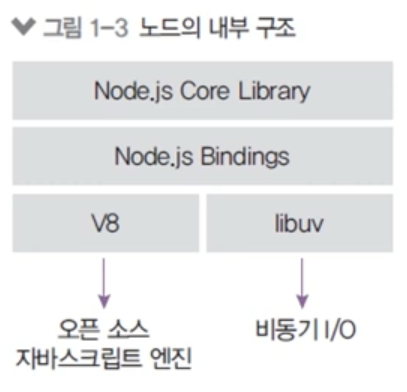

- v8과 libuv를 내부적으로 포함
- v8 엔진: 오픈 소스 자바스크립트 엔진 -> 속도 문제 개선
- libuv: 노드의 특성인 이벤트 기반, 논블로킹 I/O 모델을 구현한 라이브러리
  - 내부적으로는 C++


### 02. 노드의 특징

#### 이벤트 기반

> 대부분의 프로그램들은 이벤트 기반(사용자와 인터렉션)
>
> 동일한 응답을 할 수 있도록 미리 동작함수를 등록

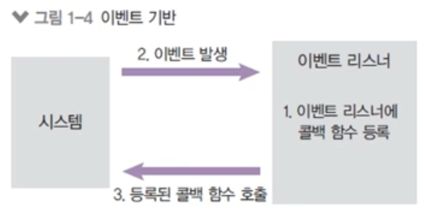

- 이벤트가 발생할 때 미리 지정해둔 작업을 수행
  - 이벤트의 예: 클릭, 네트워크 요청, 타이머 등
  - 이벤트리스너: 이벤트를 등록하는 함수
  - 콜백 함수: 이벤트가 발생했을 때 실행될 함수

<br>

#### 논블로킹 I/O

> 노드는 블로킹이면서 동기, 비동기면서 논블로키 I/O를 지원
>
> 동시라고 생각하기 쉬운데 동시가 아님.

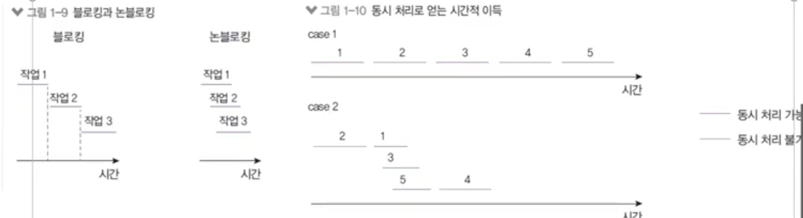

- 논블로킹: 오래 걸리는 함수를 백그라운드로 보내서 다음 코드가 먼저 실행되게 하고, 나중에 오래 걸리는 함수를 실행
  - 논블로킹 방식 하에서 일부 코드는 백그라운드에서 병렬로 실행됨
  - 일부 코드: I/O 작업(파일 시스템 접근, 네트워크 요청), 압축, 암호화 등
  - 나머지 코드는 블로킹 방식으로 실행
    - I/O 작업이 많을 때 노드 활용성이 극대화

#### 프로세스 vs 스레드

> 노드는 프로세스 안에 스레드가 여러개 뜨는데 하나만 컨트롤 할 수 있음. 그래서 싱글스레드라고 함. 따지면 멀티스레드! (14버전부터 멀티스레드가 가능)

- 프로세스: 운영체제에서 할당하는 작업의 단위, 프로세스 간 자원 공유 X
- 스레드: 프로세스 내에서 실행되는 작업의 단위, 부모 프로세스 자원 공유

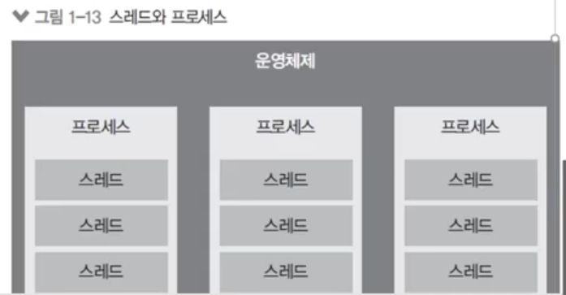

- 노드 프로세스는 멀티 스레드이지만 직접 다룰 수 있는 스레드는 하나이기 때문에 싱글 스레드라고 표현 (인간의 사고로 멀티스레드 어려움..)
  - 나머지 스레드들은 코드를 동시에 돌릴 준비를 하고 있음(대기)
- 노드는 주로 멀티 스레드 대신 멀티 프로세스 활용 
- 노드는 14버전부터 멀티 스레드 사용 가능

#### 싱글 스레드

> 점원과 주방 관리가 중요!

- 싱글스레드라 주어진 일을 하나밖에 처리하지 못함
  - 블로킹이 발생하는 경우 나머지 작업은 모두 대기해야 함 -> 비효율 발생

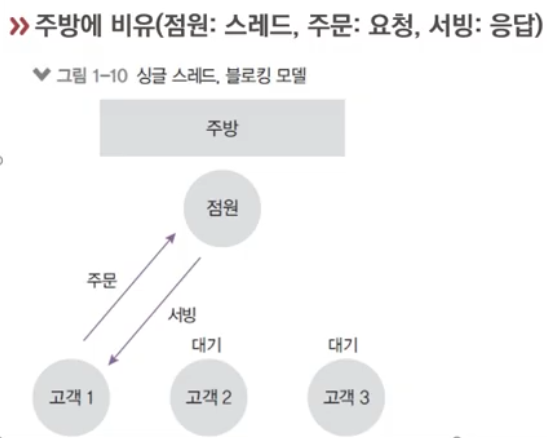

- 대신 논 블로킹 모델을 채택하여 일부 코드(I/O)를 백그라운드(다른 프로세스)에서 실행 가능
  - 요청을 먼저 받고, 완료될 때 응답함
  - I/O 관련 코드가 아닌 경우 싱글 스레드, 블로킹 모델과 같아짐

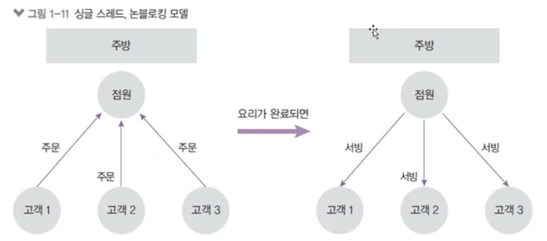

<br>

#### 멀티 스레드 모델과의 비교

> 노드 주력은 싱글스레드. 아쉬워서 14버전에서 추가해준 것.

- 싱글 스레드 모델은 에러를 처리하지 못하는 경우 멈춤
  - 프로그래밍 난이도 쉽고, CPU, 메모리 자원 적게 사용
- 멀티 스레드 모델은 에러 발생 시 새로운 스레드를 생성하여 극복
  - 단, 새로운 스레드 생성이나 놀고 있는 스레드 처리에 비용 발생
  - 프로그래밍 난이도 어려움
  - 스레드 수만큼 자원을 많이 사용함
- 점원:  스레드, 주문: 요청, 서빙: 응답

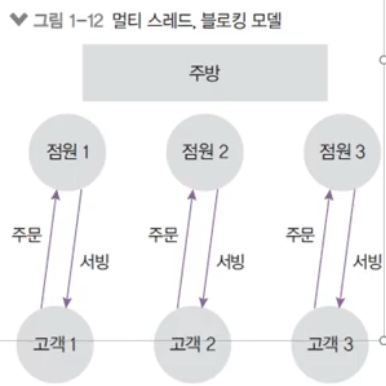

#### 멀티 스레드의 활용

- 노드 14버전
  - 멀티 스레드를 사용할 수 있도록 worker_threads 모듈 도입
  - CPU를 많이 사용하는 작업인 경우에 활용 가능
  - 멀티 프로세싱만 가능했던 아쉬움을 달래줌

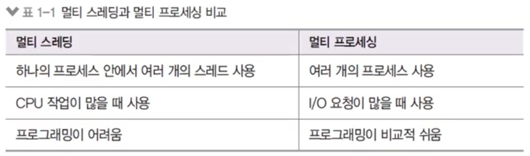

### 03. 노드의 역할

#### 서버로서의 노드

- 서버: 네트워크를 통해 클라이언트에 정보나 서비스를 제공하는 컴퓨터 또는 프로그램
- 클라이언트: 서버에 요청을 보내는 주체(브라우저, 데스크탑 프로그램, 모바일 앱,
  다른 서버에 요청을 보내는 서버)
- 예시
  - 브라우저(클라이언트, 요청)가 길벗 웹사이트(서버, 응답)에 접속
  - 핸드폰(클라이언트)을 통해 앱스토어(서버)에서 앱 다운로드
- 노드 != 서버
- But, 노드는 서버를 구성할 수 있게 하는 모듈(4장에서 설명)을 제공

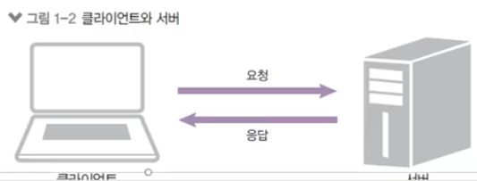


**노드 서버의 장단점**

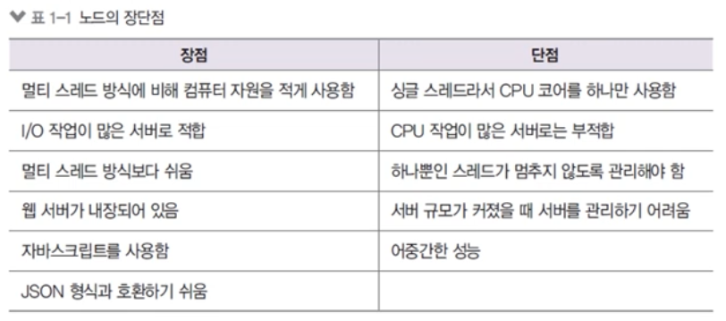

- CPU 작업을 위해 AWS Lambda나 Google Cloud Functions같은 별도 서비스
  사용

- 페이팔, 넷플릭스, 나사, 월마트, 링크드인, 우버 등에서 메인 또는 서브 서버로 사용
- 이미지 리사이징, 암호화(진상 손님..)에는 적합하지 않음(=> 멀티스레딩 활용)
- 머신러닝, 게임, 비트코인 채굴 등 고성능 작업에는 적합하지 않음

#### 서버 외의 노드

- 자바스크립트 런타임이기 때문에 용도가 서버에만 한정되지 않음
- 웹, 모바일, 데스크탑 애플리케이션에도 사용
  - 웹 프레임워크: Angular, React, Vue, Meteor 등
  - 모바일 앱 프레임워크: React Native
  - 데스크탑 개발 도구: Electron(Atom, Slack, VSCode, Discord 등 제작)
- 위 프레임워크가 노드 기반으로 동작함

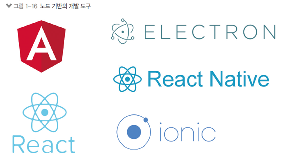

## 시작하기

**설치하기**

[https://nodejs.org](https://nodejs.org/) 

- LTS가 안정적인 버전

> This script will install Python and the Visual Studio Build Tools, necessary
> to compile Node.js native modules. Note that Chocolatey and required Windows
> updates will also be installed.
>
> 설치 안하면 회원가입 암호화 등에서 곤란해짐.

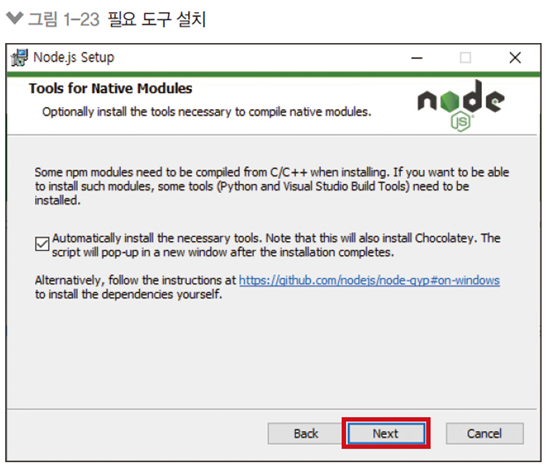

- Chocolatey: 윈도우즈에서 소프트웨어 설치를 쉽게 할 수 있는 툴

- 리눅스(우분투 18 LTS 기준)터미널에 아래 코드 입력

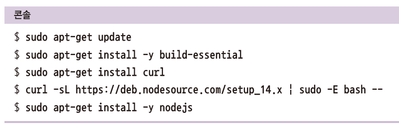

**버전확인 **

- 설치 완료 후 윈도, 맥, 리눅스 모두 명령 프롬프트나 터미널 실행 후 다음 명령어 입력'
  - 버전은 다를 수 있지만 버전이 뜨면 설치 성공'

```bash
node -v
npm -v
```

- npm 버전을 업데이트 하려면 다음 명령어 입력
  - 맥/리눅스는 sudo를 앞에 붙여야

```shell
npm i -g npm
```

```shell
 C:\Users\Helia>npm -v
6.14.13

C:\Users\Helia>npm install -g npm
C:\Users\Helia\AppData\Roaming\npm\npm -> C:\Users\Helia\AppData\Roaming\npm\node_modules\npm\bin\npm-cli.js
C:\Users\Helia\AppData\Roaming\npm\npx -> C:\Users\Helia\AppData\Roaming\npm\node_modules\npm\bin\npx-cli.js
+ npm@7.19.1
added 256 packages from 146 contributors in 8.254s

C:\Users\Helia>npm -v
7.19.1

```

> ```shell
> Forcing web requests to allow TLS v1.2 (Required for requests to Chocolatey.org)
> Getting latest version of the Chocolatey package for download.
> Not using proxy.                                                                    Getting Chocolatey from https://community.chocolatey.org/api/v2/package/chocolatey/0.10.15.Downloading https://community.chocolatey.org/api/v2/package/chocolatey/0.10.15 to C:\Users\Helia\AppData\Local\Temp\chocolatey\chocoInstall\chocolatey.zip       Not using proxy.                                                                    Extracting C:\Users\Helia\AppData\Local\Temp\chocolatey\chocoInstall\chocolatey.zip to C:\Users\Helia\AppData\Local\Temp\chocolatey\chocoInstall
> Installing Chocolatey on the local machine
> Creating ChocolateyInstall as an environment variable (targeting 'Machine')
>   Setting ChocolateyInstall to 'C:\ProgramData\chocolatey'
> WARNING: It's very likely you will need to close and reopen your shell
>   before you can use choco.
> Restricting write permissions to Administrators
> We are setting up the Chocolatey package repository.
> The packages themselves go to 'C:\ProgramData\chocolatey\lib'
>   (i.e. C:\ProgramData\chocolatey\lib\yourPackageName).
> A shim file for the command line goes to 'C:\ProgramData\chocolatey\bin'
>   and points to an executable in 'C:\ProgramData\chocolatey\lib\yourPackageName'.
> 
> Creating Chocolatey folders if they do not already exist.
> 
> WARNING: You can safely ignore errors related to missing log files when
>   upgrading from a version of Chocolatey less than 0.9.9.
>   'Batch file could not be found' is also safe to ignore.
>   'The system cannot find the file specified' - also safe.
> chocolatey.nupkg file not installed in lib.
>  Attempting to locate it from bootstrapper.
> PATH environment variable does not have C:\ProgramData\chocolatey\bin in it. Adding...
> 경고: Not setting tab completion: Profile file does not exist at
> 'C:\Users\Helia\Documents\WindowsPowerShell\Microsoft.PowerShell_profile.ps1'.
> Chocolatey (choco.exe) is now ready.
> You can call choco from anywhere, command line or powershell by typing choco.
> Run choco /? for a list of functions.
> You may need to shut down and restart powershell and/or consoles
>  first prior to using choco.
> Ensuring Chocolatey commands are on the path
> Ensuring chocolatey.nupkg is in the lib folder
> Chocolatey v0.10.15
> Upgrading the following packages:
> python;visualstudio2017-workload-vctools
> By upgrading you accept licenses for the packages.
> python is not installed. Installing...
> Progress: Downloading python3 3.9.6... 100%
> Progress: Downloading python3 3.9.6... 100%
> Progress: Downloading vcredist2015 14.0.24215.20170201... 100%
> Progress: Downloading vcredist2015 14.0.24215.20170201... 100%
> Progress: Downloading vcredist140 14.29.30037... 100%
> Progress: Downloading vcredist140 14.29.30037... 100%
> Progress: Downloading chocolatey-core.extension 1.3.5.1... 100%
> Progress: Downloading chocolatey-core.extension 1.3.5.1... 100%
> Progress: Downloading KB3033929 1.0.5... 100%
> Progress: Downloading KB3033929 1.0.5... 100%
> Progress: Downloading chocolatey-windowsupdate.extension 1.0.4... 100%
> Progress: Downloading chocolatey-windowsupdate.extension 1.0.4... 100%
> Progress: Downloading KB3035131 1.0.3... 100%
> Progress: Downloading KB3035131 1.0.3... 100%
> Progress: Downloading KB2919355 1.0.20160915... 100%
> Progress: Downloading KB2919355 1.0.20160915... 100%
> Progress: Downloading KB2919442 1.0.20160915... 100%
> Progress: Downloading KB2919442 1.0.20160915... 100%
> Progress: Downloading KB2999226 1.0.20181019... 100%
> Progress: Downloading KB2999226 1.0.20181019... 100%
> Progress: Downloading python 3.9.6... 100%
> Progress: Downloading python 3.9.6... 100%
> 
> chocolatey-core.extension v1.3.5.1 [Approved]
> chocolatey-core.extension package files upgrade completed. Performing other installation steps.
>  Installed/updated chocolatey-core extensions.
>  The upgrade of chocolatey-core.extension was successful.
>   Software installed to 'C:\ProgramData\chocolatey\extensions\chocolatey-core'
> 
> chocolatey-windowsupdate.extension v1.0.4 [Approved]
> chocolatey-windowsupdate.extension package files upgrade completed. Performing other installation steps.
>  Installed/updated chocolatey-windowsupdate extensions.
>  The upgrade of chocolatey-windowsupdate.extension was successful.
>   Software installed to 'C:\ProgramData\chocolatey\extensions\chocolatey-windowsupdate'
> 
> KB3035131 v1.0.3 [Approved]
> kb3035131 package files upgrade completed. Performing other installation steps.
> Skipping installation because update KB3035131 does not apply to this operating system (Microsoft Windows 10 Education).
> Environment Vars (like PATH) have changed. Close/reopen your shell to
>  see the changes (or in powershell/cmd.exe just type `refreshenv`).
>  The upgrade of kb3035131 was successful.
>   Software install location not explicitly set, could be in package or
>   default install location if installer.
> 
> KB3033929 v1.0.5 [Approved]
> kb3033929 package files upgrade completed. Performing other installation steps.
> Skipping installation because update KB3033929 does not apply to this operating system (Microsoft Windows 10 Education).
> Environment Vars (like PATH) have changed. Close/reopen your shell to
>  see the changes (or in powershell/cmd.exe just type `refreshenv`).
>  The upgrade of kb3033929 was successful.
>   Software install location not explicitly set, could be in package or
>   default install location if installer.
> 
> KB2919442 v1.0.20160915 [Approved]
> kb2919442 package files upgrade completed. Performing other installation steps.
> Skipping installation because this hotfix only applies to Windows 8.1 and Windows Server 2012 R2.
> Environment Vars (like PATH) have changed. Close/reopen your shell to
>  see the changes (or in powershell/cmd.exe just type `refreshenv`).
>  The upgrade of kb2919442 was successful.
>   Software install location not explicitly set, could be in package or
>   default install location if installer.
> 
> KB2919355 v1.0.20160915 [Approved]
> kb2919355 package files upgrade completed. Performing other installation steps.
> Skipping installation because this hotfix only applies to Windows 8.1 and Windows Server 2012 R2.
> Environment Vars (like PATH) have changed. Close/reopen your shell to
>  see the changes (or in powershell/cmd.exe just type `refreshenv`).
>  The upgrade of kb2919355 was successful.
>   Software install location not explicitly set, could be in package or
>   default install location if installer.
> 
> KB2999226 v1.0.20181019 [Approved] - Possibly broken
> kb2999226 package files upgrade completed. Performing other installation steps.
> Skipping installation because update KB2999226 does not apply to this operating system (Microsoft Windows 10 Education).
> Environment Vars (like PATH) have changed. Close/reopen your shell to
>  see the changes (or in powershell/cmd.exe just type `refreshenv`).
>  The upgrade of kb2999226 was successful.
>   Software install location not explicitly set, could be in package or
>   default install location if installer.
> 
> vcredist140 v14.29.30037 [Approved]
> vcredist140 package files upgrade completed. Performing other installation steps.
> Downloading vcredist140-x86
>   from 'https://download.visualstudio.microsoft.com/download/pr/76a91598-ca94-410b-b874-c7fa26e400da/91C21C93A88DD82E8AE429534DACBC7A4885198361EAE18D82920C714E328CF9/VC_redist.x86.exe'
> Progress: 100% - Completed download of C:\Users\Helia\AppData\Local\Temp\chocolatey\vcredist140\14.29.30037\VC_redist.x86.exe (13.14 MB).
> Download of VC_redist.x86.exe (13.14 MB) completed.
> Hashes match.
> Installing vcredist140-x86...
> vcredist140-x86 has been installed.
> Downloading vcredist140-x64 64 bit
>   from 'https://download.visualstudio.microsoft.com/download/pr/f1998402-3cc0-466f-bd67-d9fb6cd2379b/A1592D3DA2B27230C087A3B069409C1E82C2664B0D4C3B511701624702B2E2A3/VC_redist.x64.exe'
> Progress: 100% - Completed download of C:\Users\Helia\AppData\Local\Temp\chocolatey\vcredist140\14.29.30037\VC_redist.x64.exe (24 MB).
> Download of VC_redist.x64.exe (24 MB) completed.
> Hashes match.
> Installing vcredist140-x64...
> vcredist140-x64 has been installed.
>   vcredist140 may be able to be automatically uninstalled.
> Environment Vars (like PATH) have changed. Close/reopen your shell to
>  see the changes (or in powershell/cmd.exe just type `refreshenv`).
>  The upgrade of vcredist140 was successful.
>   Software installed as 'exe', install location is likely default.
> 
> vcredist2015 v14.0.24215.20170201 [Approved]
> vcredist2015 package files upgrade completed. Performing other installation steps.
>  The upgrade of vcredist2015 was successful.
>   Software install location not explicitly set, could be in package or
>   default install location if installer.
> 
> python3 v3.9.6 [Approved]
> python3 package files upgrade completed. Performing other installation steps.
> Installing 64-bit python3...
> python3 has been installed.
> Python installed to: 'C:\Python39'
> Restricting write permissions to Administrators
>   python3 can be automatically uninstalled.
> Environment Vars (like PATH) have changed. Close/reopen your shell to
>  see the changes (or in powershell/cmd.exe just type `refreshenv`).
>  The upgrade of python3 was successful.
>   Software installed as 'exe', install location is likely default.
> 
> python v3.9.6 [Approved]
> python package files upgrade completed. Performing other installation steps.
>  The upgrade of python was successful.
>   Software install location not explicitly set, could be in package or
>   default install location if installer.
> visualstudio2017-workload-vctools is not installed. Installing...
> Progress: Downloading chocolatey-visualstudio.extension 1.9.0... 100%
> Progress: Downloading chocolatey-visualstudio.extension 1.9.0... 100%
> Progress: Downloading chocolatey-visualstudio.extension 1.9.0... 100%
> Progress: Downloading visualstudio2017-workload-vctools 1.3.3... 100%
> Progress: Downloading visualstudio2017-workload-vctools 1.3.3... 100%
> Progress: Downloading visualstudio2017-workload-vctools 1.3.3... 100%
> Progress: Downloading visualstudio-installer 2.0.1... 100%
> Progress: Downloading visualstudio-installer 2.0.1... 100%
> Progress: Downloading visualstudio-installer 2.0.1... 100%
> Progress: Downloading visualstudio2017buildtools 15.9.36.0... 100%
> Progress: Downloading visualstudio2017buildtools 15.9.36.0... 100%
> Progress: Downloading visualstudio2017buildtools 15.9.36.0... 100%
> Progress: Downloading dotnetfx 4.8.0.20190930... 100%
> Progress: Downloading dotnetfx 4.8.0.20190930... 100%
> Progress: Downloading dotnetfx 4.8.0.20190930... 100%
> Progress: Downloading chocolatey-dotnetfx.extension 1.0.1... 100%
> Progress: Downloading chocolatey-dotnetfx.extension 1.0.1... 100%
> Progress: Downloading chocolatey-dotnetfx.extension 1.0.1... 100%
> 
> chocolatey-visualstudio.extension v1.9.0 [Approved]
> chocolatey-visualstudio.extension package files upgrade completed. Performing other installation steps.
>  Installed/updated chocolatey-visualstudio extensions.
>  The upgrade of chocolatey-visualstudio.extension was successful.
>   Software installed to 'C:\ProgramData\chocolatey\extensions\chocolatey-visualstudio'
> 
> visualstudio-installer v2.0.1 [Approved]
> visualstudio-installer package files upgrade completed. Performing other installation steps.
> Environment Vars (like PATH) have changed. Close/reopen your shell to
>  see the changes (or in powershell/cmd.exe just type `refreshenv`).
>  The upgrade of visualstudio-installer was successful.
>   Software install location not explicitly set, could be in package or
>   default install location if installer.
> 
> chocolatey-dotnetfx.extension v1.0.1 [Approved]
> chocolatey-dotnetfx.extension package files upgrade completed. Performing other installation steps.
>  Installed/updated chocolatey-dotnetfx extensions.
>  The upgrade of chocolatey-dotnetfx.extension was successful.
>   Software installed to 'C:\ProgramData\chocolatey\extensions\chocolatey-dotnetfx'
> 
> dotnetfx v4.8.0.20190930 [Approved]
> dotnetfx package files upgrade completed. Performing other installation steps.
> Microsoft .NET Framework 4.8 or later is already installed.
> Environment Vars (like PATH) have changed. Close/reopen your shell to
>  see the changes (or in powershell/cmd.exe just type `refreshenv`).
>  The upgrade of dotnetfx was successful.
>   Software install location not explicitly set, could be in package or
>   default install location if installer.
> 
> visualstudio2017buildtools v15.9.36.0 [Approved]
> visualstudio2017buildtools package files upgrade completed. Performing other installation steps.
> Downloading channel manifest
>   from 'https://aka.ms/vs/15/release/channel'
> Progress: 100% - Completed download of C:\Users\Helia\AppData\Local\Temp\chocolatey\chocolatey-visualstudio.extension\ChannelManifest_81725945.man (69.46 KB).
> Download of ChannelManifest_81725945.man (69.46 KB) completed.
> Downloading catalog manifest
>   from 'https://download.visualstudio.microsoft.com/download/pr/67f7bfaa-2635-43d9-ba82-26564f458881/14843feac3804c49bb9a1817e6d53f4338b0eb07ebcf09d94c4068a9971e45a7/VisualStudio.vsman'
> Progress: 100% - Completed download of C:\Users\Helia\AppData\Local\Temp\chocolatey\chocolatey-visualstudio.extension\Catalog_-1108124616.man (7.94 MB).
> Download of Catalog_-1108124616.man (7.94 MB) completed.
> Downloading visualstudio2017buildtools
>   from 'https://download.visualstudio.microsoft.com/download/pr/67f7bfaa-2635-43d9-ba82-26564f458881/bb057808eeff7d02561cab636b32397e298c3e770ed278602c46d119fa2e4ee8/vs_BuildTools.exe'
> Progress: 100% - Completed download of C:\Users\Helia\AppData\Local\Temp\chocolatey\visualstudio2017buildtools\15.9.36.0\vs_BuildTools.exe (1.2 MB).
> Download of vs_BuildTools.exe (1.2 MB) completed.
> Hashes match.
> Installing visualstudio2017buildtools...
> 
> Preparing: C:\Users\Helia\AppData\Local\Temp\chocolatey\e1d77828984f82ee0de4\vs_bootstrapper_d15\HelpFile\1028\help.html...
> 
> Preparing: C:\Users\Helia\AppData\Local\Temp\chocolatey\e1d77828984f82ee0de4\vs_bootstrapper_d15\HelpFile\2052\help.html...
> 
> Preparing: C:\Users\Helia\AppData\Local\Temp\chocolatey\e1d77828984f82ee0de4\vs_bootstrapper_d15\HelpFile\1029\help.html...
> 
> Preparing: C:\Users\Helia\AppData\Local\Temp\chocolatey\e1d77828984f82ee0de4\vs_bootstrapper_d15\HelpFile\1031\help.html...
> 
> Preparing: C:\Users\Helia\AppData\Local\Temp\chocolatey\e1d77828984f82ee0de4\vs_bootstrapper_d15\HelpFile\1042\help.html...
> 
> Preparing: C:\Users\Helia\AppData\Local\Temp\chocolatey\e1d77828984f82ee0de4\vs_bootstrapper_d15\HelpFile\1036\help.html...
> 
> Preparing: C:\Users\Helia\AppData\Local\Temp\chocolatey\e1d77828984f82ee0de4\vs_bootstrapper_d15\HelpFile\3082\help.html...
> 
> Preparing: C:\Users\Helia\AppData\Local\Temp\chocolatey\e1d77828984f82ee0de4\vs_bootstrapper_d15\HelpFile\1040\help.html...
> 
> Preparing: C:\Users\Helia\AppData\Local\Temp\chocolatey\e1d77828984f82ee0de4\vs_bootstrapper_d15\HelpFile\1041\help.html...
> 
> Preparing: C:\Users\Helia\AppData\Local\Temp\chocolatey\e1d77828984f82ee0de4\vs_bootstrapper_d15\HelpFile\1055\help.html...
> 
> Preparing: C:\Users\Helia\AppData\Local\Temp\chocolatey\e1d77828984f82ee0de4\vs_bootstrapper_d15\HelpFile\1046\help.html...
> 
> Preparing: C:\Users\Helia\AppData\Local\Temp\chocolatey\e1d77828984f82ee0de4\vs_bootstrapper_d15\HelpFile\1045\help.html...
> 
> Preparing: C:\Users\Helia\AppData\Local\Temp\chocolatey\e1d77828984f82ee0de4\vs_bootstrapper_d15\HelpFile\1049\help.html...
> 
> Preparing: C:\Users\Helia\AppData\Local\Temp\chocolatey\e1d77828984f82ee0de4\vs_bootstrapper_d15\HelpFile\1033\help.html...
> 
> Preparing: C:\Users\Helia\AppData\Local\Temp\chocolatey\e1d77828984f82ee0de4\vs_bootstrapper_d15\vs_setup_bootstrapper.exe...
> 
> Preparing: C:\Users\Helia\AppData\Local\Temp\chocolatey\e1d77828984f82ee0de4\vs_bootstrapper_d15\Microsoft.Diagnostics.Tracing.EventSource.dll...
> 
> Preparing: C:\Users\Helia\AppData\Local\Temp\chocolatey\e1d77828984f82ee0de4\vs_bootstrapper_d15\Microsoft.VisualStudio.RemoteControl.dll...
> 
> Preparing: C:\Users\Helia\AppData\Local\Temp\chocolatey\e1d77828984f82ee0de4\vs_bootstrapper_d15\Microsoft.VisualStudio.Setup.Common.dll...
> 
> Preparing: C:\Users\Helia\AppData\Local\Temp\chocolatey\e1d77828984f82ee0de4\vs_bootstrapper_d15\Microsoft.VisualStudio.Setup.Configuration.Interop.dll...
> 
> Preparing: C:\Users\Helia\AppData\Local\Temp\chocolatey\e1d77828984f82ee0de4\vs_bootstrapper_d15\Microsoft.VisualStudio.Setup.dll...
> 
> Preparing: C:\Users\Helia\AppData\Local\Temp\chocolatey\e1d77828984f82ee0de4\vs_bootstrapper_d15\Microsoft.VisualStudio.Setup.Download.dll...
> Preparing: C:\Users\Helia\AppData\Local\Temp\chocolatey\e1d77828984f82ee0de4\vs_bootstrapper_d15\Microsoft.VisualStudio.Setup.Engine.dll...
> 
> Preparing: C:\Users\Helia\AppData\Local\Temp\chocolatey\e1d77828984f82ee0de4\vs_bootstrapper_d15\Microsoft.VisualStudio.Telemetry.dll...
> 
> Preparing: C:\Users\Helia\AppData\Local\Temp\chocolatey\e1d77828984f82ee0de4\vs_bootstrapper_d15\Microsoft.VisualStudio.Utilities.Internal.dll...
> 
> 
> 
> Preparing: C:\Users\Helia\AppData\Local\Temp\chocolatey\e1d77828984f82ee0de4\vs_bootstrapper_d15\zh-Hans\vs_setup_bootstrapper.resources.dll...
> Preparing: C:\Users\Helia\AppData\Local\Temp\chocolatey\e1d77828984f82ee0de4\vs_bootstrapper_d15\zh-Hant\vs_setup_bootstrapper.resources.dll...
> 
> Preparing: C:\Users\Helia\AppData\Local\Temp\chocolatey\e1d77828984f82ee0de4\vs_bootstrapper_d15\cs\vs_setup_bootstrapper.resources.dll...
> 
> Preparing: C:\Users\Helia\AppData\Local\Temp\chocolatey\e1d77828984f82ee0de4\vs_bootstrapper_d15\es\vs_setup_bootstrapper.resources.dll...
> 
> Preparing: C:\Users\Helia\AppData\Local\Temp\chocolatey\e1d77828984f82ee0de4\vs_bootstrapper_d15\pt-BR\vs_setup_bootstrapper.resources.dll...
> 
> Preparing: C:\Users\Helia\AppData\Local\Temp\chocolatey\e1d77828984f82ee0de4\vs_bootstrapper_d15\Newtonsoft.Json.dll...
> 
> Preparing: C:\Users\Helia\AppData\Local\Temp\chocolatey\e1d77828984f82ee0de4\vs_bootstrapper_d15\tr\vs_setup_bootstrapper.resources.dll...
> 
> Preparing: C:\Users\Helia\AppData\Local\Temp\chocolatey\e1d77828984f82ee0de4\vs_bootstrapper_d15\de\vs_setup_bootstrapper.resources.dll...
> 
> Preparing: C:\Users\Helia\AppData\Local\Temp\chocolatey\e1d77828984f82ee0de4\vs_bootstrapper_d15\fr\vs_setup_bootstrapper.resources.dll...
> Preparing: C:\Users\Helia\AppData\Local\Temp\chocolatey\e1d77828984f82ee0de4\vs_bootstrapper_d15\it\vs_setup_bootstrapper.resources.dll...
> 
> Preparing: C:\Users\Helia\AppData\Local\Temp\chocolatey\e1d77828984f82ee0de4\vs_bootstrapper_d15\pl\vs_setup_bootstrapper.resources.dll...
> 
> Preparing: C:\Users\Helia\AppData\Local\Temp\chocolatey\e1d77828984f82ee0de4\vs_bootstrapper_d15\ko\vs_setup_bootstrapper.resources.dll...
> 
> Preparing: C:\Users\Helia\AppData\Local\Temp\chocolatey\e1d77828984f82ee0de4\vs_bootstrapper_d15\ja\vs_setup_bootstrapper.resources.dll...
> 
> 
> Preparing: C:\Users\Helia\AppData\Local\Temp\chocolatey\e1d77828984f82ee0de4\vs_bootstrapper_d15\ru\vs_setup_bootstrapper.resources.dll...
> 
> Preparing: C:\Users\Helia\AppData\Local\Temp\chocolatey\e1d77828984f82ee0de4\vs_bootstrapper_d15\vs_setup_bootstrapper.config...
> 
> Preparing: C:\Users\Helia\AppData\Local\Temp\chocolatey\e1d77828984f82ee0de4\vs_bootstrapper_d15\vs_setup_bootstrapper.exe.config...
> 
> Preparing: C:\Users\Helia\AppData\Local\Temp\chocolatey\e1d77828984f82ee0de4\vs_bootstrapper_d15\detection.json...
> 
> 
> Preparing: C:\Users\Helia\AppData\Local\Temp\chocolatey\e1d77828984f82ee0de4\vs_bootstrapper_d15\vs_setup_bootstrapper.json...
> visualstudio2017buildtools has been installed.
>   visualstudio2017buildtools may be able to be automatically uninstalled.
> Environment Vars (like PATH) have changed. Close/reopen your shell to
>  see the changes (or in powershell/cmd.exe just type `refreshenv`).
>  The upgrade of visualstudio2017buildtools was successful.
>   Software installed to '"C:\Program Files (x86)\Microsoft Visual Studio\Installer"'
> 
> visualstudio2017-workload-vctools v1.3.3 [Approved]
> visualstudio2017-workload-vctools package files upgrade completed. Performing other installation steps.
> Installing visualstudio2017-workload-vctools...
> 
> [39d4:0001][2021-07-03T15:06:18] Saving the current locale (ko-KR) to user.json.
> [39d4:0001][2021-07-03T15:06:18] Setting the telemetry services
> [39d4:0003][2021-07-03T15:06:18] Creating a new telemetry service.
> [39d4:0001][2021-07-03T15:06:18] Visual Studio Installer Version: 2.9.3366
> [39d4:0001][2021-07-03T15:06:18] Raw Command line: "C:\Program Files (x86)\Microsoft Visual Studio\Installer\setup.exe" modify --installPath "C:\Program Files (x86)\Microsoft Visual Studio\2017\BuildTools" --includeRecommended --norestart --quiet --add Microsoft.VisualStudio.Workload.VCTools
> [39d4:0001][2021-07-03T15:06:18] Parsed command line options: modify --add Microsoft.VisualStudio.Workload.VCTools --includeRecommended --installPath "C:\Program Files (x86)\Microsoft Visual Studio\2017\BuildTools" --norestart --quiet
> [39d4:0001][2021-07-03T15:06:18] Getting singleton lock.
> [39d4:0001][2021-07-03T15:06:18] Getting singleton lock succeed.
> [39d4:0001][2021-07-03T15:06:18] Navigation requested from ApplicationViewModel to MainPageViewModel
> [39d4:0009][2021-07-03T15:06:18] Creating new ExperimentationService
> [39d4:0003][2021-07-03T15:06:18] Telemetry property vs.willow.source : WPF
> [39d4:0003][2021-07-03T15:06:18] Telemetry property vs.willow.locale : ko-KR
> [39d4:0003][2021-07-03T15:06:18] Telemetry property vs.willow.installerversion : 2.9.3366.28650
> [39d4:0003][2021-07-03T15:06:18] Telemetry property vs.willow.startmethod : direct
> [39d4:0003][2021-07-03T15:06:18] Telemetry property vs.willow.activityid : 3713d0a9-e759-4cc8-8a14-a80ca73654ad
> [39d4:0003][2021-07-03T15:06:18] Telemetry property vs.willow.campaign :
> [39d4:0003][2021-07-03T15:06:18] Telemetry property vs.willow.passive : False
> [39d4:0003][2021-07-03T15:06:18] Telemetry property vs.willow.quiet : True
> [39d4:0003][2021-07-03T15:06:18] Telemetry property vs.willow.processtype : ui
> [39d4:0003][2021-07-03T15:06:18] Telemetry property vs.willow.force : False
> [39d4:0003][2021-07-03T15:06:18] Telemetry property vs.willow.noweb : False
> [39d4:0009][2021-07-03T15:06:18] Telemetry property VS.ABExp.Flights : lazytoolboxinit;fwlargebuffer;refactoring;spmoretempsbtn1;asloff;keybindgoldbarext;asynccsproj;vsfricheditor;completionapi;tn-vsmacnps-7;toggleblockcomment;tasmigddvs;multitenanttasmigration_002;vsfdevcom2;lsprmsgvol;parallel-lsp-clients
> [39d4:0007][2021-07-03T15:06:19] Telemetry property VS.SetupEngine.ChannelUpdateDisabled : False
> Warning: [39d4:0007][2021-07-03T15:06:19] Setup expects one or more channel manifest in the repository.
> Warning: [39d4:0007][2021-07-03T15:06:19] Setup expects one or more channel manifest in the repository.
> [39d4:0007][2021-07-03T15:06:19] Download requested: https://aka.ms/vs/15/release/channel
> [39d4:0015][2021-07-03T15:06:19] Attempting download 'https://aka.ms/vs/15/release/channel' using engine 'WebClient'
> [39d4:0015][2021-07-03T15:06:19] Uri 'https://aka.ms/vs/15/release/channel' redirected to 'https://download.visualstudio.microsoft.com/download/pr/67f7bfaa-2635-43d9-ba82-26564f458881/339cc95f2abe3ce9d169a281e214850bba2c13e07b39669a7f964ddc36c53e8c/VisualStudio.15.Release.chman'
> [39d4:0010][2021-07-03T15:06:19] Uri 'https://go.microsoft.com/fwlink/?linkid=857708' redirected to 'https://sendvsfeedback2.azurewebsites.net/api'
> [39d4:0015][2021-07-03T15:06:19] ManifestVerifier Result: Success
> [39d4:0015][2021-07-03T15:06:19] Download of 'https://aka.ms/vs/15/release/channel' succeeded using engine 'WebClient'
> [39d4:000b][2021-07-03T15:06:19] Trying to remove channel manifest: C:\Users\Helia\AppData\Local\Microsoft\VisualStudio\Packages\_Channels\4CB340F5\installChannelManifest.json
> [39d4:000b][2021-07-03T15:06:19] Trying to remove product manifest: C:\Users\Helia\AppData\Local\Microsoft\VisualStudio\Packages\_Channels\4CB340F5\install_catalog.json
> [39d4:000b][2021-07-03T15:06:19] Setup Engine v2.9.3366, Microsoft Windows NT 10.0.18363.0
> [39d4:000b][2021-07-03T15:06:19] Command line: "C:\Program Files (x86)\Microsoft Visual Studio\Installer\setup.exe" modify --installPath "C:\Program Files (x86)\Microsoft Visual Studio\2017\BuildTools" --includeRecommended --norestart --quiet --add Microsoft.VisualStudio.Workload.VCTools
> [39d4:000b][2021-07-03T15:06:19] Loading packages for instance '19383fc9'
> [39d4:0007][2021-07-03T15:06:20] Telemetry property vs.setup.WorkloadOverrides.DidReceiveOverride : False
> [39d4:0007][2021-07-03T15:06:20] Telemetry property vs.setup.WorkloadOverrides.RuleId : None
> [39d4:0006][2021-07-03T15:06:20] Download requested: https://go.microsoft.com/fwlink/?linkid=2066144
> [39d4:001e][2021-07-03T15:06:20] Attempting download 'https://go.microsoft.com/fwlink/?linkid=2066144' using engine 'WebClient'
> [39d4:000b][2021-07-03T15:06:21] Loaded existing instance for product 'Microsoft.VisualStudio.Product.BuildTools,version=15.9.28307.1525'
> [39d4:000b][2021-07-03T15:06:21] Telemetry property VS.SetupEngine.Id : VisualStudio/15.9.36+28307.1525
> [39d4:000b][2021-07-03T15:06:21] Telemetry property VS.SetupEngine.Branch : d15.9
> [39d4:000b][2021-07-03T15:06:21] Telemetry property VS.SetupEngine.BuildNumber : 15.9.28307.1525
> [39d4:000b][2021-07-03T15:06:21] Telemetry property VS.SetupEngine.InstanceId : 19383fc9
> [39d4:000b][2021-07-03T15:06:21] Telemetry property VS.SetupEngine.EngineVersion : 2.9.3366.28650
> [39d4:001e][2021-07-03T15:06:21] Uri 'https://go.microsoft.com/fwlink/?linkid=2066144' redirected to 'https://vsstartpage.blob.core.windows.net/news/vs'
> [39d4:001e][2021-07-03T15:06:21] Download of 'https://go.microsoft.com/fwlink/?linkid=2066144' succeeded using engine 'WebClient'
> [39d4:000b][2021-07-03T15:06:21] Package Microsoft.Windows.UniversalCRT.Msu.8 is not applicable: 현재 OS 버전 '10.0.18363.0'은(는) 지원되는 버전 범위 '[6.2,6.3)'에 속하지 않습니다.
> [39d4:000b][2021-07-03T15:06:21] Package Microsoft.Windows.UniversalCRT.Msu.81 is not applicable: 현재 OS 버전 '10.0.18363.0'은(는) 지원되는 버전 범위 '[6.3,6.4)'에 속 하지 않습니다.
> [39d4:000b][2021-07-03T15:06:21] Package Microsoft.Net.4.6.1.FullRedist.Threshold is not applicable: 현재 OS 버전 '10.0.18363.0'은(는) 지원되는 버전 범위 '[10.0.10240]'에 속하지 않습니다.
> [39d4:000b][2021-07-03T15:06:21] Package Microsoft.Net.4.6.1.FullRedist.Threshold.Resources is not applicable: 현재 OS 버전 '10.0.18363.0'은(는) 지원되는 버전 범위 '[10.0.10240]'에 속하지 않습니다.
> [39d4:000b][2021-07-03T15:06:21] Package Microsoft.Windows.D3DCompiler.Msu.Win7 is not applicable: 현재 OS 버전 '10.0.18363.0'은(는) 지원되는 버전 범위 '[6.1,6.2)'에 속하지 않습니다.
> [39d4:000b][2021-07-03T15:06:21] Package Microsoft.Net.4.6.1.FullRedist.NonThreshold is not applicable: 현재 OS 버전 '10.0.18363.0'은(는) 지원되는 버전 범위 '[6.1.1,6.4)'에 속하지 않습니다.
> [39d4:000b][2021-07-03T15:06:21] Package Microsoft.NET.4.6.1.FullRedist.NonThreshold.Resources is not applicable: 현재 OS 버전 '10.0.18363.0'은(는) 지원되는 버전 범위 '[6.1.1,6.4)'에 속하지 않습니다.
> [39d4:000b][2021-07-03T15:06:21] Package Microsoft.Windows.UniversalCRT.Msu.7 is not applicable: 현재 OS 버전 '10.0.18363.0'은(는) 지원되는 버전 범위 '[6.1,6.2)'에 속하지 않습니다.
> [39d4:000b][2021-07-03T15:06:21] Package Microsoft.Windows.81SDK.Store.DirectX.Msi is not applicable: 현재 OS 버전 '10.0.18363.0'은(는) 지원되는 버전 범위 '[6.1,6.3]'에 속하지 않습니다.
> [39d4:000b][2021-07-03T15:06:21] Package Microsoft.Windows.81SDK.Store.DirectX.Msi is not applicable: 현재 OS 버전 '10.0.18363.0'은(는) 지원되는 버전 범위 '[6.1,6.3]'에 속하지 않습니다.
> [39d4:000b][2021-07-03T15:06:21] Package Microsoft.Windows.81SDK.Desktop.DirectX.Msi is not applicable: 현재 OS 버전 '10.0.18363.0'은(는) 지원되는 버전 범위 '[6.1,6.3]'에 속하지 않습니다.
> [39d4:000b][2021-07-03T15:06:21] Package Microsoft.Windows.81SDK.Desktop.DirectX.Msi is not applicable: 현재 OS 버전 '10.0.18363.0'은(는) 지원되는 버전 범위 '[6.1,6.3]'에 속하지 않습니다.
> [39d4:000b][2021-07-03T15:06:21] Package Microsoft.Net.4.7.FullRedist is not applicable: 현재 OS 버전 '10.0.18363.0'은(는) 지원되는 버전 범위 '[6.1.1,10.0.14393]'에 속 하지 않습니다.
> [39d4:000b][2021-07-03T15:06:21] Package Microsoft.Net.4.7.FullRedist.Resources is not applicable: 현재 OS 버전 '10.0.18363.0'은(는) 지원되는 버전 범위 '[6.1.1,10.0.14393]'에 속하지 않습니다.
> [39d4:000b][2021-07-03T15:06:21] Package Microsoft.Net.4.7.1.FullRedist is not applicable: 현재 OS 버전 '10.0.18363.0'은(는) 지원되는 버전 범위 '[6.1.1,10.0.15063]'에  속하지 않습니다.
> [39d4:000b][2021-07-03T15:06:21] Package Microsoft.Net.4.7.1.FullRedist.Resources is not applicable: 현재 OS 버전 '10.0.18363.0'은(는) 지원되는 버전 범위 '[6.1.1,10.0.15063]'에 속하지 않습니다.
> [39d4:000b][2021-07-03T15:06:21] Package Microsoft.Net.4.7.2.FullRedist is not applicable: 현재 OS 버전 '10.0.18363.0'은(는) 지원되는 버전 범위 '[6.1.1,10.0.16299]'에  속하지 않습니다.
> [39d4:000b][2021-07-03T15:06:21] Package Microsoft.Net.4.7.2.FullRedist.Resources is not applicable: 현재 OS 버전 '10.0.18363.0'은(는) 지원되는 버전 범위 '[6.1.1,10.0.16299]'에 속하지 않습니다.
> [39d4:000b][2021-07-03T15:06:21] Package Microsoft.VisualStudio.OfficeDeveloperTools.WindowsIdentityFoundation.Msu is not applicable: 현재 OS 버전 '10.0.18363.0'은(는) 지원되는 버전 범위 '(,6.2)'에 속하지 않습니다.
> [39d4:000b][2021-07-03T15:06:21] Package Microsoft.VisualStudio.Debugger.DbgHelp.Win8 is not applicable: 현재 OS 버전 '10.0.18363.0'은(는) 지원되는 버전 범위 '[6.1,6.3]'에 속하지 않습니다.
> [39d4:000b][2021-07-03T15:06:21] Package Microsoft.VisualStudio.Debugger.Remote.DbgHelp.Win8 is not applicable: 현재 OS 버전 '10.0.18363.0'은(는) 지원되는 버전 범위 '[6.1,6.3]'에 속하지 않습니다.
> [39d4:000b][2021-07-03T15:06:21] Package Microsoft.VisualStudio.Debugger.Remote.DbgHelp.Win8 is not applicable: 현재 OS 버전 '10.0.18363.0'은(는) 지원되는 버전 범위 '[6.1,6.3]'에 속하지 않습니다.
> [39d4:000b][2021-07-03T15:06:21] Package Microsoft.VisualStudio.NuGet.PowershellBindingRedirect is not applicable: 현재 OS 버전 '10.0.18363.0'은(는) 지원되는 버전 범위 '[6.1,6.2)'에 속하지 않습니다.
> [39d4:000b][2021-07-03T15:06:21] Package Microsoft.Windows.UniversalCRT.Msu.8 is not applicable: 현재 OS 버전 '10.0.18363.0'은(는) 지원되는 버전 범위 '[6.2,6.3)'에 속하지 않습니다.
> [39d4:000b][2021-07-03T15:06:21] Package Microsoft.Windows.UniversalCRT.Msu.81 is not applicable: 현재 OS 버전 '10.0.18363.0'은(는) 지원되는 버전 범위 '[6.3,6.4)'에 속 하지 않습니다.
> [39d4:000b][2021-07-03T15:06:21] Package Microsoft.Net.4.6.1.FullRedist.Threshold is not applicable: 현재 OS 버전 '10.0.18363.0'은(는) 지원되는 버전 범위 '[10.0.10240]'에 속하지 않습니다.
> [39d4:000b][2021-07-03T15:06:21] Package Microsoft.Net.4.6.1.FullRedist.Threshold.Resources is not applicable: 현재 OS 버전 '10.0.18363.0'은(는) 지원되는 버전 범위 '[10.0.10240]'에 속하지 않습니다.
> [39d4:000b][2021-07-03T15:06:21] Package Microsoft.Windows.D3DCompiler.Msu.Win7 is not applicable: 현재 OS 버전 '10.0.18363.0'은(는) 지원되는 버전 범위 '[6.1,6.2)'에 속하지 않습니다.
> [39d4:000b][2021-07-03T15:06:21] Package Microsoft.Net.4.6.1.FullRedist.NonThreshold is not applicable: 현재 OS 버전 '10.0.18363.0'은(는) 지원되는 버전 범위 '[6.1.1,6.4)'에 속하지 않습니다.
> [39d4:000b][2021-07-03T15:06:21] Package Microsoft.NET.4.6.1.FullRedist.NonThreshold.Resources is not applicable: 현재 OS 버전 '10.0.18363.0'은(는) 지원되는 버전 범위 '[6.1.1,6.4)'에 속하지 않습니다.
> [39d4:000b][2021-07-03T15:06:21] Package Microsoft.Windows.UniversalCRT.Msu.7 is not applicable: 현재 OS 버전 '10.0.18363.0'은(는) 지원되는 버전 범위 '[6.1,6.2)'에 속하지 않습니다.
> [39d4:000b][2021-07-03T15:06:21] Package Microsoft.Windows.81SDK.Store.DirectX.Msi is not applicable: 현재 OS 버전 '10.0.18363.0'은(는) 지원되는 버전 범위 '[6.1,6.3]'에 속하지 않습니다.
> [39d4:000b][2021-07-03T15:06:21] Package Microsoft.Windows.81SDK.Store.DirectX.Msi is not applicable: 현재 OS 버전 '10.0.18363.0'은(는) 지원되는 버전 범위 '[6.1,6.3]'에 속하지 않습니다.
> [39d4:000b][2021-07-03T15:06:21] Package Microsoft.Windows.81SDK.Desktop.DirectX.Msi is not applicable: 현재 OS 버전 '10.0.18363.0'은(는) 지원되는 버전 범위 '[6.1,6.3]'에 속하지 않습니다.
> [39d4:000b][2021-07-03T15:06:21] Package Microsoft.Windows.81SDK.Desktop.DirectX.Msi is not applicable: 현재 OS 버전 '10.0.18363.0'은(는) 지원되는 버전 범위 '[6.1,6.3]'에 속하지 않습니다.
> [39d4:000b][2021-07-03T15:06:21] Package Microsoft.Net.4.7.FullRedist is not applicable: 현재 OS 버전 '10.0.18363.0'은(는) 지원되는 버전 범위 '[6.1.1,10.0.14393]'에 속 하지 않습니다.
> [39d4:000b][2021-07-03T15:06:21] Package Microsoft.Net.4.7.FullRedist.Resources is not applicable: 현재 OS 버전 '10.0.18363.0'은(는) 지원되는 버전 범위 '[6.1.1,10.0.14393]'에 속하지 않습니다.
> [39d4:000b][2021-07-03T15:06:21] Package Microsoft.Net.4.7.1.FullRedist is not applicable: 현재 OS 버전 '10.0.18363.0'은(는) 지원되는 버전 범위 '[6.1.1,10.0.15063]'에  속하지 않습니다.
> [39d4:000b][2021-07-03T15:06:21] Package Microsoft.Net.4.7.1.FullRedist.Resources is not applicable: 현재 OS 버전 '10.0.18363.0'은(는) 지원되는 버전 범위 '[6.1.1,10.0.15063]'에 속하지 않습니다.
> [39d4:000b][2021-07-03T15:06:21] Package Microsoft.Net.4.7.2.FullRedist is not applicable: 현재 OS 버전 '10.0.18363.0'은(는) 지원되는 버전 범위 '[6.1.1,10.0.16299]'에  속하지 않습니다.
> [39d4:000b][2021-07-03T15:06:21] Package Microsoft.Net.4.7.2.FullRedist.Resources is not applicable: 현재 OS 버전 '10.0.18363.0'은(는) 지원되는 버전 범위 '[6.1.1,10.0.16299]'에 속하지 않습니다.
> [39d4:000b][2021-07-03T15:06:21] Package Microsoft.VisualStudio.OfficeDeveloperTools.WindowsIdentityFoundation.Msu is not applicable: 현재 OS 버전 '10.0.18363.0'은(는) 지원되는 버전 범위 '(,6.2)'에 속하지 않습니다.
> [39d4:000b][2021-07-03T15:06:21] Package Microsoft.VisualStudio.Debugger.DbgHelp.Win8 is not applicable: 현재 OS 버전 '10.0.18363.0'은(는) 지원되는 버전 범위 '[6.1,6.3]'에 속하지 않습니다.
> [39d4:000b][2021-07-03T15:06:21] Package Microsoft.VisualStudio.Debugger.Remote.DbgHelp.Win8 is not applicable: 현재 OS 버전 '10.0.18363.0'은(는) 지원되는 버전 범위 '[6.1,6.3]'에 속하지 않습니다.
> [39d4:000b][2021-07-03T15:06:21] Package Microsoft.VisualStudio.Debugger.Remote.DbgHelp.Win8 is not applicable: 현재 OS 버전 '10.0.18363.0'은(는) 지원되는 버전 범위 '[6.1,6.3]'에 속하지 않습니다.
> [39d4:000b][2021-07-03T15:06:21] Package Microsoft.VisualStudio.NuGet.PowershellBindingRedirect is not applicable: 현재 OS 버전 '10.0.18363.0'은(는) 지원되는 버전 범위 '[6.1,6.2)'에 속하지 않습니다.
> [39d4:0003][2021-07-03T15:06:21] Adding packages from --add
> [39d4:0006][2021-07-03T15:06:21] Planning graph selection
> [39d4:0006][2021-07-03T15:06:21] Graph.PlanSelection completed in 5ms
> [39d4:0006][2021-07-03T15:06:21] Building the required chain
> [39d4:0006][2021-07-03T15:06:21] Committing graph selection
> [39d4:0006][2021-07-03T15:06:21] Graph.CommitSelection completed in 3ms
> [39d4:0006][2021-07-03T15:06:21] Updating graph selection
> [39d4:0006][2021-07-03T15:06:21] Graph.UpdateSelection completed in 2ms
> [39d4:0006][2021-07-03T15:06:21] Notifying VMs with the updated selections: GroupSelected - Microsoft.VisualStudio.Workload.VCTools Microsoft.VisualStudio.Component.VC.CoreBuildTools Microsoft.VisualStudio.Component.VC.Tools.x86.x64 Microsoft.VisualStudio.Component.VC.Redist.14.Latest Microsoft.VisualStudio.Component.Windows10SDK.17763 Microsoft.VisualStudio.Component.VC.CMake.Project Microsoft.VisualStudio.Component.TestTools.BuildTools Microsoft.VisualStudio.Component.Windows10SDK Microsoft.VisualStudio.Component.Static.Analysis.Tools
> [39d4:0010][2021-07-03T15:06:22] No restart manager available. Assuming no reboot required for instance state.
> [39d4:0010][2021-07-03T15:06:22] No restart manager available. Assuming no reboot required for instance state.
> [39d4:0011][2021-07-03T15:06:22] Creating a UnelevatedProductModifier to modify the following packages: Microsoft.VisualStudio.Product.BuildTools Microsoft.VisualStudio.Workload.MSBuildTools Microsoft.VisualStudio.Workload.VCTools Microsoft.VisualStudio.Component.Roslyn.Compiler Microsoft.Component.MSBuild Microsoft.VisualStudio.Component.CoreBuildTools Microsoft.VisualStudio.Component.Windows10SDK Microsoft.VisualStudio.Component.VC.CoreBuildTools Microsoft.VisualStudio.Component.Static.Analysis.Tools Microsoft.VisualStudio.Component.VC.Tools.x86.x64 Microsoft.VisualStudio.Component.VC.Redist.14.Latest Microsoft.VisualStudio.Component.Windows10SDK.17763 Microsoft.VisualStudio.Component.VC.CMake.Project Microsoft.VisualStudio.Component.TestTools.BuildTools
> [39d4:0011][2021-07-03T15:06:22] Decorating UnelevatedProductModifier with UnelevatedInstallerTelemetryDecorator
> [39d4:0011][2021-07-03T15:06:22] Created a UnelevatedInstallerTelemetryDecorator
> [39d4:003d][2021-07-03T15:12:36] Setup Engine v2.9.3366, Microsoft Windows NT 10.0.18363.0
> [39d4:003d][2021-07-03T15:12:36] Command line: "C:\Program Files (x86)\Microsoft Visual Studio\Installer\setup.exe" modify --installPath "C:\Program Files (x86)\Microsoft Visual Studio\2017\BuildTools" --includeRecommended --norestart --quiet --add Microsoft.VisualStudio.Workload.VCTools
> [39d4:003d][2021-07-03T15:12:36] Loading packages for instance '19383fc9'
> [39d4:003d][2021-07-03T15:12:37] Compatible ProductCode '{D2DC1EDF-EE04-9B5F-BDD7-06645D859EC3}' found for package 'Microsoft.Windows.UniversalCRT.Tools.Msi,version=10.0.26624,chip=x86'
> [39d4:003d][2021-07-03T15:12:37] Compatible ProductCode '{3B588BBE-EB02-D1B2-5CD5-7DB85AD8A3E7}' found for package 'Microsoft.Windows.UniversalCRT.Tools.Msi,version=10.0.26624,chip=x64'
> [39d4:003d][2021-07-03T15:12:38] Loaded existing instance for product 'Microsoft.VisualStudio.Product.BuildTools,version=15.9.28307.1525'
> [39d4:003d][2021-07-03T15:12:38] Telemetry property VS.SetupEngine.Id : VisualStudio/15.9.36+28307.1525
> [39d4:003d][2021-07-03T15:12:38] Telemetry property VS.SetupEngine.Branch : d15.9
> [39d4:003d][2021-07-03T15:12:38] Telemetry property VS.SetupEngine.BuildNumber : 15.9.28307.1525
> [39d4:003d][2021-07-03T15:12:38] Telemetry property VS.SetupEngine.InstanceId : 19383fc9
> [39d4:003d][2021-07-03T15:12:38] Telemetry property VS.SetupEngine.EngineVersion : 2.9.3366.28650
> [39d4:003d][2021-07-03T15:12:38] Compatible ProductCode '{D2DC1EDF-EE04-9B5F-BDD7-06645D859EC3}' found for package 'Microsoft.Windows.UniversalCRT.Tools.Msi,version=10.0.26624,chip=x86'
> [39d4:003d][2021-07-03T15:12:38] Compatible ProductCode '{3B588BBE-EB02-D1B2-5CD5-7DB85AD8A3E7}' found for package 'Microsoft.Windows.UniversalCRT.Tools.Msi,version=10.0.26624,chip=x64'
> [39d4:003d][2021-07-03T15:12:38] Package Microsoft.Windows.UniversalCRT.Msu.8 is not applicable: 현재 OS 버전 '10.0.18363.0'은(는) 지원되는 버전 범위 '[6.2,6.3)'에 속하지 않습니다.
> [39d4:003d][2021-07-03T15:12:38] Package Microsoft.Windows.UniversalCRT.Msu.81 is not applicable: 현재 OS 버전 '10.0.18363.0'은(는) 지원되는 버전 범위 '[6.3,6.4)'에 속 하지 않습니다.
> [39d4:003d][2021-07-03T15:12:38] Package Microsoft.Net.4.6.1.FullRedist.Threshold is not applicable: 현재 OS 버전 '10.0.18363.0'은(는) 지원되는 버전 범위 '[10.0.10240]'에 속하지 않습니다.
> [39d4:003d][2021-07-03T15:12:38] Package Microsoft.Net.4.6.1.FullRedist.Threshold.Resources is not applicable: 현재 OS 버전 '10.0.18363.0'은(는) 지원되는 버전 범위 '[10.0.10240]'에 속하지 않습니다.
> [39d4:003d][2021-07-03T15:12:38] Package Microsoft.Windows.D3DCompiler.Msu.Win7 is not applicable: 현재 OS 버전 '10.0.18363.0'은(는) 지원되는 버전 범위 '[6.1,6.2)'에 속하지 않습니다.
> [39d4:003d][2021-07-03T15:12:38] Package Microsoft.Net.4.6.1.FullRedist.NonThreshold is not applicable: 현재 OS 버전 '10.0.18363.0'은(는) 지원되는 버전 범위 '[6.1.1,6.4)'에 속하지 않습니다.
> [39d4:003d][2021-07-03T15:12:38] Package Microsoft.NET.4.6.1.FullRedist.NonThreshold.Resources is not applicable: 현재 OS 버전 '10.0.18363.0'은(는) 지원되는 버전 범위 '[6.1.1,6.4)'에 속하지 않습니다.
> [39d4:003d][2021-07-03T15:12:38] Package Microsoft.Windows.UniversalCRT.Msu.7 is not applicable: 현재 OS 버전 '10.0.18363.0'은(는) 지원되는 버전 범위 '[6.1,6.2)'에 속하지 않습니다.
> [39d4:003d][2021-07-03T15:12:38] Package Microsoft.Windows.81SDK.Store.DirectX.Msi is not applicable: 현재 OS 버전 '10.0.18363.0'은(는) 지원되는 버전 범위 '[6.1,6.3]'에 속하지 않습니다.
> [39d4:003d][2021-07-03T15:12:38] Package Microsoft.Windows.81SDK.Store.DirectX.Msi is not applicable: 현재 OS 버전 '10.0.18363.0'은(는) 지원되는 버전 범위 '[6.1,6.3]'에 속하지 않습니다.
> [39d4:003d][2021-07-03T15:12:38] Package Microsoft.Windows.81SDK.Desktop.DirectX.Msi is not applicable: 현재 OS 버전 '10.0.18363.0'은(는) 지원되는 버전 범위 '[6.1,6.3]'에 속하지 않습니다.
> [39d4:003d][2021-07-03T15:12:38] Package Microsoft.Windows.81SDK.Desktop.DirectX.Msi is not applicable: 현재 OS 버전 '10.0.18363.0'은(는) 지원되는 버전 범위 '[6.1,6.3]'에 속하지 않습니다.
> [39d4:003d][2021-07-03T15:12:38] Package Microsoft.Net.4.7.FullRedist is not applicable: 현재 OS 버전 '10.0.18363.0'은(는) 지원되는 버전 범위 '[6.1.1,10.0.14393]'에 속 하지 않습니다.
> [39d4:003d][2021-07-03T15:12:38] Package Microsoft.Net.4.7.FullRedist.Resources is not applicable: 현재 OS 버전 '10.0.18363.0'은(는) 지원되는 버전 범위 '[6.1.1,10.0.14393]'에 속하지 않습니다.
> [39d4:003d][2021-07-03T15:12:38] Package Microsoft.Net.4.7.1.FullRedist is not applicable: 현재 OS 버전 '10.0.18363.0'은(는) 지원되는 버전 범위 '[6.1.1,10.0.15063]'에  속하지 않습니다.
> [39d4:003d][2021-07-03T15:12:38] Package Microsoft.Net.4.7.1.FullRedist.Resources is not applicable: 현재 OS 버전 '10.0.18363.0'은(는) 지원되는 버전 범위 '[6.1.1,10.0.15063]'에 속하지 않습니다.
> [39d4:003d][2021-07-03T15:12:38] Package Microsoft.Net.4.7.2.FullRedist is not applicable: 현재 OS 버전 '10.0.18363.0'은(는) 지원되는 버전 범위 '[6.1.1,10.0.16299]'에  속하지 않습니다.
> [39d4:003d][2021-07-03T15:12:38] Package Microsoft.Net.4.7.2.FullRedist.Resources is not applicable: 현재 OS 버전 '10.0.18363.0'은(는) 지원되는 버전 범위 '[6.1.1,10.0.16299]'에 속하지 않습니다.
> [39d4:003d][2021-07-03T15:12:38] Package Microsoft.VisualStudio.OfficeDeveloperTools.WindowsIdentityFoundation.Msu is not applicable: 현재 OS 버전 '10.0.18363.0'은(는) 지원되는 버전 범위 '(,6.2)'에 속하지 않습니다.
> [39d4:003d][2021-07-03T15:12:38] Package Microsoft.VisualStudio.Debugger.DbgHelp.Win8 is not applicable: 현재 OS 버전 '10.0.18363.0'은(는) 지원되는 버전 범위 '[6.1,6.3]'에 속하지 않습니다.
> [39d4:003d][2021-07-03T15:12:38] Package Microsoft.VisualStudio.Debugger.Remote.DbgHelp.Win8 is not applicable: 현재 OS 버전 '10.0.18363.0'은(는) 지원되는 버전 범위 '[6.1,6.3]'에 속하지 않습니다.
> [39d4:003d][2021-07-03T15:12:38] Package Microsoft.VisualStudio.Debugger.Remote.DbgHelp.Win8 is not applicable: 현재 OS 버전 '10.0.18363.0'은(는) 지원되는 버전 범위 '[6.1,6.3]'에 속하지 않습니다.
> [39d4:003d][2021-07-03T15:12:38] Package Microsoft.VisualStudio.NuGet.PowershellBindingRedirect is not applicable: 현재 OS 버전 '10.0.18363.0'은(는) 지원되는 버전 범위 '[6.1,6.2)'에 속하지 않습니다.
> [39d4:003d][2021-07-03T15:12:38] Package Microsoft.Windows.UniversalCRT.Msu.8 is not applicable: 현재 OS 버전 '10.0.18363.0'은(는) 지원되는 버전 범위 '[6.2,6.3)'에 속하지 않습니다.
> [39d4:003d][2021-07-03T15:12:38] Package Microsoft.Windows.UniversalCRT.Msu.81 is not applicable: 현재 OS 버전 '10.0.18363.0'은(는) 지원되는 버전 범위 '[6.3,6.4)'에 속 하지 않습니다.
> [39d4:003d][2021-07-03T15:12:38] Package Microsoft.Net.4.6.1.FullRedist.Threshold is not applicable: 현재 OS 버전 '10.0.18363.0'은(는) 지원되는 버전 범위 '[10.0.10240]'에 속하지 않습니다.
> [39d4:003d][2021-07-03T15:12:38] Package Microsoft.Net.4.6.1.FullRedist.Threshold.Resources is not applicable: 현재 OS 버전 '10.0.18363.0'은(는) 지원되는 버전 범위 '[10.0.10240]'에 속하지 않습니다.
> [39d4:003d][2021-07-03T15:12:38] Package Microsoft.Windows.D3DCompiler.Msu.Win7 is not applicable: 현재 OS 버전 '10.0.18363.0'은(는) 지원되는 버전 범위 '[6.1,6.2)'에 속하지 않습니다.
> [39d4:003d][2021-07-03T15:12:38] Package Microsoft.Net.4.6.1.FullRedist.NonThreshold is not applicable: 현재 OS 버전 '10.0.18363.0'은(는) 지원되는 버전 범위 '[6.1.1,6.4)'에 속하지 않습니다.
> [39d4:003d][2021-07-03T15:12:38] Package Microsoft.NET.4.6.1.FullRedist.NonThreshold.Resources is not applicable: 현재 OS 버전 '10.0.18363.0'은(는) 지원되는 버전 범위 '[6.1.1,6.4)'에 속하지 않습니다.
> [39d4:003d][2021-07-03T15:12:38] Package Microsoft.Windows.UniversalCRT.Msu.7 is not applicable: 현재 OS 버전 '10.0.18363.0'은(는) 지원되는 버전 범위 '[6.1,6.2)'에 속하지 않습니다.
> [39d4:003d][2021-07-03T15:12:38] Package Microsoft.Windows.81SDK.Store.DirectX.Msi is not applicable: 현재 OS 버전 '10.0.18363.0'은(는) 지원되는 버전 범위 '[6.1,6.3]'에 속하지 않습니다.
> [39d4:003d][2021-07-03T15:12:38] Package Microsoft.Windows.81SDK.Store.DirectX.Msi is not applicable: 현재 OS 버전 '10.0.18363.0'은(는) 지원되는 버전 범위 '[6.1,6.3]'에 속하지 않습니다.
> [39d4:003d][2021-07-03T15:12:38] Package Microsoft.Windows.81SDK.Desktop.DirectX.Msi is not applicable: 현재 OS 버전 '10.0.18363.0'은(는) 지원되는 버전 범위 '[6.1,6.3]'에 속하지 않습니다.
> [39d4:003d][2021-07-03T15:12:38] Package Microsoft.Windows.81SDK.Desktop.DirectX.Msi is not applicable: 현재 OS 버전 '10.0.18363.0'은(는) 지원되는 버전 범위 '[6.1,6.3]'에 속하지 않습니다.
> [39d4:003d][2021-07-03T15:12:38] Package Microsoft.Net.4.7.FullRedist is not applicable: 현재 OS 버전 '10.0.18363.0'은(는) 지원되는 버전 범위 '[6.1.1,10.0.14393]'에 속 하지 않습니다.
> [39d4:003d][2021-07-03T15:12:38] Package Microsoft.Net.4.7.FullRedist.Resources is not applicable: 현재 OS 버전 '10.0.18363.0'은(는) 지원되는 버전 범위 '[6.1.1,10.0.14393]'에 속하지 않습니다.
> [39d4:003d][2021-07-03T15:12:38] Package Microsoft.Net.4.7.1.FullRedist is not applicable: 현재 OS 버전 '10.0.18363.0'은(는) 지원되는 버전 범위 '[6.1.1,10.0.15063]'에  속하지 않습니다.
> [39d4:003d][2021-07-03T15:12:38] Package Microsoft.Net.4.7.1.FullRedist.Resources is not applicable: 현재 OS 버전 '10.0.18363.0'은(는) 지원되는 버전 범위 '[6.1.1,10.0.15063]'에 속하지 않습니다.
> [39d4:003d][2021-07-03T15:12:38] Package Microsoft.Net.4.7.2.FullRedist is not applicable: 현재 OS 버전 '10.0.18363.0'은(는) 지원되는 버전 범위 '[6.1.1,10.0.16299]'에  속하지 않습니다.
> [39d4:003d][2021-07-03T15:12:38] Package Microsoft.Net.4.7.2.FullRedist.Resources is not applicable: 현재 OS 버전 '10.0.18363.0'은(는) 지원되는 버전 범위 '[6.1.1,10.0.16299]'에 속하지 않습니다.
> [39d4:003d][2021-07-03T15:12:38] Package Microsoft.VisualStudio.OfficeDeveloperTools.WindowsIdentityFoundation.Msu is not applicable: 현재 OS 버전 '10.0.18363.0'은(는) 지원되는 버전 범위 '(,6.2)'에 속하지 않습니다.
> [39d4:003d][2021-07-03T15:12:38] Package Microsoft.VisualStudio.Debugger.DbgHelp.Win8 is not applicable: 현재 OS 버전 '10.0.18363.0'은(는) 지원되는 버전 범위 '[6.1,6.3]'에 속하지 않습니다.
> [39d4:003d][2021-07-03T15:12:38] Package Microsoft.VisualStudio.Debugger.Remote.DbgHelp.Win8 is not applicable: 현재 OS 버전 '10.0.18363.0'은(는) 지원되는 버전 범위 '[6.1,6.3]'에 속하지 않습니다.
> [39d4:003d][2021-07-03T15:12:38] Package Microsoft.VisualStudio.Debugger.Remote.DbgHelp.Win8 is not applicable: 현재 OS 버전 '10.0.18363.0'은(는) 지원되는 버전 범위 '[6.1,6.3]'에 속하지 않습니다.
> [39d4:003d][2021-07-03T15:12:38] Package Microsoft.VisualStudio.NuGet.PowershellBindingRedirect is not applicable: 현재 OS 버전 '10.0.18363.0'은(는) 지원되는 버전 범위 '[6.1,6.2)'에 속하지 않습니다.
> [39d4:003d][2021-07-03T15:12:38] Shutting down the application with exit code 0
> [39d4:0001][2021-07-03T15:12:38] Releasing singleton lock.
> [39d4:0001][2021-07-03T15:12:38] Releasing singleton lock succeed.
> [39d4:0001][2021-07-03T15:12:38] Releasing singleton lock.
> [39d4:0001][2021-07-03T15:12:38] Singleton lock does not exist. Releasing singleton lock skipped.
> [39d4:0001][2021-07-03T15:12:38] Closing the installer with exit code 0
> [39d4:0001][2021-07-03T15:12:38] Exit Code: 0
> [39d4:0001][2021-07-03T15:12:39] Trying to remove channel manifest: C:\Users\Helia\AppData\Local\Microsoft\VisualStudio\Packages\_Channels\4CB340F5\installChannelManifest.json
> visualstudio2017-workload-vctools has been installed.
>   visualstudio2017-workload-vctools may be able to be automatically uninstalled.
> Environment Vars (like PATH) have changed. Close/reopen your shell to
>  see the changes (or in powershell/cmd.exe just type `refreshenv`).
>  The upgrade of visualstudio2017-workload-vctools was successful.
>   Software install location not explicitly set, could be in package or
>   default install location if installer.
> 
> Chocolatey upgraded 17/17 packages.
>  See the log for details (C:\ProgramData\chocolatey\logs\chocolatey.log).
> 
> Upgraded:
>  - visualstudio2017buildtools v15.9.36.0
>  - kb2919355 v1.0.20160915
>  - python v3.9.6
>  - kb3033929 v1.0.5
>  - chocolatey-core.extension v1.3.5.1
>  - kb2999226 v1.0.20181019
>  - python3 v3.9.6
>  - dotnetfx v4.8.0.20190930
>  - chocolatey-visualstudio.extension v1.9.0
>  - vcredist2015 v14.0.24215.20170201
>  - visualstudio2017-workload-vctools v1.3.3
>  - kb2919442 v1.0.20160915
>  - visualstudio-installer v2.0.1
>  - vcredist140 v14.29.30037
>  - chocolatey-dotnetfx.extension v1.0.1
>  - kb3035131 v1.0.3
>  - chocolatey-windowsupdate.extension v1.0.4
> 
> Packages requiring reboot:
>  - vcredist140 (exit code 3010)
> 
> The recent package changes indicate a reboot is necessary.
>  Please reboot at your earliest convenience.
> 
> Did you know the proceeds of Pro (and some proceeds from other
>  licensed editions) go into bettering the community infrastructure?
>  Your support ensures an active community, keeps Chocolatey tip top,
>  plus it nets you some awesome features!
>  https://chocolatey.org/compare
> Type ENTER to exit:
> ```

<br>

## 자바스크립트

### 01. 호출 스택, 이벤트 루프

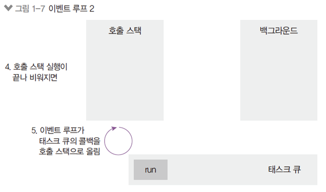


<br>

#### 호출 스택


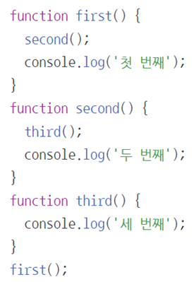

(세 번째 -> 두 번째 -> 첫 번째)

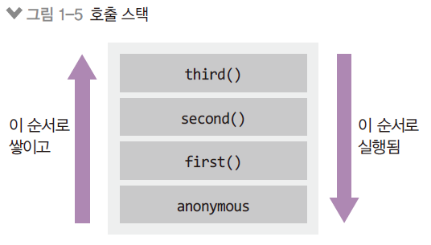

- Anonymous은 가상의 전역 컨텍스트(항상 있다고 생각하는게 좋음)
- 함수 호출 순서대로 쌓이고, 역순으로 실행됨
- 함수 실행이 완료되면 스택에서 빠짐
- LIFO 구조라서 스택이라고 불림
- JS는 싱글 스레드이기 때문에 호출 스택이 1개

<br>

#### 이벤트루프

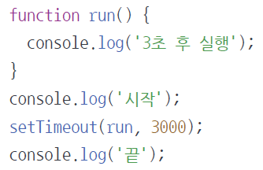

> 시작 -> 끝 -> 3초 후 실행
>
> 호출 스택만으로는 설명이 안 됨(run은 호출 안 했는데?)
>
> 호출 스택 + 이벤트 루프로 설명할 수 있음

- 호출 스택 - 백그라운드 - 태스크 큐의 흐름을 도는 알고리즘 내지는 처리자

  - 호출스택과 백그라운드가 동시에 실행이 가능

  - 백그라운드 작업이 먼저 끝난다고 하더라도 항상 호출스택이 먼저 실행됨

    > 코드의 실행값은 lalalala 다음에 what이 출력된다. (0초 임에도 불구하고)
    >
    > 이유는 setTimeout이 실행되면 우선 Web API라는 백그라운드에 담기고 일정 시간이 지나면(여기서는 0ms) 큐에 담긴다. 그런데 큐에 있는 명령이 스택에 올라가려면 스택이 비어있어야 한다.

    ```javascript
    setTimeout(() => console.log("what"), 0);
    console.log("lalalala");
    ```

- 콜백함수의 종류에 따라 태스크 큐가 여러 개 형성되는데 우선 순위를 정하여 호출 스택으로 올리는 것도 이벤트 루프의 역할

- <u>Promise의 then, catch는 일반함수를 새치기한다</u>

- <u>process의 nextTick은 일반함수를 새치기한다</u>

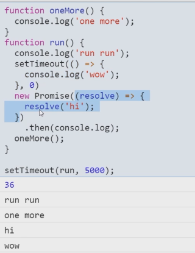

> wow가 먼저 나와야 할 것 같지만 hi가 먼저 나옴 promise라 task queue에서 익명함수를 새치기함.

<br>

#### 콜백함수

- 일이 처리된 후에 알려주는 함수라고 해서 Call Back
- 무언가 처리가 오래 걸리는 일을 맡겨놓고 끝나면 해당 함수(콜백 함수)가 실행되게 함으로써 프로그램이 정지 상태에 머물지 않고 다음 코드를 계속 실행하게 만든다.

- **콜백함수는 호출 스택에 바로 쌓이는 것이 아니라 백그라운드에 존재했다가 지정된 업무, 시간을 다하면 태스크 큐(Task Queue)를 거쳐 차례대로(FIFO) 호출 스택으로 올라간다**
  - 코드가 길어질수록 콜백함수의 효용성은 높아진다.
- Scope는 말 그대로 범위를 말함. 변수에 접근할 수 있는 범위
- 블록 스코프인 변수를 바깥에서도 사용하기 위해서는 블록 외부에서 정의하고 사용하면 된다.

```javascript
let hello

if (true) {
  hello = "hello";
}

console.log(hello);
```

- 스코프 체인: 자기 스코프로부터 가까운 스코프로 확대해나가면서 값을 찾는 것

```javascript
var name = "helia";
function outer() {
  console.log("외부", name);
  function inner() {
    console.log("내부", name);
  }
  inner();
}
outer();
```

<br>

#### 클로저(closure)

- 스코프를 계속 들고 있는 것

- 본래 함수 내부에 선언한 변수는 함수가 끝나면 사라지지만, 
  클로저가 스코프를 계속 들고 있으므로 그 함수 내부의 변수를 참조할 수 있게 된다.
  - 때문에 메모리 문제의 주범이기도 하다

<br>

#### 태스크 큐

- 태스크 큐로 옮겨가게 하는 함수
  - 해당 함수들만 비동기적으로 처리되고 나머지들은 동기적
  - Promise resolve의 경우 내부까지는 동기여서 resolve('hi')라면 hi는 출력되고 백그라운드로 이동
    - then이 나오는 순간 비동기

```
setTimeout, setInterval, setImmediate
Promise resolve, reject, async/await
eventListener
```

<br>

### 02. **ES2015+** 문법

#### const, let

> 이제는 굳이 var을 쓸 필요가 없음

**var**

- 가장 큰 차이점: const, let은 블록 스코프(var은 함수 스코프)
  - var은 블록 스코프를 무시. 바깥에서도 접근 가능
  - 하지만 var도 function 스코프는 못빠져나감
- 기존: 함수 스코프(function() {}이 스코프의 기준점)
  다른 언어와는 달리 if나 for, while은 영향을 미치지 못함
  const와 let은 함수 및 블록({})에도 별도의 스코프를 가짐

**const**

> `=`을 한번만 쓴다고 생각하자.

- const는 상수
  - 상수에 할당한 값은 다른 값으로 변경 불가
  - 변경하고자 할 때는 let으로 변수 선언
    상수 선언 시부터 초기화가 필요함
  - 초기화를 하지 않고 선언하면 에러

```javascript
const a = 3;
a = '5'; // 에러

const b = { name: 'zerocho' };
b.name = 'nerocho'; // 가능
```

<br>

#### 템플릿 문자열

- 문자열을 합칠 때 + 기호때문에 지저분함
- ES2015부터는 ` (백틱) 사용 가능
  - 백틱 문자열 안에 ${변수} 처럼 사용

- 함수 호출도 가능(태그드 탬플릿 리터럴)

```javascript
function a() {}
a(); // 함수호출방법 1
a``; // 함수호출방법 2
```

<br>

#### 객체 리터럴

- 훨씬 간결한 문법으로 객체 리터럴 표현 가능

  -  객체의 메서드에 :function을 붙이지 않아도 됨
  -  { sayNode: sayNode }와 같은 것을 { sayNode }로 축약 가능
  -  [변수 + 값] 등으로 동적 속성명을 객체 속성 명으로 사용 가능

- 전

  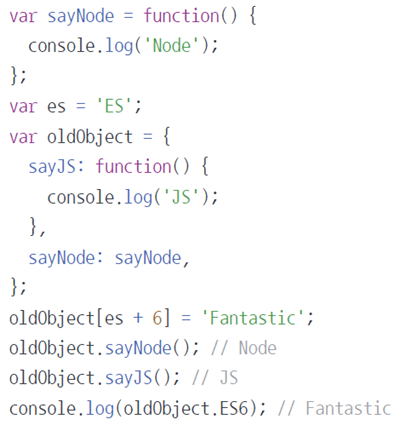

- 후

  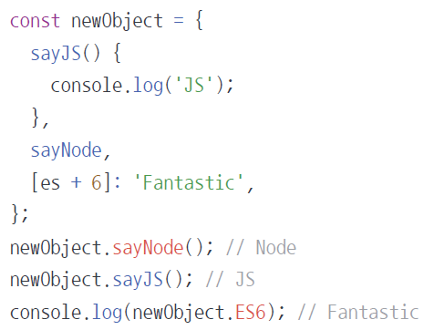 

<br>

#### 

### 03. **프런트엔드** **자바스크립트**


