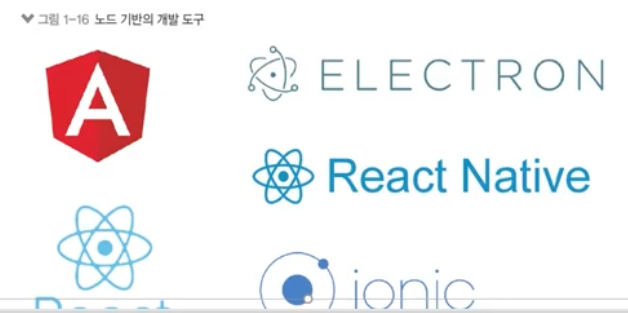

[TOC]

# Node.js

## BACKGROUND

- Node.js v14
  - 멀티스레딩,
  - (강의) 스레드풀, 스트림 메모리 확인, child_process 예제
  - (강의)패키지들도 가능한한 최신 버전을 사용했으나 확인할 것!
- 강의내용
  - axios 사용 (AJAX 요청 라이브러리)
  - 템플릿 엔진
    - 퍼그 => 넌적스(Nunjucks)
    - EJS는 비추. 실무에서 사용하지 않음 
    - 평이 좋은 넌적스와 핸들바스에서 고민하닥 세팅이 쉬운 넌적스로 결정
  - 이미지 리사이징은 GM대신 sharp사용

 

### 01. 노드의 정의

> 노드는 서버가 아님!! 자바스크립트 엔진도 아님(엔진은 크롬 V8)

- 크롬 V8 자바스크립트 엔진으로 빌드된 자바스크립트 런타임
  - 서버의 역할도 수행할 수 있는 자바스크립트 런타임
    - 런타임: 실행기
      - 특정 언어로 만든 프로그램들을 실행할 수 있게 해주는 가상 머신(크롬의 V8 엔진 사용)의 상태
      -  노드: 자바스크립트로 만든 프로그램들을 실행할 수 있게 해줌
      - 다른 런타임으로는 웹 브라우저(크롬, 엣지, 사파리, 파이어폭스 등)가 있음
    - 서버소스코드를 넣으면 서버의 역할을 하는 것
    - 타입스크립트의 런타임은 deno(노드 스펠링 순서 바꾼 것)
    - 노드의 효과
      - 노드가 없을때 자바스크립트는 브라우저가 HTML을 읽으면서 script를 읽었음. (HTML에 종속)
      - 노드에서는 자바스크립트가 브라우저나 HTML의 종속성에서 벗어남. 
    - 노드 이전에도 자바스크립트 런타임을 만들기 위한 많은 시도 But, 엔진 속도 문제
    - 크롬 V8이 속도 문제를 해결하면서 node.js로 빠르게 자바스크립트를 돌릴 수 있게됨
      - <u>싱글스레드 + 비동기 모델</u>
    - 자바스크립트로 데스크탑앱, 모바일 앱 등등을 만들 수도 있게 됨. 자바스크립트의 확장성에 기여했음
  - 노드로 자바스크립트로 작성된 서버를 실행할 수 있음.
    ● 서버 실행을 위해 필요한 http/https/http2 모듈을 제공

#### 내부 구조

- v8과 libuv를 내부적으로 포함
- v8 엔진: 오픈 소스 자바스크립트 엔진 -> 속도 문제 개선
- libuv: 노드의 특성인 이벤트 기반, 논블로킹 I/O 모델을 구현한 라이브러리
  - 내부적으로는 C++

### 02. 노드의 특징

#### 이벤트 기반

> 대부분의 프로그램들은 이벤트 기반(사용자와 인터렉션)
>
> 동일한 응답을 할 수 있도록 미리 동작함수를 등록

- 이벤트가 발생할 때 미리 지정해둔 작업을 수행
  - 이벤트의 예: 클릭, 네트워크 요청, 타이머 등
  - 이벤트리스너: 이벤트를 등록하는 함수
  - 콜백 함수: 이벤트가 발생했을 때 실행될 함수

 

#### 논블로킹 I/O

> 노드는 블로킹이면서 동기, 비동기면서 논블로키 I/O를 지원
>
> 동시라고 생각하기 쉬운데 동시가 아님.

- 논블로킹: 오래 걸리는 함수를 백그라운드로 보내서 다음 코드가 먼저 실행되게 하고, 나중에 오래 걸리는 함수를 실행
  - 논블로킹 방식 하에서 일부 코드는 백그라운드에서 병렬로 실행됨
  - 일부 코드: I/O 작업(파일 시스템 접근, 네트워크 요청), 압축, 암호화 등
  - 나머지 코드는 블로킹 방식으로 실행
    - I/O 작업이 많을 때 노드 활용성이 극대화

#### 프로세스 vs 스레드

> 노드는 프로세스 안에 스레드가 여러개 뜨는데 하나만 컨트롤 할 수 있음. 그래서 싱글스레드라고 함. 따지면 멀티스레드! (14버전부터 멀티스레드가 가능)

- 프로세스: 운영체제에서 할당하는 작업의 단위, 프로세스 간 자원 공유 X
- 스레드: 프로세스 내에서 실행되는 작업의 단위, 부모 프로세스 자원 공유

- 노드 프로세스는 멀티 스레드이지만 직접 다룰 수 있는 스레드는 하나이기 때문에 싱글 스레드라고 표현 (인간의 사고로 멀티스레드 어려움..)
  - 나머지 스레드들은 코드를 동시에 돌릴 준비를 하고 있음(대기)
- 노드는 주로 멀티 스레드 대신 멀티 프로세스 활용 
- 노드는 14버전부터 멀티 스레드 사용 가능

#### 싱글 스레드

> 점원과 주방 관리가 중요!

- 싱글스레드라 주어진 일을 하나밖에 처리하지 못함
  - 블로킹이 발생하는 경우 나머지 작업은 모두 대기해야 함 -> 비효율 발생

- 대신 논 블로킹 모델을 채택하여 일부 코드(I/O)를 백그라운드(다른 프로세스)에서 실행 가능
  - 요청을 먼저 받고, 완료될 때 응답함
  - I/O 관련 코드가 아닌 경우 싱글 스레드, 블로킹 모델과 같아짐

 

#### 멀티 스레드 모델과의 비교

> 노드 주력은 싱글스레드. 아쉬워서 14버전에서 추가해준 것.

- 싱글 스레드 모델은 에러를 처리하지 못하는 경우 멈춤
  - 프로그래밍 난이도 쉽고, CPU, 메모리 자원 적게 사용
- 멀티 스레드 모델은 에러 발생 시 새로운 스레드를 생성하여 극복
  - 단, 새로운 스레드 생성이나 놀고 있는 스레드 처리에 비용 발생
  - 프로그래밍 난이도 어려움
  - 스레드 수만큼 자원을 많이 사용함
- 점원:  스레드, 주문: 요청, 서빙: 응답

#### 멀티 스레드의 활용

- 노드 14버전
  - 멀티 스레드를 사용할 수 있도록 worker_threads 모듈 도입
  - CPU를 많이 사용하는 작업인 경우에 활용 가능
  - 멀티 프로세싱만 가능했던 아쉬움을 달래줌

### 03. 노드의 역할

#### 서버로서의 노드

- 서버: 네트워크를 통해 클라이언트에 정보나 서비스를 제공하는 컴퓨터 또는 프로그램
- 클라이언트: 서버에 요청을 보내는 주체(브라우저, 데스크탑 프로그램, 모바일 앱,
  다른 서버에 요청을 보내는 서버)
- 예시
  - 브라우저(클라이언트, 요청)가 길벗 웹사이트(서버, 응답)에 접속
  - 핸드폰(클라이언트)을 통해 앱스토어(서버)에서 앱 다운로드
- 노드 != 서버
- But, 노드는 서버를 구성할 수 있게 하는 모듈(4장에서 설명)을 제공

**노드 서버의 장단점**

- CPU 작업을 위해 AWS Lambda나 Google Cloud Functions같은 별도 서비스
  사용

- 페이팔, 넷플릭스, 나사, 월마트, 링크드인, 우버 등에서 메인 또는 서브 서버로 사용
- 이미지 리사이징, 암호화(진상 손님..)에는 적합하지 않음(=> 멀티스레딩 활용)
- 머신러닝, 게임, 비트코인 채굴 등 고성능 작업에는 적합하지 않음

#### 서버 외의 노드

- 자바스크립트 런타임이기 때문에 용도가 서버에만 한정되지 않음
- 웹, 모바일, 데스크탑 애플리케이션에도 사용
  - 웹 프레임워크: Angular, React, Vue, Meteor 등
  - 모바일 앱 프레임워크: React Native
  - 데스크탑 개발 도구: Electron(Atom, Slack, VSCode, Discord 등 제작)
- 위 프레임워크가 노드 기반으로 동작함

### 04

### 05

