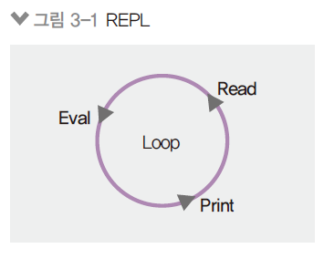
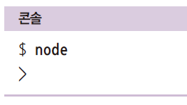
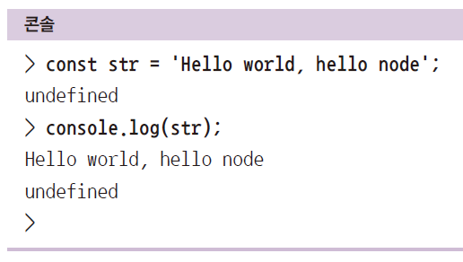
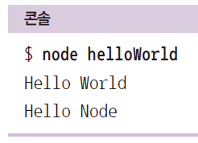
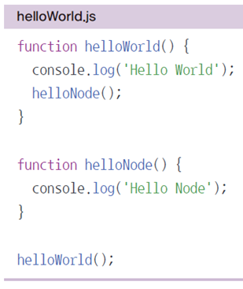

[TOC]

# Node.js

## 노드 기능

### 01. REPL 사용하기

#### REPL

- 자바스크립트는 스크립트 언어라서 즉석에서 코드를 실행할 수 있음

  - REPL이라는 콘솔 제공
  - **R(Read), E(Evaluate), P(Print), L(Loop)**

  

  - 윈도에서는 명령 프롬프트, 맥이나 리눅스에서는 터미널에 node 입력

  

- 프롬프트가 > 모양으로 바뀌면, 자바스크립트 코드 입력
- 입력한 값의 결괏값이 바로 출력됨.
  - 간단한 코드를 테스트하는 용도로 적합
  - 긴 코드를 입력하기에는 부적합



- console.log()의 리턴값은 undefined임에 주의

  ```javascript
  C:\Users\Helia>node
  Welcome to Node.js v14.17.2.
  Type ".help" for more information.
  > const str = 'Hello world, hello node';
  undefined // 바로 리턴값을 보여줌
  > str
  'Hello world, hello node' // 리턴값
  > console.log(str)
  Hello world, hello node //콘솔로그 출력하고
  undefined // 리턴값은 undefined
  ```

- 종료하기

  - press `^C` or` ^D` twice or type `.exit`

<br>

### 02.  JS 파일 실행하기

- 자바스크립트 파일을 만들어 통째로 코드를 실행하는 방법

  - 아무 폴더(디렉터리)에서 helloWorld.js를 만들어보자
  - node [자바스크립트 파일 경로]로 실행
  - 실행 결괏값이 출력됨

  

  

```javascript
// helloWorld.js
function helloworld() {
  console.log('Hello World');
  helloNode();
}

function helloNode() {
  console.log('Hello node');
}

helloworld()
```

```bash
C:\Users\Helia\Nodejs\Nodejs_lecture\lecture>node helloWorld.js
Hello World
Hello node
```

- vs code에서 할때는 CMD로 터미널을 바꾸고 할 것

<br>

### 03.  모듈로 만들기


<br>

### 04. 노드 내장 객체 알아보기


<br>

### 05. 노드 내장 모듈 사용하기


<br>

### 06. 파일 시스템 접근하기


<br>

### 07. 이벤트 이해하기


<br>

### 08. 예외 처리하기


<br>

global과 콘솔, 타이머


exports와 this


모듈 심화, 순환 참조


process


os와 path


url와 querystring


crypto와 util


worker_threads


child_process


파일 시스템 사용하기


버퍼와 스트림 이해하기


pipe와 스트림 메모리 효율 확인


스레드풀과 커스텀 이벤트


에러 처리하기