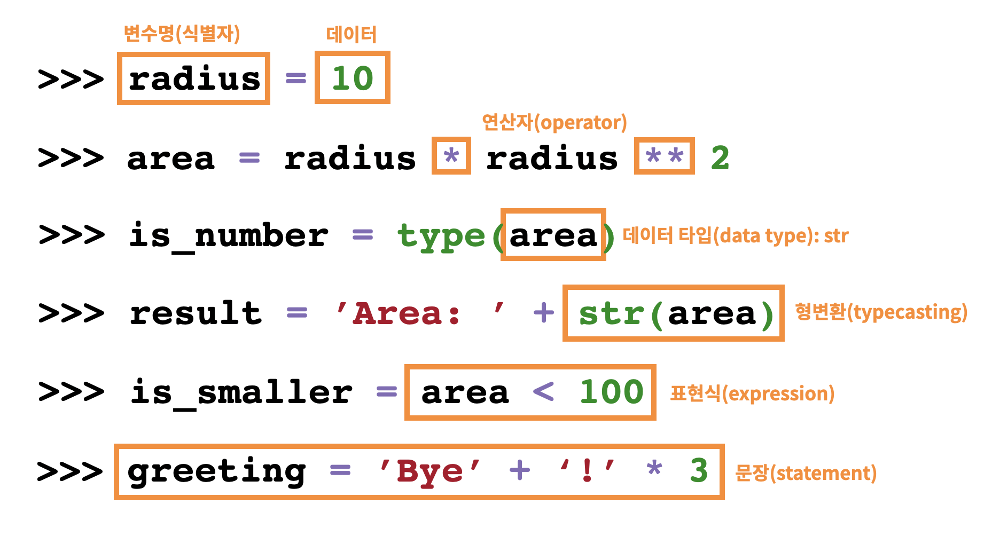

# Python


### 기초 문법(Syntax)

- 주석(Comment => `#`, `''' '''`)은 실행되지 않습니다.
- 문장(statement)은 파이썬이 실행 가능(executable)한 최소한의 코드 단위
  - 1줄에 1문장(statment)'이 원칙

```python
print('hello');'print('world') # X

print('hello')
print('world') # O
```


> #### 식별자(Identifiers)

- 변수, 함수, 모듈, 클래스 등을 식별하는데 사용되는 이름(name)

  - 영문알파벳(대문자와 소문자), 밑줄(_), 숫자로 구성

  - 첫 글자에 숫자가 올 수 없다.

  - 길이에 제한 없음, 대소문자(case) 구별

  - 사용할 수 없는 키워드( + 내장함수, 모듈)

    ```python
    import keyword
    print(keyword.kwlist)
    ['False', 'None', 'True', 'and', 'as', 'assert', 'async', 'await', 'break', 'class', 'continue', 'def', 'del', 'elif', 'else', 'except', 'finally', 'for', 'from', 'global', 'if', 'import', 'in', 'is', 'lambda', 'nonlocal', 'not', 'or', 'pass', 'raise', 'return', 'try', 'while', 'with', 'yield']
    ```


### 데이터 타입(Data Type)

> ####  **숫자**(Number) 타입

##### `int` (정수, ingteger)

- 8진수 : `0o` / 2진수 : `0b` / 16진수: `0x` 로도 표현 가능

##### `float`(부동소수점, 실수, floating point number)

- floating point rounding error
- 실수의 연산

##### `complex`(복소수, complex number)

- 실수로 표현되는 실수부와 허수부(`j`)


> ####  **문자**(String) 타입

- Single quotes(`'`)나 Double quotes(`"`)으로 표현
- `PEP-8`에서는 **하나의 문장부호를 선택**하여 유지하도록 하고 있다. (Pick a rule and Stick to it)
- 사용자에게 받은 입력은 기본적으로 str


##### 이스케이프 문자

| 예약문자 |    내용(의미)     |
| :------: | :---------------: |
|    \n    |      줄 바꿈      |
|    \t    |        탭         |
|    \r    |    캐리지리턴     |
|    \0    |     널(Null)      |
|    \\    |        `\`        |
|    \'    | 단일인용부호(`'`) |
|    \"    | 이중인용부호(`"`) |

- 문자열 안에 문장부호(`'`, `"`)가 사용될 경우 이스케이프 문자(`\`)를 활용

```python
print('철수가 말했다. '안녕?'') # Error
print('철수가 말했다. "안녕?"') # '와 "로 해결, PEP-8
print('철수가 말했다. \'안녕?\'') # '와 \'로 해결
```

- 연산, 변수화 가능

```python
'hi' * 10 # 곱셈
'hi' + 'hong' # 합
# 변수화
a = 'hi' 
b = ', hong'
a + b
```


##### String interpolation

- `%-formatting`

  - `%d` : 정수 (ex. `print('정수입력 %d' % int타입변수)`)
  - `%f` : 실수 (ex. `print('실수입력 %f' % float타입변수)` )
  - `%s` : 문자열 (ex. `print('문자열입력 %s' % str타입변수)`)

- [`str.format()`](https://pyformat.info/) (ex. `print('Hello, {}. 내 집번호는 {}'.format(name, call))`)

- [`f-strings`](https://www.python.org/dev/peps/pep-0498/) : 파이썬 3.6 이후 버전에서 지원 -> **주로 사용!!!**
  ex. `print(f'Hello, {name}. 내 폰 번호는 {score}!')`
  - f-strings에서는 형식 지정 가능

    ```python
    # 사전 설정
    import datetime
    today = datetime.datetime.now()
    print(today) # 2021-01-18 10:28:01.178706
    
    print(f'오늘은 {today:%y}년 {today:%m}월 {today:%d}일 {today:%A}')
    
    # interpolation에서 출력형식을 지정할 수 있습니다.
    # https://docs.python.org/ko/3/library/datetime.html#strftime-and-strptime-format-codes
    ```

  - f-strings에서는 연산과 출력형식 지정 가능

    ```python
    pi = 3.141592
    print(f'원주율은 {pi:.4}! 반지름이 2일때 원의 넓이는 {pi*2*2})
    
    # 결과
    '원주율은 3.142! 반지름이 2일때 원의 넓이는 12.566368'
    ```

    

> #### **참/거짓**(Boolean) 타입

- `print(type(True)) -> <class 'bool'>`
- 다음은 False 로 변환 : `0`, `0.0`, `()`, `[]`, `{}`, `' '`, `None`


> #### `None` 타입

- `print(type(None)) -> <class 'NoneType'>`
- 값이 없음을 표현


### 형변환(Type conversion, Typecasting)


> ####  암시적 형변환(Implicit Type Conversion)
>
> : python에 의해 자동으로 변환

- bool
  - `True + 5 `  -> `6`
- Numbers 내에서 (int, float, complex)
  - int + float = float
  - int + complex = complex


> ####  명시적 형변환(Explicit Type Conversion)
>
> : 사용자가 의도적으로 변환

- 조건
  - string -> intger : 형식에 맞는 숫자만 가능 (cf. `int(3.5)` => X )
  - integer -> string : 모두 가능 (ex. `str(1) + '등'`)
- 형변환 함수
  - `int()` : string, float를 int로 변환
  - `float()` : string, int를 float로 변환
  - `str()` : int, float, list, tuple, dictionary를 문자열로 변환


### 연산자(Operator)


> #### 할당 연산자(Assignment Operator): `=`

- 변수는 `=`을 통해 할당(assignment) 된다.
- 같은 / 다른 값을 동시에 할당 가능, 변수 값 교환 가능

```python
# 같은 값
x = y = 10
print(x, y)

# 다른 값
x, y = (1, 10) # 좌변과 우변의 개수가 일치해야 함
print(x, y)

# 변수의 값 SWAP
x = 10
y = 100
x, y = y, x
print(x, y)

## 임시 변수를 활용하여 변수의 값 SWAP
temp = x # temp : temporary, 임시 상자의 개념
x = y 
y = temp
print(x, y)
```

 

> ####  산술 연산자

| 연산자 |      내용      | 설명                                                         |
| :----: | :------------: | ------------------------------------------------------------ |
|   +    |      덧셈      |                                                              |
|   -    |      뺄셈      |                                                              |
|   *    |      곱셈      |                                                              |
|   /    |     나눗셈     | 항상 float로 반환                                            |
|   //   |  몫(quotient)  | 정수 나눗셈 으로 (소수부 없이) <br />정수 결과를 얻으려면 `//` 연산자 |
|   %    | 나머지(modulo) | remainder                                                    |
|   **   |    거듭제곱    | 루트는 **1/2                                                 |


> #### 비교 연산자

|   연산자 |                   내용 |
| -------: | ---------------------: |
|      `<` |                   미만 |
|     `<=` |                   이하 |
|      `>` |                   초과 |
|     `>=` |                   이상 |
|     `==` |                   같음 |
|     `!=` |               같지않음 |
|     `is` |        객체 아이덴티티 |
| `is not` | 부정된 객체 아이덴티티 |

####  

> #### 논리 연산자

|  연산자 |                                               내용 |
| ------: | -------------------------------------------------: |
| a and b |                           a와 b 모두 True시만 True |
|  a or b | 하나라도 True면 True = a 와 b 모두 False시만 False |
|   not a |                       True -> False, False -> True |

- `&` `|`은 파이썬에서 비트 연산자

- not

  - ```python
    print(not True)
    print(not 0)
    ```

- 파이썬에서 and는 a가 거짓이면 a를 리턴하고, 참이면 b를 리턴한다. -> 첫번째 값이 True면 뒤의 값도 봐야한다.
  파이썬에서 or은 a가 참이면 a를 리턴하고, 거짓이면 b를 리턴한다.

  ```python
  ('a' and 'b') in 'aeiou' # b -> False
  ('b' and 'a') in 'aeiou' # a -> True
  ```

- and의 단축평가(short-circuit evaluation)

  ```python
  # and : 둘다 True여야 True..
  # 첫번째 True, 두번째것도 확인해야함.
  # 5
  print(3 and 5)
  print(3 and 0)
  # 첫번째 : 0 => False, 빼박... False!!!
  # 0 
  print(0 and 3)
  print(0 and 0)
  ```

- or의 단축평가(short-circuit evaluation)

  ```python
  # or : 둘 중 하나만 True면 True
  # 첫번째 3 True, 빼박... True!
  # 3
  print(3 or 5)
  print(3 or 0)
  # 첫번째 False, 하나만 True여도 True니까 다음 것도 봐야함.
  # 3
  print(0 or 3)
  print(0 or 0)
  ```

  


> #### 복합 연산자

|  연산자 |       내용 |
| ------: | ---------: |
|  a += b |  a = a + b |
|  a -= b |  a = a - b |
|  a *= b |  a = a * b |
|  a /= b |  a = a / b |
| a //= b | a = a // b |
|  a %= b |  a = a % b |
| a **= b | a = a ** b |


> ####  기타 연산자

##### 순차 (Concatenation) 

- 문자열의 끝과 끝을 결합시키는 조작
- 숫자가 아닌 자료형은 `+` 연산자를 통해 결합 (ex. `'abc' + 'efg'`, `[1, 2, 3] + [4, 5, 6]`)


##### Containment Test

- `in` 연산자를 통해 요소가 속해있는지 확인 가능 (ex. `'a' in 'apple'`-> T, `1 in [1, 2, 3]`-> T, `100 in range(1, 5)`->  F)


##### Identity

- `is` 연산자를 통해 동일한 object인지 확인할 수 있습니다. (OOP 파트에서 다시 학습하게 됩니다.)

  - -5 부터 256 까지의 id는 동일, 257 이후의 id는 다름

  - 의도적으로 공백없는 알파벳 문자열도 같게끔 해놨음(object interning)

    ```python
    a = 'hi'
    b = 'hi'
    print(a is b)
    print(id(a), id(b))
    # True
    # 2176910051888 2176910051888
    ```

  - 의도적으로 특정 범위의 숫자를 id를 같게끔 해놨다.

    ```python
    a = 1
    b = 1
    print(a is b)
    print(id(a), id(b))
    # True
    # 140730894124704 140730894124704
    ```

  - 값 비교와 동일 object 확인은 다름

    ```python
    a = []
    b = []
    print(a == b, a is b)
    print(id(a), id(b))
    # True False
    # 2176949362560 2176949327168
    ```

    ```python
    # 느낌표때문에 같지 않다..
    a = 'hi!'
    b = 'hi!'
    a is b # False
    ```

##### Indexing / Slicing

- `[]`를 통한 값을 접근하고, `[:]`을 통해 리스트를 슬라이싱할 수 있습니다.
  - [n이상:m미만]을 출력 = n ~ m-1

```python
a = 'I do\'nt know how to use this game tool'
a[31:33] + a[-4:-1]
# 'metoo'
```


> ### 주의사항

-  List 표기 방식

```python
## PEP-8 가이드에 따르면 여러 줄의 생성자의 닫히는 괄호(소, 중, 대)는
## (1) 첫번째 문자(요소) 위치에 오거나 (2) 마지막 줄에서 생성자가 시작되는 첫번째 열에 위치합니다.
## 저희는 (1) 방식으로 사용할 것입니다.

food = [
    '샐러드'
    '까르보붉닭'
    '제육볶음'
    '허니버터칩'
    '꿔바로우'
    '짜파게티'
    '일본가정식'
]
```


- 연산자 우선순위
  1. `()`을 통한 grouping
  2. Slicing
  3. Indexing
  4. 제곱연산자 `**`
  5. 단항연산자 `+`, `-` (음수/양수 부호) ( 4 - 5 ex. `-3 ** 6`->-729, `(-3) ** 6` ->729)
  6. 산술연산자 `*`, `/`, `%`
  7. 산술연산자 `+`, `-`
  8. 비교연산자, `in`, `is`
  9. `not`
  10. `and`
  11. `or`


> ### 관련 함수

| 내장 함수<br />(Built-in function) |                            |                                                              |
| ---------------------------------- | -------------------------- | ------------------------------------------------------------ |
| type()                             | 해당 데이터 타입 확인      | `print(variables, type(variables))`<br />`<class 'int'>`<br />int, str, float, tuple... |
| id()                               | 해당 값의 메모리 주소 확인 | 할당 !== 메모리 기록                                         |
| round()                            | 반올림                     | 0~4는 내림, 5는 동일하게 작동하지 않고 반올림 방식에 따라 다름<br/>짝수에서 5는 내림 / 홀수에서 5는 올림 (?) |

| 모듈     |                                                              | 외장함수                                    | import 함수명                                                |
| -------- | ------------------------------------------------------------ | ------------------------------------------- | ------------------------------------------------------------ |
| keyword  | 식별자가 될 수 없는 목록                                     | `keyword.kwlist`                            |                                                              |
| sys      | 1. 파이썬에서 가장 큰 숫자를 활용하기 위해 불러온 모듈<br />2. `epsilon` 은 부동소수점 연산에서 반올림을 함으로써 발생하는 오차 상환 | `sys.maxsize`<br />`sys.float_info.epsilon` | `sys.maxsize` 의 값은 2**63 - 1 <br />=> 64비트에서 부호비트를 뺀 63개의 최대치 <br />= 9223372036854775807 85070591730234615847396907784232501249<br /> |
| datetime |                                                              |                                             | today = datetime.datetime.now()<br />2021-01-18 10:28:01.178706 |
| divmod   |                                                              |                                             | `quotient, remainder = divmod(5, 2)`<br />`print(f'몫은 {quotient}, 나머지는 {remainder}')` |

round()

round 처리 : 2진수 처리방식에 의해, 부동소수점을 활용해 계산


부동소수점 방식

- 많은 언어가 사용하는 방식


> ### 알아두기

**Syntax) 여러 줄 작성**

- 기본적으로 파이썬에서는 `;`을 작성하지 않으나, 한 줄로 표기할때는 `;`을 작성하여 표기(지양)

```python
print('hello');print('world')
```

- 줄을 여러줄 작성할 때는 역슬래시`\`를 사용할 수 있다

```python
print('hello\
world')
```

**Syntax) 여러줄 문자열의 관례(convention)**

```python
print("""hello
world""")
```

---

**Identifiers) 내장함수의 이름을 식별자로 사용한다면 일어나는 일**

- 내장함수가 새로운 값으로 인식되어 이전의 기능을 수행하지 못함
- `del 함수명`으로 새로 생성한 식별자를 삭제해야

---

**Int) 파이썬에서 표현할 수 있는 가장 큰 수**

- 파이썬에서 가장 큰 숫자를 활용하기 위해 sys 모듈을 불러온다.
- 파이썬은 기존 C 계열 프로그래밍 언어와 다르게 정수 자료형(integer)에서 오버플로우가 없다.
- 임의 정밀도 산술(arbitrary-precision arithmetic)을 사용하기 때문이다.

> **오버플로우(overflow)**

- 데이터 타입 별로 사용할 수 있는 메모리의 크기가 제한되어 있다.
- 표현할 수 있는 수의 범위를 넘어가는 연산을 하게 되면, 기대했던 값이 출력되지 않는 현상, 즉 메모리가 차고 넘쳐 흐르는 현상

> **임의 정밀도 산술(arbitrary-precision arithmetic)**

- 사용할 수 있는 메모리양이 정해져 있는 기존의 방식과 달리, 현재 남아있는 만큼의 가용 메모리를 모두 수 표현에 끌어다 쓸 수 있는 형태
- 특정 값을 나타내는데 4바이트가 부족하다면 5바이트, 더 부족하면 6바이트까지 사용할 수 있게 유동적으로 운용


**int) n진수 만들기**

```python
binary_number = 0b10 
octal_number = 0o10
decimal_number = 10
hexadecimal_number = 0x10
print(f"""
2진수 : {binary_number} # 2
8진수 : {octal_number} # 8
10진수 : {decimal_number} # 10
16진수 : {hexadecimal_number} # 16
""")
```

---

**float) 컴퓨터식 지수 표현 방식**

- e와 E 둘 중 어느 것을 사용해도 무방

```python
pi = 314e-2
print(pi, type(pi))
# 3.14 <class 'float'>
```


**float) floating point rounding error**

- 실수를 컴퓨터가 표현하는 과정에서 부동소수점을 사용하며, 항상 같은 값으로 일치되지 않습니다. 
- 컴퓨터가 2진수(비트)를 통해 숫자를 표현하는 과정에서 생기는 오류이며, 대부분의 경우는 중요하지 않으나 값을 같은지 비교하는 과정에서 문제가 발생

```python
3.5 - 3.12 # A
```

```python
0.3799999999999999 # 결과
```

```python
round(3.5 - 3.12, 2)
```

```python
0.38 # 결과 # B 
```

```python
3.5 - 3.12 == 0.38 # A = B
```

```python
False # 결과
```

=> 처리방법

```python
# 1.
a = 3.5 - 3.12
b = 0.38

abs(a - b) <= 1e-10
```

```python
True # 결과
```

```python
# 2. sys 모듈을 통해 처리
import sys
abs(a - b) <= sys.float_info.epsilon
```

```python
True # 결과
```

```python
# 3. python 3.5부터 활용 가능한 math 모듈
import math
math.isclose(a, b)
```

```python
True # 결과
```

---

**Syntax)표현식(Expression) & 문장(Statement)**

- 표현식 => `evaluate` => 값
  - 하나의 값(value)으로 환원(reduce)될 수 있는 문장
  - `식별자`, `값`(리터럴), `연산자`로 구성됩니다.
  - ex. `'hello'`,  `3.14 * (radius - 5) **2`
  - cf. `4 +`
  - 할당문(assignment statement)은 표현식일까요?
- 문장(Statement)
  파이썬이 실행 가능한 최소한의 코드 단위 (a syntatic unit of programming)
  - ex. 하나의 값(value) `'ssafy'`, 표현식(expression)`5 * 21 - 4 `


