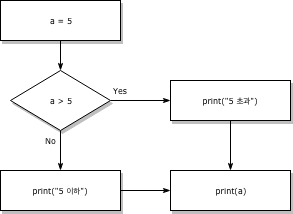

# 제어문

:**코드 실행의 순차적인 흐름을 제어**(Control Flow)하는 것

제어문을 통해 순서도(Flow Chart)를 코드로 표현할 수 있음

크게 조건문과 반복문으로 나눔




# 조건문(Conditional Statement)

`if` 문

사용조건 : 반드시 **참/거짓을 판단할 수 있는 조건**과 함께 사용되어야 한다.


### if / else

```python
if <expression>:
    <코드 블럭>
else:
    <코드 블럭>
```

- 활용법

  - `expression`에는 일반적으로 참/거짓에 대한 조건식이 들어간다.
  - **조건**이 **참**인 경우 `:` 이후의 문장을 수행한다.
  - **조건**이 **거짓**인 경우 `else:` 이후의 문장을 수행한다.
  - 여러 개의 `elif` 부가 있을 수 있고(없거나), `else`는 선택적이다.

- 주의사항

  - 이때 반드시 들여쓰기를 유의해야 함
    - 파이썬에서는 코드 블록을 자바나 C언어의 `{}`와 달리 **들여쓰기**로 판단하기 때문
  - [PEP 8](https://www.python.org/dev/peps/pep-0008/#indentation)에서 권장하는 **4spaces**를 사용

- 활용 아이디어

  - 크리스마스 판독기

    ```python
    is_christmas = input('날짜를 입력해주세요 ex)12/24 : ')
    # 입력 및 결과
    12/25
    크리스마스입니다.
    ```

  - 홀/짝 판독기


### if / elif / else

`elif`  : 복수 조건

- 2개 이상의 조건을 활용할 경우 `elif <조건>:`을 활용한다.
- 주의사항
  - elif는 특정한 조건을 거는 것이라서 반드시 조건식이 필요함
  - else는 나머지 모든 케이스를 뜻하기 때문에, 조건식이 들어갈 수 없음

- 활용 아이디어 
  - 점수에 따른 등급 출력


### 중첩 조건문(Nested Conditional Statement)

조건문은 다른 조건문에 중첩될 수도 있다.

- 활용 아이디어
  - 95점 이상이면, "참 잘했어요"도 함께 출력


---


### 조건 표현식(Conditional Expression)

- ```python
  true_value if <조건식> else false_value
  ```

- 조건 표현식은 일반적으로 조건에 따라 값을 정할 때 활용된다.

- **삼항 연산자(Ternary Operator)**라고 부르기도 한다.

- 예시

  - ```python
    num = int(input('숫자를 입력하세요 : '))
    print('0 보다 큼') if num > 0 else print('0 보다 크지않음')
    ```

  - 절댓값

    ```python
    num = int(input('숫자를 입력하세요 : '))
    value = num if num >= 0 else -num
    print(value)
    ```

    

---


# 반복문(Loop Statement)

### while

```python
while <조건식>:
    <코드 블럭>
```

- `while` 문은 조건식이 참(`True`)인 경우 반복적으로 코드를 실행한다.

- 주의사항
  - `while` 문 역시 조건식 뒤에 콜론(`:`)이 반드시 필요하며, 이후 실행될 코드 블럭은 **4spaces**로 **들여쓰기**를 한다.
  - **반드시 종료조건을 설정해야 한다.**
- 아이디어
  - 사용자가 "안녕"이라고 입력할 때까지 인사하는 코드
  - 합(Summation) : 1부터 사용자가 입력한 양의 정수까지의 총합을 구하는 코드
  - 한자리 씩 출력하기 : 사용자로부터 숫자 입력 받은 양의 정수의 각 자리 수를 1의 자리부터 차례대로 출력하는 코드


### for


```python
for <임시변수> in <순회가능한데이터(iterable)>:
    <코드 블럭>
```

- `for` 문은 시퀀스(string, tuple, list, range)나 다른 순회가능한 객체(iterable)의 요소들을 순회한다.

- `for` 문에서 요소 값에 다른 값을 할당해도 다음 반복구문에 영향을 주지 않는다.
  다음 요소 값에 의해 덮어 씌워지기 때문이다.
- 활용
  - 리스트(list) 순회에서 index의 활용하기
    `range(리스트의 길이)` -> `range()`와 순회할 list의 길이를 활용하여 index를 조작 가능


#### `enumerate()`


:인덱스(index)와 값(value)을 함께 활용 가능

- `enumerate()`를 활용하면, 추가적인 변수를 활용할 수 있다.

- 활용

  - ```python
    lunch = ['짜장면', '초밥', '피자', '햄버거']
    for menu in enumerate(lunch):
        print(menu)
        
    # 결과
    (0, '짜장면')
    (1, '초밥')
    (2, '피자')
    (3, '햄버거')
    ```

  - 숫자를 1부터 카운트도 가능

    ```python
    for menu in enumerate(lunch, 1): # start = 0 인자가 내장되어 있음
    ```

  - str 붙여주는 것도 가능

    ```python
    >>> for i, v in enumerate(t):
    ...     print("index : {}, value: {}".format(i,v))
    ... 
    index : 0, value: 1
    index : 1, value: 5
    index : 2, value: 7
    index : 3, value: 33
    index : 4, value: 39
    index : 5, value: 52
    ```

    

---


### 특수 키워드 (break, continue, else)


### break

: 반복문을 종료한다.

- `for` 나 `while` 문에서 빠져나간다.
- 활용
  - 조건문과 반복문, `break`를 활용하여 리스트에서 쌀이 나왔을때 `for` 문을 멈추는 코드


### continue

: continue 이후의 코드를 수행하지 않고 *다음 요소부터 계속(continue)하여*  반복을 수행한다.

원카드의 'J' 느낌

- 활용
  - 나이가 입력된 리스트가 있을때, 조건문과 반복문, continue를 활용하여 20살 이상일때만 "성인입니다"라는 출력을 하는 코드

### else

끝까지 반복문을 실행한 이후에 실행된다.

- 반복에서 리스트의 소진이나 (`for` 의 경우) 조건이 거짓이 돼서 (`while` 의 경우) 종료할 때 실행된다.
- 하지만 반복문이 **`break` 문으로 종료될 때는 실행되지 않는다.** (즉, `break`를 통해 중간에 종료되지 않은 경우만 실행)


### + pass

아무것도 하지 않는다.

- 문법적으로 문장이 필요하지만, 프로그램이 특별히 할 일이 없을 때 자리를 채우는 용도로 사용할 수 있다.