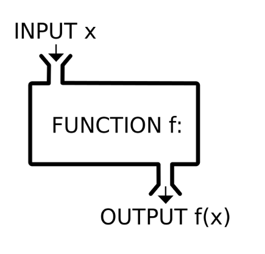
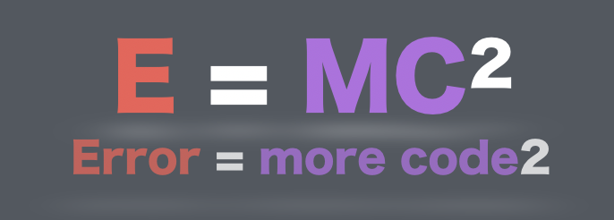

# 함수(function) I


### 함수(function)?



: 특정한 기능(function)을 하는 코드의 묶음

다른 곳에서 동일한 작업을 다시 해야 할 경우 필요


- 함수를 쓰는 이유

  

  - 높은 가독성: 짧아짐
  - 재사용성
  - 유지보수: 코드의 기능별 분화


> #### 함수의 선언과 호출


```python
def <함수이름>(parameter1, parameter2):
    <코드 블럭>
    return value
```

- 함수 선언은 `def`로 시작하여 `:`으로 끝나고, 다음은 `4spaces 들여쓰기`로 코드 블록을 만든다.

- 함수는 `매개변수(parameter)`를 넘겨줄 수도 있다.

- 함수는 동작후에 `return`을 통해 결과값을 전달 할 수도 있다. (`return` 값이 없으면, `None`을 반환한다.)

- 함수는 호출을 `func()` / `func(val1, val2)`와 같이 한다.


### 함수의 Output

> ####  함수의 `return`

- 앞서 설명한 것과 마찬가지로 함수는 반환되는 값이 있으며, 이는 어떠한 종류(~~의 객체~~)라도 상관없다.
  단, **오직 한 개의 객체**만 반환된다.

  - 오직 하나만 반환!

  - 만약, return이 없으면 => `None`

  - 만약, 여러개를 ,로 이어서 return => `tuple`

    ```python
    def my_name(name):
        return 'hello', name
    name = my_name('홍길동')
    print(name) # ('hello', '홍길동')
    print(type(name)) # <class 'tuple'>
    ```

- 함수가 return 되거나 종료되면, 함수를 호출한 곳으로 돌아간다.


sort 와 sorted의 차이 할 차례 ( return 유무의 차이 예시)


### 함수의 Input


> ### 함수 목록


| 함수                      | 설명                   | 모듈              | 활용                    |
| ------------------------- | ---------------------- | ----------------- | ----------------------- |
| math.sqrt()               | 제곱근 반환            | import math       | 제곱근 구현에 활용 가능 |
| statistics.pstdev(values) | 리스트의 표준편차 반환 | import statistics |                         |
| random.sample()           |                        |                   |                         |
| max()                     |                        |                   |                         |


> ### 함수의 사용 예

```python
# 표준편차, math.sqrt()

import math
values = [100, 75, 85, 90, 65, 95, 90, 60, 85, 50, 90, 80]
# 갯수
cnt = len(values)
# 다 더한 것을 갯수로 나눴으니, 평균..
mean = sum(values) / cnt

sum_var = sum(pow(value - mean, 2) for value in values) / cnt

std_dev = math.sqrt(sum_var)

print(std_dev)
```


> ### 알아두기

*****

**`print()`)함수는 `None`을 반환**

```python
# print 함수는 None을 반환!
# print_number 변수에 None이 저장됨..
print_number = print(6 + 3)
print(print_number)

# 결과
9
None
```


`**math.sqrt()`)없이 표준편차 구현하기**

```python
# 리스트
values = [100, 75, 85, 90, 65, 95, 90, 60, 85, 50, 90, 80]
# 초기화 변수
total = 0
cnt = 0
# 값을 다 더하고, 갯수를 센다.
for value in values:
    total += value
    cnt += 1

mean = total / cnt

total_var = 0

for value in values:
    total_var += (value - mean) ** 2

sum_var = total_var / cnt

target = sum_var
  
count = 0 

while True : 
    count += 1 
    root = 0.5 * (target + (sum_var / target))  
    if (abs(root - target) < 0.0000000000000001) : 
        break 
    target = root

std_dev = target
print(std_dev)
```

