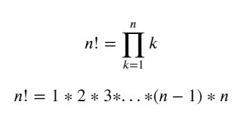
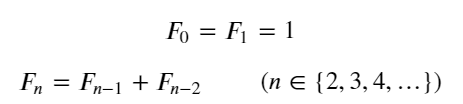

# 함수(function) II

<br>

### 함수와 스코프(scope)

함수는 코드 내부에 공간(scope)를 생성.
`지역 스코프(local scope)` : 함수로 생성된 공간. 
그 외의 공간인 `전역 스코프(global scope)`와 구분됨.

- **전역 스코프(`global scope`)**: 코드 어디에서든 참조할 수 있는 공간
- **지역 스코프(`local scope`)**: 함수가 만든 스코프로 함수 내부에서만 참조할 수 있는 공간

- **전역 변수(`global variable`)**: 전역 스코프에 정의된 변수
- **지역 변수(`local variable`)**: 로컬 스코프에 정의된 변수

<br>

```python
# 전역스코프와 지역스코프
a = 10 # 전역 스코프에 정의된 전역변수

def func(b):
    c = 20 # 지역 스코프에 정의된 지역변수
    print('지역스코프입니다.')
    print(a) # 10
    print(b) # 5
    print(c) # 20

func(5)
    
print('전역스코프입니다.')
print(a) # 10
# print(b) # 에러
# NameError: name 'c' is not defined
print(c) # 에러
```

```python
# 전역스코프와 지역스코프에 같은 이름의 변수를 만들면
# -> 전역스코프에 지역스코프가 덮어씌워짐

# 전역 스코프 
a = 10

def func(b):
    # 지역 스코프(L)
    a = 5
    print(a)
func(10) # 5
```

<br>

### 이름 검색(resolution) 규칙

파이썬에서 사용되는 이름(식별자)들은 이름공간(namespace)에 저장되어 있다.

> ####  LEGB Rule

- `L`ocal scope: 정의된 함수

- `E`nclosed scope: 상위 함수

- `G`lobal scope: 함수 밖의 변수 혹은 import된 모듈

- `B`uilt-in scope: 파이썬안에 내장되어 있는 함수 또는 속성

<br>

##### 1. Built-in scope와 Global scope

```python
print = 6
print('hi') # 6(hi)와 같아짐. error
# TypeError: 'int' object is not callable

# 해결 -> 글로벌 스코프에 정의된 이름을 지워버리기!
del print
```

1. `print()` 코드가 실행되면
2. 함수에서 실행된 코드가 아니기 때문에 `L`, `E` 를 건너 뛰고,
3. `print`라는 식별자를 Global scope에서 찾아서 `print = 6`를 가져오고,
4. 이는 함수가 아니라 변수이기 때문에 `not callable`하다라는 오류를 내뱉게 된다..
5. 우리가 원하는 `print()`은 Built-in scope에 있기 때문.

<br>

##### 2. Global scope와 Local scope

```python
a = 10 # G
b = 20 # G
def enclosed():
    a = 30 # enclosed 함수 Local, local 함수 입장에서는 Enclosed
    def local():
        c = 40 # local
        print(a, b, c) #a가 30!!!
    local()
    a = 50 # enclosed 함수 Local, local 함수 Enclosed
enclosed()
# 30 20 40
```

<br>

##### 전역변수를 바꿀 수 있을까?

```python
global_num = 3
def local_scope():
    # Local scope!
    global_num = 5

local_scope() 
print(global_num)
# 3 -> 지역스코프에서 바꾼다고 하더라도 전역변수는 그대로
```

```python
# 굳이 바꾸고 싶다면? global을 넣어줘야.
global_num = 3
def local_scope():
    # Local scope!
    # 아 지금부터 이야기하는거 방탄 지민 말고, AOA 지민..
    global global_num
    global_num = 5

local_scope() 
print(global_num)
```

<br>

### 재귀 함수(recursive function)

함수 내부에서 자기 자신을 호출 하는 함수. 설계는 어렵지만 코드가 간단함.

1. 활용
   - 재귀함수는 기본적으로 같은 문제이지만 점점 범위가 줄어드는 문제를 풀게 된다.
   - 재귀함수를 작성시에는 반드시, `base case`가 존재 하여야 한다. 
     `base case`는 점점 범위가 줄어들어 반복되지 않는 최종적으로 도달하는 곳이다.
2. 특성
   - 자기 자신을 호출하는 재귀함수는 알고리즘 구현시 많이 사용된다.
   - 코드가 더 직관적이고 이해하기 쉬운 경우가 있다. (설계는 어렵지만 코드가 간단하다)
   - 팩토리얼 재귀함수를 [Python Tutor](https://goo.gl/k1hQYz)에서 확인해보면, 함수가 호출될 때마다 메모리 공간에 쌓이는 것을 볼 수 있다.
   - 이 경우, 메모리 스택이 넘치거나(Stack overflow) 프로그램 실행 속도가 늘어지는 단점이 생긴다.
   - 파이썬에서는 이를 방지하기 위해 3,000번이 넘어가게 되면 더이상 함수를 호출하지 않고, 종료된다. (최대 재귀 깊이)

<br>

> #### 팩토리얼 계산

팩토리얼 : 1부터 n 까지 양의 정수를 차례대로 곱한 값
`!` 기호로 표기



<br>

1. 반복문 이용

   - n이 1보다 큰 경우 반복문을 돌며, n은 1씩 감소한다.
   - 마지막에 n이 1이면 더 이상 반복문을 돌지 않는다.

   ```python
   def fact(n):
       # while 종료조건!
       result = 1
       while n > 1:
           # n을 곱하고..
           # result *= n
           result = result * n
           n -= 1
           # n = n - 1
       return result
   ```

2. 재귀 이용

   - 재귀를 이용한 팩토리얼 계산에서의 base case는 **n이 1일때, 함수가 아닌 정수 반환하는 것**이다.

   - 재귀 함수를 호출하며, n은 1씩 감소한다.
   - 마지막에 n이 1이면 더 이상 추가 함수를 호출하지 않는다.

   ```python
   # 1! = 1
   # 2! = 1 * 2 = 1! * 2 
   # 3! = 1 * 2 * 3 = 2! * 3
   
   def factorial(n):
       if n == 1:
           # base case...
           return 1
       else:
           return n * factorial(n-1)
   ```

   <br>

> #### 피보나치 수열

첫째 및 둘째 항이 1이며 그 뒤의 모든 항은 바로 앞 두 항의 합인 수열
(0), 1, 1, 2, 3, 5, 8 ...

- 점화식으로 나타낼 수 있다.



1. `fib(n)` : 재귀함수

   ```python
   # n 이 0이나 1일 때는 값도 0, 1이기 때문에 그대로 반환하면 되고, 
   # 2 이상일 때만 재귀 함수 두개로 분기해 값을 반환.
   def fib(n):
       # base case!
       # 그냥 if 0일때, return 0 / if 1일때, return 1
       if n < 2:
           return 1
       else:
           return fib(n-1) + fib(n-2)
   ```

2. `fib_loop(n)` : 반복문 활용한 함수

   ```python
   def fib_loop(n):
       a, b = 1, 1
       for i in range(n-1):
           a, b = b, a+b
       return b
   ```


#### 반복문과 재귀 함수의 차이

- 알고리즘 자체가 재귀적인 표현이 자연스러운 경우 재귀함수를 사용한다.
- 재귀 호출은 `변수 사용` 을 줄여줄 수 있다.
- 다만 더 무겁다.

```python
# 재귀 함수에 걸리는 시간. 큰 숫자를 넣어봄.
import time

t0 = time.time()
fib(31)
t1 = time.time()

total = t1 - t0
print(total) # 0.29259395599365234
```

```python
# 반복문. 재귀 함수보다 100배 되는 숫자를 넣어도
import time

t0 = time.time()
fib_loop(30000)
t1 = time.time()

total = t1 - t0
print(total) # 0.009914875030517578
```


> ### 알아두기

*****

**변수의 수명주기**

변수의 이름은 각자의 `수명주기(lifecycle)`가 있다.

- **빌트인 스코프`(built-in scope)`**: 파이썬이 실행된 이후부터 영원히 유지

- **전역 스코프`(global scope)`**: 모듈이 호출된 시점 이후 혹은 이름 선언된 이후부터 인터프리터가 끝날때 까지 유지

- **지역(함수) 스코프`(local scope)`**: 함수가 호출될 때 생성되고, 함수가 가 종료될 때까지 유지 (함수 내에서 처리되지 않는 예외를 일으킬 때 삭제됨)


**최대 재귀 깊이**

```python
def howlong():
    print('deeper')
    howlong()

howlong()
# deeper이 3000번 출력되다 RecursionError
# RecursionError: maximum recursion depth exceeded while calling a Python object
```

파이썬에서는 최대 재귀 깊이(maximum recursion depth)가 3,000으로 정해져 있다

