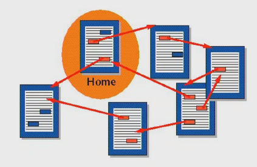

[TOC]

# HTML



> Hyper Text Markup Language
>
> "**웹 컨텐츠의 의미와 구조를 정의**할 때 사용하는 언어"

<br>

## HTML 기초

**Hyper**

- 텍스트 등의 정보가 동일 선상에 있는 것이 아니라 다중으로 연결되어 있는 상태

**Hyper Text**

- 기존의 선형적인 텍스트가 아닌 비 선형적으로 이루어진 텍스트
- 참조(하이퍼링크)를 통해 사용자가 한 문서에서 다른 문서로 즉시 접근 할 수 잇는 텍스트
- 하이퍼 텍스트가 쓰인 기술등 중 가장 중요한 2가지 (http, html)

**Markup Language**

- 태그 등을 이용하여 문서나 데이터의 구조를 명시하는 언어
  - 특정 텍스트에 역할을 부여하는, 따라서 "마크업을 한다" 라고 하는 건 제목이 제목이라하고 본문이 본문이라고 마킹을 하는 것
  - ex) h1 tag는 단순히 글자가 커지는 것이 아니라 의미론적으로 그 페이지에서 가장 핵심 주제를 의미하는 것
- 프로그래밍 언어와는 다르게 단순하게 데이터를 표현하기만 한다
- 대표적인 예 :  HTML, Markdown

<br>

## HTML 기본 구조

**DOM**()

- DOM은 문서의 구조화된 표현(structured representation)을 제공하며 프로그래밍 언어가 DOM 구조에 접근할 수 있는 방법을 제공하여 그들이 문서 구조, 스타일, 내용 등을 변경할 수 있게 도움
- DOM은 동일한 문서를 표현하고, 저장하고, 조작하는 방법을 제공
- 웹 페이지의 객체 지향 표현

<br>

**요소 (Element)**

- HTML 요소는 시작 태그와 종료 태그 그리고 태그 사이에 위치한 내용으로 구성
  - 태그(Element, 요소)는 컨텐츠(내용)를 감싸서 그 정보의 성격과 의미를 정의 한다.
- 내용이 없는 태그들
  - br, hr, img, input, link, meta
- 요소는 중첩(nested)될 수 있다.
  - 이러한 중첩들로 하나의 문서를 완성해 나간다.
  - 그리고 항상 열고 닫는 태그 쌍이 잘 맞는지 잘 봐야한다.
  - HTML은 오류를 뿜지 않고 그냥 레이아웃이 깨져버리기 때문에 어떤 면에서는 친절하게 오류 띄워주고 어디 틀렸는지 알려주는 프로그래밍 보다 디버깅이 힘들다.

<br>

## 요소와 그 기능

##### html 요소 

- HTML문서의 최상위 요소로 문서의 root를 뜻한다.
- head와 body 부분으로 구분된다.

##### head 요소

- 문서 제목, 문자코드(인코딩)와 같이 해당 문서 정보를 담고 있으며,
  브라우저에 나타나지 않는다. 
- CSS 선언혹은 외부 로딩 파일 지정 등도 작성한다.

##### body 요소

- 브라우저 화면에 나타나는 정보로 실제 내용에 해당한다.


> ### 유용한 방법(Emmet)

p*4 +enter -> <p>태그 4개 생성

div.class + tab class를 가진 div 생성

div#id + tab : id를 가진 div 생성

div>a + tab : div 안에 a 태그 생성

서로 중복 가능 ex) ol>li*3

Lorem, ipsum. : 표준 채우기 텍스트


> ###  VS Code 설정

- 확장 프로그램 설치
  - Open in browser
  - Auto rename tag
  - Highlight Matching Tag

- tabsize 설정

  - HTML, CSS 등 WEB 관련 코드의 tabsize는 2paces로 진행
    Python 코드만 4spaces를 유지할 수 있도록 설정

  - `ctrl + shift + p` →` json`검색 → `Preferences: Open Settings (JSON)`

    ```json
    {
        ...생략...,
        "editor.tabSize": 2,
        
        "[python]:{
        	"editor.insertSpaces": true,
        	"editor.tabSize": 4
    	},
    }
    ```


> ### 알아두기

**HTML 기초) 크롬 개발자 도구**

- 웹 브라우저 크롬에서 제공하는 개발과 관련된 다양한 기능을 제공
- 주요 기능
  - Elements - DOM 탐색 및 CSS 확인 및 변경
    - Styles - 요소에 적용된 CSS 확인
    - Computed - 스타일이 계산된 최종 결과
    - Event Listeners 해당 요소에 적용된 이벤트 (JS)
  - Sources, Network, Performance, Application, Security, Audits 등


**HTML 기초) 현재의 웹 표준**

- W3C : HTML5
  - World Wide Web Consortium 
- WHATWG : HTML Living Standard 
  - Apple, Google, Microsoft, Mozilla
  - 웹개발 성장의 빠른 속도로 인해 등장
  - 'W3C와의 기술 표준화 주도권 싸움에서 WHATWG


**HTML 기초) 구글 효과**

- 컬럼비아대 벳시 스페로 교수팀 , '사이언스'지 게재 
- Hyper Text가 인간이 기억하는 방식까지 바꿈


##### HTML 기초) 참고 사이트

HTML5test-How well does your browser support HTML5?

Can I use... Support tables for HTML5, CSS3, etc

info.cern.ch : home of the first website


**HTML 기본구조)Open Graph Protocol**

>  메타 데이터를 표현하는 새로운 규약


- HTML 문서의 메타 데이터를 통해 문서의 정보를 전달
- 페이스북에서 만들었으며, 메타정보에 해당하는 제목, 설명 등을 쓸 수 있도록 정의

